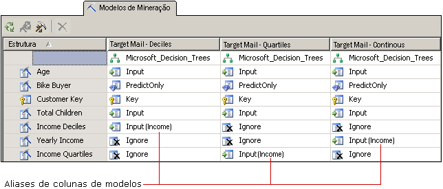

# Personalizar os modelos de mineração e a estrutura
[!INCLUDE[ssas-appliesto-sqlas](../../includes/ssas-appliesto-sqlas.md)]
Depois de selecionar um algoritmo que atende as necessidades do seu negócio, é possível personalizar o modelo de mineração das formas a seguir para melhorar potencialmente os resultados.  
  
-   Use colunas diferentes de dados no modelo ou altere o uso, tipos de conteúdo ou método de diferenciação para as colunas.  
  
-   Crie filtros no modelo de mineração para restringir os dados usados para treinar o modelo.  
  
-   Altere o algoritmo que foi usado para analisar dados.  
  
-   Defina parâmetros de algoritmo para controlar limites, divisões de árvore e outras condições importantes.  
  
 Este tópico descreve estas opções.  
  
## Alterando os dados usados pelo modelo  
 As decisões relacionadas a quais colunas de dados serão usadas no modelo e como usar e processar os dados afetam consideravelmente os resultados da análise. Os tópicos a seguir fornecem informações para ajudá-lo a entender essas escolhas.  
  
### Usando a seleção de recursos  
 A maioria dos algoritmos de mineração de dados no [!INCLUDE[ssASnoversion](../../includes/ssasnoversion-md.md)] usam um processo chamado *seleção de recursos* para selecionar apenas os atributos mais úteis para serem adicionados a um modelo. A redução do número de colunas e atributos pode melhorar o desempenho e a qualidade do modelo. Os métodos de seleção de recursos disponíveis diferem de acordo com o algoritmo escolhido.  
  
 [Seleção de recursos &#40;Mineração de dados&#41;](../../analysis-services/data-mining/feature-selection-data-mining.md).  
  
### Alterando uso  
 Você pode alterar quais colunas são incluídas em um modelo de mineração e como cada coluna é usada. Se você não obtiver os resultados esperados, exemplifique as colunas que você usou como entrada e pergunte-se se elas são uma boa escolha boa, e se há algo que você possa fazer para melhorar a manipulação de dados, incluindo:  
  
-   Identificar variáveis categóricas que foram rotuladas erroneamente como números.  
  
-   Adicionar categorias para recolher o número de atributos e facilitar a localização de correlações.  
  
-   Alterar o modo como os números são compartimentados ou discretizados.  
  
-   Remover colunas que têm muitos valores exclusivos ou colunas que são realmente dados de referência e não são úteis para análise, como endereços ou nomes do meio.  
  
 Você não precisa remover colunas fisicamente da estrutura de mineração; você pode sinalizar a coluna apenas como **Ignorar**. A coluna será removida do modelo de mineração, mas essa coluna ainda poderá ser usada por outros modelos de mineração na estrutura ou referenciada em uma consulta de detalhamento.  
  
### Criando alias em colunas do modelo  
 Quando o [!INCLUDE[ssASnoversion](../../includes/ssasnoversion-md.md)] criar o modelo de mineração, ele usa os mesmos nomes de colunas que estão na estrutura de mineração. Você pode adicionar um alias a qualquer coluna do modelo de mineração. Isso pode tornar mais fácil entender o conteúdo da coluna ou o uso ou fazer com que o nome fique mais curto para conveniência na criação de consultas. Os aliases também são úteis quando você quer criar uma cópia de uma coluna e nomeá-la com algo descritivo.  
  
 Você cria um alias editando a propriedade **Name** da coluna do modelo de mineração. [!INCLUDE[ssASnoversion](../../includes/ssasnoversion-md.md)] continua a usar o nome original como ID de coluna, o novo valor digitado para **Nome** torna-se o alias da coluna e é exibido na grade em parênteses próximo ao uso da coluna.  
  
   
  
 O gráfico mostra modelos relacionados que têm várias cópias de uma coluna de estrutura de mineração, todas relacionadas a Receita. Cada cópia da coluna de estrutura foi discretizada de um modo diferente. Os modelos no diagrama usam cada um uma coluna diferente da estrutura de mineração; no entanto, para a conveniência na comparação de colunas pelos modelos, a coluna em cada modelo foi renomeada para [**Receita**].  
  
### Adicionando filtros  
 Você pode adicionar um filtro a um modelo de mineração. Um filtro é um conjunto de condições WHERE que restringe os dados nos casos de modelo a algum subconjunto. O filtro é usado ao treinar o modelo e pode opcionalmente ser usado quando você testa o modelo ou cria gráficos de precisão.  
  
 Ao adicionar filtros, você pode reutilizar as estruturas de mineração, mas criar modelos com base em subconjuntos muito diferentes dos dados. Ou você pode simplesmente usar filtros para eliminar determinadas linhas e melhorar a qualidade da análise.  
  
 Para obter mais informações, consulte [Filtros para modelos de mineração &#40;Analysis Services – Mineração de dados&#41;](../../analysis-services/data-mining/filters-for-mining-models-analysis-services-data-mining.md).  
  
## Alterando o algoritmo  
 Embora novos modelos que você adiciona a uma estrutura de mineração compartilhem o mesmo conjunto de dados, você pode obter resultados diferentes usando um algoritmo diferente (se os dados derem suporte a isto), ou alterando os parâmetros para o algoritmo. Você também pode definir sinalizadores de modelagem.  
  
 A escolha do algoritmo determina que tipo de resultados você terá. Para obter informações gerais sobre como um algoritmo específico funciona ou sobre os cenários de negócio em que você se beneficiaria ao usar um algoritmo específico, consulte [Algoritmos de mineração de dados &#40;Analysis Services – Data Mining&#41;](../../analysis-services/data-mining/data-mining-algorithms-analysis-services-data-mining.md).  
  
 Consulte o tópico de referência técnica para cada algoritmo para obter uma descrição de requisitos e restrições, assim como informações detalhadas sobre as personalizações ao qual cada algoritmo dá suporte.  
  
|||  
|-|-|  
|[Algoritmo Árvores de Decisão da Microsoft](../../analysis-services/data-mining/microsoft-decision-trees-algorithm.md)|[Algoritmo MTS](../../analysis-services/data-mining/microsoft-time-series-algorithm.md)|  
|[Algoritmo Microsoft Clustering](../../analysis-services/data-mining/microsoft-clustering-algorithm.md)|[Algoritmo Rede Neural da Microsoft](../../analysis-services/data-mining/microsoft-neural-network-algorithm.md)|  
|[Algoritmo Microsoft Naïve Bayes](../../analysis-services/data-mining/microsoft-naive-bayes-algorithm.md)|[Algoritmo Regressão Logística da Microsoft](../../analysis-services/data-mining/microsoft-logistic-regression-algorithm.md)|  
|[Algoritmo Associação da Microsoft](../../analysis-services/data-mining/microsoft-association-algorithm.md)|[Algoritmo Regressão Linear da Microsoft](../../analysis-services/data-mining/microsoft-linear-regression-algorithm.md)|  
|[Algoritmo MSC](../../analysis-services/data-mining/microsoft-sequence-clustering-algorithm.md)||  
  
## Personalizando parâmetros de algoritmo  
 Cada algoritmo aceita parâmetros que podem ser usados para personalizar o comportamento do algoritmo e ajustar os resultados do modelo. Para obter uma descrição de como usar cada parâmetro, consulte os tópicos a seguir:  
  
 O tópico para cada tipo algoritmo também lista as funções de previsão que podem ser usadas com modelos com base em algoritmo.  
  
|Nome da propriedade|Aplica-se a|  
|-------------------|----------------|  
|AUTO_DETECT_PERIODICITY|[Referência técnica do algoritmo MTS](../../analysis-services/data-mining/microsoft-time-series-algorithm-technical-reference.md)|  
|CLUSTER_COUNT|[Referência técnica do algoritmo Microsoft Clustering](../../analysis-services/data-mining/microsoft-clustering-algorithm-technical-reference.md)   [Referência técnica do algoritmo MSC](../../analysis-services/data-mining/microsoft-sequence-clustering-algorithm-technical-reference.md)|  
|CLUSTER_SEED|[Referência técnica do algoritmo Microsoft Clustering](../../analysis-services/data-mining/microsoft-clustering-algorithm-technical-reference.md)|  
|CLUSTERING_METHOD|[Referência técnica do algoritmo Microsoft Clustering](../../analysis-services/data-mining/microsoft-clustering-algorithm-technical-reference.md)|  
|COMPLEXITY_PENALTY|[Referência técnica do algoritmo de árvores de decisão da Microsoft](../../analysis-services/data-mining/microsoft-decision-trees-algorithm-technical-reference.md)   [Referência técnica do algoritmo Microsoft Time Series](../../analysis-services/data-mining/microsoft-time-series-algorithm-technical-reference.md)|  
|FORCE_REGRESSOR|[Referência técnica do algoritmo de árvores de decisão da Microsoft](../../analysis-services/data-mining/microsoft-decision-trees-algorithm-technical-reference.md)   [Referência técnica do algoritmo de regressão linear da Microsoft](../../analysis-services/data-mining/microsoft-linear-regression-algorithm-technical-reference.md)   [Modelagem sinalizadores &#40; mineração de dados &#41;](../../analysis-services/data-mining/modeling-flags-data-mining.md)|  
|FORECAST_METHOD|[Referência técnica do algoritmo Microsoft Time Series](../../analysis-services/data-mining/microsoft-time-series-algorithm-technical-reference.md)|  
|HIDDEN_NODE_RATIO|[Microsoft Neural Network Algorithm Technical Reference](../../analysis-services/data-mining/microsoft-neural-network-algorithm-technical-reference.md)|  
|HISTORIC_MODEL_COUNT|[Referência técnica do algoritmo Microsoft Time Series](../../analysis-services/data-mining/microsoft-time-series-algorithm-technical-reference.md)|  
|HISTORICAL_MODEL_GAP|[Referência técnica do algoritmo Microsoft Time Series](../../analysis-services/data-mining/microsoft-time-series-algorithm-technical-reference.md)|  
|HOLDOUT_PERCENTAGE|[Referência técnica do algoritmo Regressão Logística da Microsoft](../../analysis-services/data-mining/microsoft-logistic-regression-algorithm-technical-reference.md)   [Microsoft Neural Network Algorithm Technical Reference](../../analysis-services/data-mining/microsoft-neural-network-algorithm-technical-reference.md)   Observação: este parâmetro é diferente do valor da porcentagem de controle que se aplica a uma estrutura de mineração.|  
|HOLDOUT_SEED|[Referência técnica do algoritmo de regressão logística de Microsoft](../../analysis-services/data-mining/microsoft-logistic-regression-algorithm-technical-reference.md)   [Microsoft Neural Network Algorithm Technical Reference](../../analysis-services/data-mining/microsoft-neural-network-algorithm-technical-reference.md)   Observação: este parâmetro é diferente do valor da semente de controle que se aplica a uma estrutura de mineração.|  
|INSTABILITY_SENSITIVITY|[Referência técnica do algoritmo Microsoft Time Series](../../analysis-services/data-mining/microsoft-time-series-algorithm-technical-reference.md)|  
|MAXIMUM_INPUT_ATTRIBUTES|[Referência técnica do algoritmo Microsoft Clustering](../../analysis-services/data-mining/microsoft-clustering-algorithm-technical-reference.md)   [Referência técnica do algoritmo de árvores de decisão da Microsoft](../../analysis-services/data-mining/microsoft-decision-trees-algorithm-technical-reference.md)   [Referência técnica do algoritmo de regressão linear da Microsoft](../../analysis-services/data-mining/microsoft-linear-regression-algorithm-technical-reference.md)   [Referência técnica do algoritmo Microsoft Naive Bayes](../../analysis-services/data-mining/microsoft-naive-bayes-algorithm-technical-reference.md)   [Microsoft Neural Network Algorithm Technical Reference](../../analysis-services/data-mining/microsoft-neural-network-algorithm-technical-reference.md)   [Referência técnica do algoritmo de regressão logística de Microsoft](../../analysis-services/data-mining/microsoft-logistic-regression-algorithm-technical-reference.md)|  
|MAXIMUM_ITEMSET_COUNT|[Referência técnica do algoritmo de associação da Microsoft](../../analysis-services/data-mining/microsoft-association-algorithm-technical-reference.md)|  
|MAXIMUM_ITEMSET_SIZE|[Referência técnica do algoritmo de associação da Microsoft](../../analysis-services/data-mining/microsoft-association-algorithm-technical-reference.md)|  
|MAXIMUM_OUTPUT_ATTRIBUTES|[Referência técnica do algoritmo de árvores de decisão da Microsoft](../../analysis-services/data-mining/microsoft-decision-trees-algorithm-technical-reference.md)   [Referência Técnica do Algoritmo de Regressão Linear da Microsoft](../../analysis-services/data-mining/microsoft-linear-regression-algorithm-technical-reference.md)   [Referência técnica do algoritmo de regressão logística de Microsoft](../../analysis-services/data-mining/microsoft-logistic-regression-algorithm-technical-reference.md)   [Microsoft Naive Bayes Algorithm Technical Reference](../../analysis-services/data-mining/microsoft-naive-bayes-algorithm-technical-reference.md)   [Microsoft Neural Network Algorithm Technical Reference](../../analysis-services/data-mining/microsoft-neural-network-algorithm-technical-reference.md)|  
|MAXIMUM_SEQUENCE_STATES|[Referência técnica do algoritmo Microsoft Sequence Clustering](../../analysis-services/data-mining/microsoft-sequence-clustering-algorithm-technical-reference.md)|  
|MAXIMUM_SERIES_VALUE|[Referência técnica do algoritmo Microsoft Time Series](../../analysis-services/data-mining/microsoft-time-series-algorithm-technical-reference.md)|  
|MAXIMUM_STATES|[Referência técnica do algoritmo Microsoft Clustering](../../analysis-services/data-mining/microsoft-clustering-algorithm-technical-reference.md)   [Microsoft Neural Network Algorithm Technical Reference](../../analysis-services/data-mining/microsoft-neural-network-algorithm-technical-reference.md)   [Referência técnica do algoritmo Microsoft Sequence Clustering](../../analysis-services/data-mining/microsoft-sequence-clustering-algorithm-technical-reference.md)|  
|MAXIMUM_SUPPORT|[Referência técnica do algoritmo de associação da Microsoft](../../analysis-services/data-mining/microsoft-association-algorithm-technical-reference.md)|  
|MINIMUM_IMPORTANCE|[Referência técnica do algoritmo de associação da Microsoft](../../analysis-services/data-mining/microsoft-association-algorithm-technical-reference.md)|  
|MINIMUM_ITEMSET_SIZE|[Referência técnica do algoritmo de associação da Microsoft](../../analysis-services/data-mining/microsoft-association-algorithm-technical-reference.md)|  
|MINIMUM_DEPENDENCY_PROBABILITY|[Microsoft Naive Bayes Algorithm Technical Reference](../../analysis-services/data-mining/microsoft-naive-bayes-algorithm-technical-reference.md)|  
|MINIMUM_PROBABILITY|[Referência técnica do algoritmo de associação da Microsoft](../../analysis-services/data-mining/microsoft-association-algorithm-technical-reference.md)|  
|MINIMUM_SERIES_VALUE|[Referência técnica do algoritmo Microsoft Time Series](../../analysis-services/data-mining/microsoft-time-series-algorithm-technical-reference.md)|  
|MINIMUM_SUPPORT|[Referência técnica do algoritmo de associação da Microsoft](../../analysis-services/data-mining/microsoft-association-algorithm-technical-reference.md)   [Referência técnica do algoritmo Microsoft Clustering](../../analysis-services/data-mining/microsoft-clustering-algorithm-technical-reference.md)   [Referência técnica do algoritmo de árvores de decisão da Microsoft](../../analysis-services/data-mining/microsoft-decision-trees-algorithm-technical-reference.md)   [Referência técnica do algoritmo Microsoft Sequence Clustering](../../analysis-services/data-mining/microsoft-sequence-clustering-algorithm-technical-reference.md)   [Referência técnica do algoritmo Microsoft Time Series](../../analysis-services/data-mining/microsoft-time-series-algorithm-technical-reference.md)|  
|MISSING_VALUE_SUBSTITUTION|[Referência técnica do algoritmo Microsoft Time Series](../../analysis-services/data-mining/microsoft-time-series-algorithm-technical-reference.md)|  
|MODELLING_CARDINALITY|[Referência técnica do algoritmo Microsoft Clustering](../../analysis-services/data-mining/microsoft-clustering-algorithm-technical-reference.md)|  
|PERIODICITY_HINT|[Referência técnica do algoritmo Microsoft Time Series](../../analysis-services/data-mining/microsoft-time-series-algorithm-technical-reference.md)|  
|PREDICTION_SMOOTHING|[Referência técnica do algoritmo Microsoft Time Series](../../analysis-services/data-mining/microsoft-time-series-algorithm-technical-reference.md)|  
|SAMPLE_SIZE|[Referência técnica do algoritmo Microsoft Clustering](../../analysis-services/data-mining/microsoft-clustering-algorithm-technical-reference.md)   [Referência técnica do algoritmo de regressão logística de Microsoft](../../analysis-services/data-mining/microsoft-logistic-regression-algorithm-technical-reference.md)   [Microsoft Neural Network Algorithm Technical Reference](../../analysis-services/data-mining/microsoft-neural-network-algorithm-technical-reference.md)|  
|SCORE_METHOD|[Referência técnica do algoritmo Árvores de Decisão da Microsoft](../../analysis-services/data-mining/microsoft-decision-trees-algorithm-technical-reference.md)|  
|SPLIT_METHOD|[Referência técnica do algoritmo de árvores de decisão da Microsoft](../../analysis-services/data-mining/microsoft-decision-trees-algorithm-technical-reference.md)|  
|STOPPING_TOLERANCE|[Referência técnica do algoritmo Microsoft Clustering](../../analysis-services/data-mining/microsoft-clustering-algorithm-technical-reference.md)|  
  
## Consulte também  
 [Algoritmos de mineração de dados &#40;Analysis Services – Data Mining&#41;](../../analysis-services/data-mining/data-mining-algorithms-analysis-services-data-mining.md)   
 [Arquitetura física &#40; Analysis Services – mineração de dados &#41;](../../analysis-services/data-mining/physical-architecture-analysis-services-data-mining.md)  
  
  
