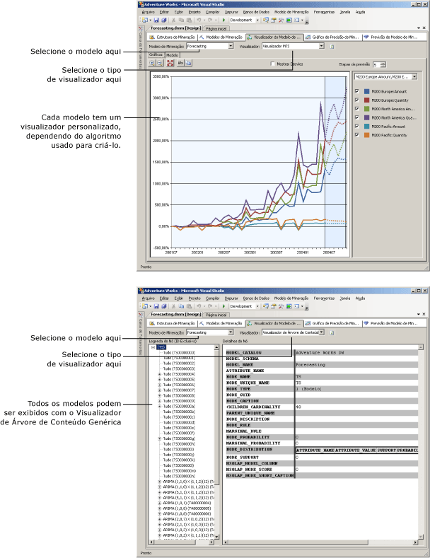

# Visualizadores do Modelo de Mineração de Dados
[!INCLUDE[ssas-appliesto-sqlas](../../includes/ssas-appliesto-sqlas.md)]
Após treinar em um modelo de mineração de dados no [!INCLUDE[msCoName](../../includes/msconame-md.md)] [!INCLUDE[ssNoVersion](../../includes/ssnoversion-md.md)] [!INCLUDE[ssASnoversion](../../includes/ssasnoversion-md.md)], você pode explorar o modelo para procurar tendências interessantes. Como os resultados dos modelos de mineração são complexos e de difícil entendimento quando em um formato bruto, muitas vezes a verificação visual dos dados é a maneira mais fácil de interpretar as regras e as relações que os algoritmos identificam nos dados.  
  
 Cada algoritmo usado para criar um modelo retorna um tipo de resultado diferente. Portanto, o [!INCLUDE[ssASnoversion](../../includes/ssasnoversion-md.md)] fornece um visualizador separado para cada algoritmo. Quando você navega em um modelo de mineração no [!INCLUDE[ssBIDevStudioFull](../../includes/ssbidevstudiofull-md.md)], o modelo é exibido na guia **Visualizador do Modelo de Mineração** do Designer de Mineração de Dados, usando o visualizador adequado ao modelo.  
  
## Como usar os Visualizadores de Modelo  
 Selecione primeiro o modelo de mineração e, em seguida, selecione um visualizador. Cada modelo tem sempre dois visualizadores disponíveis: um visualizar personalizado, que pode incluir várias guias, e o visualizador genérico.  
  
 Dependendo do tipo do modelo que selecionado, você verá opções muito diferentes para explorar o modelo. Os visualizadores personalizados, associados a cada tipo de modelo, são adaptados para o algoritmo usado para criar o modelo de mineração de dados selecionado. Cada visualizador personalizado tem várias ferramentas e caixas de diálogo para ajudar a explorar as estatísticas e padrões no modelo, exibir gráficos ou trabalhar interativamente com limites de probabilidade ou filtrar itens pelo nome.  
  
 O diagrama a seguir ilustra a diferença entre um visualizador personalizado escolhido e o visualizador genérico para o mesmo modelo.  
  
1.  Primeiro, você verá um visualizador personalizado exibido quando você seleciona um modelo de mineração baseado no algoritmo MTS.  
  
     Esse visualizador personalizado específico cria automaticamente um gráfico da série temporal e fornece cinco previsões.  
  
2.  Em seguida, verá o mesmo modelo, exibido usando o **Visualizador de Árvore de Conteúdo Genérica da Microsoft**.  
  
     Na esquerda, o visualizador genérico exibe uma lista dos nós no modelo. Você pode clicar em um nó para exibir seu conteúdo no painel direito.  
  
   
  
## Mais sobre o Visualizador de árvore de conteúdo genérica da Microsoft  
 Cada modelo pode ser exibido com o [Visualizador de Árvore de Conteúdo Genérico da Microsoft &#40;Mineração de dados&#41;](http://msdn.microsoft.com/library/751b4393-f6fd-48c1-bcef-bdca589ce34c). Este visualizador apresenta o conteúdo do modelo de mineração de acordo com um formato de tabela de HTML padrão. No entanto, a disposição dos nós e o conteúdo de cada nó difere enormemente, dependendo do algoritmo usado para gerar os resultados.  
  
 Enquanto os visualizadores personalizados são projetados para explorar e compreender o modelo, o visualizador genérico é mais útil quando você já compreende o modelo e deseja extrair estatísticas ou regras a partir de um nó específico. Por exemplo, você usaria o visualizador genérico quando desejasse exibir informações detalhadas sobre os padrões e as estatísticas que o [!INCLUDE[ssASnoversion](../../includes/ssasnoversion-md.md)] capturou durante a análise, como a probabilidade de um nó, ou uma fórmula de regressão.  
  
 Você também pode escrever *consultas de conteúdo* usando DMX para obter todas as informações que são apresentadas neste visualizador. Para obter mais informações, consulte [Consultas de conteúdo &#40;Mineração de dados&#41;](../../analysis-services/data-mining/content-queries-data-mining.md).  
  
## Nesta seção  
 Os tópicos a seguir descrevem em mais detalhe cada um dos visualizadores, e como interpretar as informações neles.  
  
 [Procurar um modelo usando o Visualizador de árvore da Microsoft](../../analysis-services/data-mining/browse-a-model-using-the-microsoft-tree-viewer.md)  
 Descreve o Visualizador de Árvore da [!INCLUDE[msCoName](../../includes/msconame-md.md)] . Esse visualizador exibe os modelos de mineração criados com o algoritmo Árvores de Decisão da [!INCLUDE[msCoName](../../includes/msconame-md.md)] e com o algoritmo Regressão Linear da [!INCLUDE[msCoName](../../includes/msconame-md.md)] .  
  
 [Procurar um modelo usando o Visualizador de Cluster da Microsoft](../../analysis-services/data-mining/browse-a-model-using-the-microsoft-cluster-viewer.md)  
 Descreve o Visualizador de Cluster da [!INCLUDE[msCoName](../../includes/msconame-md.md)] . Esse visualizador exibe os modelos de mineração criados com o algoritmo Clustering da [!INCLUDE[msCoName](../../includes/msconame-md.md)] .  
  
 [Procurar um modelo usando o visualizador MTS](../../analysis-services/data-mining/browse-a-model-using-the-microsoft-time-series-viewer.md)  
 Descreve o Visualizador Time Series da [!INCLUDE[msCoName](../../includes/msconame-md.md)] . Esse visualizador exibe os modelos de mineração criados com o algoritmo MTS da [!INCLUDE[msCoName](../../includes/msconame-md.md)] .  
  
 [Procurar um modelo usando o visualizador Microsoft Naive Bayes](../../analysis-services/data-mining/browse-a-model-using-the-microsoft-naive-bayes-viewer.md)  
 Descreve o Visualizador Naive Bayes da [!INCLUDE[msCoName](../../includes/msconame-md.md)] . Esse visualizador exibe os modelos de mineração criados com o algoritmo Naive Bayes da [!INCLUDE[msCoName](../../includes/msconame-md.md)] .  
  
 [Procurar um modelo usando o Visualizador de Cluster de sequência da Microsoft](../../analysis-services/data-mining/browse-a-model-using-the-microsoft-sequence-cluster-viewer.md)  
 Descreve o Visualizador de Cluster de Sequência da [!INCLUDE[msCoName](../../includes/msconame-md.md)] . Esse visualizador exibe os modelos de mineração criados com o algoritmo MSC da [!INCLUDE[msCoName](../../includes/msconame-md.md)] .  
  
 [Procurar um modelo usando o Visualizador de regras de associação da Microsoft](../../analysis-services/data-mining/browse-a-model-using-the-microsoft-association-rules-viewer.md)  
 Descreve o Visualizador de Regras de Associação da [!INCLUDE[msCoName](../../includes/msconame-md.md)] . Esse visualizador exibe os modelos de mineração criados com o algoritmo Associação da [!INCLUDE[msCoName](../../includes/msconame-md.md)] .  
  
 [Procurar um modelo usando o Visualizador de rede Neural da Microsoft](../../analysis-services/data-mining/browse-a-model-using-the-microsoft-neural-network-viewer.md)  
 Descreve o Visualizador de Rede Neural da [!INCLUDE[msCoName](../../includes/msconame-md.md)] . Esse visualizador exibe os modelos de mineração criados com o algoritmo Rede Neural da [!INCLUDE[msCoName](../../includes/msconame-md.md)] , incluindo os modelos que usam o algoritmo Regressão Logística da [!INCLUDE[msCoName](../../includes/msconame-md.md)] .  
  
 [Procurar um modelo usando o Visualizador de árvore de conteúdo genérica da Microsoft](../../analysis-services/data-mining/browse-a-model-using-the-microsoft-generic-content-tree-viewer.md)  
 Descreve as informações detalhadas disponíveis no visualizador genérico de todos os modelos de mineração de dados e fornece exemplos de como interpretar as informações para cada algoritmo.  
  
## Consulte também  
 [Algoritmos de mineração de dados e &#40; Analysis Services – Data Mining e &#41;](../../analysis-services/data-mining/data-mining-algorithms-analysis-services-data-mining.md)   
 [Designer de mineração de dados](../../analysis-services/data-mining/data-mining-designer.md)  
  
  
