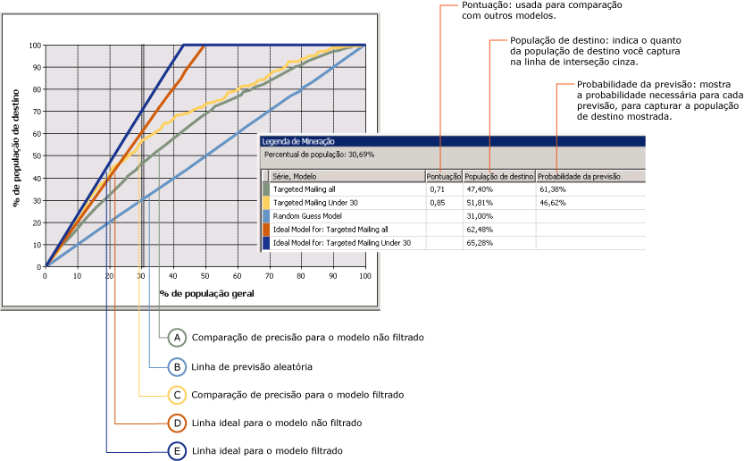
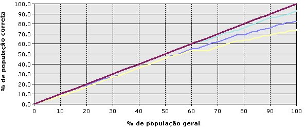

# Gráfico de comparação de precisão (Analysis Services - Mineração de Dados)
[!INCLUDE[ssas-appliesto-sqlas](../../includes/ssas-appliesto-sqlas.md)]
  Um *Gráfico de comparação de precisão* representa graficamente a melhoria que um modelo de mineração fornece quando comparado contra uma suposição aleatória, e mede a alteração em termos de uma pontuação de *comparação de precisão* . Comparando as pontuações de comparação de precisão de modelos diferentes, você pode determinar qual modelo é melhor. Você também pode determinar o ponto no qual as previsões do modelo se tornam menos úteis. Por exemplo, ao analisar o gráfico de comparação de precisão, você pode perceber que uma campanha promocional é provavelmente eficaz apenas para 30% dos clientes e usar esse valor para limitar o escopo da campanha.  
  
 No [!INCLUDE[ssNoVersion](../../includes/ssnoversion-md.md)] Data Mining, o gráfico de comparação de precisão pode comparar a exatidão dos vários modelos que têm o mesmo atributo previsível. Você também pode avaliar a exatidão de previsão para um único resultado (um único valor do atributo previsível), ou para todos os resultados (todos os valores do atributo especificado).  
  
 Um gráfico de ganho é um tipo de gráfico relacionado que contém as mesmas informações do gráfico de comparação de precisão, mas que também exibe o aumento projetado em ganho associado ao uso de cada modelo.  
  
##   Entendendo o gráfico de comparação de precisão  
 Pode ser difícil entender gráficos de comparação de precisão em teoria. Portanto, para ilustrar o uso das ferramentas de gráfico de comparação de precisão e as informações no gráfico, esta seção apresenta um cenário no qual um gráfico de comparação de precisão é usado para estimar a resposta a uma campanha de mala direta.  
  
 O departamento de marketing neste cenário sabe que uma taxa de resposta de 10 por cento é mais ou menos típica de campanhas de mala direta. Eles têm uma lista de 10.000 clientes potenciais armazenada em uma tabela do banco de dados. Com base na taxa de resposta típica, eles normalmente podem esperar que somente cerca de 1.000 clientes potenciais respondam. Porém, o dinheiro orçado para o projeto não é suficiente para atingir todos os 10.000 clientes do banco de dados e eles querem aumentar sua taxa de resposta. Suponha para este cenário que o orçamento deles permite remeter uma peça para somente 5.000 clientes. O departamento de marketing tem duas opções:  
  
-   Selecionar aleatoriamente 5.000 clientes-alvo.  
  
-   Usar um modelo de mineração para atingir os 5.000 clientes mais prováveis de responder.  
  
 Usando um gráfico de comparação de precisão, você pode comparar os resultados esperados de ambas as opções. Por exemplo, se a empresa selecionou aleatoriamente 5.000 clientes, pode esperar receber apenas 500 respostas, com base na taxa de resposta típica. Este cenário é representado pela linha *aleatório* no gráfico de comparação de precisão. No entanto, se o departamento de marketing utilizou um modelo de mineração para direcionar a mala direta, eles podem esperar uma taxa de resposta melhor, pois o modelo identificaria os clientes que mais provavelmente responderão. Se o modelo fosse perfeito, ele criaria previsões que nunca estariam erradas, a empresa poderia esperar receber 1.000 respostas por ter enviado a mala direta somente para os 1.000 clientes potenciais recomendados pelo modelo. Este cenário é representado pela linha *ideal* no gráfico de comparação de precisão.  
  
 A realidade é que o modelo de mineração muito provavelmente cairá entre estes dois extremos; entre a previsão aleatória e a perfeita. Qualquer melhoria da previsão aleatória é considerada para a precisão.  
  
 Quando você criar um gráfico de comparação de precisão, pode ter como destino um valor específico e medir a comparação de precisão somente para esse resultado ou pode criar uma avaliação geral do modelo que mede comparações de precisão para todos os resultados possíveis. Essas seleções afetam o gráfico final, conforme descrito nas seções a seguir.  
  
 [Voltar ao Início](#bkmk_Top)  
  
### Gráfico de comparação de precisão com valor de destino  
 O gráfico a seguir mostra um gráfico de comparação de precisão relativo ao modelo **Mala Direta Dirigida** criado no [Tutorial Básico de Data Mining](http://msdn.microsoft.com/library/6602edb6-d160-43fb-83c8-9df5dddfeb9c). Neste gráfico, o atributo de destino é [Bike Buyer] e o valor de destino é 1, o que significa que o cliente está propenso a comprar a bicicleta. Portanto, o gráfico de comparação de precisão mostra a melhoria que o modelo oferece ao identificar esses clientes potenciais.  
  
 Este gráfico contém vários modelos baseados nos mesmos dados. Um destes modelos foi personalizado para clientes de destino específicos. Você pode personalizar um modelo adicionando filtros nos dados usados para treinar o modo. Este filtro restringe os casos usados tanto no treinamento quanto na avaliação a clientes com menos de 30 anos de idade. Observe que um efeito de filtrar é que o modelo básico e o modelo filtrado usam conjuntos de dados diferentes e, portanto, o número de casos usados para avaliação no gráfico de comparação de precisão também é diferente. Este é um ponto importante a ser lembrado na interpretação dos resultados da previsão e de outras estatísticas.  
  
   
  
 O eixo x do gráfico representa a porcentagem do conjunto de dados de teste usada para comparar as previsões. O eixo y do gráfico representa a porcentagem de valores previstos.  
  
 A linha reta diagonal, em azul, aparece em todos os gráficos. Ela representa os resultados da previsão aleatória e é a linha de base para avaliar a precisão. Para cada modelo adicionado a um gráfico de comparação de precisão, você tem duas linhas adicionais: uma que mostra os resultados ideais para o conjunto de dados de treinamento se for possível criar um modelo que sempre faça previsões com perfeição e uma segunda linha, que mostra a precisão real, ou a melhoria nos resultados, do modelo.  
  
 Neste exemplo, a linha ideal para o modelo filtrado é mostrada em azul-escuro, e a linha relativa à precisão real aparece em amarelo. Com base no gráfico, podemos afirmar que a linha ideal atinge o ponto máximo em torno dos 40%, o que significa que, se você tiver um modelo perfeito, pode atingir 100% dos clientes-alvo enviando uma mala direta para apenas 40% da população total. A precisão real referente ao modelo filtrado quando você visa 40% da população fica entre 60% e 70%, o que significa que é possível atingir 60-70% dos clientes-alvo enviando a mala direta para 40% da população total de clientes.  
  
 A **Legenda de Mineração** contém os valores reais em qualquer ponto das curvas. Você pode alterar o lugar que é medido clicando na barra vertical cinza para movê-la. No gráfico, a linha cinza foi movida até 30% porque esse é o ponto em que tanto o modelo filtrado quanto o não filtrado parecem ser mais eficientes, e após esse ponto o valor da precisão diminui.  
  
 A **Legenda de Mineração** também mostra pontuações e estatísticas que ajudam a interpretar o gráfico. Esses resultados representam a precisão do modelo na linha cinza, que neste cenário está posicionada para incluir 30% dos testes de caso gerais.  
  
|Série e modelo|Pontuação|População de destino|Probabilidade da previsão|  
|-----------------------|-----------|-----------------------|-------------------------|  
|Targeted mailing all|0.71|47.40%|61.38%|  
|Mala direta dirigida – menos de 30 anos|0.85|51.81%|46.62%|  
|Modelo de previsão aleatória||31.00%||  
|Modelo ideal para: Mala direta dirigida – todos||62.48%||  
|Modelo ideal para: Mala direta dirigida – menos de 30 anos||65.28%||  
  
 [Voltar ao Início](#bkmk_Top)  
  
#### Interpretando os resultados  
 Com base nesses resultados, podemos observar que, quando avaliado em 30% de todos os casos, o modelo geral [Targeted mailing all] pode prever o comportamento de compra de bicicleta de 47,40% da população de destino. Em outras palavras, se você enviar uma mala direta direcionada para apenas 30% dos clientes do seu banco de dados, poderá atingir um pouco menos da metade do público-alvo. Se usasse o modelo filtrado, você poderia obter resultados ligeiramente melhores e atingir aproximadamente 51% de seus clientes-alvo.  
  
 O valor de **Probabilidade da previsão** representa o limite necessário para incluir um cliente entre os casos "propenso a comprar". Para cada caso, o modelo estima a precisão de cada previsão e armazena esse valor, que você pode usar para filtrar os clientes ou definir os clientes-alvo. Por exemplo, para identificar os clientes do modelo básico que são possíveis compradores, use uma consulta que recupere os casos com um valor de Probabilidade da previsão de, pelo menos, 61%. Para definir os clientes-alvo pelo modelo filtrado, crie uma consulta que recupere os casos que atendem a todos os critérios: idade e um valor de **PredictProbability** de, pelo menos, 46%.  
  
 É interessante comparar os modelos. O modelo filtrado parece capturar mais clientes potenciais, mas quando você visa clientes com uma pontuação de probabilidade de previsão de 46%, também tem 53% de probabilidade de enviar uma mala direta para alguém que não comprará uma bicicleta. Portanto, para decidir qual é o melhor modelo, procure contrabalançar a maior precisão e o menor tamanho de destino do modelo filtrado com base na seletividade do modelo básico.  
  
 O valor de **Pontuação** ajuda a comparar os modelos calculando a eficácia do modelo em uma população normalizada. Uma pontuação maior é melhor, por isso nesse caso você deve decidir que visar clientes com menos de 30 anos é a estratégia mais eficaz, apesar da probabilidade de previsão mais baixa.  
  
#### Como a pontuação é calculada?  
 A pontuação é calculada como a pontuação média geométrica de todos os pontos que constituem um gráfico de dispersão em que o eixo x contém os valores reais, o eixo y contém o valor previsto e cada ponto tem uma probabilidade associada.  
  
 O significado estatístico da pontuação de qualquer ponto individual é a comparação de precisão preditiva do modelo medido nesse ponto. A média de todos os pontos constitui a pontuação do modelo.  
  
 [Voltar ao Início](#bkmk_Top)  
  
### Gráfico de comparação de precisão para modelo sem valor de destino  
 Se você não especificar o estado da coluna previsível, criará o tipo de gráfico mostrado no diagrama a seguir. Este gráfico mostra o desempenho do modelo para todos os estados do atributo previsível. Por exemplo, ele informa com que precisão o modelo prevê tanto os clientes que estão propensos a comprar uma bicicleta quanto aqueles que provavelmente não comprarão uma.  
  
 O eixo x é o mesmo do gráfico com a coluna previsível especificada, mas agora o eixo y representa a porcentagem de previsões corretas. Portanto, a linha ideal é a diagonal, que mostra que em 50% dos dados o modelo prevê corretamente 50% dos casos, o valor máximo que se pode esperar.  
  
   
  
 Você pode clicar no gráfico para mover a barra vertical cinza, e a **Legenda de Mineração** exibe o percentual de casos no geral e o percentual dos casos previstos corretamente. Por exemplo, se você posicionar o controle deslizante cinza na marca dos 50%, a **Legenda de Mineração** exibirá as pontuações de precisão listadas a seguir. Estes números têm como base o modelo TM_Decision Tree criado no Tutorial Básico de Mineração de Dados.  
  
|Série, modelo|Pontuação|População de destino|Probabilidade da previsão|  
|-------------------|-----------|-----------------------|-------------------------|  
|TM_Decision Tree|0.77|40.50%|72.91%|  
|Modelo ideal||50.00%||  
  
 Essa tabela mostra que, em 50% da população, o modelo que você criou prevê corretamente 40% dos casos. Você deve considerar esse modelo razoavelmente preciso. No entanto, lembre-se de que esse modelo específico prevê todos os valores do atributo previsível. Por isso, o modelo pode ser preciso ao prever que 90% dos clientes não comprarão uma bicicleta.  
  
 [Voltar ao Início](#bkmk_Top)  
  
### Restrições em gráficos de comparação de precisão  
 Os gráficos de comparação de precisão exigem que o atributo previsível seja um valor discreto. Em outras palavras, você não pode usar gráficos de comparação de precisão para medir a exatidão de modelos que preveem valores numéricos contínuos.  
  
 A exatidão de previsão de todos os valores distintos do atributo previsível é mostrada em uma única linha. Para ver as linhas de exatidão de previsão de qualquer valor individual do atributo previsível, crie um gráfico de comparação de precisão à parte para cada valor de destino.  
  
 É possível adicionar vários modelos a um gráfico de comparação de precisão, desde que todos os modelos tenham o mesmo atributo previsível. Os modelos que não compartilharem o atributo estarão indisponíveis para seleção na guia **Entrada** .  
  
 Você não pode exibir modelos de série temporal em um gráfico de comparação de precisão ou gráfico de lucro. Uma prática comum para medir a exatidão de previsões de série temporal é reservar uma parte de dados históricos e comparar esses dados com as previsões. Para obter mais informações, consulte [Algoritmo MTS](../../analysis-services/data-mining/microsoft-time-series-algorithm.md).  
  
### Conteúdo relacionado  
 [Voltar ao Início](#bkmk_Top)  
  
## Consulte também  
 [Teste e validação &#40;Data Mining&#41;](../../analysis-services/data-mining/testing-and-validation-data-mining.md)  
  
  
