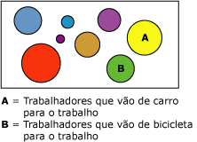

# Algoritmo Microsoft Clustering
[!INCLUDE[ssas-appliesto-sqlas](../../includes/ssas-appliesto-sqlas.md)]O [!INCLUDE[msCoName](../../includes/msconame-md.md)] algoritmo de Clustering é um *segmentação* ou *clustering* algoritmo itera sobre casos em um conjunto de dados para agrupá-los em clusters que contenham características semelhantes. Esses agrupamentos são úteis para explorar dados, identificando anomalias nos dados e criar previsões.  
  
 Modelos de clustering identificam as relações em um conjunto de dados que não podem ser derivados de forma lógica através de observação casual. Por exemplo, você pode discernir imaginar facilmente que as pessoas que vão para o trabalho de bicicleta normalmente não moram longe do local onde trabalham. Porém, o algoritmo pode encontrar outras características dos usuários de bicicleta que não são tão óbvias. No diagrama a seguir, o cluster A representa dados sobre pessoas que pretendem ir de carro para o trabalho, enquanto o cluster B representa dados sobre pessoas que pretendem ir de bicicleta para o trabalho.  
  
   
  
 O algoritmo de clustering difere dos demais algoritmos de mineração de dados, como o algoritmo Árvores de Decisão da [!INCLUDE[msCoName](../../includes/msconame-md.md)] , porque você não precisa designar uma coluna previsível para poder criar um modelo de clustering. O algoritmo de clustering treina o modelo estritamente a partir das relações existentes nos dados e a partir dos clusters que o algoritmo identifica.  
  
## Exemplo  
 Considere um grupo de pessoas que compartilha informações demográficas similares e que compram produtos semelhantes da empresa [!INCLUDE[ssSampleDBCoShort](../../includes/sssampledbcoshort-md.md)] . Esse grupo de pessoas representa um cluster de dados. Podem existir vários desses clusters em um banco de dados. Observando as colunas que formam um cluster, é possível observar claramente como os registros em um conjunto de dados são relacionados entre si.  
  
## Como o algoritmo funciona  
 O algoritmo [!INCLUDE[msCoName](../../includes/msconame-md.md)] Clustering primeiro identifica as relações em um conjunto de dados e gera uma série de clusters com base nelas. Uma dispersão é uma maneira útil para representar visualmente como o algoritmo agrupa os dados, conforme mostrado no diagrama a seguir. A dispersão representa todos os caso no conjunto de dados, e cada caso é um ponto no gráfico. Os clusters agrupam pontos no gráfico e ilustram as relações que o algoritmo identifica.  
  
   
  
 Após definir primeiro os clusters, o algoritmo calcula como os mesmos representam satisfatoriamente agrupamentos dos pontos, e em seguida, tenta redefinir os agrupamentos para criar os clusters que melhor representem os dados. O algoritmo itera através desse processo até não poder mais melhorar os resultados pela redefinição dos clusters.  
  
 Você pode personalizar o modo como o algoritmo funciona ao selecionar uma técnica de clustering específica, limitando o número máximo de clusters ou alterando o valor de suporte necessário para criar um cluster. Para obter mais informações, consulte [Referência técnica do algoritmo Microsoft Clustering](../../analysis-services/data-mining/microsoft-clustering-algorithm-technical-reference.md). esse algoritmo inclui dois métodos de clusters populares: clustering K-means e o método de maximização de expectativa.  
  
## Dados requeridos por agrupar modelos  
 Ao preparar dados para usar no treinamento de um modelo de clustering, é preciso entender os requisitos de um determinado algoritmo, incluindo a quantidade de dados necessária e como eles são usados.  
  
 Os requisitos de um modelo de clustering são os seguintes:  
  
-   **Uma única coluna de chave** Cada modelo deve conter uma coluna de texto ou numérica que identifique unicamente cada registro. Chaves compostas não são permitidas.  
  
-   **Colunas de entrada** Cada modelo deve conter pelo menos uma coluna de entrada contendo os valores que serão usados para criar os clusters. Você pode ter quantas colunas de entrada desejar, mas, dependendo do número de valores em cada coluna, a inclusão de colunas extras pode aumentar o tempo que leva para treinar o modelo.  
  
-   **Coluna previsível opcional** O algoritmo não precisa de uma coluna previsível para criar o modelo, mas você pode adicionar uma coluna previsível de praticamente qualquer tipo de dados. Os valores da coluna previsível podem ser tratados como entrada para o modelo de clustering ou você pode especificar que ela deve ser usada somente para previsão. Por exemplo, para prever a receita de clientes ao agrupá-los por dados demográficos, como região ou idade, você poderia especificar a receita como **PredictOnly** e adicionar todas as outras colunas, como região e idade, como entradas.  
  
 Para obter informações mais detalhadas sobre os tipos de conteúdo e de dados com suporte pelos modelos de clustering, consulte a seção Requisitos de [Referência técnica do algoritmo Microsoft Clustering](../../analysis-services/data-mining/microsoft-clustering-algorithm-technical-reference.md).  
  
## Exibindo um modelo de clustering  
 Para explorar o modelo, você pode usar o **Visualizador de Cluster da Microsoft**. Quando você exibir um modelo de clustering, o [!INCLUDE[ssASnoversion](../../includes/ssasnoversion-md.md)] mostrará os clusters em um diagrama que descreve as relações entre eles, além de fornecer um perfil detalhado de cada cluster, uma lista dos atributos que distinguem cada um deles e as características de todo o conjunto de dados de treinamento. Para obter mais informações, consulte [Procurar um modelo usando o Visualizador de Cluster da Microsoft](../../analysis-services/data-mining/browse-a-model-using-the-microsoft-cluster-viewer.md).  
  
 Para obter mais detalhes, você pode navegar pelo modelo no [Visualizador de Árvore de Conteúdo Genérica da Microsoft](../../analysis-services/data-mining/browse-a-model-using-the-microsoft-generic-content-tree-viewer.md). O conteúdo armazenado para o modelo inclui a distribuição de todos os valores em cada nó, a probabilidade de cada cluster e outras informações. Para obter mais informações, consulte [Conteúdo do modelo de mineração para modelos de clustering &#40;Analysis Services – Data Mining&#41;](../../analysis-services/data-mining/mining-model-content-for-clustering-models-analysis-services-data-mining.md).  
  
## Criando previsões  
 Depois que o modelo tiver sido treinado, os resultados serão armazenados como um conjunto de padrões, que você poderá explorar ou usar para realizar previsões.  
  
 Você pode criar consultas para retornar previsões sobre a adequação dos novos dados aos clusters que foram detectados ou para obter estatísticas descritivas sobre os clusters.  
  
 Para obter informações sobre como criar consultas com base em um modelo de mineração de dados, consulte [Consultas de mineração de dados](../../analysis-services/data-mining/data-mining-queries.md). Para obter exemplos de como usar consultas com um modelo de clustering, consulte [Exemplos de consulta de modelo de clustering](../../analysis-services/data-mining/clustering-model-query-examples.md).  
  
## Comentários  
  
-   Suporta o uso de PMML (Predictive Model Markup Language) para criar modelos de mineração.  
  
-   Dá suporte ao detalhamento.  
  
-   Dá suporte ao uso de modelos de mineração OLAP e à criação de dimensões de mineração de dados.  
  
## Consulte também  
 [Algoritmos de mineração de dados &#40;Analysis Services – Data Mining&#41;](../../analysis-services/data-mining/data-mining-algorithms-analysis-services-data-mining.md)   
 [Microsoft Clustering Algorithm Technical Reference](../../analysis-services/data-mining/microsoft-clustering-algorithm-technical-reference.md)   
 [Conteúdo do modelo de mineração para Clustering modelos &#40; Analysis Services – mineração de dados &#41;](../../analysis-services/data-mining/mining-model-content-for-clustering-models-analysis-services-data-mining.md)   
 [Exemplos de consulta de modelo de clustering](../../analysis-services/data-mining/clustering-model-query-examples.md)  
  
  
