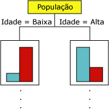
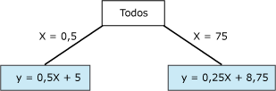

# Algoritmo Árvores de Decisão da Microsoft
[!INCLUDE[ssas-appliesto-sqlas](../../includes/ssas-appliesto-sqlas.md)]
  O algoritmo Árvores de Decisão da [!INCLUDE[msCoName](../../includes/msconame-md.md)] é um algoritmo de classificação e regressão para uso em modelagens de previsão de atributos discretos e contínuos.  
  
 No caso dos atributos discretos, o algoritmo faz previsões fundadas nas relações entre colunas de entrada em um conjunto de dados. Ele usa os valores, conhecidos como estados, dessas colunas para prever os estados de uma coluna que você define como previsível. Especificamente, o algoritmo identifica as colunas de entrada que são correlacionadas com a coluna previsível. Por exemplo, em um cenário em que se deseja prever a tendência dos clientes em adquirir uma bicicleta, se 9 de 10 clientes jovens comprarem uma bicicleta, mas apenas 2 de 10 clientes mais velhos fizerem o mesmo, o algoritmo infere que idade é um bom indicador para a compra de bicicletas. A árvore de decisão faz previsões com base nesta tendência para obter um resultado específico.  
  
 No caso de atributos contínuos, o algoritmo usa a regressão linear para determinar onde uma árvore de decisão se divide.  
  
 Se mais de uma coluna for definida como previsível, ou se os dados de entrada tiverem uma tabela aninhada configurada como previsível, o algoritmo criará uma árvore de decisão separada para cada coluna previsível.  
  
## Exemplo  
 O departamento de marketing da empresa [!INCLUDE[ssSampleDBCoFull](../../includes/sssampledbcofull-md.md)] deseja identificar as características dos clientes antigos que possam indicar se há chance de eles realizarem compras futuramente. O banco de dados da [!INCLUDE[ssSampleDBnormal](../../includes/sssampledbnormal-md.md)] armazena informações demográficas que descrevem clientes antigos. Usando o algoritmo Árvores de Decisão da [!INCLUDE[msCoName](../../includes/msconame-md.md)] para analisar essas informações, o departamento de marketing pode criar um modelo que prevê se um cliente específico comprará ou não produtos com base nos estados de colunas conhecidas sobre aquele cliente, como padrões demográficos ou compras já efetuadas.  
  
## Como o algoritmo funciona  
 O algoritmo Árvores de Decisão da [!INCLUDE[msCoName](../../includes/msconame-md.md)] gera um modelo de mineração de dados criando uma série de divisões na árvore. Essas divisões são representadas como *nós*. O algoritmo adiciona um nó ao modelo toda vez que uma coluna de entrada é considerada significativamente correlacionada a uma coluna previsível. A forma que o algoritmo determina uma divisão depende do fato de ele estar prevendo uma coluna contínua ou discreta.  
  
 O algoritmo Árvores de Decisão da [!INCLUDE[msCoName](../../includes/msconame-md.md)] usa a *seleção de recurso* para guiar a seleção dos atributos mais úteis. A seleção de recurso é usada por todos os algoritmos de mineração de dados do [!INCLUDE[ssNoVersion](../../includes/ssnoversion-md.md)] Data Mining algorithms to improve performance and the quality of analysis. A seleção de recurso é importante para impedir que atributos sem-importância usem tempo do processador. Se você usar muitas entradas ou atributos previsíveis ao criar um modelo de mineração de dados, o modelo poderá demorar muito tempo para processar ou ainda esgotar a memória. Os métodos usados para determinar a divisão da árvore incluem medidas padrão da indústria para *entropia* e redes Bayesianas *.* Para obter mais informações sobre os métodos usados para selecionar atributos significativos e depois classificá-los, consulte [Seleção de recursos &#40;Mineração de dados&#41;](../../analysis-services/data-mining/feature-selection-data-mining.md).  
  
 Um problema muito comum nos modelos de mineração de dados é que eles se tornam muito sensíveis a pequenas diferenças nos dados de treinamento. Nesse caso, nos referimos a eles como *sobrecarregados* ou *muito treinados*. Um modelo sobrecarregado não pode ser generalizado para outros conjuntos de dados. Para evitar a superajuste de um determinado conjunto de dados, o algoritmo Árvores de Decisão da [!INCLUDE[msCoName](../../includes/msconame-md.md)] usa técnicas para controlar o crescimento da árvore. Para obter uma explicação mais detalhada de como funciona o algoritmo de Árvores de Decisão [!INCLUDE[msCoName](../../includes/msconame-md.md)] , consulte [Referência técnica do algoritmo Árvores de Decisão da Microsoft](../../analysis-services/data-mining/microsoft-decision-trees-algorithm-technical-reference.md).  
  
### Prevendo colunas discretas  
 A forma como o algoritmo Árvores de Decisão da [!INCLUDE[msCoName](../../includes/msconame-md.md)] cria uma árvore para uma coluna previsível discreta pode ser mostrada usando um histograma. O diagrama a seguir mostra um histograma que esboça uma coluna previsível, Compradores de bicicleta, em comparação com uma coluna de entrada, Idade. O histograma mostra que a idade de uma pessoa ajuda a distinguir se ela comprará uma bicicleta.  
  
   
  
 A correlação que é mostrada no diagrama faz com que o algoritmo Árvores de Decisão da [!INCLUDE[msCoName](../../includes/msconame-md.md)] crie um novo nó no modelo.  
  
   
  
 À medida que o algoritmo acrescenta novos nós em um modelo, uma estrutura de árvore é formada. O nó superior da árvore indica a divisão da coluna previsível para a média da população de clientes. Como o modelo continua crescendo, o algoritmo considera todas as colunas.  
  
### Prevendo colunas contínuas  
 Quando o algoritmo Árvores de Decisão da [!INCLUDE[msCoName](../../includes/msconame-md.md)] cria uma árvore com base em uma coluna previsível contínua, cada nó contém uma fórmula de regressão. Uma divisão ocorre em um ponto de não linearidade na fórmula de regressão. Por exemplo, considere o seguinte diagrama:  
  
   
  
 Em um modelo de regressão padrão, você deve tentar derivar uma única fórmula que represente as tendências e as relações para os dados como um todo.  No entanto, uma única fórmula pode fazer um trabalho ruim de capturar a descontinuidade em dados complexos. Em vez disso, o algoritmo de Árvores de Decisão [!INCLUDE[msCoName](../../includes/msconame-md.md)] procura segmentos da árvore que são muito lineares e cria fórmulas separadas para esses segmentos. Ao dividir os dados em diferentes segmentos, o modelo pode fazer um trabalho melhor de aproximar dados.  
  
 O diagrama a seguir representa o diagrama de árvore para o modelo na dispersão acima.  Para prever o resultado, o modelo fornece duas fórmulas diferentes: uma para ramificação à esquerda, com a fórmula y = 0,5x x 5 e outra para ramificação à direita, com a fórmula y = 0,25x + 8,75. O ponto no qual as duas linhas se encontram no diagrama de dispersão é o ponto de não linearidade e o ponto em que o nó de um modelo de árvore de decisão se dividiria.  
  
   
  
 Esse é um modelo simples com apenas duas equações lineares; portanto, a divisão na árvore é imediatamente após o nó **Todos** . No entanto, uma divisão pode ocorrer em qualquer nível da árvore. Isso significa que, em uma árvore contendo vários níveis e nós, em que cada nó é caracterizado por um conjunto diferente de atributos, uma fórmula pode ser compartilhada entre vários nós ou aplicar-se a somente um único nó. Por exemplo, você pode obter uma fórmula para um nó definido como "clientes acima de determinada idade e renda" e outra para um nó que represente "clientes que se deslocam longas distâncias". Para ver a fórmula para um nó ou segmento individual, basta clicar no nó.  
  
## Dados necessários para modelos de árvore de decisão  
 Ao preparar dados para usar em um modelo de árvore de decisão, você deve saber os requisitos do algoritmo específico, incluindo a quantidade de dados necessária e como eles são usados.  
  
 Os requisitos para um modelo de árvore de decisão são os seguintes:  
  
-   **Uma única coluna de chave** Cada modelo deve conter uma coluna de texto ou numérica que identifique unicamente cada registro. Não são permitidas chaves compostas.  
  
-   **Uma coluna previsível** Requer, pelo menos, uma coluna previsível. Você pode incluir vários atributos previsíveis em um modelo, e o atributo previsível pode ser de diferentes tipos, tanto numérico como discreto. Porém, o aumento no número de atributos previsíveis pode aumentar o tempo de processamento.  
  
-   **Colunas de entrada** Requer colunas de entrada que podem ser discretas ou contínuas. O aumento no número de atributos de entrada afeta o tempo de processamento.  
  
 Para obter informações mais detalhadas sobre os tipos de conteúdo e de dados com suporte pelos modelos de árvore de decisão, consulte a seção Requisitos de [Referência técnica do algoritmo de árvore de decisão da Microsoft](../../analysis-services/data-mining/microsoft-decision-trees-algorithm-technical-reference.md).  
  
## Exibindo um modelo de árvore de decisão  
 Para explorar o modelo, você pode usar o **Visualizador de Árvores da Microsoft**. Caso seu modelo gere várias árvores, é possível selecionar uma árvore e o visualizador mostrará uma divisão de como os casos são categorizados para cada atributo previsível. Você também pode exibir a interação das árvores usando o visualizador de rede de dependência. Para obter mais informações, consulte [Procurar um modelo usando o Visualizador de Árvores da Microsoft](../../analysis-services/data-mining/browse-a-model-using-the-microsoft-tree-viewer.md).  
  
 Se quiser obter mais detalhes sobre qualquer ramificação ou nó da árvore, você também pode explorar o modelo usando o [Visualizador de Árvore de Conteúdo Genérica da Microsoft](../../analysis-services/data-mining/browse-a-model-using-the-microsoft-generic-content-tree-viewer.md). O conteúdo armazenado para o modelo inclui a distribuição de todos os valores em cada nó, as probabilidades em cada nível da árvore e as fórmulas de regressão dos atributos contínuos. Para obter mais informações, consulte [Mining Model Content for Decision Tree Models &#40;Analysis Services - Data Mining&#41;](../../analysis-services/data-mining/mining-model-content-for-decision-tree-models-analysis-services-data-mining.md).  
  
## Criando previsões  
 Depois que o modelo foi processado, os resultados são armazenados como um conjunto de padrões e estatísticas. Esse conjunto pode ser usado para explorar relações e fazer previsões.  
  
 Para obter exemplos de consultas a usar com um modelo de árvores de decisão, consulte [Exemplos de consulta de modelo de árvores de decisão](../../analysis-services/data-mining/decision-trees-model-query-examples.md).  
  
 Para obter informações gerais sobre como criar consultas com base em modelos de mineração, consulte [Consultas de mineração de dados](../../analysis-services/data-mining/data-mining-queries.md).  
  
## Comentários  
  
-   Suporta o uso de PMML (Predictive Model Markup Language) para criar modelos de mineração.  
  
-   Dá suporte ao detalhamento.  
  
-   Dá suporte ao uso de modelos de mineração OLAP e à criação de dimensões de mineração de dados.  
  
## Consulte também  
 [Algoritmos de mineração de dados e &#40; Analysis Services – Data Mining e &#41;](../../analysis-services/data-mining/data-mining-algorithms-analysis-services-data-mining.md)   
 [Referência técnica do algoritmo de árvores de decisão da Microsoft](../../analysis-services/data-mining/microsoft-decision-trees-algorithm-technical-reference.md)   
 [Exemplos de consulta de modelo de árvores de decisão](../../analysis-services/data-mining/decision-trees-model-query-examples.md)   
 [Conteúdo do modelo de mineração para modelos de árvore de decisão & #40; Analysis Services – mineração de dados & #41;](../../analysis-services/data-mining/mining-model-content-for-decision-tree-models-analysis-services-data-mining.md)  
  
  
