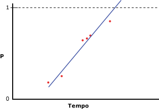
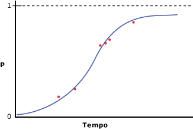

# <a name="microsoft-logistic-regression-algorithm-technical-reference"></a>Referência técnica do algoritmo Regressão Logística da Microsoft
  O algoritmo Regressão Logística da [!INCLUDE[msCoName](../../includes/msconame-md.md)] é uma variação do algoritmo Rede Neural da [!INCLUDE[msCoName](../../includes/msconame-md.md)] , no qual o parâmetro *HIDDEN_NODE_RATIO* é definido como 0. Essa configuração criará um modelo de rede neural que não contém uma camada oculta e, portanto, é equivalente à regressão logística.  
  
## <a name="implementation-of-the-microsoft-logistic-regression-algorithm"></a>Implementação do algoritmo Regressão Logística da Microsoft  
 Suponha que a coluna previsível contenha apenas dois estados, mas você deseja executar uma análise de regressão, relacionando as colunas de entrada com a probabilidade de que a coluna previsível contenha um estado específico. O diagrama a seguir ilustra os resultados que você obterá se atribuir 1 e 0 aos estados da coluna previsível, calcular a probabilidade de que a coluna previsível contenha um estado específico e executar uma regressão linear em uma variável de entrada.  
  
   
  
 O eixo x contém os valores de uma coluna de entrada. O eixo y contém as probabilidades de que a coluna previsível tenha um estado ou outro. O problema disso é que a regressão linear não restringe a coluna para que fique entre 0 e 1, embora esses sejam os valores máximo e mínimo da coluna. Uma maneira de resolver isso é executar regressão logística. Em vez de criar uma linha reta, a análise de regressão logística cria uma curva em forma de "S" que contém as restrições máxima e mínima. Por exemplo, o diagrama a seguir ilustra os resultados que você obterá se executar uma regressão logística nos mesmos dados usados no exemplo anterior.  
  
   
  
 Observe como a curva nunca atinge mais do que 1 ou menos que 0. Você pode usar a regressão logística para descrever quais colunas de entrada são importantes para determinar o estado da coluna previsível.  
  
### <a name="feature-selection"></a>Seleção de recursos  
 A seleção de recursos é usada automaticamente por todos os algoritmos de mineração de dados do Analysis Services para melhorar a análise e reduzir a carga de processamento. O método usado para seleção de recursos em um modelo de regressão logística depende do tipo de dados do atributo. Como a regressão logística se baseia no algoritmo Rede Neural da Microsoft, ela usa um subconjunto dos métodos de seleção de recursos que se aplicam às redes neurais. Para obter mais informações, consulte [Seleção de recursos &#40;Mineração de Dados&#41;](../../analysis-services/data-mining/feature-selection-data-mining.md).  
  
### <a name="scoring-inputs"></a>Entradas de pontuação  
 *Pontuação* no contexto de um modelo de rede neural ou de regressão logística significa o processo de converter os valores presentes nos dados em um conjunto de valores que usam a mesma escala e, portanto, podem ser comparados. Por exemplo, vamos supor que as entradas do intervalo de Renda vão de 0 a 100.000, enquanto as entradas de [Número de Filhos] vão de 0 a 5. Esse processo de conversão lhe permite comparar a importância de cada entrada, independentemente da diferença nos valores.  
  
 Para cada estado que aparece no conjunto de treinamento, o modelo gera uma entrada. Para entradas discretas ou diferenciadas, uma entrada adicional será criada para representar o estado Ausente, se o estado ausente aparecer pelo menos uma vez no conjunto de treinamento. Para entradas contínuas, no máximo dois nós de entrada são criados: um para valores Ausentes, se presentes nos Dados de Treinamento e uma entrada para todos os valores existentes ou não nulos. Cada entrada é escalonada para um formato numérico usando o método de normalização de pontuação, `(x – μ)\StdDev`.  
  
 Durante a normalização da pontuação z, a média (µ) e o desvio padrão são obtidos sobre o conjunto de treinamento completo.  
  
 **Valores contínuos**  
  
 Valor presente:   `(X – μ)/σ ` (X é o valor real que está sendo codificado)  
  
 Valor ausente:    `-   μ/σ `  (mu negativo dividido por sigma)  
  
 **Valores discretos**  
  
 `μ = p`  (a probabilidade anterior de um estado)  
  
 StdDev  `= sqrt(p\(1-p))`  
  
 Valor presente:     `\(1 – μ)/σ` (um menos mu dividido por sigma)  
  
 Valor ausente:     `(– μ)/σ` (mu negativo dividido por sigma)  
  
### <a name="understanding-logistic-regression-coefficients"></a>Entendendo coeficientes de regressão logística  
 Há vários métodos na literatura estatística para execução de regressão logística, mas uma parte importante de todos os métodos é avaliar a adequação do modelo. Várias estatísticas de adequação do ajuste foram propostas, dentre elas taxas de possibilidades e padrões de covariável. Uma análise de como medir a adequação de um modelo está além do escopo deste tópico; no entanto, você pode recuperar o valor dos coeficientes no modelo e usá-los para projetar suas próprias medidas de ajuste.  
  
> [!NOTE]  
>  Os coeficientes criados como parte de um modelo de regressão logística não representam taxas de possibilidades e não devem ser interpretados como tal.  
  
 Os coeficientes para cada nó no gráfico do modelo representam uma soma ponderada das entradas do nó. Em um modelo de regressão logística, a camada oculta está vazia; portanto, há apenas um conjunto de coeficientes, que é armazenado nos nós de saída. Você pode recuperar os valores dos coeficientes usando a seguinte consulta:  
  
```  
SELECT FLATTENED [NODE_UNIQUE NAME],  
(SELECT ATTRIBUTE_NAME< ATTRIBUTE_VALUE  
FROM NODE_DISTRIBUTION) AS t  
FROM <model name>.CONTENT  
WHERE NODE_TYPE = 23  
```  
  
 Para cada valor de saída, essa consulta retorna os coeficientes e uma ID que aponta para o nó de entrada relacionado. Também retorna uma linha que contém o valor da saída e da interseção. Cada X de entrada tem seu próprio coeficiente (Ci), mas a tabela aninhada também contém um coeficiente (Co) “livre”, calculado de acordo com a seguinte fórmula:  
  
 `F(X) = X1*C1 + X2*C2 + … +Xn*Cn + X0`  
  
 Ativação: `exp(F(X)) / (1 + exp(F(X)) )`  
  
 Para obter mais informações, consulte [Exemplos de consulta de modelo de regressão logística](../../analysis-services/data-mining/logistic-regression-model-query-examples.md).  
  
## <a name="customizing-the-logistic-regression-algorithm"></a>Personalizando o algoritmo de regressão logística  
 O algoritmo de regressão logística de [!INCLUDE[msCoName](../../includes/msconame-md.md)] dá suporte a vários parâmetros que afetam o comportamento, o desempenho e a precisão do modelo de mineração resultante. Você também pode modificar o comportamento do modelo definindo sinalizadores de modelagem nas colunas usadas como entrada.  
  
### <a name="setting-algorithm-parameters"></a>Definindo parâmetros de algoritmo  
 A tabela a seguir descreve os parâmetros que podem ser usados com o algoritmo Regressão Logística da Microsoft.  
  
 HOLDOUT_PERCENTAGE  
 Especifica a porcentagem de casos dentro dos dados de treinamento usados para calcular o erro de validação. HOLDOUT_PERCENTAGE é usado como parte dos critérios de interrupção durante o treinando do modelo de mineração.  
  
 O padrão é 30.  
  
 HOLDOUT_SEED  
 Especifica um número a ser usado para propagar o gerador pseudoaleatório ao determinar os dados de controle aleatoriamente. Se HOLDOUT_SEED for definido como 0, o algoritmo gerará a semente com base no nome do modelo de mineração, para garantir que o conteúdo do modelo permaneça o mesmo durante um novo processamento.  
  
 O padrão é 0.  
  
 MAXIMUM_INPUT_ATTRIBUTES  
 Define o número de atributos de entrada que o algoritmo pode manipular antes de invocar a seleção de recurso. Defina este valor como 0 para desativar a seleção de recursos.  
  
 O padrão é 255.  
  
 MAXIMUM_OUTPUT_ATTRIBUTES  
 Define o número de atributos de saída que o algoritmo pode manipular antes de invocar a seleção de recurso. Defina este valor como 0 para desativar a seleção de recursos.  
  
 O padrão é 255.  
  
 MAXIMUM_STATES  
 Especifica o número máximo de estados de atributo para os quais o algoritmo dá suporte. Se o número de estados que um atributo tiver for maior que o número máximo de estados, o algoritmo usará os estados mais populares do atributo e ignorará os demais estados.  
  
 O padrão é 100.  
  
 SAMPLE_SIZE  
 Especifica o número de casos a ser usado para treinar o modelo. O provedor de algoritmo usa esse número ou a porcentagem do total de casos não incluídos na porcentagem de controle conforme especificado pelo parâmetro HOLDOUT_PERCENTAGE, o que tiver menor valor.  
  
 Em outras palavras, se HOLDOUT_PERCENTAGE for definido como 30, o algoritmo usará o valor desse parâmetro ou um valor igual a 70 por cento do número total de casos, o que for menor.  
  
 O padrão é 10000.  
  
### <a name="modeling-flags"></a>Sinalizadores de modelagem  
 Os sinalizadores de modelagem a seguir têm suporte para uso com o algoritmo Regressão Logística de [!INCLUDE[msCoName](../../includes/msconame-md.md)] .  
  
 NOT NULL  
 Indica que a coluna não pode conter um nulo. Um erro ocorrerá se o Analysis Services encontrar um valor nulo durante o treinamento do modelo.  
  
 Aplica-se às colunas de estrutura de mineração.  
  
 MODEL_EXISTENCE_ONLY  
 Significa que a coluna será tratada como se tivesse dois estados possíveis: **Missing** e **Existing**. Nulo é um valor ausente.  
  
 Aplica-se à coluna de modelo de mineração.  
  
## <a name="requirements"></a>Requisitos  
 Um modelo de regressão logística deve conter uma coluna de chave, colunas de entrada e pelo menos uma coluna previsível.  
  
### <a name="input-and-predictable-columns"></a>Colunas de entrada e colunas previsíveis  
 O algoritmo Regressão Logística de [!INCLUDE[msCoName](../../includes/msconame-md.md)] dá suporte aos tipos de conteúdo da coluna de entrada, tipos de conteúdo da coluna previsível e sinalizadores de modelagem específicos, relacionados na tabela a seguir. Para obter mais informações sobre o significado dos tipos de conteúdo quando usados em um modelo de mineração, consulte [Tipos de conteúdo &#40;Mineração de dados&#41;](../../analysis-services/data-mining/content-types-data-mining.md).  
  
|Coluna|Tipos de conteúdo|  
|------------|-------------------|  
|Atributo de entrada|Contínuo, discreto, diferenciado, chave, tabela|  
|Atributo previsível|Contínuo, discreto, diferenciado|  
  
## <a name="see-also"></a>Consulte também  
 [Algoritmo Regressão Logística da Microsoft](../../analysis-services/data-mining/microsoft-logistic-regression-algorithm.md)   
 [Exemplos de consulta de modelo de regressão linear](../../analysis-services/data-mining/linear-regression-model-query-examples.md)   
 [Conteúdo do modelo de mineração para modelos de regressão logística &#40;Analysis Services – Data Mining&#41;](../../analysis-services/data-mining/mining-model-content-for-logistic-regression-models.md)   
 [Algoritmo Rede Neural da Microsoft](../../analysis-services/data-mining/microsoft-neural-network-algorithm.md)  
  
  
