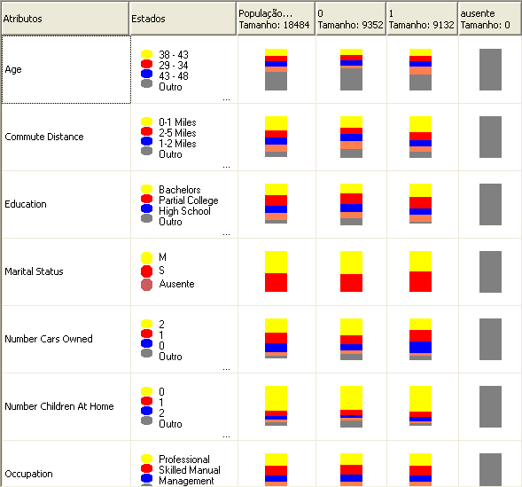

# Algoritmo Na&#239;ve Bayes da Microsoft 
  O algoritmo Naïve Bayes da [!INCLUDE[msCoName](../../includes/msconame-md.md)] é um algoritmo de classificação baseado no teorema de Bayes e pode ser usado em modelagem de previsão e exploratória. O nome naïve no nome Naïve Bayes foi atribuído pelo fato de o algoritmo usar técnicas Bayesianas, mas não considerar dependências que possam existir. Portanto, suas suposições são consideradas ingênuas.  
  
 Esse algoritmo é computacionalmente menos intenso de que outros algoritmos da [!INCLUDE[msCoName](../../includes/msconame-md.md)] e, portanto, é útil para gerar modelos de mineração rapidamente para descobrir as relações entre as colunas de entrada e as colunas previsíveis. Você pode usar esse algoritmo para realizar exploração de dados iniciais, e em seguida, aplicar os resultados para criar modelos de mineração adicionais com outros algoritmos que são computacionalmente mais intensos e mais precisos.  
  
## Exemplo  
 Como estratégia promocional contínua, o departamento de marketing da empresa Adventure Works Cycle decidiu atingir clientes em potencial, enviando folhetos pelo correio. Para reduzir despesas, eles querem enviar folhetos apenas aos clientes que provavelmente irão responder. A empresa armazena as informações sobre dados demográficos e resposta a uma correspondência anterior em um banco de dados. Eles querem usar esses dados para ver como os dados demográficos, tais como idade e local, podem ajudar a prever a resposta a uma promoção, comparando clientes em potencial com clientes que têm características similares e que já compraram da empresa no passado. Especificamente, eles querem ver a diferença entre os clientes que compraram uma bicicleta e aqueles que não compraram.  
  
 Usando o algoritmo Naive Bayes da [!INCLUDE[msCoName](../../includes/msconame-md.md)] , o departamento de marketing pode prever rapidamente o resultado do perfil de um cliente específico e, portanto, determinar os clientes que mais provavelmente irão responder aos folhetos. Usando o Visualizador do Naive Bayes da [!INCLUDE[msCoName](../../includes/msconame-md.md)] no [!INCLUDE[ssBIDevStudioFull](../../includes/ssbidevstudiofull-md.md)], eles podem especificamente investigar visualmente as colunas de entrada que contribuem para respostas positivas aos folhetos.  
  
## Como o algoritmo funciona  
 O algoritmo Naive Bayes da [!INCLUDE[msCoName](../../includes/msconame-md.md)] calcula a probabilidade do estado de cada coluna de entrada, uma vez proporcionado cada possível estado da coluna previsível.  
  
 Para entender como isso funciona, use o Visualizador do Naive Bayes da [!INCLUDE[msCoName](../../includes/msconame-md.md)] no [!INCLUDE[ssBIDevStudioFull](../../includes/ssbidevstudiofull-md.md)] (conforme mostrado no gráfico a seguir) para explorar visualmente como o algoritmo distribui estados.  
  
   
  
 Aqui, o Visualizador Naive Bayes da [!INCLUDE[msCoName](../../includes/msconame-md.md)] lista cada coluna de entrada no conjunto de dados e mostra como os estados de cada coluna são distribuídos, uma vez proporcionado cada estado da coluna previsível.  
  
 Você poderia usar essa exibição do modelo para identificar as colunas de entrada que são importantes para diferenciar estados da coluna previsível.  
  
 Por exemplo, na linha para Distância do Trabalho mostrada aqui, a distribuição de valores de entrada é visivelmente diferente para compradores versus não compradores. O que isso diz é que a entrada, Distância do Trabalho = 0-1 milhas, é um indicador potencial.  
  
 O visualizador também fornece valores para as distribuições, para que você possa ver isso para os clientes que se deslocam até duas milhas para trabalhar, a probabilidade de ele comprar uma bicicleta é 0,387 e a de ele não comprar é 0,287. Nesse exemplo, o algoritmo usa as informações numéricas, derivadas das características do cliente (tais como a distância do trabalho), para prever se o cliente comprará a bicicleta.  
  
 Para obter mais informações sobre como usar o Visualizador Naïve Bayes da [!INCLUDE[msCoName](../../includes/msconame-md.md)], consulte [Procurar um modelo usando o Visualizador Naïve Bayes da Microsoft](../../analysis-services/data-mining/browse-a-model-using-the-microsoft-naive-bayes-viewer.md).  
  
## Dados necessários para modelos Naive Bayes  
 Ao preparar dados para usar no treinamento de um modelo Naive Bayes, você deve compreender os requisitos do algoritmo, incluindo a quantidade de dados necessária, e a forma que os dados são usados.  
  
 Os requisitos para um modelo Naive Bayes são os seguintes:  
  
-   **Uma única coluna de chave** Cada modelo deve conter uma coluna de texto ou numérica que identifique unicamente cada registro. Chaves compostas não são permitidas.  
  
-   **Colunas de entrada** Em um modelo Naïve Bayes, todas as colunas devem ser discretas, ou os valores devem ter sido compartimentalizados. Para obter informações sobre como discretizar colunas (compartimentalizar), consulte [Métodos de discretização &#40;Mineração de dados&#41;](../../analysis-services/data-mining/discretization-methods-data-mining.md).  
  
-   **Variáveis devem ser independentes.** Além disso, também é importante assegurar que os atributos de entrada sejam independentes uns dos outros. Isto é particularmente importante quando você usa o modelo para previsão. Se você usar duas colunas de dados que já estão intimamente relacionadas, o efeito será multiplicar a influência dessas colunas, que poderão obscurecer outros fatores que influenciam o resultado.  
  
     De maneira recíproca, a capacidade de o algoritmo identificar correlações entre variáveis é útil quando você está explorando um modelo ou conjunto de dados, para identificar relações entre entradas.  
  
-   **Pelo menos uma coluna previsível** O atributo previsível deve conter valores discretos ou diferenciados.  
  
     Os valores da coluna previsível podem ser tratados como entradas. Esta prática pode ser útil quando você está explorando um novo conjunto de dados, para localizar relações entre as colunas.  
  
## Exibindo o modelo  
 Para explorar o modelo, você pode usar o **Visualizador Naive Bayes da Microsoft**. O visualizador mostra a você como os atributos de entrada se relacionam com o atributo previsível. Ele também fornece um perfil detalhado para cada clusters, uma lista dos atributos que distinguem cada um dos clusters e as características de todo o conjunto de dados de treinamento. Para obter mais informações, consulte [Procurar um modelo usando o Visualizador Naïve Bayes da Microsoft](../../analysis-services/data-mining/browse-a-model-using-the-microsoft-naive-bayes-viewer.md).  
  
 Para obter mais detalhes, você pode navegar pelo modelo no [Visualizador de Árvore de Conteúdo Genérica da Microsoft &#40;Mineração de dados&#41;](../Topic/Microsoft%20Generic%20Content%20Tree%20Viewer%20\(Data%20Mining\).md). Para obter mais informações sobre o tipo de informação armazenada no modelo, consulte [Conteúdo do modelo de mineração para modelos Naïve Bayes &#40;Analysis Services – Mineração de dados&#41;](../../analysis-services/data-mining/mining-model-content-for-naive-bayes-models-analysis-services-data-mining.md).  
  
## Fazendo previsões  
 Depois que o modelo tiver sido treinado, os resultados serão armazenados como um conjunto de padrões, que você poderá explorar ou usar para realizar previsões.  
  
 Você pode criar consultas para retornar previsões sobre como novos dados se relacionam com o atributo previsível ou pode recuperar estatísticas que descrevem as correlações encontradas pelo modelo.  
  
 Para obter informações sobre como criar consultas com base em um modelo de mineração de dados, consulte [Consultas de mineração de dados](../../analysis-services/data-mining/data-mining-queries.md). Para obter exemplos de como usar consultas com um modelo Naive Bayes, consulte [Exemplos de consulta de modelo Naïve Bayes](../../analysis-services/data-mining/naive-bayes-model-query-examples.md).  
  
## Comentários  
  
-   Suporta o uso de PMML (Predictive Model Markup Language) para criar modelos de mineração.  
  
-   Dá suporte ao detalhamento.  
  
-   Não suporta a criação de dimensões de mineração de dados.  
  
-   Suporta o uso de modelos de mineração OLAP.  
  
## Consulte também  
 [Algoritmos de mineração de dados &#40;Analysis Services – Data Mining&#41;](../../analysis-services/data-mining/data-mining-algorithms-analysis-services-data-mining.md)   
 [Seleção de recursos &#40;Mineração de dados&#41;](../../analysis-services/data-mining/feature-selection-data-mining.md)   
 [Naive Bayes Model Query Examples](../../analysis-services/data-mining/naive-bayes-model-query-examples.md)   
 [Conteúdo do modelo de mineração para modelos Naive Bayes &#40;Analysis Services – Data Mining&#41;](../../analysis-services/data-mining/mining-model-content-for-naive-bayes-models-analysis-services-data-mining.md)   
 [Referência técnica do algoritmo Microsoft Naive Bayes](../../analysis-services/data-mining/microsoft-naive-bayes-algorithm-technical-reference.md)  
  
  