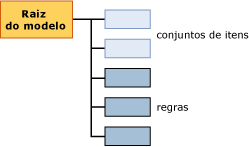

# Conteúdo do modelo de mineração para modelos de associação (Analysis Services – Mineração de Dados)
[!INCLUDE[ssas-appliesto-sqlas](../../includes/ssas-appliesto-sqlas.md)]
  Este tópico descreve o conteúdo do modelo de mineração específico para modelos que usam o algoritmo Regras de Associação da [!INCLUDE[msCoName](../../includes/msconame-md.md)] . Para obter uma explicação sobre a terminologia geral e estatística relacionada ao conteúdo do modelo de mineração que se aplica a todos os tipos de modelo, consulte [Conteúdo do modelo de mineração &#40;Analysis Services – Data Mining&#41;](../../analysis-services/data-mining/mining-model-content-analysis-services-data-mining.md).  
  
## Entendendo a estrutura de um modelo de associação  
 Um modelo de associação tem uma estrutura simples. Cada modelo tem um único nó pai que representa o modelo e seus metadados, e cada nó pai possui uma lista simples de conjuntos de itens e regras. Os conjuntos de itens e as regras não são organizados em árvores, são ordenados com os conjuntos de itens primeiro e depois as regras, como mostra o diagrama a seguir.  
  
   
  
 Cada conjunto de item é contido em seu próprio nó (NODE_TYPE = 7). O *nó* inclui a definição do conjunto de itens, o número de casos que contém esse conjunto de itens e outras informações.  
  
 Cada regra também é contida em seu próprio nó (NODE_TYPE = 8). Uma *regra* descreve um padrão geral de como os itens são associados. Uma regra é como uma instrução IF-THEN. O lado esquerdo da regra mostra uma condição existente ou um conjunto de condições. O lado direito da regra mostra o item em seu conjunto de dados que geralmente é associado às condições à esquerda.  
  
 **Observação** Para extrair regras ou conjuntos de itens, você pode usar uma consulta para retornar somente os tipos de nós desejados. Para obter mais informações, consulte [Exemplos de consulta de um modelo associação](../../analysis-services/data-mining/association-model-query-examples.md).  
  
## Conteúdo de um modelo de associação  
 Esta seção fornece detalhes e exemplos somente para as colunas de conteúdo do modelo de mineração que são relevantes para os modelos de associação.  
  
 Para obter informações sobre as colunas de uso general no conjunto de linhas de esquema, como MODEL_CATALOG e MODEL_NAME, consulte [Conteúdo do modelo de mineração &#40;Analysis Services – Data Mining&#41;](../../analysis-services/data-mining/mining-model-content-analysis-services-data-mining.md).  
  
 MODEL_CATALOG  
 Nome do banco de dados no qual o modelo é armazenado.  
  
 MODEL_NAME  
 Nome do modelo.  
  
 ATTRIBUTE_NAME  
 Os nomes dos atributos que correspondem a este nó.  
  
 NODE_NAME  
 O nome do nó. Em um modelo de associação, essa coluna contém o mesmo valor que NODE_UNIQUE_NAME.  
  
 NODE_UNIQUE_NAME  
 Nome exclusivo do nó.  
  
 NODE_TYPE  
 O modelo de associação produz apenas os seguintes tipos de nó:  
  
|ID do tipo de nó|type|  
|------------------|----------|  
|1 (Modelo)|Raiz ou nó pai.|  
|7 (Conjunto de itens)|Um conjunto de itens ou coleção de pares atributo-valor. Exemplos:   `Product 1 = Existing, Product 2 = Existing`   ou   `Gender = Male`.|  
|8 (Regra)|Uma regra que define como itens relacionam-se entre si.   Exemplo:   `Product 1 = Existing, Product 2 = Existing -> Product 3 = Existing`.|  
  
 NODE_CAPTION  
 Um rótulo ou uma legenda associada ao nó.  
  
 **Nó do conjunto de itens** Uma lista de itens separada por vírgula.  
  
 **Nó de regra** Contém os lados esquerdo e direito da regra.  
  
 CHILDREN_CARDINALITY  
 Indica o número de filhos do nó atual.  
  
 **Nó pai** Indica o número total de conjuntos de itens mais regras.  
  
> [!NOTE]  
>  Para obter uma análise da contagem de conjuntos de itens e regras, consulte NODE_DESCRIPTION do nó raiz do modelo.  
  
 **Nó do conjunto de itens ou de regra** Sempre 0.  
  
 PARENT_UNIQUE_NAME  
 O nome exclusivo do nó pai.  
  
 **Nó pai** Sempre NULL.  
  
 **Nó do conjunto de itens ou de regra** Sempre 0.  
  
 NODE_DESCRIPTION  
 Uma descrição amigável do conteúdo do nó.  
  
 **Nó pai** Inclui uma lista separada por vírgula das seguintes informações sobre o modelo:  
  
|Item|Descrição|  
|----------|-----------------|  
|ITEMSET_COUNT|Contagem de todos os conjuntos de itens do modelo.|  
|RULE_COUNT|Contagem de todas as regras do modelo.|  
|MIN_SUPPORT|O suporte mínimo localizado para qualquer conjunto de itens único.   **Observação** Esse valor pode ser diferente daquele que você definiu para o parâmetro *MINIMUM_SUPPORT* .|  
|MAX_SUPPORT|O suporte máximo localizado para qualquer conjunto de itens único.   **Observação** Esse valor pode ser diferente daquele que você definiu para o parâmetro *MAXIMUM_SUPPORT* .|  
|MIN_ITEMSET_SIZE|O tamanho do menor conjunto de itens, representado por uma contagem de itens.   Um valor de 0 indica que o estado **Ausente** foi tratado como um item independente.   **Observação** O valor padrão do parâmetro *MINIMUM_ITEMSET_SIZE* é 1.|  
|MAX_ITEMSET_SIZE|Indica o tamanho do maior conjunto de dados localizado.   **Observação** Esse valor é restrito pelo valor que você definiu para o parâmetro *MAX_ITEMSET_SIZE* ao criar o modelo. Esse valor nunca pode exceder aquele valor; no entanto, pode ser menor. O valor padrão é 3.|  
|MIN_PROBABILITY|A probabilidade mínima detectada para qualquer conjunto de itens único ou regra do modelo.   Exemplo: 0.400390625   **Observação** Para conjuntos de itens, esse valor é sempre maior que valor que você definiu para o parâmetro *MINIMUM_PROBABILITY* ao criar o modelo.|  
|MAX_PROBABILITY|A probabilidade máxima detectada para qualquer conjunto de itens único ou regra do modelo.   Exemplo: 1   **Observação** Não há nenhum parâmetro para restringir a probabilidade máxima de conjuntos de itens. Para eliminar itens que são muito frequentes, use o parâmetro *MAXIMUM_SUPPORT* .|  
|MIN_LIFT|O valor mínimo de comparação de precisão fornecido pelo modelo para qualquer conjunto de itens.   Exemplo: 0.14309369632511   Observação: Conhecer a comparação de precisão mínima pode ajudar a determinar se a comparação de precisão de qualquer conjunto de dados é significante.|  
|MAX_LIFT|O valor máximo de comparação de precisão fornecido pelo modelo para qualquer conjunto de itens.   Exemplo: 1,95758227647523 **Observação** saber a comparação de precisão máximo pode ajudá-lo a determinar se a comparação de precisão de qualquer conjunto de dados é significante.|  
  
 **Nó do conjunto de itens** Os nós de conjuntos de itens contêm uma lista dos itens, exibida como uma cadeia de caracteres de texto separada por vírgula.  
  
 Exemplo:  
  
 `Touring Tire = Existing, Water Bottle = Existing`  
  
 Significa que foram comprados juntamente pneus de passeio e garrafas de água.  
  
 **Nó de regra** Os nós de regras contêm um lado esquerdo e um direito, separados por uma seta.  
  
 Exemplo: `Touring Tire = Existing, Water Bottle = Existing -> Cycling cap = Existing`  
  
 Significa que, se alguém comprou pneus de passeio e uma garrafa de água, provavelmente vai comprar um boné de ciclismo.  
  
 NODE_RULE  
 Um fragmento XML que descreve a regra ou o conjunto de itens que foi inserido no nó.  
  
 **Nó pai** Em branco.  
  
 **Nó do conjunto de itens** Em branco.  
  
 **Nó da regra** O fragmento XML inclui informações adicionais úteis sobre a regra, como suporte, confiança e o número de itens, e a ID do nó que representa o lado esquerdo da regra.  
  
 MARGINAL_RULE  
 Em branco.  
  
 NODE_PROBABILITY  
 Uma pontuação de probabilidade ou confiança associada ao conjunto de itens ou à regra.  
  
 **Nó pai** Sempre 0.  
  
 **Nó do conjunto de itens** Probabilidade do conjunto de itens.  
  
 **Nó da regra** Valor de confiança da regra.  
  
 MARGINAL_PROBABILITY  
 Mesmo que NODE_PROBABILITY.  
  
 NODE_DISTRIBUTION  
 A tabela contém informações muito diferentes, dependendo de o nó ser um conjunto de itens ou uma regra.  
  
 **Nó pai** Em branco.  
  
 **Nó do conjunto de itens** Lista cada item do conjunto de itens com uma probabilidade e um valor de suporte. Por exemplo, se o conjunto de itens contiver dois produtos, o nome de cada um será listado juntamente com a contagem de casos que incluem esses produtos.  
  
 **Nó de regra** Contém duas linhas. A primeira mostra o atributo do lado direito da regra, que é o item do predicado, com uma pontuação de confiança.  
  
 A segunda linha é exclusiva em modelos de associação e contém um ponteiro para o conjunto de itens no lado direito da regra. O ponteiro é representado na coluna ATTRIBUTE_VALUE como uma ID do conjunto de itens que contém apenas o item do lado direito.  
  
 Por exemplo, se a regra for `If {A,B} Then {C}`, a tabela conterá o nome do item `{C}`e a ID do nó que só contém o conjunto de itens do item C.  
  
 Esse ponteiro é útil pois é possível determinar a partir do nó do conjunto de itens entre todos os casos quantos contêm o produto no lado direito. Os casos sujeitos à regra `If {A,B} Then {C}` formam um subconjunto dos casos listados no conjunto de itens para `{C}`.  
  
 NODE_SUPPORT  
 O número de casos com suporte para este nó.  
  
 **Nó pai** Número de casos no modelo.  
  
 **Nó do conjunto de itens** Número de casos que contém todos os itens do conjunto de itens.  
  
 **Nó de regra** O número de casos que contém todos os itens incluídos na regra.  
  
 MSOLAP_MODEL_COLUMN  
 Contém informações diferentes que dependem de o nó se um conjunto de itens ou uma regra.  
  
 **Nó pai** Em branco.  
  
 **Nó do conjunto de itens** Em branco.  
  
 **Nó da regra** A ID do conjunto de itens que contém os itens do lado esquerdo da regra. Por exemplo, se a regra for `If {A,B} Then {C}`, essa coluna conterá a ID do conjunto de itens que contém apenas `{A,B}`.  
  
 MSOLAP_NODE_SCORE  
 **Nó pai** Em branco.  
  
 **Nó do conjunto de itens** Pontuação de importância do conjunto de itens.  
  
 **Nó da regra** Pontuação de importância da regra.  
  
> [!NOTE]  
>  A importância é calculada de forma diferente para conjuntos de itens e regras. Para obter mais informações, consulte [Referência técnica do algoritmo de associação da Microsoft](../../analysis-services/data-mining/microsoft-association-algorithm-technical-reference.md).  
  
 MSOLAP_NODE_SHORT_CAPTION  
 Em branco.  
  
## Consulte também  
 [Conteúdo do modelo de mineração &#40;Analysis Services – Data Mining&#41;](../../analysis-services/data-mining/mining-model-content-analysis-services-data-mining.md)   
 [Algoritmo Associação da Microsoft](../../analysis-services/data-mining/microsoft-association-algorithm.md)   
 [Exemplos de consulta de um modelo associação](../../analysis-services/data-mining/association-model-query-examples.md)  
  
  
