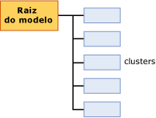

# Conteúdo do modelo de mineração para modelos de clustering (Analysis Services – Mineração de Dados)
[!INCLUDE[ssas-appliesto-sqlas](../../includes/ssas-appliesto-sqlas.md)]
  Este tópico descreve o conteúdo do modelo de mineração que é específico para modelos que usam o algoritmo Microsoft Clustering. Para obter uma explicação geral sobre o conteúdo do modelo de mineração para todos os tipos de modelo, consulte [Mining Model Content &#40;Analysis Services - Data Mining&#41;](../../analysis-services/data-mining/mining-model-content-analysis-services-data-mining.md).  
  
## Entendendo a estrutura de um modelo de clustering  
 Um modelo de clustering tem uma estrutura simples. Cada modelo tem um único nó pai que representa o modelo e seus metadados, e cada nó pai possui uma lista simples de clusters (NODE_TYPE = 5). Essa organização é mostrada na imagem a seguir.  
  
   
  
 Cada nó filho representa um único cluster e contém estatísticas detalhadas sobre os atributos dos casos desse cluster. Isso inclui a contagem do número de casos do cluster e a distribuição de valores que distinguem cada cluster.  
  
> [!NOTE]  
>  Não é necessária iteração com os nós para obter a contagem ou a descrição dos clusters; o nó pai do modelo também conta e lista os clusters.  
  
 O nó pai contém estatísticas úteis que descrevem a distribuição real de todos os casos em treinamento. Essas estatísticas são encontradas na coluna da tabela aninhada, NODE_DISTRIBUTION. Por exemplo, a tabela a seguir mostra várias linhas da tabela NODE_DISTRIBUTION que descrevem a distribuição dos dados demográficos dos clientes do modelo de clustering `TM_Clustering`que você cria no [Tutorial Básico de Data Mining](http://msdn.microsoft.com/library/6602edb6-d160-43fb-83c8-9df5dddfeb9c):  
  
|ATTRIBUTE_NAME|ATTRIBUTE_VALUE|SUPPORT|PROBABILITY|variance|VALUE_TYPE|  
|---------------------|---------------------|-------------|-----------------|--------------|-----------------|  
|Idade|Ausente|0|0|0|1 (Ausente)|  
|Idade|44.9016152716593|12939|1|125.663453102554|3 (Contínuo)|  
|Gênero|Ausente|0|0|0|1 (Ausente)|  
|Gênero|F|6350|0.490764355823479|0|4 (Discreto)|  
|Gênero|M|6589|0.509235644176521|0|4 (Discreto)|  
  
 A partir desses resultados, você pode ver que foram usados 12.939 casos para construir o modelo, que a proporção de homens para mulheres é de cerca de 50-50 e que a idade média é de 44 anos. As estatísticas descritivas variam de acordo com o fato de o atributo que está sendo reportado ser um tipo de dados numérico contínuo, como idade, ou um tipo de valor discreto, como gênero. As medidas estatísticas *mean* e *variance* são computadas para os tipos de dados contínuos, enquanto *probability* e *support* são computadas para tipos de dados discretos.  
  
> [!NOTE]  
>  A variância representa a variação total do cluster. Quando esse valor é pequeno, indica que a maioria dos valores da coluna estão bem próximos da média. Para obter o desvio padrão, calcule a raiz quadrada da variância.  
  
 Observe que para cada atributo existe um tipo de valor **Missing** que indica quantos casos não tinham dados para esse atributo. Dados ausentes podem ser importantes e afetar os cálculos de várias formas, dependendo do tipo de dados. Para obter mais informações, consulte [Valores ausentes &#40;Analysis Services – Data Mining&#41;](../../analysis-services/data-mining/missing-values-analysis-services-data-mining.md).  
  
## Conteúdo do modelo para um modelo de clustering  
 Esta seção fornece detalhes e exemplos somente para as colunas de conteúdo do modelo de mineração que são relevantes para os modelos de clustering.  
  
 Para obter informações sobre as colunas de uso general no conjunto de linhas de esquema, como MODEL_CATALOG e MODEL_NAME, consulte [Mining Model Content &#40;Analysis Services - Data Mining&#41;](../../analysis-services/data-mining/mining-model-content-analysis-services-data-mining.md).  
  
 MODEL_CATALOG  
 Nome do banco de dados no qual o modelo é armazenado.  
  
 MODEL_NAME  
 Nome do modelo.  
  
 ATTRIBUTE_NAME  
 Sempre em branco em modelos de clustering porque não há nenhum atributo previsível no nó.  
  
 NODE_NAME  
 Sempre igual a NODE_UNIQUE_NAME.  
  
 NODE_UNIQUE_NAME  
 Um identificador exclusivo do nó no modelo. Esse valor não pode ser alterado.  
  
 NODE_TYPE  
 Um modelo de clustering gera os seguintes tipos de nó:  
  
|ID e nome do nó|Descrição|  
|----------------------|-----------------|  
|1 (Modelo)|Nó raiz do modelo.|  
|5 (Cluster)|Contém a contagem de casos do cluster, as características dos casos do cluster e estatísticas que descrevem os valores do cluster.|  
  
 NODE_CAPTION  
 Um nome amigável para exibição. Quando você criar um modelo, o valor de NODE_UNIQUE_NAME será usado automaticamente como legenda. No entanto, é possível alterar o valor de NODE_CAPTION para atualizar o nome para exibição do cluster, seja de maneira programática ou usando o visualizador.  
  
> [!NOTE]  
>  Quando você reprocessar o modelo, todas as alterações de nome serão substituídas pelos valores novos. Não é possível persistir nomes no modelo ou monitorar alterações na associação do cluster entre versões diferentes de um modelo.  
  
 CHILDREN_CARDINALITY  
 Uma estimativa do número de filhos do nó.  
  
 **Nó pai** Indica o número de clusters no modelo.  
  
 **Nós de cluster** Sempre 0.  
  
 PARENT_UNIQUE_NAME  
 O nome exclusivo do nó pai.  
  
 **Nó pai** Sempre NULL  
  
 **Nós de cluster** Normalmente, 000.  
  
 NODE_DESCRIPTION  
 Uma descrição do nó.  
  
 **Nó pai** Sempre **(Tudo)** .  
  
 **Nós de cluster** Uma lista separada por vírgula dos principais atributos que distinguem cada cluster.  
  
 NODE_RULE  
 Não é usado para modelos de clustering.  
  
 MARGINAL_RULE  
 Não é usado para modelos de clustering.  
  
 NODE_PROBABILITY  
 A probabilidade associada a este nó. **Nó pai** Sempre 1.  
  
 **Nós de cluster** A probabilidade representa a probabilidade composta dos atributos, com alguns ajustes de acordo com o algoritmo usado na criação do modelo de clustering.  
  
 MARGINAL_PROBABILITY  
 A probabilidade de que o nó seja alcançado a partir do nó pai. Em um modelo de clustering, a probabilidade marginal é sempre igual à probabilidade de nó.  
  
 NODE_DISTRIBUTION  
 Um tabela que contém o histograma de probabilidade do nó.  
  
 **Nó pai** Consulte a Introdução deste tópico.  
  
 **Nós de cluster** Representa a distribuição de atributos e valores para casos incluídos no cluster.  
  
 NODE_SUPPORT  
 O número de casos com suporte para este nó. **Nó pai** Indica o número de casos em treinamento do modelo inteiro.  
  
 **Nós de cluster** Indica o tamanho do cluster como o número de casos.  
  
 **Observação** Se o modelo usar clustering K-Means, cada caso poderá pertencer somente a um cluster. No entanto, se o modelo usar clustering EM, cada são pode pertencer a clusters diferentes e ao caso é atribuída uma distância ponderada para cada cluster a que ele pertence. Portanto, para modelos EM, a soma de suporte para um cluster individual é maior que o suporte para o modelo inteiro.  
  
 MSOLAP_MODEL_COLUMN  
 Não é usado para modelos de clustering.  
  
 MSOLAP_NODE_SCORE  
 Exibe uma pontuação associada ao nó.  
  
 **Nó pai** A pontuação BIC (Bayesian Information Criterion) para o modelo de clustering.  
  
 **Nós de cluster** Sempre 0.  
  
 MSOLAP_NODE_SHORT_CAPTION  
 Um rótulo usado para exibição. Não é possível alterar essa legenda.  
  
 **Nó pai** o tipo de modelo: Modelo de cluster  
  
 **Nós de cluster** O nome do cluster. Exemplo: Cluster 1.  
  
## Comentários  
 [!INCLUDE[ssASnoversion](../../includes/ssasnoversion-md.md)] oferece vários métodos para a criação de um modelo de clustering. Se você não souber qual método foi usado para criar o modelo com que você está trabalhando, pode recuperar os metadados do modelo programaticamente, usando um cliente ADOMD ou AMO ou consultando o conjunto de linhas do esquema de mineração de dados. Para obter mais informações, consulte [Como consultar os parâmetros usados para criar um modelo de mineração](../../analysis-services/data-mining/query-the-parameters-used-to-create-a-mining-model.md).  
  
> [!NOTE]  
>  A estrutura e o conteúdo do modelo permanecem inalterados, independentemente do método ou dos parâmetros de clustering usados.  
  
## Consulte também  
 [Conteúdo do modelo de mineração &#40;Analysis Services – Data Mining&#41;](../../analysis-services/data-mining/mining-model-content-analysis-services-data-mining.md)   
 [Visualizadores do Modelo de Mineração de Dados](../../analysis-services/data-mining/data-mining-model-viewers.md)   
 [Algoritmo Microsoft Clustering](../../analysis-services/data-mining/microsoft-clustering-algorithm.md)   
 [Consultas de mineração de dados](../../analysis-services/data-mining/data-mining-queries.md)  
  
  
