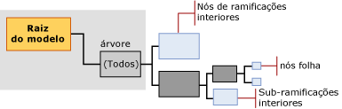

# Mining Model Content for Decision Tree Models (Analysis Services - Data Mining)
  Este tópico descreve o conteúdo do modelo de mineração específico para modelos que usam o algoritmo Árvores de Decisão da [!INCLUDE[msCoName](../../includes/msconame-md.md)] . Para obter uma explicação geral sobre o conteúdo do modelo de mineração para todos os tipos de modelo, consulte [Conteúdo do modelo de mineração &#40;Analysis Services – Data Mining&#41;](../../analysis-services/data-mining/mining-model-content-analysis-services-data-mining.md). É importante lembrar que o algoritmo Árvores de Decisão da Microsoft é um híbrido que pode criar modelos com funções muito diferentes: uma árvore de decisão pode representar associações, regras ou até mesmo regressão linear. A estrutura da árvore é basicamente a mesma, mas o modo como as informações serão interpretadas dependerá do objetivo para o qual você criou o modelo.  
  
##   Entendendo a estrutura de um modelo de árvores de decisão  
 Um modelo de árvores de decisão tem um nó pai único que representa o modelo e seus metadados. Sob o nó pai há árvores independentes que representam os atributos previsíveis que você selecionou. Por exemplo, caso você tenha configurado o modelo de árvore de decisão para prever se os clientes comprarão algo e forneça entradas para sexo e renda, o modelo criará uma única árvore para o atributo de compra, com muitas ramificações divididas em condições relacionadas a sexo e renda.  
  
 No entanto, se depois você adicionar um atributo previsível separado para participação em um programa de recompensa ao cliente, o algoritmo criará duas árvores separadas sob o nó pai. Uma árvore contém a análise para comprar e a outra contém a análise para o programa de recompensa ao cliente.  Se você usar o algoritmo Árvores de Decisão para criar um modelo de associação, o algoritmo criará uma árvore separada para cada produto sendo previsto e a árvore conterá todas as outras combinações de produtos que colaboram para a seleção do atributo de destino.  
  
> [!NOTE]  
>  Se o modelo incluir várias árvores, você poderá exibir apenas uma de cada vez no **Visualizador de Árvores da Microsoft**. No entanto, no **Visualizador de Árvore de Conteúdo Genérica** , todas as árvores no mesmo modelo são exibidas ao mesmo tempo.  
  
   
  
 A árvore de cada atributo previsível contém informações que descrevem como as colunas de entrada escolhidas afetam o resultado desse atributo previsível em particular. Cada árvore é precedida por um nó (NODE_TYPE = 9) que contém o atributo previsível, seguido por uma série de nós (NODE_TYPE = 10) que representam os atributos de entrada. Um atributo corresponde a uma coluna de nível de caso ou a valores de colunas de tabelas aninhadas, que geralmente são os valores na coluna **Key** da tabela aninhada.  
  
 Nós interiores e nós folha representam condições de divisão. Uma árvore pode se dividir no mesmo atributo várias vezes. Por exemplo, talvez o modelo **TM_DecisionTree** se divida em [Renda Anual] e [Número de Filhos], e se divida novamente em [Renda Anual] ainda mais na árvore.  
  
 O algoritmo Árvores de Decisão da Microsoft também pode conter regressão linear em toda a árvore ou em parte dela. Se o atributo que você está modelando for um tipo de dados numérico contínuo, o modelo poderá criar um nó de árvore de regressão (NODE_TYPE = 25) sempre que for possível modelar linearmente o relacionamento entre os atributos. Nesse caso, o nó contém uma fórmula de regressão.  
  
 No entanto, se o atributo previsível tiver valores discretos, ou se valores numéricos tiverem recebido o atributo de bucket ou discrição, o modelo sempre criará uma árvore de classificação (NODE_TYPE =2). Uma árvore de classificação pode ter várias ramificações ou nós de árvore interiores (NODE_TYPE = 3) para cada valor do atributo. No entanto, a divisão não está necessariamente em cada valor do atributo.  
  
 O algoritmo Árvores de Decisão da Microsoft não permite tipos de dados contínuos como entradas; portanto, se alguma coluna tiver o tipo de dados numérico contínuo, os valores serão discretos. O algoritmo executa sua própria discretização no ponto de uma divisão para todos os atributos contínuos.  
  
> [!NOTE]  
>  [!INCLUDE[ssASnoversion](../../includes/ssasnoversion-md.md)]escolhe automaticamente um método para bucket de atributos contínuos; No entanto, você pode controlar como os valores contínuos nas entradas são discretos definindo o tipo de conteúdo da coluna de estrutura de mineração para **Discretized** e, em seguida, definindo o <xref:Microsoft.AnalysisServices.ScalarMiningStructureColumn.DiscretizationBucketCount%2A> ou <xref:Microsoft.AnalysisServices.ScalarMiningStructureColumn.DiscretizationMethod%2A> propriedade.  
  
 [Início](#bkmk_Top)  
  
##   Conteúdo do modelo para um modelo de árvores de decisão  
 Esta seção fornece detalhes e exemplos somente das colunas do conteúdo do modelo de mineração que são relevantes para os modelos de árvores de decisão. Para obter informações sobre as colunas de uso general no conjunto de linhas de esquema, como explicações relacionadas à terminologia do modelo de mineração, consulte [Conteúdo do modelo de mineração &#40;Analysis Services – Data Mining&#41;](../../analysis-services/data-mining/mining-model-content-analysis-services-data-mining.md).  
  
 MODEL_CATALOG  
 Nome do banco de dados no qual o modelo é armazenado.  
  
 MODEL_NAME  
 Nome do modelo.  
  
 ATTRIBUTE_NAME  
 Nome do atributo que corresponde a este nó.  
  
 NODE_NAME  
 Sempre igual a NODE_UNIQUE_NAME.  
  
 NODE_UNIQUE_NAME  
 Um identificador exclusivo do nó no modelo. Esse valor não pode ser alterado.  
  
 Para modelos de árvore de decisão, os nomes exclusivos seguem esta convenção, que não se aplica a todos os algoritmos:  
  
 Os nós filho de qualquer nó em particular terão o mesmo prefixo hexadecimal, seguido por outro número hexadecimal que representa a sequência de nós filho no pai. Você pode usar os prefixos para inferir um caminho.  
  
 NODE_TYPE  
 Em modelos de árvore de decisão, os seguintes tipos de nós são criados:  
  
|Tipo de nó|Description|  
|---------------|-----------------|  
|1 (Modelo)|Nó raiz do modelo.|  
|2 (Árvore)|Nó pai de árvores de classificação no modelo. Rotulado como **"Tudo"**.|  
|3 (Interior)|Título da ramificação interior, encontrado em uma árvore de classificação ou de regressão.|  
|4 (Distribuição)|Nó folha, encontrado em uma árvore de classificação ou de regressão.|  
|25 (Árvore de regressão)|Nó pai da árvore de regressão no modelo. Rotulado como **"Tudo"**.|  
  
 NODE_CAPTION  
 Um nome amigável para exibição.  
  
 Quando você criar um modelo, o valor de NODE_UNIQUE_NAME será usado automaticamente como legenda. No entanto, é possível alterar o valor de NODE_CAPTION para atualizar o nome para exibição do cluster, seja de maneira programática ou usando o visualizador. A legenda é gerada automaticamente pelo modelo. O conteúdo da legenda depende do tipo de modelo e o tipo de nó.  
  
 Em um modelo de árvores de decisão, NODE_CAPTION e NODE_DESCRIPTION têm informações diferentes, dependendo do nível na árvore. Para obter mais informações e exemplos, consulte [Legenda e descrição do nó](#NodeCaption).  
  
 CHILDREN_CARDINALITY  
 Uma estimativa do número de filhos do nó.  
  
 **Nó pai** Indica o número de atributos previsíveis que foram modelados. Uma árvore é criada para cada atributo previsível.  
  
 **Nó de árvore** O nó **Tudo** de cada árvore informa como muitos valores foram usados para o atributo de destino.  
  
-   Se o atributo de destino for discreto, o valor será igual ao número de valores distintos mais 1 para o estado **Missing** .  
  
-   Se o atributo previsível for contínuo, o valor informa quantos buckets foram usados para modelar esse atributo contínuo.  
  
 **Nós folha** Sempre 0.  
  
 PARENT_UNIQUE_NAME  
 O nome exclusivo do nó pai. NULL é retornado para todos os nós em nível raiz.  
  
 NODE_DESCRIPTION  
 Uma descrição do nó.  
  
 Em um modelo de árvores de decisão, NODE_CAPTION e NODE_DESCRIPTION têm informações diferentes, dependendo do nível na árvore.  
  
 Para obter mais informações e exemplos, consulte [Legenda e descrição do nó](#NodeCaption).  
  
 NODE_RULE  
 Uma descrição XML da regra que descreve o caminho para o nó atual de seu nó pai imediato.  
  
 Para obter mais informações e exemplos, consulte [Regra de nó e regra marginal](#NodeRule).  
  
 MARGINAL_RULE  
 Uma descrição XML da regra que descreve o caminho do nó pai do modelo para o nó atual.  
  
 Para obter mais informações, consulte [Regra de nó e regra marginal](#NodeRule).  
  
 NODE_PROBABILITY  
 A probabilidade associada a este nó.  
  
 Para obter mais informações, consulte [Probabilidade](#bkmk_NodeDist_Discrete).  
  
 MARGINAL_PROBABILITY  
 A probabilidade de que o nó seja alcançado a partir do nó pai.  
  
 Para obter mais informações, consulte [Probabilidade](#bkmk_NodeDist_Discrete).  
  
 NODE_DISTRIBUTION  
 Um tabela que contém o histograma de probabilidade do nó. As informações nesta tabela são diferentes dependendo se o atributo previsível é uma variável contínua ou discreta.  
  
 **Nó raiz do modelo** Esta tabela está vazia.  
  
 **Nó (Tudo)** Contém um resumo do modelo como um todo.  
  
 **Nó interior** Contém estatísticas agregadas para seus nós folha.  
  
 **Nó folha** Contém o suporte e a probabilidade para os resultados previstos dadas todas as condições no caminho que leva ao nó folha atual.  
  
 **Nó de regressão** Contém a fórmula de regressão que representa a relação entre as entradas e o atributo previsível.  
  
 Para obter mais informações, consulte [Distribuição de nó para atributos discretos](#bkmk_NodeDist_Discrete) e [Distribuição de nó para atributos contínuos](#bkmk_RegressionNodes).  
  
 NODE_SUPPORT  
 O número de casos com suporte para este nó.  
  
 MSOLAP_MODEL_COLUMN  
 Indica a coluna que contém o atributo previsível.  
  
 MSOLAP_NODE_SCORE  
 Exibe uma pontuação associada ao nó. Para obter mais informações, consulte [Pontuação de nó](#NodeScore).  
  
 MSOLAP_NODE_SHORT_CAPTION  
 Um rótulo usado para exibição.  
  
## Comentários  
 Um modelo de árvores de decisão não tem um nó separado que armazena estatísticas para todo o modelo, diferentemente do nó de estatísticas marginais encontrado em um modelo de rede Naive Bayes ou neural. Em vez disso, o modelo cria uma árvore separada para cada atributo previsível, com um nó (Tudo) na parte superior da árvore. Cada árvore é independente das outras. Se seu modelo contiver apenas um atributo previsível, haverá somente uma árvore e, portanto, só um nó (Tudo).  
  
 Cada árvore que representa um atributo de saída é subdividida adicionalmente em ramificações interiores (NODE_TYPE = 3) que representam divisões. Cada uma dessas árvores contém estatísticas sobre a distribuição do atributo de destino. Além disso, cada nó folha (NODE_TYPE = 4) contém estatísticas que descrevem atributos de entrada e seus valores, junto com o número de casos com suporte para cada par de atributo-valor. Assim, em qualquer ramificação de uma árvore de decisão, é possível exibir as probabilidades ou a distribuição dos dados facilmente, sem ter que consultar os dados de origem. Cada nível da árvore representa necessariamente a soma de seus nós filho imediatos.  
  
 Para obter exemplos de como recuperar essas estatísticas, consulte [Exemplos de consulta de modelo de árvores de decisão](../../analysis-services/data-mining/decision-trees-model-query-examples.md).  
  
 [Início](#bkmk_Top)  
  
## Exemplo de uma estrutura de árvore de decisão  
 Para entender como uma árvore de decisão funciona, considere um exemplo, como o cenário de comprador de bicicleta da AdventureWorks. Pressupondo que o atributo previsível corresponda às compras do cliente, o algoritmo de árvores de decisão tenta encontrar uma coluna de dados, entre todas as entradas fornecidas, que detecte com mais eficácia os clientes que provavelmente comprarão uma bicicleta e aqueles que provavelmente não comprarão. Por exemplo, talvez o modelo descubra que a Idade é o melhor indicador do comportamento de compra. Especificamente, que os clientes com mais de 30 anos têm maior probabilidade de comprar uma bicicleta, e todos os outros clientes provavelmente não farão uma compra. Neste cenário, o modelo cria uma *divisão* no atributo Idade. Isso significa que a árvore se divide em duas ramificações, uma que contém os clientes com mais de 30 anos e outra com os clientes com menos de 30 anos. As novas ramificações são representadas na estrutura do modelo como duas novas árvores interiores (NODE_TYPE = 3).  
  
 Para cada ramificação, o modelo continua procurando atributos adicionais a serem usados na diferenciação de clientes. Se houver poucas evidências nos dados para continuar criando subgrupos de clientes, o modelo parará de criar a árvore. O modelo também parará de criar a árvore sempre que o número de casos no nó for pequeno demais para continuar, independentemente de quão boa seja a divisão ou de o valor ser nulo ou estar ausente. Ao interromper o crescimento da árvore precocemente, você impede que o modelo treine muito perto de um determinado conjunto de dados.  
  
 Cada nó de árvore interior contém nós folha que fornecem uma análise dos resultados, de acordo com os resultados de classificação atuais. Por exemplo, talvez você tenha um nó interior que represente Idade >= 30 e Sexo = Masculino. O nó desse grupo mostra quantos clientes nessa categoria compraram ou não algo. Por exemplo, a classificação pode conter as seguintes divisões de árvore:  
  
|Árvore interior|divisão|  
|-------------------|-----------|  
|Idade >= 30|Idade >= 30 e Sexo = Masculino|  
||Idade >= 30 e Sexo = Feminino|  
|Idade < 30|Idade < = 30 e Sexo = Masculino|  
||Idade < = 30 e Sexo = Feminino|  
  
 Quando você usa um modelo de árvore de decisão para previsão, esse modelo pega os atributos fornecidos a ele como argumentos e segue o caminho desses atributos até a árvore. Em geral, todas as previsões levam a uma folha e os nós interiores são usados apenas para classificação.  
  
 Um nó folha sempre tem um NODE_TYPE de 4 (Distribuição) e contém um histograma que informa a probabilidade de cada resultado (compra ou não), de acordo com os atributos fornecidos. Por exemplo, se você solicitar uma previsão para um novo cliente do sexo masculino e com mais de 60 anos, o modelo pesquisará o nó correspondente (Idade > 30 anos e Sexo = Masculino) e retornará a probabilidade para o resultado especificado. Essas probabilidades são armazenadas na tabela [NODE_DISTRIBUTION](#bkmk_NodeDist_Discrete) do nó.  
  
 Se o atributo previsível for um número contínuo, o algoritmo tentará criar uma fórmula de regressão que modele a relação entre o atributo previsível e as entradas.  
  
 [Início](#bkmk_Top)  
  
###   Legenda e descrição do nó  
 Em um modelo de árvore de decisão, a legenda e a descrição de nó contêm informações semelhantes. No entanto, a descrição do nó é mais completa e contém mais informações à medida que você chega mais perto dos nós folha. A legenda e a descrição do nó são cadeias de caracteres localizadas.  
  
|||  
|-|-|  
|**NODE_CAPTION**|Exibe o atributo que distingue esse determinado nó em relação ao nó pai. A legenda do nó define um subsegmento da população com base na condição de divisão. Por exemplo, se a divisão estava em [Idade] e era tridimensional, as legendas dos três nós filho poderá ser "[Idade] < 40", "40 <= [Idade] < 50", "[Idade] >= 50".|  
|**NODE_DESCRIPTION**|Contém uma lista completa dos atributos que distinguem esse nó dos outros, desde o nó pai do modelo. Por exemplo, Nome do produto = Apple e Cor = Vermelho.|  
  
 [Início](#bkmk_Top)  
  
###   Regra de nó e regra marginal  
 As colunas NODE_RULE e MARGINAL_RULE contêm as mesmas informações que as colunas NODE_CAPTION e NODE_DESCRIPTION, mas representam as informações como fragmentos XML. A regra de nó é uma versão XML do caminho completo, enquanto a regra marginal indica a divisão mais recente.  
  
 O atributo representado pelo fragmento XML pode ser simples ou complexo. Um atributo simples contém o nome da coluna do modelo e o valor do atributo. Se a coluna do modelo contiver uma tabela aninhada, o atributo de tabela aninhada será representado como uma concatenação do nome da tabela, do valor da chave e do atributo.  
  
> [!NOTE]  
>  [!INCLUDE[ssNoVersion](../../includes/ssnoversion-md.md)][!INCLUDE[ssASnoversion](../../includes/ssasnoversion-md.md)] dá suporte à versão 2.0 do padrão PMML, com extensões para dar suporte ao uso de tabela aninhada. Se os dados contiverem tabelas aninhadas e você gerar uma versão PMML do modelo, todos os elementos no modelo que incluírem os predicados serão marcados como uma extensão.  
  
 [Início](#bkmk_Top)  
  
###   Distribuição de nó para atributos discretos  
 Em um modelo de árvores de decisão, a tabela NODE_DISTRIBUTION contém estatísticas úteis. No entanto, o tipo de estatísticas depende se a árvore prevê um atributo discreto ou contínuo. Esta seção descreve o significado das estatísticas de distribuição de nó para atributos discretos.  
  
#### Nome e valor de atributo  
 Em uma árvore de classificação, o nome do atributo sempre contém o nome da coluna previsível. Esse valor informa o que a árvore prevê. Como uma única árvore sempre representa um único atributo previsível, esse valor é repetido ao longo da árvore.  
  
 Para um tipo de dados discreto, o campo de valor do atributo lista os valores possíveis da coluna previsível, mais o valor **Missing** .  
  
#### Suporte  
 O valor de suporte para cada nó informa quantos casos estão incluídos neste nó. No nível (Tudo), você deverá visualizar a contagem completa de casos que foram usados para treinar o modelo. Para cada divisão na árvore, o valor do suporte é a contagem de casos agrupados no nó da árvore. A soma de casos nos nós folha é necessariamente igual à contagem de casos no nó pai da árvore.  
  
 Para nós que representam atributos contínuos, a presença de itens nulos nos dados pode levar a alguns resultados não intuitivos. Por exemplo, se houver m casos, um valor médio será calculado como soma(todos os casos)/n, em que n é um número menor que m, e m-n indica a contagem de casos com valores ausentes. O suporte também é representado como n.  
  
#### Probabilidade  
 A probabilidade associada a cada nó informa a probabilidade de algum caso no conjunto de dados acabar nesse nó em particular. As pontuações de probabilidade são computadas para a árvore como um todo, e para a divisão imediata.  
  
 Por exemplo, a tabela a seguir mostra um modelo muito simples, com 100 casos.  
  
|Árvore interior|Casos|Nó folha|Casos|Probabilidade relativa ao nó pai|Probabilidade relativa ao nó superior|  
|-------------------|-----------|---------------|-----------|-----------------------------------------|--------------------------------------|  
|Idade >= 30|60|Idade >= 30 e Sexo = Masculino|50|50/60 = 0,83|50/100 = 0,5|  
|||Idade >= 30 e Sexo = Feminino|10|10/60 = 0,16|10/100 = 0,10|  
|Idade < 30|40|Idade < = 30 e Sexo = Masculino|30|30/40 = 0,75|30/100 = 0,30|  
|||Idade < = 30 e Sexo = Feminino|10|10/40 = 0,25|10/100 = 0,10|  
  
 Um pequeno ajuste  é feito em todos os modelos para contabilizar possíveis valores ausentes. Para atributos contínuos, cada valor ou intervalo de valores é representado como um estado (por exemplo, idade \<30, idade = 30 e idade > 30) e as probabilidades são calculadas da seguinte maneira: estado existe (valor = 1), algum outro estado existe (valor = 0), o estado é  **Faltando**. Para obter mais informações sobre como as probabilidades são ajustadas para representar valores ausentes, consulte [Valores ausentes &#40;Analysis Services – Data Mining&#41;](../../analysis-services/data-mining/missing-values-analysis-services-data-mining.md).  
  
 As probabilidades para cada nó são calculadas quase diretamente da distribuição, da seguinte forma:  
  
 Probabilidade = (suporte para estado + suporte para estado anterior) / (suporte ao nó mais o suporte ao nó anterior)  
  
 [!INCLUDE[ssASnoversion](../../includes/ssasnoversion-md.md)] usa probabilidades para cada nó para comparar a probabilidade armazenada com a probabilidade anterior para determinar se o caminho do nó pai para o filho indica uma inferência forte.  
  
 Durante a criação de previsões, a probabilidade da distribuição deve ser balanceada com a probabilidade do nó, para atenuar as probabilidades. Por exemplo, se uma divisão na árvore separa casos por uma razão de 9000/1000, a árvore está muito desequilibrada. Assim, uma previsão que vem da ramificação pequena não deve ter o mesmo peso que uma previsão de uma ramificação com muitos casos.  
  
#### Variance  
 A variação é uma medida de como são os valores dispersos em um exemplo, dada uma distribuição esperada. Para valores discretos, a variação é 0 por definição.  
  
 Para obter mais informações sobre como calcular a variação de valores contínuos, consulte [Conteúdo do modelo de mineração para modelos de regressão linear &#40;Analysis Services – Data Mining&#41;](../../analysis-services/data-mining/mining-model-content-for-linear-regression-models-analysis-services-data-mining.md).  
  
#### Tipo de valor  
 A coluna de tipo de valor fornece informações sobre o significado do valor numérico fornecido nas outras colunas na tabela NODE_DISTRIBUTION. Você pode usar o tipo de valor em consultas para recuperar linhas específicas das tabelas aninhadas. Para obter mais exemplos, consulte [Exemplos de consulta de modelo de árvores de decisão](../../analysis-services/data-mining/decision-trees-model-query-examples.md).  
  
 Dos tipos na enumeração <xref:Microsoft.AnalysisServices.AdomdClient.MiningValueType> , os seguintes são usados em árvores de classificação.  
  
|Tipo de valor|Description|  
|----------------|-----------------|  
|1 (Ausente)|Indica uma contagem, probabilidade ou outra estatística relacionada a valores ausentes.|  
|4 (Discreto)|Indica uma contagem, probabilidade ou outra estatística relacionada a um valor discreto ou diferenciado.|  
  
 Se o modelo incluir um atributo previsível contínuo, a árvore talvez contenha tipos de valores exclusivos para fórmulas de regressão. Para ver a lista dos tipos de valores que são usados em árvores de regressão, consulte [Conteúdo do modelo de mineração para modelos de regressão linear &#40;Analysis Services – Data Mining&#41;](../../analysis-services/data-mining/mining-model-content-for-linear-regression-models-analysis-services-data-mining.md).  
  
###   Pontuação de nó  
 A pontuação de nó representa informações ligeiramente diferentes a cada nível da árvore. Em geral, a pontuação é um valor numérico que informa o quão boa foi uma divisão obtida pela divisão da condição. O valor é representado como um duplo, em que um valor mais alto é melhor.  
  
 Por definição, o nó do modelo e todos os nós folha têm uma pontuação de nó de 0.  
  
 Para o nó (Tudo) que representa a parte superior de cada árvore, a coluna MSOLAP_NODE_SCORE contém a melhor pontuação de divisão em toda a árvore.  
  
 Para todos os nós na árvore (exceto nós folha), a pontuação de cada nó representa a melhor pontuação de divisão do nó atual, menos a pontuação de divisão do nó pai. Em geral, a pontuação de divisão de um nó pai sempre deve ser melhor do que a pontuação de divisão de qualquer um de seus nós filho. Isso ocorre porque um modelo de árvores de decisão teoricamente se divide primeiro nos atributos mais importantes.  
  
 Há muitos modos de calcular uma pontuação para uma divisão, dependendo do parâmetro de algoritmo escolhido. Uma discussão de como as pontuações são calculadas para cada método de pontuação está além do escopo deste tópico. Para obter mais informações, consulte "[Learning Bayesian Networks: The Combination of Knowledge and Statistical Data](http://research.microsoft.com/en-us/um/people/heckerman/hgc94uai.pdf)", no site de Pesquisa da [!INCLUDE[msCoName](../../includes/msconame-md.md)] .  
  
> [!NOTE]  
>  Se você criar um modelo de árvores de decisão que tenha atributos contínuos e previsíveis discretos, verá pontuações completamente diferentes nos nós (Tudo) que representam cada tipo de árvore. Cada modelo deve ser considerado de modo independente, e os métodos usados para regressão de pontuação são completamente diferentes daqueles usados para classificação de pontuação. Não é possível comparar os valores de pontuação de nó.  
  
 [Início](#bkmk_Top)  
  
##   Nós de regressão em um modelo de árvore de decisão  
 Se um modelo de árvore de decisão contiver um atributo previsível com dados numéricos contínuos, o algoritmo Árvores de Decisão da Microsoft buscará encontrar áreas nos dados em que a relação entre o estado previsto e as variáveis de entrada for linear. Se o algoritmo conseguir encontrar uma relação linear, ele criará uma árvore especial (NODE_TYPE = 25) que representa uma regressão linear. Esses nós de árvore de regressão são mais complexos do que os nós que representam valores discretos.  
  
 Em geral, uma regressão mapeia as alterações na variável dependente contínua (previsível) como uma função das alterações nas entradas. Se a variável dependente tiver qualquer entrada contínua e a relação entre a entrada e o valor previsto for estável o suficiente para ser computada como um gráfico de linha, o nó da regressão conterá uma fórmula.  
  
 No entanto, se a relação entre a entrada e o valor previsto for *não linear*, uma divisão será criada, bem como uma árvore de decisão padrão. Por exemplo, vamos supor que A é o atributo previsível, e B e C são as entradas, onde C é um tipo de valor contínuo. Se a relação entre A e C for razoavelmente estável em partes dos dados, mas instável em outras, o algoritmo criará divisões para representar as diferentes áreas dos dados.  
  
|Condição de divisão|Resultado em nó|  
|---------------------|--------------------|  
|se n < 5|A relação pode ser expressada como equação 1|  
|se n entre 5 e 10|Nenhuma equação|  
|se n > 10|A relação pode ser expressada como equação 2|  
  
 Para obter mais informações sobre os nós de regressão, consulte [Conteúdo do modelo de mineração para modelos de regressão linear &#40;Analysis Services – Data Mining&#41;](../../analysis-services/data-mining/mining-model-content-for-linear-regression-models-analysis-services-data-mining.md).  
  
## Consulte também  
 [Conteúdo do modelo de mineração &#40;Analysis Services – Data Mining&#41;](../../analysis-services/data-mining/mining-model-content-analysis-services-data-mining.md)   
 [Visualizadores do Modelo de Mineração de Dados](../../analysis-services/data-mining/data-mining-model-viewers.md)   
 [Consultas de mineração de dados](../../analysis-services/data-mining/data-mining-queries.md)   
 [Algoritmo Árvores de Decisão da Microsoft](../../analysis-services/data-mining/microsoft-decision-trees-algorithm.md)  
  
  

