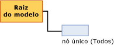

# Conteúdo do modelo de mineração para modelos de regressão linear (Analysis Services – Mineração de Dados)
  Este tópico descreve o conteúdo do modelo de mineração específico para modelos que usam o algoritmo Regressão Linear da [!INCLUDE[msCoName](../../includes/msconame-md.md)] . Para obter uma explicação geral sobre o conteúdo do modelo de mineração para todos os tipos de modelo, consulte [Conteúdo do modelo de mineração &#40;Analysis Services – Data Mining&#41;](../../analysis-services/data-mining/mining-model-content-analysis-services-data-mining.md).  
  
## Entendendo a estrutura de um modelo de regressão linear  
 Um modelo de regressão linear tem uma estrutura extremamente simples. Cada modelo tem um único nó pai que representa o modelo e seus metadados e um nó de árvore de regressão (NODE_TYPE = 25) que contém uma fórmula de regressão para cada atributo previsível.  
  
   
  
 Os modelos de regressão linear usam o mesmo algoritmo Árvores de Decisão da [!INCLUDE[msCoName](../../includes/msconame-md.md)] , mas são usados parâmetros diferentes para restringir a árvore e apenas atributos contínuos são aceitos como entradas. Entretanto, como os modelos de regressão linear são baseados no algoritmo Árvores de Decisão do [!INCLUDE[msCoName](../../includes/msconame-md.md)] , eles são exibidos com o uso do Visualizador de Árvore de Decisão do [!INCLUDE[msCoName](../../includes/msconame-md.md)] . Para obter informações, consulte [Procurar um modelo usando o Visualizador de Árvores da Microsoft](../../analysis-services/data-mining/browse-a-model-using-the-microsoft-tree-viewer.md).  
  
 A próxima seção explica como interpretar informações no nó da fórmula de regressão. Essas informações são aplicadas não apenas a modelos de regressão linear, mas também a modelos de árvores de decisão que contêm regressões em uma parte da árvore.  
  
## Conteúdo de um modelo de regressão linear  
 Esta seção fornece detalhes e exemplos somente para as colunas de conteúdo do modelo de mineração que são relevantes para a regressão linear.  
  
 Para obter informações sobre as colunas de uso general no conjunto de linhas de esquema, consulte [Conteúdo do modelo de mineração &#40;Analysis Services – Data Mining&#41;](../../analysis-services/data-mining/mining-model-content-analysis-services-data-mining.md).  
  
 MODEL_CATALOG  
 Nome do banco de dados no qual o modelo é armazenado.  
  
 MODEL_NAME  
 Nome do modelo.  
  
 ATTRIBUTE_NAME  
 **Nó raiz:** em branco  
  
 **Nó de regressão** O nome do atributo previsível.  
  
 NODE_NAME  
 Sempre igual a NODE_UNIQUE_NAME.  
  
 NODE_UNIQUE_NAME  
 Um identificador exclusivo do nó no modelo. Esse valor não pode ser alterado.  
  
 NODE_TYPE  
 Um modelo de regressão linear gera os seguintes tipos de nó:  
  
|ID do tipo de nó|Tipo|Description|  
|------------------|----------|-----------------|  
|25|Raiz da árvore de regressão|Contém a fórmula que descreve a relação entre a variável de entrada e saída.|  
  
 NODE_CAPTION  
 Um rótulo ou uma legenda associada ao nó. Essa propriedade é usada principalmente para exibição.  
  
 **Nó raiz:** em branco  
  
 **Nó de regressão:** Tudo.  
  
 CHILDREN_CARDINALITY  
 Uma estimativa do número de filhos do nó.  
  
 **Nó raiz:** Indica o número de nós de regressão. Um nó de regressão é criado para cada atributo previsível no modelo.  
  
 **Nó de regressão:** Sempre 0.  
  
 PARENT_UNIQUE_NAME  
 O nome exclusivo do nó pai. NULL é retornado para todos os nós em nível raiz.  
  
 NODE_DESCRIPTION  
 Uma descrição do nó.  
  
 **Nó raiz:** em branco  
  
 **Nó de regressão:** Tudo.  
  
 NODE_RULE  
 Não é usado em modelos de regressão linear.  
  
 MARGINAL_RULE  
 Não é usado em modelos de regressão linear.  
  
 NODE_PROBABILITY  
 A probabilidade associada a este nó.  
  
 **Nó raiz:** 0  
  
 **Nó de regressão:** 1  
  
 MARGINAL_PROBABILITY  
 A probabilidade de que o nó seja alcançado a partir do nó pai.  
  
 **Nó raiz:** 0  
  
 **Nó de regressão:** 1  
  
 NODE_DISTRIBUTION  
 Uma tabela aninhada que fornece estatísticas sobre os valores no nó.  
  
 **Nó raiz:** 0  
  
 **Nó de regressão:** Uma tabela que contém os elementos usados para criar a fórmula de regressão. Um nó de regressão contém os seguintes tipos de valor:  
  
|VALUETYPE|  
|---------------|  
|1 (Ausente)|  
|3 (Contínuo)|  
|7 (Coeficiente)|  
|8 (Ganho de pontos)|  
|9 (Estatísticas)|  
|11 (Interceptação)|  
  
 NODE_SUPPORT  
 O número de casos com suporte para este nó.  
  
 **Nó raiz:** 0  
  
 **Nó de regressão:** Contagem dos casos de treinamento.  
  
 MSOLAP_MODEL_COLUMN  
 Nome do atributo previsível.  
  
 MSOLAP_NODE_SCORE  
 O mesmo que NODE_PROBABILITY.  
  
 MSOLAP_NODE_SHORT_CAPTION  
 O rótulo usado para exibição.  
  
## Comentários  
 Ao criar um modelo usando o algoritmo Regressão Linear da [!INCLUDE[msCoName](../../includes/msconame-md.md)] , o mecanismo de mineração de dados cria uma instância especial de um modelo de árvores de decisão e fornece parâmetros que restringem a árvore para que ela tenha todos os dados de treinamento em um único nó. Todas as entradas contínuas são sinalizadas e avaliadas como regressores potenciais, mas apenas os regressores que se ajustam aos dados são mantidos como regressores no modelo final. A análise gera uma única fórmula de regressão para cada regressor ou nenhuma fórmula de regressão.  
  
 Você pode exibir toda a fórmula de regressão em **Legenda de Mineração**clicando no nó **(All)** no [Visualizador de Árvores da Microsoft](../../analysis-services/data-mining/browse-a-model-using-the-microsoft-tree-viewer.md).  
  
 Além disso, ao criar um modelo de árvores de decisão que inclui um atributo previsível contínuo, a árvore, algumas vezes, tem nós de regressão que compartilham as propriedades dos nós da árvore de regressão.  
  
##   Distribuição de nó em atributos contínuos  
 A maioria da informações importantes em um nó de regressão está localizada na tabela NODE_DISTRIBUTION. O exemplo a seguir ilustra o layout da tabela NODE_DISTRIBUTION. Nesse exemplo, a estrutura de mineração Correspondência Destinada é usada para criar um modelo de regressão linear que prevê a renda do cliente com base na idade. Esse modelo é apenas ilustrativo, pois pode ser criado facilmente com o uso da estrutura de mineração e dos dados de exemplo do [!INCLUDE[ssSampleDBnormal](../../includes/sssampledbnormal-md.md)] .  
  
|ATTRIBUTE_NAME|ATTRIBUTE_VALUE|SUPPORT|PROBABILITY|VARIANCE|VALUETYPE|  
|---------------------|----------------------|-------------|-----------------|--------------|---------------|  
|Renda Anual|Ausente|0|0.000457142857142857|0|1|  
|Renda Anual|57220.8876687257|17484|0.999542857142857|1041275619.52776|3|  
|Idade|471.687717702463|0|0|126.969442359327|7|  
|Idade|234.680904692439|0|0|0|8|  
|Idade|45.4269617936399|0|0|126.969442359327|9|  
||35793.5477381267|0|0|1012968919.28372|11|  
  
 A tabela NODE_DISTRIBUTION contém várias linhas, cada uma agrupada por uma variável. As primeiras duas linhas sempre são dos tipos de valor 1 e 3 e descrevem o atributo de destino. As linhas subsequentes fornecem detalhes sobre a fórmula de um *regressor*específico. Um regressor é uma variável de entrada que tem uma relação linear com a variável de saída. Você pode ter vários regressores, sendo que cada um deles terá uma linha diferente para coeficiente (VALUETYPE = 7), ganho de pontos (VALUETYPE = 8) e estatísticas (VALUETYPE = 9). Finalmente, a tabela tem uma linha que contém a interceptação da equação (VALUETYPE = 11).  
  
### Elementos da fórmula de regressão  
 A tabela NODE_DISTRIBUTION aninhada contém cada elemento da fórmula de regressão em uma linha separada. As duas primeiras linhas de dados nos resultados do exemplo contêm informações sobre o atributo previsível, **Renda anual**, que modela a variável dependente. A coluna SUPPORT exibe o número de casos para os dois estados desse atributo: ou um valor de **Renda anual** disponível ou o valor de **Renda anual** ausente.  
  
 A coluna VARIANCE indica a variância computada do atributo previsível. A*variância* é uma medida de quão disperso são os valores em um exemplo de acordo com uma determinada distribuição. Aqui, a variância é calculada ao considerar a média do desvio quadrado da média. A raiz quadrada de uma variância também é conhecida como desvio padrão. [!INCLUDE[ssASnoversion](../../includes/ssasnoversion-md.md)] não fornece um desvio padrão, mas você poderá calculá-lo facilmente.  
  
 Para cada regressor, são produzidas três linhas. Elas contêm o coeficiente, o ganho de contagem e a estatísticas de regressor.  
  
 Finalmente, a tabela contém uma linha que fornece a interceptação para a equação.  
  
#### Coeficiente  
 Para cada regressor, é calculado um coeficiente (VALUETYPE = 7). O próprio coeficiente é exibido na coluna ATTRIBUTE_VALUE, enquanto que a coluna VARIANCE indica a variância do coeficiente. Os coeficientes são calculados para maximizar a linearidade.  
  
#### Ganho de pontos  
 O ganho de pontos (VALUETYPE = 8) para cada regressor representa a pontuação de interesse do atributo. Você pode usar esse valor para estimar a utilidade de vários regressores.  
  
#### Estatísticas  
 A estatística de regressor (VALUETYPE = 9) é a média para o atributo nos casos em que há um valor. A coluna ATTRIBUTE_VALUE contém a própria média, enquanto que a coluna VARIANCE contém a soma de desvios da média.  
  
#### Interceptação  
 Normalmente, a *interceptação* (VALUETYPE = 11) ou o *residual* de uma equação de regressão indica o valor do atributo previsível no instante em que o atributo de entrada é 0. Em muitos casos, isso pode não acontecer e gerar resultados inesperados.  
  
 Por exemplo, em um modelo que prevê a renda com base na idade, é inútil obter a renda para a idade de 0 anos. Em casos reais, normalmente é mais útil saber o comportamento da linha com relação aos valores médios. Sendo assim, o [!INCLUDE[ssNoVersion](../../includes/ssnoversion-md.md)] [!INCLUDE[ssASnoversion](../../includes/ssasnoversion-md.md)] modifica a interceptação para expressar cada regressor em uma relação com a média.  
  
 Esse ajuste é difícil de ser visualizado no conteúdo do modelo de mineração, mas fica bem-aparente ao exibir toda a equação na **Legenda de Mineração** do **Visualizador de Árvores da Microsoft**. A fórmula de regressão é deslocada do ponto 0 para o ponto que representa a média. Isso apresenta uma exibição que é mais intuitiva com relação aos dados atuais.  
  
 Com isso, presumindo que a idade média seja de aproximadamente 45 anos, a interceptação (VALUETYPE = 11) da fórmula de regressão indica a renda média.  
  
## Consulte também  
 [Conteúdo do modelo de mineração &#40;Analysis Services – Data Mining&#41;](../../analysis-services/data-mining/mining-model-content-analysis-services-data-mining.md)   
 [Algoritmo Regressão Linear da Microsoft](../../analysis-services/data-mining/microsoft-linear-regression-algorithm.md)   
 [Referência técnica do algoritmo de regressão Linear de Microsoft](../../analysis-services/data-mining/microsoft-linear-regression-algorithm-technical-reference.md)   
 [Exemplos de consulta de modelo de regressão linear](../../analysis-services/data-mining/linear-regression-model-query-examples.md)  
  
  
