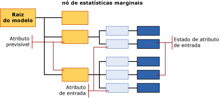

# <a name="mining-model-content-for-naive-bayes-models-analysis-services---data-mining"></a>Conteúdo do modelo de mineração para modelos Naive Bayes (Analysis Services – Mineração de Dados)
[!INCLUDE[ssas-appliesto-sqlas](../../includes/ssas-appliesto-sqlas.md)]
  Este tópico descreve o conteúdo do modelo de mineração específico para modelos que usam o algoritmo Naive Bayes da [!INCLUDE[msCoName](../../includes/msconame-md.md)] . Para obter uma explicação de como interpretar as estatísticas e a estrutura compartilhada por todos os tipos de modelos, e definições gerais dos termos relacionados ao conteúdo do modelo de mineração, consulte [Conteúdo do modelo de mineração &#40;Analysis Services – Data Mining&#41;](../../analysis-services/data-mining/mining-model-content-analysis-services-data-mining.md).  
  
## <a name="understanding-the-structure-of-a-naive-bayes-model"></a>Entendendo a estrutura de um modelo Naive Bayes  
 Um modelo Naive Bayes tem um único nó pai que representa o modelo e seus metadados e, subjacente ao nó pai, árvores independentes que representam os atributos previsíveis que você selecionou. Além das árvores para os atributos, cada modelo contém um nó de estatísticas marginais (NODE_TYPE = 26) que fornece estatísticas descritivas sobre o conjunto de casos de treinamento. Para obter mais informações, consulte [Informações no nó de estatísticas marginais](#bkmk_margstats).  
  
 Para cada atributo previsível e valor, o modelo gera uma árvore contendo informações que descrevem como várias colunas de entrada afetam o resultado de uma previsão específica. Cada árvore contém um atributo previsível e seu valor (NODE_TYPE = 9) e, depois, uma série de nós que representam os atributos de entrada (NODE_TYPE = 10). Como os atributos de entrada normalmente têm diversos valores, cada atributo (NODE_TYPE = 10) pode ter diversos nós filho (NODE_TYPE = 11), cada um para um estado específico do atributo.  
  
> [!NOTE]  
>  Como um modelo Naive Bayes não permite tipos de dados contínuos, todos os valores das colunas de entrada são tratados como discretos ou diferenciados. É possível especificar como um valor é diferenciado. Para obter mais informações, consulte [Alterar a discretização de uma coluna em um modelo de mineração](../../analysis-services/data-mining/change-the-discretization-of-a-column-in-a-mining-model.md).  
  
   
  
## <a name="model-content-for-a-naive-bayes-model"></a>Conteúdo de um modelo Naive Bayes  
 Esta seção fornece detalhes e exemplos somente das colunas do conteúdo do modelo de mineração que são relevantes para os modelos Naive Bayes.  
  
 Para obter informações sobre as colunas de uso general no conjunto de linhas de esquema, como MODEL_CATALOG e MODEL_NAME que não são descritos aqui, ou explicações relacionadas à terminologia do modelo de mineração, consulte [Conteúdo do modelo de mineração &#40;Analysis Services – Data Mining&#41;](../../analysis-services/data-mining/mining-model-content-analysis-services-data-mining.md).  
  
 MODEL_CATALOG  
 Nome do banco de dados no qual o modelo é armazenado.  
  
 MODEL_NAME  
 Nome do modelo.  
  
 ATTRIBUTE_NAME  
 Os nomes dos atributos que correspondem a este nó.  
  
 **Raiz do modelo** O nome do atributo previsível.  
  
 **Estatísticas marginais** Não aplicável  
  
 **Atributo previsível** O nome do atributo previsível.  
  
 **Atributo de entrada** O nome do atributo de entrada.  
  
 **Estado do atributo de entrada** O nome apenas do atributo de entrada. Para obter o estado, use MSOLAP_NODE_SHORT_CAPTION.  
  
 NODE_NAME  
 O nome do nó.  
  
 Esta coluna contém o mesmo valor que NODE_UNIQUE_NAME.  
  
 Para obter mais informações sobre convenções de nomenclatura de nó, consulte [Usando nomes e IDs de nós](#bkmk_nodenames).  
  
 NODE_UNIQUE_NAME  
 Nome exclusivo do nó. Os nomes exclusivos são atribuídos de acordo com uma convenção que fornece informações sobre as relações entre os nós. Para obter mais informações sobre convenções de nomenclatura de nó, consulte [Usando nomes e IDs de nós](#bkmk_nodenames).  
  
 NODE_TYPE  
 Um modelo Naive Bayes gera os seguintes tipos de nó:  
  
|ID do tipo de nó|Descrição|  
|------------------|-----------------|  
|26 (NaiveBayesMarginalStatNode)|Contém estatísticas que descrevem todo o conjunto de casos de treinamento do modelo.|  
|9 (Atributo previsível)|Contém o nome do atributo previsível.|  
|10 (Atributo de entrada)|Contém o nome de uma coluna de atributo de entrada e nós filhos que contêm os valores do atributo.|  
|11 (Estado do atributo de entrada)|Contém os valores ou valores diferenciados de todos os atributos de entrada que foram pareados com um atributo de saída específico.|  
  
 NODE_CAPTION  
 O rótulo ou uma legenda associada ao nó. Essa propriedade é usada principalmente para exibição.  
  
 **Raiz do modelo** em branco  
  
 **Estatísticas marginais** em branco  
  
 **Atributo previsível** O nome do atributo previsível.  
  
 **Atributo de entrada** O nome do atributo previsível e do atributo de entrada atual. Ex:  
  
 Bike Buyer -> Idade  
  
 **Estado do atributo de entrada** O nome do atributo previsível e do atributo de entrada atual, mais o valor da entrada. Ex:  
  
 Bike Buyer -> Idade = Missing  
  
 CHILDREN_CARDINALITY  
 Número de filhos do nó.  
  
 **Raiz do modelo** Contagem dos atributos previsíveis no modelo, mais 1 para nós de estatísticas marginais.  
  
 **Estatísticas marginais** Por definição, não têm filho.  
  
 **Atributo previsível**  Contagem dos atributos de entrada relacionados ao atributo previsível atual.  
  
 **Atributo de entrada** Contagem dos valores discretos ou diferenciados do atributo de entrada atual.  
  
 **Estado do atributo da entrada** Sempre 0.  
  
 PARENT_UNIQUE_NAME  
 O nome exclusivo do nó pai. Para obter mais informações sobre como relacionar nós pai e filho, consulte [Usado nomes e IDs de nós](#bkmk_nodenames).  
  
 NODE_DESCRIPTION  
 O mesmo que a legenda do nó.  
  
 NODE_RULE  
 Uma representação XML da legenda do nó.  
  
 MARGINAL_RULE  
 O mesmo que a regra do nó.  
  
 NODE_PROBABILITY  
 A probabilidade associada a este nó.  
  
 **Raiz do modelo** Sempre 0.  
  
 **Estatísticas marginais** Sempre 0.  
  
 **Atributo previsível**  Sempre 1.  
  
 **Atributo de entrada** Sempre 1.  
  
 **Estado do atributo de entrada** Um número decimal que representa a probabilidade do valor atual. Os valores de todos os estados do atributo de entrada sob o nó de atributo de entrada pai somam-se a 1.  
  
 MARGINAL_PROBABILITY  
 O mesmo que a probabilidade do nó.  
  
 NODE_DISTRIBUTION  
 Uma tabela que contém o histograma de probabilidade do nó. Para obter mais informações, consulte a [tabela NODE_DISTRIBUTION](#bkmk_nodedist).  
  
 NODE_SUPPORT  
 O número de casos com suporte para este nó.  
  
 **Raiz do modelo** Contagem de todos os casos nos dados de treinamento.  
  
 **Estatísticas marginais** Sempre 0.  
  
 **Atributo previsível** Contagem de todos os casos nos dados de treinamento.  
  
 **Atributo de entrada** Contagem de todos os casos nos dados de treinamento.  
  
 **Estado do atributo de entrada** Contagem dos casos nos dados de treinamento que contêm apenas este valor específico.  
  
 MSOLAP_MODEL_COLUMN  
 Um rótulo usado para exibição. Normalmente, o mesmo que ATTRIBUTE_NAME.  
  
 MSOLAP_NODE_SCORE  
 Representa a importância do atributo ou do valor no modelo.  
  
 **Raiz do modelo** Sempre 0.  
  
 **Estatísticas marginais** Sempre 0.  
  
 **Atributo previsível**  Sempre 0.  
  
 **Atributo de entrada** Pontuação de interesse do atributo de entrada atual com relação ao atributo previsível atual.  
  
 **Estado do atributo da entrada** Sempre 0.  
  
 MSOLAP_NODE_SHORT_CAPTION  
 Uma cadeia de texto que representa o nome ou o valor de uma coluna.  
  
 **Raiz do modelo** em branco  
  
 **Estatísticas marginais** em branco  
  
 **Atributo previsível**  O nome do atributo previsível.  
  
 **Atributo de entrada** O nome do atributo de entrada.  
  
 **Estado do atributo de entrada** O valor ou valor diferenciado do atributo de entrada.  
  
##  <a name="bkmk_nodenames"></a> Usando nomes e IDs de nós  
 A nomenclatura dos nós em um modelo Naive Bayes fornece mais informações sobre o tipo de nó para facilitar a compreensão das relações entre as informações no modelo. A tabela a seguir mostra a convenção para as IDs que são atribuídas a tipos de nós diferentes.  
  
|Tipo de nó|Convenção da ID de nó|  
|---------------|----------------------------|  
|Raiz do modelo (1)|Sempre 0.|  
|Nó de estatísticas marginais (26)|Um valor de ID arbitrário.|  
|Atributo previsível (9)|Número hexadecimal que inicia com 10000000<br /><br /> Exemplo: 100000001, 10000000b|  
|Atributo de entrada (10)|Um número hexadecimal de duas partes, onde a primeira parte é sempre 20000000 e a segunda inicia com o identificador hexadecimal do atributo previsível relacionado.<br /><br /> Exemplo: 20000000b00000000<br /><br /> Nesse caso, o atributo previsível relacionado é 10000000b.|  
|Estado do atributo de entrada (11)|Um número hexadecimal de três partes, onde a primeira parte é sempre 30000000, a segunda inicia com o identificador hexadecimal do atributo previsível relacionado e a terceira representa o identificador do valor.<br /><br /> Exemplo: 30000000b00000000200000000<br /><br /> Nesse caso, o atributo previsível relacionado é 10000000b.|  
  
 Você pode usar as IDs para relacionar atributos de entrada e estados a um atributo previsível. Por exemplo, a consulta a seguir retorna os nomes e as legendas dos nós que representam combinações possíveis de entrada e atributos previsíveis para o modelo `TM_NaiveBayes`.  
  
```  
SELECT NODE_NAME, NODE_CAPTION  
FROM TM_NaiveBayes.CONTENT  
WHERE NODE_TYPE = 10  
```  
  
 Resultados esperados:  
  
|NODE_NAME|NODE_CAPTION|  
|----------------|-------------------|  
|20000000000000001|Bike Buyer -> Distância do Trabalho|  
|20000000000000002|Bike Buyer -> Educação em Inglês|  
|20000000000000003|Bike Buyer -> Ocupação em Inglês|  
|20000000000000009|Bike Buyer -> Estado Civil|  
|2000000000000000a|Bike Buyer -> Número de Crianças na Casa|  
|2000000000000000b|Bike Buyer -> Região|  
|2000000000000000c|Bike Buyer -> Total de Filhos|  
  
 Depois, você pode usar as IDs dos nós pai para recuperar os nós filho. A consulta a seguir recupera os nós que contêm valores para o atributo `Marital Status` , juntamente com a probabilidade de cada nó.  
  
```  
SELECT NODE_NAME, NODE_CAPTION, NODE_PROBABILITY  
FROM TM_NaiveBayes.CONTENT  
WHERE NODE_TYPE = 11  
AND [PARENT_UNIQUE_NAME] = '20000000000000009'  
```  
  
> [!NOTE]  
>  O nome da coluna, PARENT_UNIQUE_NAME, deve estar entre colchetes para diferenciá-lo da palavra-chave reservada de mesmo nome.  
  
 Resultados esperados:  
  
|NODE_NAME|NODE_CAPTION|NODE_PROBABILITY|  
|----------------|-------------------|-----------------------|  
|3000000000000000900000000|Bike Buyer -> Estado Civil = Missing|0|  
|3000000000000000900000001|Bike Buyer -> Estado Civil = S|0.457504004|  
|3000000000000000900000002|Bike Buyer -> Estado Civil = M|0.542495996|  
  
##  <a name="bkmk_nodedist"></a> tabela NODE_DISTRIBUTION  
 Normalmente, a coluna de tabela aninhada, NODE_DISTRIBUTION, contém estatísticas sobre a distribuição de valores no nó. Em um modelo Naive Bayes, essa tabela é populada apenas para os seguintes nós:  
  
|Tipo de nó|Conteúdo da tabela aninhada|  
|---------------|-----------------------------|  
|Raiz do modelo (1)|Em branco.|  
|Nó de estatísticas marginais (24)|Contém informações resumidas para todos os atributos previsíveis e atributos de entrada de todo o conjunto de treinamento.|  
|Atributo previsível (9)|Em branco.|  
|Atributo de entrada (10)|Em branco.|  
|Estado do atributo de entrada (11)|Contém estatísticas que descrevem a distribuição de valores nos dados de treinamento desta combinação específica de um valor previsível e um valor de atributo de entrada.|  
  
 Você pode usar as IDs ou legendas de nó para recuperar níveis crescentes de detalhes. Por exemplo, a consulta a seguir recupera colunas específicas da tabela NODE_DISTRIBUTION apenas para nós do atributo de entrada relacionados ao valor `'Marital Status = S'`.  
  
```  
SELECT FLATTENED NODE_CAPTION,  
(SELECT ATTRIBUTE_NAME, ATTRIBUTE_VALUE, [SUPPORT], [PROBABILITY], VALUETYPE  
FROM NODE_DISTRIBUTION) as t  
FROM TM_NaiveBayes.content  
WHERE NODE_TYPE = 11  
AND NODE_CAPTION = 'Bike Buyer -> Marital Status = S'  
```  
  
 Resultados esperados:  
  
|NODE_CAPTION|T.ATTRIBUTE_NAME|t.ATTRIBUTE_VALUE|t.SUPPORT|t.PROBABILITY|t.VALUETYPE|  
|-------------------|-----------------------|------------------------|---------------|-------------------|-----------------|  
|Bike Buyer -> Estado Civil = S|Bike Buyer|Ausente|0|0|1|  
|Bike Buyer -> Estado Civil = S|Bike Buyer|0|3783|0.472934117|4|  
|Bike Buyer -> Estado Civil = S|Bike Buyer|1|4216|0.527065883|4|  
  
 Nesses resultados, o valor da coluna SUPPORT indica a você o número de clientes com o estado civil especificado que compraram uma bicicleta. A coluna PROBABILITY contém a probabilidade de cada valor de atributo, conforme calculado apenas para este nó. Para obter definições gerais dos termos usados na tabela NODE_DISTRIBUTION, consulte [Conteúdo do modelo de mineração &#40;Analysis Services – Data Mining&#41;](../../analysis-services/data-mining/mining-model-content-analysis-services-data-mining.md).  
  
###  <a name="bkmk_margstats"></a> Informações no nó de estatísticas marginais  
 Em um modelo Naive Bayes, a tabela aninhada para nós de estatísticas marginais contém a distribuição dos valores para todo o conjunto de dados de treinamento. Por exemplo, a tabela a seguir contém uma lista parcial das estatísticas na tabela NODE_DISTRIBUTION aninhada para o modelo `TM_NaiveBayes`.  
  
|ATTRIBUTE_NAME|ATTRIBUTE_VALUE|SUPPORT|PROBABILITY|VARIANCE|VALUETYPE|  
|---------------------|----------------------|-------------|-----------------|--------------|---------------|  
|Bike Buyer|Ausente|0|0|0|1|  
|Bike Buyer|0|8869|0.507263784|0|4|  
|Bike Buyer|1|8615|0.492736216|0|4|  
|Estado Civil|Ausente|0|0|0|1|  
|Estado Civil|P|7999|0.457504004|0|4|  
|Estado Civil|M|9485|0.542495996|0|4|  
|Total de Filhos|Ausente|0|0|0|1|  
|Total de Filhos|0|4865|0.278254404|0|4|  
|Total de Filhos|3|2093|0.119709449|0|4|  
|Total de Filhos|1|3406|0.19480668|0|4|  
  
 A coluna [Bike Buyer] foi incluída, pois o nó de estatísticas marginais sempre contém uma descrição do atributo previsível e de seus valores possíveis. Todas as outras colunas listadas representam atributos de entrada, juntamente com os valores que foram usados no modelo. Os valores só podem ser ausentes, discretos ou diferenciados.  
  
 No modelo Naive Bayes, não pode haver atributos contínuos. Portanto, todos os dados numéricos são representados como discretos (VALUE_TYPE = 4) ou diferenciados (VALUE_TYPE = 5).  
  
 Um valor **Missing** (VALUE_TYPE = 1) é adicionado a cada atributo de entrada e de saída para representar valores potenciais que não estavam presentes nos dados de treinamento. Você deve ter cuidado para distinguir "missing" como uma cadeia de caracteres e o valor padrão **Missing**. Para obter mais informações, consulte [Valores ausentes&#40;Analysis Services – Data Mining&#41;](../../analysis-services/data-mining/missing-values-analysis-services-data-mining.md).  
  
## <a name="see-also"></a>Consulte também  
 [Conteúdo do modelo de mineração &#40;Analysis Services – Data Mining&#41;](../../analysis-services/data-mining/mining-model-content-analysis-services-data-mining.md)   
 [Visualizadores do Modelo de Mineração de Dados](../../analysis-services/data-mining/data-mining-model-viewers.md)   
 [Consultas de mineração de dados](../../analysis-services/data-mining/data-mining-queries.md)   
 [Algoritmo Naïve Bayes da Microsoft](../../analysis-services/data-mining/microsoft-naive-bayes-algorithm.md)  
  
  
