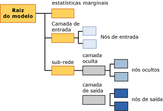

# Conteúdo do modelo de mineração para modelos de rede neural (Analysis Services – Mineração de Dados)
[!INCLUDE[ssas-appliesto-sqlas](../../includes/ssas-appliesto-sqlas.md)]
  Este tópico descreve o conteúdo do modelo de mineração que é específico para modelos que usam o algoritmo Rede Neural da Microsoft. Para obter uma explicação de como interpretar as estatísticas e a estrutura compartilhada por todos os tipos de modelos, e definições gerais dos termos relacionados ao conteúdo do modelo de mineração, consulte [Conteúdo do Modelo de Mineração &#40;Analysis Services – Data Mining&#41;](../../analysis-services/data-mining/mining-model-content-analysis-services-data-mining.md).  
  
## Entendendo a estrutura de um modelo de rede neural  
 Cada modelo de rede neural tem um único nó pai que representa o modelo e seus metadados, além de um nó de estatísticas marginais (NODE_TYPE = 24) que fornece estatísticas descritivas sobre os atributos de entrada. O nó de estatísticas marginais é útil porque resume informações sobre entradas, para que não seja necessário consultar dados de nós individuais.  
  
 Sob esses dois nós, há pelo menos mais dois nós, e talvez haja mais, dependendo da quantidade de atributos previsíveis do modelo.  
  
-   O primeiro nó (NODE_TYPE = 18) sempre representa o nó superior da camada de entrada. Sob esse nó superior, é possível encontrar nós de entrada (NODE_TYPE = 21) que contêm os atributos de entrada reais e seus valores.  
  
-   Nós sucessivos contêm uma *sub-rede* diferente (NODE_TYPE = 17). Cada sub-rede sempre contém uma camada oculta (NODE_TYPE = 19) e uma cama da de saída (NODE_TYPE = 20) para essa sub-rede.  
  
   
  
 As informações na camada de entrada são objetivas: o nó superior de cada camada de entrada (NODE_TYPE = 18) atua como um organizador de uma coleção de nós de entrada (NODE_TYPE = 21). O conteúdo dos nós de entrada é descrito na tabela a seguir.  
  
 Cada sub-rede (NODE_TYPE = 17) representa a análise da influência da camada de entrada em um determinado atributo previsível. Se houver várias saídas previsíveis, haverá várias sub-redes. A camada oculta de cada sub-rede contém vários nós ocultos (NODE_TYPE = 22) que contêm detalhes sobre os pesos de cada transição que termina nesse nó oculto em particular.  
  
 A camada de saída (NODE_TYPE = 20) contém nós de saída (NODE_TYPE = 23) que contêm valores distintos do atributo previsível. Se o atributo previsível for um tipo de dados numérico contínuo, haverá apenas um nó de saída para o atributo.  
  
> [!NOTE]  
>  O algoritmo regressão logística usa um caso especial de rede neural que tem apenas um resultado previsível e potencialmente muitas entradas. A regressão logística não usa uma camada oculta.  
  
 A maneira mais fácil de explorar a estrutura das entradas e sub-redes é utilizar o **Visualizador de Árvore de Conteúdo Genérica da Microsoft**. Você pode clicar em qualquer nó para expandi-lo e visualizar os nós filho ou exibir os pesos e outras estatísticas contidas no nó.  
  
 Para trabalhar com os dados e verificar como o modelo correlaciona entradas com saídas, use o **Visualizador de Rede Neural da Microsoft**. Ao usar esse visualizador personalizado, você pode filtrar os atributos de entrada e seus valores e visualizar graficamente como eles afetam as saídas. As dicas de ferramentas no visualizador mostram a probabilidade e a comparação de precisão associadas a cada par de valores de entrada e saída. Para obter mais informações, consulte [Procurar um modelo usando o Visualizador de Rede Neural da Microsoft](../../analysis-services/data-mining/browse-a-model-using-the-microsoft-neural-network-viewer.md).  
  
## Conteúdo de um modelo de rede neural  
 Esta seção fornece detalhes e exemplos somente das colunas do conteúdo do modelo de mineração que são relevantes para redes neurais. Para obter informações sobre as colunas de uso general no conjunto de linhas de esquema, como MODEL_CATALOG e MODEL_NAME que não são descritos aqui, ou explicações relacionadas à terminologia do modelo de mineração, consulte [Conteúdo do Modelo de Mineração &#40;Analysis Services – Data Mining&#41;](../../analysis-services/data-mining/mining-model-content-analysis-services-data-mining.md).  
  
 MODEL_CATALOG  
 Nome do banco de dados no qual o modelo é armazenado.  
  
 MODEL_NAME  
 Nome do modelo.  
  
 ATTRIBUTE_NAME  
 Os nomes dos atributos que correspondem a este nó.  
  
|Nó|Conteúdo|  
|----------|-------------|  
|Raiz do modelo|Em branco|  
|Estatísticas marginais|Em branco|  
|Camada de entrada|Em branco|  
|Nó de entrada|Nome do atributo de entrada|  
|hidden layer|Em branco|  
|Nó oculto|Em branco|  
|Camada de saída|Em branco|  
|Nó de saída|Nome do atributo de saída|  
  
 NODE_NAME  
 O nome do nó. Esta coluna contém o mesmo valor que NODE_UNIQUE_NAME.  
  
 NODE_UNIQUE_NAME  
 Nome exclusivo do nó.  
  
 Para obter mais informações sobre como os nomes e as IDs fornecem dados estruturais sobre o modelo, consulte a seção, [Usando nomes e IDs de nós](#bkmk_NodeIDs).  
  
 NODE_TYPE  
 Um modelo de rede neural produz apenas os seguintes tipos de nó:  
  
|ID do tipo de nó|Description|  
|------------------|-----------------|  
|1|Modelo.|  
|17|Nó do organizador para a sub-rede.|  
|18|Nó do organizador da camada de entrada.|  
|19|Nó do organizador da camada oculta.|  
|20|Nó do organizador da camada de saída.|  
|21|Nó do atributo de entrada.|  
|22|Nó da camada oculta|  
|23|Nó do atributo de saída.|  
|24|Nó de estatísticas marginais.|  
  
 NODE_CAPTION  
 Um rótulo ou uma legenda associada ao nó. Em modelos de rede neural, sempre em branco.  
  
 CHILDREN_CARDINALITY  
 Uma estimativa do número de filhos do nó.  
  
|Nó|Conteúdo|  
|----------|-------------|  
|Raiz do modelo|Indica a contagem de nós filho, que inclui pelo menos 1 rede, 1 nó marginal necessário e 1 camada de entrada necessária. Por exemplo, se o valor for 5, haverá 3 sub-redes.|  
|Estatísticas marginais|Sempre 0.|  
|Camada de entrada|Indica o número de pares de atributo-valores de entrada usados pelo modelo.|  
|Nó de entrada|Sempre 0.|  
|hidden layer|Indica o número de nós ocultos que foram criados pelo modelo.|  
|Nó oculto|Sempre 0.|  
|Camada de saída|Indica o número de valores de saída.|  
|Nó de saída|Sempre 0.|  
  
 PARENT_UNIQUE_NAME  
 O nome exclusivo do nó pai. NULL é retornado para todos os nós em nível raiz.  
  
 Para obter mais informações sobre como os nomes e as IDs fornecem dados estruturais sobre o modelo, consulte a seção, [Usando nomes e IDs de nós](#bkmk_NodeIDs).  
  
 NODE_DESCRIPTION  
 Uma descrição amigável do nó.  
  
|Nó|Conteúdo|  
|----------|-------------|  
|Raiz do modelo|Em branco|  
|Estatísticas marginais|Em branco|  
|Camada de entrada|Em branco|  
|Nó de entrada|Nome do atributo de entrada|  
|hidden layer|Em branco|  
|Nó oculto|Número inteiro que indica a sequência do nó oculto na lista de nós ocultos.|  
|Camada de saída|Em branco|  
|Nó de saída|Se o atributo de saída for contínuo, conterá o nome do atributo de saída.   Se o atributo de saída for discreto ou diferenciado, contém o nome do atributo e o valor.|  
  
 NODE_RULE  
 Uma descrição XML da regra é inserida no nó.  
  
|Nó|Conteúdo|  
|----------|-------------|  
|Raiz do modelo|Em branco|  
|Estatísticas marginais|Em branco|  
|Camada de entrada|Em branco|  
|Nó de entrada|Um fragmento de XML que contém as mesmas informações que a coluna NODE_DESCRIPTION.|  
|hidden layer|Em branco|  
|Nó oculto|Número inteiro que indica a sequência do nó oculto na lista de nós ocultos.|  
|Camada de saída|Em branco|  
|Nó de saída|Um fragmento de XML que contém as mesmas informações que a coluna NODE_DESCRIPTION.|  
  
 MARGINAL_RULE  
 Para modelos de rede neural, sempre em branco.  
  
 NODE_PROBABILITY  
 A probabilidade associada a este nó. Para modelos de rede neural, sempre 0.  
  
 MARGINAL_PROBABILITY  
 A probabilidade de que o nó seja alcançado a partir do nó pai. Para modelos de rede neural, sempre 0.  
  
 NODE_DISTRIBUTION  
 Uma tabela aninhada que contém informações estatísticas para o nó. Para obter informações detalhadas sobre o conteúdo dessa tabela para cada tipo de nó, consulte a seção [Entendendo a tabela NODE_DISTRIBUTION](#bkmk_NodeDistTable).  
  
 NODE_SUPPORT  
 Para modelos de rede neural, sempre 0.  
  
> [!NOTE]  
>  O suporte a probabilidades é sempre 0 porque a saída desse tipo modelo não é probabilística. Somente os pesos são significativos para o algoritmo; portanto, o algoritmo não computa probabilidade, suporte ou variação.  
  
 Para obter informações sobre o suporte nos casos de treinamento para valores específicos, consulte o nó de estatísticas marginais.  
  
 MSOLAP_MODEL_COLUMN  
 |Nó|Conteúdo|  
|----------|-------------|  
|Raiz do modelo|Em branco|  
|Estatísticas marginais|Em branco|  
|Camada de entrada|Em branco|  
|Nó de entrada|Nome do atributo de entrada.|  
|hidden layer|Em branco|  
|Nó oculto|Em branco|  
|Camada de saída|Em branco|  
|Nó de saída|Nome do atributo de entrada.|  
  
 MSOLAP_NODE_SCORE  
 Para um modelo de rede neural, sempre 0.  
  
 MSOLAP_NODE_SHORT_CAPTION  
 Para modelos de rede neural, sempre em branco.  
  
## Comentários  
 O objetivo do treinamento de um modelo de rede neural é determinar os pesos associados a cada transição de uma entrada para um ponto médio, e de um ponto médio para um ponto de extremidade. Assim, a camada de entrada do modelo existe principalmente para armazenar os valores reais usados para criar o modelo. A camada oculta armazena os pesos que foram computados e fornece ponteiros para os atributos de entrada. A camada de saída armazena os valores previsíveis e também fornece ponteiros para os pontos médios na camada oculta.  
  
##   Usando nomes e IDs de nós  
 A nomenclatura dos nós em um modelo de rede neural fornece mais informações sobre o tipo de nó, para tornar mais fácil relacionar a camada oculta à camada de entrada, e a camada de saída à camada oculta. A tabela a seguir mostra a convenção para as IDs atribuídas aos nós em cada camada.  
  
|Tipo de nó|Convenção da ID de nó|  
|---------------|----------------------------|  
|Raiz do modelo (1)|00000000000000000.|  
|Nó de estatísticas marginais (24)|10000000000000000|  
|Camada de entrada (18)|30000000000000000|  
|Nó de entrada (21)|Inicia em 60000000000000000|  
|Sub-rede (17)|20000000000000000|  
|Camada oculta (19)|40000000000000000|  
|Nó oculto (22)|Inicia em 70000000000000000|  
|Camada de saída (20)|50000000000000000|  
|Nó de saída (23)|Inicia às 80000000000000000|  
  
 Você pode determinar quais atributos de entrada estão relacionados a um nó da camada oculta específico exibindo a tabela NODE_DISTRIBUTION no nó oculto (NODE_TYPE = 22). Cada linha da tabela NODE_DISTRIBUTION contém a ID de um nó de atributo de entrada.  
  
 De modo semelhante, você pode determinar quais camadas ocultas estão relacionadas a um atributo de saída exibindo a tabela NODE_DISTRIBUTION no nó de saída (NODE_TYPE = 23). Cada linha da tabela NODE_DISTRIBUTION contém a ID de um nó da camada oculta, junto com o coeficiente relacionado.  
  
##   Interpretando as informações na tabela NODE_DISTRIBUTION  
 A tabela NODE_DISTRIBUTION pode estar vazia em alguns nós. No entanto, para nós de entrada, nós da camada oculta e nós de saída, a tabela NODE_DISTRIBUTION armazena informações importantes e interessantes sobre o modelo. Para ajudá-lo a interpretar essas informações, a tabela NODE_DISTRIBUTION contém uma coluna VALUETYPE para cada linha que informa se o valor na coluna ATTRIBUTE_VALUE é Discreto (4), Diferenciado (5) ou Contínuo (3).  
  
### Nós de entrada  
 A camada de entrada contém um nó para cada valor do atributo que foi usado no modelo.  
  
 **Atributo discreto:** O nó de entrada armazena apenas o nome do atributo e seu valor nas colunas ATTRIBUTE_NAME e ATTRIBUTE_VALUE. Por exemplo, se [Turno de Trabalho] for a coluna, um nó separado será criado para cada valor dessa coluna que foi usado no modelo, como AM e PM. A tabela NODE_DISTRIBUTION para cada nó lista apenas o valor atual do atributo.  
  
 **Atributo numérico discreto:** O nó de entrada armazena o nome do atributo e o valor, que pode ser um intervalo ou valor específico. Todos os valores são representados por expressões, como '77.4 - 87.4' ou ' < 64.0' para o valor de [Tempo por Emissão]. A tabela NODE_DISTRIBUTION para cada nó lista apenas o valor atual do atributo.  
  
 **Atributo contínuo:** O nó de entrada armazena o valor médio do atributo. A tabela NODE_DISTRIBUTION para cada nó lista apenas o valor atual do atributo.  
  
### Nós da camada oculta  
 A camada oculta contém um número variável de nós. Em cada nó, a tabela NODE_DISTRIBUTION contém mapeamentos da camada oculta para os nós na camada de entrada. A coluna ATTRIBUTE_NAME contém uma ID de nó que corresponde a um nó na camada de entrada. A coluna ATTRIBUTE_VALUE contém o peso associado à combinação de nó de entrada e nó da camada oculta. A última linha na tabela contém um coeficiente que representa o peso do nó oculto na camada oculta.  
  
### Nós de saída  
 A camada de saída contém um nó de saída para cada valor de saída usado no modelo. Em cada nó, a tabela NODE_DISTRIBUTION contém mapeamentos da camada de saída para os nós na camada oculta. A coluna ATTRIBUTE_NAME contém uma ID de nó que corresponde a um nó na camada oculta. A coluna ATTRIBUTE_VALUE contém o peso associado à combinação de nó de saída e nó da camada oculta.  
  
 A tabela NODE_DISTRIBUTION tem as seguintes informações adicionais, dependendo do tipo de atributo:  
  
 **Atributo discreto:** As duas linhas finais da tabela NODE_DISTRIBUTION contêm um coeficiente para os nós como um todo, e o valor atual do atributo.  
  
 **Atributo numérico discreto:** Idêntico aos atributos discretos, exceto pelo fato de o valor do atributo ser um intervalo de valores.  
  
 **Atributo contínuo:** As duas linhas finais da tabela NODE_DISTRIBUTION contêm a média do atributo, o coeficiente do nó como um todo e a variação do coeficiente.  
  
## Consulte também  
 [Algoritmo rede Neural da Microsoft](../../analysis-services/data-mining/microsoft-neural-network-algorithm.md)   
 [Microsoft Neural Network Algorithm Technical Reference](../../analysis-services/data-mining/microsoft-neural-network-algorithm-technical-reference.md)   
 [Exemplos de consulta de modelo de rede neural](../../analysis-services/data-mining/neural-network-model-query-examples.md)  
  
  
