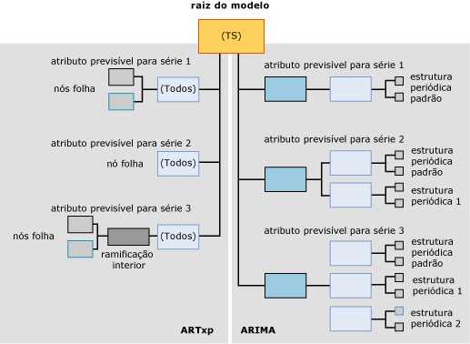

# <a name="mining-model-content-for-time-series-models-analysis-services---data-mining"></a>Conteúdo do modelo de mineração para modelos de série temporal (Analysis Services – Mineração de dados)
  Todos os modelos de mineração usam a mesma estrutura para armazenar conteúdo. Essa estrutura é definida de acordo com o conjunto de linhas de esquema do conteúdo da mineração de dados. Entretanto, em uma estrutura padrão, os nós que contêm informações são organizados de formas diferentes para representar vários tipos de árvores. Este tópico descreve como os nós são organizados e o que cada nó significa para os modelos de mineração que têm como base o algoritmo MTS da [!INCLUDE[msCoName](../../includes/msconame-md.md)] .  
  
 Para obter uma explicação sobre o conteúdo geral do modelo de mineração que se aplica a todos os tipos de modelo, consulte [Conteúdo do modelo de mineração &#40;Analysis Services – Data Mining&#41;](../../analysis-services/data-mining/mining-model-content-analysis-services-data-mining.md).  
  
 Pode ser muito útil pesquisar os conteúdos de um modelo de série temporal ao revisar este tópico. Você criará um modelo de série temporal ao concluir o tutorial Mineração de dados básica. O modelo criado nesse tutorial é do tipo misto que treina dados usando algoritmos ARIMA e ARTXP. Para obter informações sobre como exibir o conteúdo de um modelo de mineração, consulte [Visualizadores do Modelo de Data Mining](../../analysis-services/data-mining/data-mining-model-viewers.md).  
  
## <a name="understanding-the-structure-of-a-time-series-model"></a>Entendendo a estrutura de um modelo de série temporal  
 Um modelo de série temporal tem um nó pai único que representa o modelo e seus metadados. Embaixo do nó pai, há uma ou duas árvores de série temporal dependendo do algoritmo usado para criar o modelo.  
  
 Se você criou um modelo misto, foram adicionadas duas árvores diferentes ao modelo: uma para ARIMA ou outra para ARTXP. Se optou por usar somente o algoritmo ARTXP ou o ARIMA, você terá uma árvore única que corresponde ao algoritmo escolhido. Você especifica qual algoritmo será usado configurando o parâmetro FORECAST_METHOD. Para obter mais informações sobre quando usar ARTXP, ARIMA ou um modelo misto, consulte [Algoritmo MTS](../../analysis-services/data-mining/microsoft-time-series-algorithm.md).  
  
 O diagrama a seguir mostra um exemplo de um modelo de mineração de dados de série temporal criado com as configurações padrão para modelo misto. Para que você possa comparar mais facilmente as diferenças entre os dois modelos, o modelo ARTXP é mostrado no lado esquerdo do diagrama e o modelo ARIMA, no lado direito.  Enquanto o ARTXP é uma estrutura parecida com uma área que se divide em ramificações cada vez menores, a estrutura criada pelo algoritmo ARIMA é mais parecida com uma pirâmide criada para cima a partir de componentes menores.  
  
   
  
 É importante lembrar que as informações são organizadas nas árvores ARIMA e ARTXP de formas completamente diferentes e você deve considerar as duas árvores relacionadas somente no nó raiz. Embora as duas representações estejam presentes em um modelo para conveniência, elas devem ser tratadas como modelos independentes. ARTXP representa uma estrutura de árvore real, mas ARIMA não.  
  
 Quando você usa o Visualizador de Árvore de Conteúdo Genérica da Microsoft para exibir um modelo que usa ARIMA e ARTXP, os nós nos modelos ARTXP e ARIMS são mostrados como nós filho do modelo de série temporal pai. Porém, você pode distingui-los facilmente pelos rótulos aplicados aos nós.  
  
-   O primeiro conjunto de nós é rotulado (All) e representa os resultados da análise pelo algoritmo ARTXP.  
  
-   O segundo conjunto de nós é chamado ARIMA e representa os resultados da análise pelo algoritmo ARIMA.  
  
> [!WARNING]  
>  O nome (All) na árvore ARTXP é mantido somente por questões de compatibilidade com versões anteriores. Antes do SQL Server 2008, o algoritmo MST usava um único algoritmo para análise, o ARTXP.  
  
 As seções a seguir explicam como os nós são organizados dentro de cada tipo de modelo.  
  
### <a name="structure-of-an-artxp-model"></a>Estrutura de um modelo ARTXP  
 O algoritmo ARTXP cria um modelo semelhante a um modelo de árvore de decisão. Ele agrupa atributos previsíveis e os divide sempre que são localizadas diferenças significativas. Consequentemente, cada modelo ARTXP contém uma ramificação separada para cada atributo previsível. Por exemplo, o tutorial Mineração de dados básica cria um modelo que prevê o volume de vendas para várias regiões. Nesse caso, **[Amount]** é o atributo previsível e uma ramificação separada é criada para cada região. Se tivéssemos dois atributos previsíveis, **[Amount]** e **[Quantity]**, seria criada uma ramificação separada para cada combinação de um atributo e uma região.  
  
 O nó superior da divisão ARTXP contém a mesma informação presente no nó raiz da árvore de decisão. Isso inclui o número de filhos de cada nó (CHILDREN_CARDINALITY), o número de casos que atendem as condições deste nó (NODE_SUPPORT) e uma variedade de estatísticas descritivas (NODE_DISTRIBUTION).  
  
 Se o nó não tiver nenhum filho, significa que nenhuma condição significativa, que justificaria a divisão dos casos em outros subgrupos, foi encontrada. A ramificação termina neste ponto e o nó é chamado de *nó folha*. O nó folha contém atributos, coeficientes e valores que são os blocos de construção da fórmula ARTXP.  
  
 Algumas ramificações podem ter divisões adicionais, semelhante a um modelo de árvore de decisão. Por exemplo, a ramificação da árvore que representa vendas para a região da Europa divide-se em duas ramificações. Uma divisão ocorre quando há condição que gera diferença significativa entre os dois grupos. O nó pai indica o nome do atributo que causou a divisão, como [Amount], e quantos casos existem no nó pai. O nó folha fornece mais detalhes: o valor do atributo, como [Sales] >10,000 vs. [Sales] < 10,000), o número de casos que aceitam cada condição e a fórmula ARTXP.  
  
> [!NOTE]  
>  Caso queira exibir as fórmulas, poderá encontrar a fórmula de regressão completa no nível do nó folha, mas não em um nó intermediário ou no nó raiz.  
  
### <a name="structure-of-an-arima-model"></a>Estrutura de um modelo ARIMA  
 O algoritmo ARIMA cria uma única informação para cada combinação de uma série de dados (como **[Region]**) e um atributo previsível (como **[Sales Amount]**): equação que descreve a alteração do atributo previsível com o passar do tempo.  
  
 A equação para cada série é derivada de vários componentes, um para cada estrutura periódica que foi encontrada nos dados. Por exemplo, se você tem dados de vendas que são coletados mensalmente, o algoritmo pode detectar estruturas periódicas mensais, trimestrais ou anuais.  
  
 O algoritmo produz um conjunto separado de nós pai e filho para cada periodicidade encontrada. A periodicidade padrão é 1, para um único intervalo de tempo, e é adicionada automaticamente em todos os modelos. Você pode especificar possíveis estruturas periódicas digitando vários valores no parâmetro PERIODICITY_HINT. Porém, se o algoritmo não detectar uma estrutura periódica, não produzirá resultados para aquela dica.  
  
 Cada estrutura periódica que é produzida no conteúdo do modelo contém os seguintes nós de componente:  
  
-   Um nó para a *ordem regressiva automática* (AR)  
  
-   Um nó para a *média móvel* (MA)  
  
 Para obter informações sobre o significado desses temos, consulte [Algoritmo MTS](../../analysis-services/data-mining/microsoft-time-series-algorithm.md).  
  
 A *ordem de diferença* é uma parte importante da fórmula e é representada na equação. Para obter mais informações sobre como a ordem de diferença é usada, consulte [Referência técnica do algoritmo MTS](../../analysis-services/data-mining/microsoft-time-series-algorithm-technical-reference.md).  
  
## <a name="model-content-for-time-series"></a>Conteúdo do modelo para série temporal  
 Esta seção fornece detalhes e exemplos somente das colunas do conteúdo do modelo de mineração que são relevantes para os modelos de série temporal.  
  
 Para obter informações sobre as colunas de uso general no conjunto de linhas de esquema, como MODEL_CATALOG e MODEL_NAME, ou ainda explicações relacionadas à terminologia do modelo de mineração, consulte [Conteúdo do modelo de mineração &#40;Analysis Services – Data Mining&#41;](../../analysis-services/data-mining/mining-model-content-analysis-services-data-mining.md).  
  
 MODEL_CATALOG  
 Nome do banco de dados no qual o modelo é armazenado.  
  
 MODEL_NAME  
 Nome do modelo.  
  
 ATTRIBUTE_NAME  
 O atributo previsível para a série de dados representada no nó. (O mesmo valor de MSOLAP_MODEL_COLUMN.)  
  
 NODE_NAME  
 O nome do nó.  
  
 Atualmente, esta coluna contém o mesmo valor de NODE_UNIQUE_NAME, embora isso possa mudar em versões futuras.  
  
 NODE_UNIQUE_NAME  
 Nome exclusivo do nó. O nó pai modelo sempre recebe o nome de **TS**.  
  
 **ARTXP:** cada nó é representado por TS seguido de um valor numérico hexadecimal. A ordem dos nós não é importante.  
  
 Por exemplo, os nós ARTXP diretamente abaixo da árvore TS podem ser numerados TS00000001-TS0000000b.  
  
 **ARIMA:** cada nó em uma árvore ARIMA é representado por TA seguido de um valor numérico hexadecimal. Os nós filho contêm o nome exclusivo do nó pai, seguido de um número hexadecimal que indica a sequência no nó.  
  
 Todas as árvores ARIMA são estruturadas exatamente da mesma forma. Cada raiz contém os nós e a convenção de nomenclatura exemplificadas na tabela a seguir:  
  
|Tipo e identificador de nó ARIMA|Exemplo de nome de nó|  
|----------------------------|--------------------------|  
|Raiz ARIMA (27)|TA0000000b|  
|Estrutura periódica ARIMA (28)|TA0000000b00000000|  
|Regressão automática ARIMA (29)|TA0000000b000000000|  
|Média de movimentação ARIMA (30)|TA0000000b000000001|  
  
 NODE_TYPE  
 Um modelo de série temporal gera os seguintes tipos de nós, dependendo do algoritmo:  
  
 **ARTXP:**  
  
|ID do tipo de nó|Description|  
|------------------|-----------------|  
|1 (Modelo)|Série temporal|  
|3 (Interior)|Representa uma ramificação interior em uma árvore de série temporal ARTXP.|  
|16 (Árvore de série temporal)|Raiz da árvore ARTXP que corresponde a uma série e atributo previsível.|  
|15 (Série temporal)|Nó folha na árvore ARTXP.|  
  
 **ARIMA:**  
  
|ID do tipo de nó|Description|  
|------------------|-----------------|  
|27 (Raiz ARIMA)|O nó superior de uma árvore ARIMA.|  
|28 (Estrutura periódica ARIMA)|Componente de uma árvore ARIMA que descreve uma única estrutura periódica.|  
|29 (Regressão automática ARIMA)|Contém um coeficiente para uma única estrutura periódica.|  
|30 (Média de movimentação ARIMA)|Contém um coeficiente para uma única estrutura periódica.|  
  
 NODE_CAPTION  
 Um rótulo ou legenda associada ao nó.  
  
 Essa propriedade é usada principalmente para exibição.  
  
 **ARTXP:** contém a condição de divisão para o nó, exibido como uma combinação de atributo e intervalo de valor.  
  
 **ARIMA:** contém a forma abreviada da equação ARIMA.  
  
 Para obter informações sobre o formato da equação ARIMA, consulte [Legenda de mineração para ARIMA](#bkmk_ARIMA_2).  
  
 CHILDREN_CARDINALITY  
 Número de filhos diretos que o nó possui.  
  
 PARENT_UNIQUE_NAME  
 O nome exclusivo do nó pai. NULL é retornado para todos os nós em nível raiz.  
  
 NODE_DESCRIPTION  
 Uma descrição em texto das regras, divisões ou fórmulas no nó atual.  
  
 **ARTXP:** para obter mais informações, consulte [Entendendo a árvore ARTXP](#bkmk_ARTXP_1).  
  
 **ARIMA:** para obter mais informações, consulte [Entendendo a árvore ARIMA](#bkmk_ARIMA_1).  
  
 NODE_RULE  
 Uma descrição em XML das regras, divisões ou fórmulas no nó atual.  
  
 **ARTXP:** o NODE_RULE geralmente corresponde ao NODE_CAPTION.  
  
 **ARIMA:** para obter mais informações, consulte [Entendendo a árvore ARIMA](#bkmk_ARIMA_1).  
  
 MARGINAL_RULE  
 Uma descrição em XML da divisão ou conteúdo que é específico àquele nó.  
  
 **ARTXP:** o MARGINAL_RULE geralmente corresponde ao NODE_DESCRIPTION.  
  
 **ARIMA:** sempre em branco; use NODE_RULE.  
  
 NODE_PROBABILITY  
 **ARTXP:** para nós de árvore, sempre 1. Para nós folha, a probabilidade de alcançar o nó a partir do nó raiz modelo.  
  
 **ARIMA:** sempre 0.  
  
 MARGINAL_PROBABILITY  
 **ARTXP:** para nós de árvore, sempre 1. Para nós folha, a probabilidade de alcançar o nó a partir do nó pai imediato.  
  
 **ARIMA:** sempre 0.  
  
 NODE_DISTRIBUTION  
 Um tabela que contém o histograma de probabilidade do nó. Em um modelo de série temporal, essa tabela aninhada contém todos os componentes necessários para montar a fórmula de regressão real.  
  
 Para obter mais informações sobre a tabela de distribuição de nó em uma árvore ARTXP, consulte [Entendendo a árvore ARTXP](#bkmk_ARTXP_1).  
  
 Para obter mais informações sobre a tabela de distribuição de nó em uma árvore ARIMA, consulte [Entendendo a árvore ARIMA](#bkmk_ARIMA_1).  
  
 Se preferir verificar todas as constantes e os outros componentes em um formato legível, use o [Visualizador MTS](../../analysis-services/data-mining/browse-a-model-using-the-microsoft-time-series-viewer.md), clique no nó e abra a **Legenda de Mineração**.  
  
 NODE_SUPPORT  
 O número de casos com suporte para este nó.  
  
 **ARTXP:** para o nó **(All)** , indica o número total de intervalos de tempo incluído na ramificação.  
  
 No caso de nós terminais, indica o número de intervalos de tempo que são incluídos no intervalo descrito pelo NODE_CAPTION. O número de intervalos de tempo nos nós terminais sempre são somados ao valor de NODE_SUPPORT do nó **(All)** da ramificação.  
  
 **ARIMA:** um cálculo dos casos que oferecem suporte à estrutura periódica atual. O valor para suporte é repetido em todos os nós da estrutura periódica atual.  
  
 MSOLAP_MODEL_COLUMN  
 O atributo previsível para a série de dados representada no nó. (O mesmo valor de ATTRIBUTE_NAME.)  
  
 MSOLAP_NODE_SCORE  
 Um valor numérico que caracteriza o valor da informação da árvore ou divisão.  
  
 **ARTXP:** o valor é sempre 0.0 para nós sem uma divisão. Para nós com uma divisão, o valor representa a pontuação de interesse da divisão.  
  
 Para obter mais informações sobre esses métodos de pontuação, consulte [Seleção de recursos &#40;Data Mining&#41;](../../analysis-services/data-mining/feature-selection-data-mining.md).  
  
 **ARIMA:** uma pontuação BIC (Bayesian Information Criterion) do modelo ARIMA. A mesma pontuação é definida em todos os nós ARIMA relacionados à equação.  
  
 MSOLAP_NODE_SHORT_CAPTION  
 **ARTXP:**  mesmas informações de NODE_DESCRIPTION.  
  
 **ARIMA:** mesmas informações de NODE_CAPTION, ou seja, uma equação ARIMA reduzida.  
  
##  <a name="bkmk_ARTXP_1"></a> Entendendo a árvore ARTXP  
 O modelo ARTXP separa claramente as área de dados lineares das áreas de dados divididos em algum outro fator. Sempre que as alterações no atributo previsível podem ser diretamente representadas como uma função das variáveis independentes, uma fórmula de regressão é calculada para representar aquela relação  
  
 Por exemplo, se houvesse uma correlação direta entre tempo e vendas para a maioria das séries de dados, cada série estaria em uma árvore de série temporal (NODE_TYPE = 16) que não tivesse nós filhos para cada série de dados, somente uma equação de regressão. Porém, se a relação não é linear, uma árvore de série temporal ARTXP pode dividir condições em nós filho, exatamente como um modelo de árvore de decisão. Ao exibir o conteúdo do modelo no **Visualizador de Árvore de Conteúdo Genérica da Microsoft** , você pode ver onde as divisões ocorrem e como elas afetam a linha de tendência.  
  
 Para entender melhor este comportamento, você pode analisar o modelo de série temporal criado no [Tutorial Básico de Data Mining](http://msdn.microsoft.com/library/6602edb6-d160-43fb-83c8-9df5dddfeb9c). Este modelo, baseado no data warehouse do AdventureWorks, não usa dados particularmente complexos. Portanto, não há muitas divisões na árvore ARTXP. Mesmo assim, até mesmo esse modelo relativamente simples ilustra três tipos diferentes de divisões:  
  
-   A linha de tendência [Amount] para a região Pacific se divide na chave de tempo. Uma divisão na chave de tempo significa que há uma alteração de tendência em determinado momento. A linha de tendência só era linear até um certo ponto. Depois, a curva assumiu uma forma diferente. Por exemplo, uma série temporal pode continuar até 6 de agosto de 2002 e outra série temporal iniciar depois dessa data.  
  
-   A linha de tendência [Amount] para a região North America se divide em outra variável. Nesse caso, a tendência para North America se divide com base no valor para o mesmo modelo na região Europe. Em outras palavras, o algoritmo detectou que quando o valor para Europe muda, o valor para North America A também muda.  
  
-   A linha de tendência para região Europe se divide em si mesmo.  
  
 O que significa cada divisão? A interpretação das informações transmitidas pelo conteúdo do modelo é uma arte que requer profundo conhecimento dos dados e de seus significados no contexto dos negócios.  
  
-   O vínculo aparente entre as tendências para as regiões North America e Europe pode significar apenas que a série de dados para Europe tem mais entropia, o que faz com que a tendência para North America pareça mais fraca. Ou pode ser que não haja diferença significativa na pontuação das duas regiões, e a correlação possa ser acidental baseada simplesmente no cálculo da região Europe antes do cálculo da região North America. Entretanto, talvez você queira revisar os dados e verificar se a correlação é falsa ou investigar se há outro fator envolvido.  
  
-   A divisão na chave de tempo significa que há uma alteração estatisticamente significante no gradiente da linha. Isso pode ter siso causado por fatores matemáticos, como o suporte para cada intervalo ou os cálculos da entropia necessária para a divisão. Sendo assim, essa divisão pode não ser interessante em termos do significado do modelo no mundo real. Porém, ao revisar o período indicado na divisão, você pode encontrar correlações interessantes que não são representadas nos dados, como uma promoção ou outro evento iniciado naquele período e que pode ter afetado os dados.  
  
 Se os dados tivessem outros atributos, você provavelmente veria exemplos bem mais interessantes de ramificações na árvore. Por exemplo, se você controlasse informações sobre o clima e as usasse como um atributo para a análise, provavelmente veria várias divisões na árvore que representam uma interação complexa entre as vendas e o clima.  
  
 Em outras palavras, a mineração de dados é útil para fornecer dicas sobre onde ocorrem fenômenos potencialmente interessantes. Porém, isso deve estar aliado a outras investigações e à experiência dos usuários para interpretar de forma precisa o valor das informações no contexto.  
  
### <a name="elements-of-the-artxp-time-series-formula"></a>Elementos da fórmula da série de dados ARTXP  
 Para exibir a fórmula completa de uma árvore ou ramificação ARTXP, recomendamos o uso da **Legenda de Mineração** do [Visualizador MTS](../../analysis-services/data-mining/browse-a-model-using-the-microsoft-time-series-viewer.md)que apresenta todas as constantes em um formato legível.  
  
-   [Exibir a fórmula para um modelo de série temporal &#40;Data Mining&#41;](../../analysis-services/data-mining/view-the-formula-for-a-time-series-model-data-mining.md)  
  
 A seção a seguir apresenta uma equação de exemplo e explica os termos básicos.  
  
#### <a name="mining-legend-for-an-artxp-formula"></a>Legenda de mineração para uma fórmula ARTXP  
 O exemplo a seguir mostra a fórmula ARTXP para uma parte do modelo, como exibido na **Legenda de Mineração**. Para exibir essa fórmula, abra o modelo [Forecasting] criado no tutorial Mineração de dados básica no Visualizador MTS, clique na guia **Modelo** e selecione a árvore da série de dados R250: Europe.  
  
 Para exibir a equação usada para obter este exemplo, clique no nó que representa a série de data em ou depois de 5/7/2003.  
  
 Exemplo da equação de nó de árvore:  
  
 `Quantity = 21.322 -0.293 * Quantity(R250 North America,-7) + 0.069 * Quantity(R250 Europe,-1) + 0.023 * Quantity(R250 Europe,-3) -0.142 * Quantity(R750 Europe,-8)`  
  
 Neste caso, o valor 21,322 representa o valor indicado que é previsível para Quantity como uma função dos seguintes elementos da equação.  
  
 Por exemplo, um elemento é `Quantity(R250 North America,-7)`. Esta notação indica a quantidade para a região North America em `t-7`, ou sete intervalos de tempo antes do intervalo atual. O valor para esta série de dados é multiplicado pelo coeficiente -0,293. O coeficiente para cada elemento é derivado durante o processo de treinamento e é fundado em tendências nos dados.  
  
 Há vários elementos nessa equação, pois o modelo calculou que a quantidade do modelo R250 na região Europe depende dos valores de outras séries de dados.  
  
#### <a name="model-content-for-an-artxp-formula"></a>Conteúdo do modelo de uma fórmula ARTXP  
 A tabela a seguir mostra as mesmas informações para a fórmula, usando o conteúdo do nó pertinente conforme exibido em [Visualizador de Árvore de Conteúdo Genérica da Microsoft &#40;Data Mining&#41;](http://msdn.microsoft.com/library/751b4393-f6fd-48c1-bcef-bdca589ce34c).  
  
|ATTRIBUTE_NAME|ATTRIBUTE_VALUE|SUPPORT|PROBABILITY|VARIANCE|VALUETYPE|  
|---------------------|----------------------|-------------|-----------------|--------------|---------------|  
|Quantity(R250 Europe,y-intercept)|21.3223433563772|11|0|1.65508795539661|11 (Interceptação)|  
|Quantity(R250 Europe,-1)|0.0691694140876526|0|0|0|7 (Coeficiente)|  
|Quantity(R250 Europe,-1)|20.6363635858123|0|0|182.380682874818|9 (Estatísticas)|  
|Quantity(R750 Europe,-8)|-0.1421203048299|0|0|0|7 (Coeficiente)|  
|Quantity(R750 Europe,-8)|22.5454545333019|0|0|104.362130048408|9 (Estatísticas)|  
|Quantity(R250 Europe,-3)|0.0234095979448281|0|0|0|7 (Coeficiente)|  
|Quantity(R250 Europe,-3)|24.8181818883176|0|0|176.475304989169|9 (Estatísticas)|  
|Quantity(R250 North America,-7)|-0.292914186039869|0|0|0|7 (Coeficiente)|  
|Quantity(R250 North America,-7)|10.36363640433|0|0|701.882534898676|9 (Estatísticas)|  
  
 Como você pode ver da comparação destes exemplos, o conteúdo do modelo de mineração tem as mesmas informações disponíveis na **Legenda de Mineração**, mas com colunas adicionais para *variância* e *suporte*. O valor para suporte indica a quantidade de casos em que há suporte para a tendência descrita por essa equação.  
  
### <a name="using-the-artxp-time-series-formula"></a>Usando a fórmula da série de dados ARTXP  
 Para a maioria dos usuários corporativos, o valor do conteúdo do modelo ARTXP é que ele combina uma exibição da árvore e uma representação linear dos dados.  
  
-   Se as alterações no atributo previsível podem ser representadas como uma função linear das variáveis independentes, o algoritmo computará automaticamente a equação de regressão e apresentará aquela série em um nó separado  
  
-   Sempre que a relação não puder ser expressada como uma correlação linear, a série temporal é ramificada como uma árvore de decisão.  
  
 Ao verificar o conteúdo do modelo no [Visualizador MTS](../../analysis-services/data-mining/browse-a-model-using-the-microsoft-time-series-viewer.md) , você poderá ver onde a divisão ocorre e como ela afeta a linha de tendência.  
  
 Se houver uma correlação direta entre tempo e vendas em qualquer parte da série de dados, a forma mais fácil de obter a fórmula será copiando-a da **Legenda de Mineração**e depois a colando em um documento ou apresentação para ajudar a explicar o modelo. Como alternativo, você pode extrair a média, o coeficiente e outras informações da tabela NODE_DISTRIBUTION para aquela árvore e usá-las para computar as extensões da tendência. Se a série inteira exibe uma relação linear consistente, a equação será contida no nó (All). Se houver qualquer ramificação na árvore, a equação será contida no nó folha.  
  
 A consulta a seguir retorna todas os nós folha ARTXP de um modelo de mineração, juntamente com a tabela aninhada, NODE_DISTRIBUTION, que contém a equação.  
  
```  
SELECT MODEL_NAME, ATTRIBUTE_NAME, NODE_NAME,  
NODE_CAPTION,   
(SELECT ATTRIBUTE_NAME, ATTRIBUTE_VALUE, [VARIANCE], VALUETYPE  
FROM NODE_DISTRIBUTION) as t  
FROM Forecasting.CONTENT  
WHERE NODE_TYPE = 15  
```  
  
##  <a name="bkmk_ARIMA_1"></a> Entendendo a árvore ARIMA  
 Cada estrutura em um modelo ARIMA corresponde a uma *periodicidade* ou *estrutura periódica*. Uma estrutura periódica é um padrão de dados que se repete ao longo da série de dados. São permitidas algumas pequenas variações no padrão, dentro de limites estatísticos. A periodicidade é medida de acordo com as unidades de tempo padrão que foram usadas nos dados de treinamento. Por exemplo, se os dados de treinamento fornecem informações de vendas para cada dia, a unidade de tempo padrão é um dia e todas as estruturas periódicas são definidas como um número específico de dias.  
  
 Cada período detectado pelo algoritmo adquire seu próprio nó de estrutura. Por exemplo, se você estiver analisando dados de vendas diárias, os modelo pode detectar estruturas periódicas que representam semanas. Nesse caso, o algoritmo criará duas estruturas periódicas no modelo finalizado: uma para o período diário padrão, indicada por {1}, e uma para semanas, indicada por {7}.  
  
 Por exemplo, a consulta a seguir retorna todas as estruturas ARIMA de um modelo de mineração.  
  
```  
SELECT MODEL_NAME, ATTRIBUTE_NAME, NODE_NAME, NODE_CAPTION  
FROM Forecasting.CONTENT  
WHERE NODE_TYPE = 27  
```  
  
 Resultados do exemplo:  
  
|MODEL_NAME|ATTRIBUTE_NAME|NODE_NAME|NODE_TYPE|NODE_CAPTION|  
|-----------------|---------------------|----------------|----------------|-------------------|  
|Forecasting|M200 Europe:Quantity|TA00000000|27|ARIMA (1,0,1)|  
|Forecasting|M200 North America:Quantity|TA00000001|27|ARIMA (1,0,4) X (1,1,4)(6)|  
|Forecasting|M200 Pacific:Quantity|TA00000002|27|ARIMA (2,0,8) X (1,0,0)(4)|  
|Forecasting|M200 Pacific:Quantity|TA00000002|27|ARIMA (2,0,8) X (1,0,0)(4)|  
|Forecasting|R250 Europe:Quantity|TA00000003|27|ARIMA (1,0,7)|  
|Forecasting|R250 North America:Quantity|TA00000004|27|ARIMA (1,0,2)|  
|Forecasting|R250 Pacific:Quantity|TA00000005|27|ARIMA (2,0,2) X (1,1,2)(12)|  
|Forecasting|R750 Europe:Quantity|TA00000006|27|ARIMA (2,1,1) X (1,1,5)(6)|  
|Forecasting|T1000 Europe:Quantity|TA00000009|27|ARIMA (1,0,1)|  
|Forecasting|T1000 North America:Quantity|TA0000000a|27|ARIMA (1,1,1)|  
|Forecasting|T1`000 Pacific:Quantity|TA0000000b|27|ARIMA (1,0,3)|  
  
 Nesses resultados, que também podem ser exibidos usando o [Visualizador de Árvore de Conteúdo Genérica da Microsoft &#40;Data Mining&#41;](http://msdn.microsoft.com/library/751b4393-f6fd-48c1-bcef-bdca589ce34c), você consegue diferenciar imediatamente quais séries são totalmente lineares, quais têm diversas estruturas periódicas e quais são as periodicidades encontradas.  
  
 Por exemplo, a equação ARIMA reduzida para a série M200 Europe indica que somente o ciclo padrão, ou diário, foi detectado. A equação reduzida é fornecida na coluna NODE_CAPTION.  
  
 Porém, para a série M200 North America, foi encontrada uma outra estrutura periódica. O nó TA00000001 tem dois nós filho, um com a equação (1,0,4) e um com a equação (1,1,4)(6). Essas equações são concatenadas e apresentadas no nó pai.  
  
 Para cada estrutura periódica, o conteúdo modelo fornece também a *ordem* e a *média de movimentação* como nós filho. Por exemplo, a consulta a seguir recupera os nós filho de um dos nós listados no exemplo anterior. Observe que a coluna PARENT_UNIQUE_NAME deve estar entre colchetes para diferenciá-la da palavra-chave reservada de mesmo nome.  
  
```  
SELECT *   
FROM Forecasting.CONTENT  
WHERE [PARENT_UNIQUE_NAME] = ' TA00000001'  
```  
  
 Como se trata de uma árvore ARIMA, e não ARTXP, você não pode usar a função [IsDescendant &#40;DMX&#41;](../../dmx/isdescendant-dmx.md) para retornar nós que são os nós filho desta estrutura periódica. Em vez disso, você pode usar os tipos de nós e atributos para filtrar os resultados e retornar os nós filho que fornecem mais detalhes sobre como a equação foi criada, incluindo as médias de movimentação e a ordem de diferença.  
  
```  
SELECT MODEL_NAME, ATTRIBUTE_NAME, NODE_UNIQUE_NAME,  
NODE_TYPE,  NODE_CAPTION  
FROM Forecasting.CONTENT  
WHERE [MSOLAP_MODEL_COLUMN] ='M200 North America:Quantity'  
AND (NODE_TYPE = 29 or NODE_TYPE = 30)  
```  
  
 Resultados do exemplo:  
  
|MODEL_NAME|ATTRIBUTE_NAME|NODE_UNIQUE_NAME|NODE_TYPE|NODE_CAPTION|  
|-----------------|---------------------|------------------------|----------------|-------------------|  
|Forecasting|M200 North America:Quantity|TA00000001000000010|29|ARIMA {1,0.961832044807041}|  
|Forecasting|M200 North America:Quantity|TA00000001000000011|30|ARIMA {1,-3.51073103693271E-02,2.15731642954099,-0.220314343327742,-1.33151478258758}|  
|Forecasting|M200 North America:Quantity|TA00000001000000000|29|ARIMA {1,0.643565911081657}|  
|Forecasting|M200 North America:Quantity|TA00000001000000001|30|ARIMA {1,1.45035399809581E-02,-4.40489283927752E-02,-0.19203901352577,0.242202497643993}|  
  
 Esses exemplos mostram que quanto mais detalhada for sua análise da árvore ARIMA, mais detalhes serão descobertos. Apesar disso, as informações importantes são combinadas e também apresentadas no nó pai.  
  
### <a name="time-series-formula-for-arima"></a>Fórmula de série temporal para ARIMA  
 Para exibir a fórmula completa de qualquer nó ARIMA, recomendamos o uso da **Legenda de Mineração** do [Visualizador MTS](../../analysis-services/data-mining/browse-a-model-using-the-microsoft-time-series-viewer.md)que apresenta todas as ordens de regressão automática, médias de movimentação e outros elementos da equação já compostos em um formato consistente.  
  
-   [Exibir a fórmula para um modelo de série temporal &#40;Data Mining&#41;](../../analysis-services/data-mining/view-the-formula-for-a-time-series-model-data-mining.md)  
  
 Esta seção apresenta uma equação de exemplo e explica os termos básicos.  
  
####  <a name="bkmk_ARIMA_2"></a> Legenda de mineração para fórmula ARIMA  
 O exemplo a seguir mostra a fórmula ARIMA para uma parte do modelo, como exibido na Legenda de Mineração. Para exibir essa fórmula, abra o modelo **Forecasting** usando o **Visualizador MTS**, clique na guia **Modelo** e selecione a árvore da série de dados **R250: Europe** . Depois, clique no nó que representa a série de dados em 5/7/2003 ou após essa data. A legenda de mineração apresenta todas as constantes em um formato legível, mostrado neste exemplo:  
  
 Equação ARIMA:  
  
`ARIMA ({1,1},0,{1,1.49791920964142,1.10640053499397,0.888873034670339,-5.05429403071953E-02,-0.905265316720334,-0.961908900643379,-0.649991020901922}) Intercept:56.8888888888889`  
  
 Esta equação é o formato ARIMA completo que inclui os valores dos coeficientes e a interceptação. O formato curto porque esta equação seria {1,0,7}, em que 1 indica o período como uma contagem de intervalos de tempo, 0 indica a ordem de diferença de termo e 7 indica o número de coeficientes.  
  
> [!NOTE]  
>  Uma constante é calculada pelo Analysis Services para computar a variância, mas a própria constante não é exibida na interface do usuário. Porém, você pode exibir a variância para qualquer ponto da série como uma função desta constante; basta selecionar **Exibir Desvios** na exibição **Gráfico** . A dica de ferramenta para cada série de dados mostra a variação para um ponto previsto específico.  
  
#### <a name="model-content-for-arima-formula"></a>Conteúdo do modelo da fórmula ARIMA  
 Um modelo ARIMA segue uma estrutura padrão, com informações diferentes contidas em nós de tipos diferentes. Para exibir o conteúdo do modelo ARIMA, altere o visualizador para o **Visualizador de Árvore de Conteúdo Genérica da Microsoft**e depois expanda o nó que tem o nome do atributo **R250 Europe: Quantity**.  
  
 Um modelo ARIMA para uma série de dados contém a equação periódica básica em quatro formatos diferentes; você escolhe o formato de acordo com o aplicativo.  
  
 **NODE_CAPTION:** exibe a equação em forma abreviada. O formato reduzido indica quantas estruturas periódicas são representas e quantos coeficientes elas têm. Por exemplo, se o formato curto da equação for `{4,0,6}`, o nó representará uma estrutura periódica com 6 coeficientes. Se o formato reduzido for algo como `{2,0,8} x {1,0,0}(4)`, o nó conterá duas estruturas periódicas.  
  
 **NODE DESCRIPTION:** exibe o formato completo da equação, que também é o formato da equação que aparece na **Legenda de Mineração**. O formato completo da equação é parecido com o reduzido, exceto pelo fato de os valores reais dos coeficientes serem exibidos em vez de contabilizados.  
  
 **NODE_RULE:** exibe uma representação XML da equação. Dependendo do tipo de nó, a representação XML pode incluir uma ou várias estruturas periódicas. A tabela a seguir mostra como nós XML são acumulados até níveis mais altos do modelo ARIMA.  
  
|Tipo de nó|Conteúdo XML|  
|---------------|-----------------|  
|27 (Raiz ARIMA)|Inclui todas as estruturas periódicas para a série de dados e o conteúdo de todos os nós filho de cada estrutura periódica.|  
|28 (Estrutura periódica ARIMA)|Define uma única estrutura periódica, incluindo seu nó de termo de regressão automática e seus coeficientes de média de movimentação.|  
|29 (Regressão automática ARIMA)|Lista os termos para uma única estrutura periódica.|  
|30 (Média de movimentação ARIMA)|Lista os coeficientes para uma única estrutura periódica.|  
  
 **NODE_DISTRIBUTION:** exibe os termos da equação em uma tabela aninhada que você pode consultar para obter termos específicos. A tabela de distribuição de nó segue a mesma estrutura hierárquica das regras XML. Ou seja, o nó raiz da série ARIMA (NODE_TYPE = 27) contém o valor de interceptação e as periodicidades da equação completa; isso pode incluir várias periodicidades, onde os nós filho contêm somente informações especificas de uma determinada estrutura periódica ou de nós filho daquela estrutura periódica.  
  
|Tipo de nó|Atributo|Tipo de valor|  
|---------------|---------------|----------------|  
|27 (Raiz ARIMA)|Interceptação<br /><br /> periodicidade|11|  
|28 (Estrutura periódica ARIMA)|periodicidade<br /><br /> Ordem regressiva automática<br /><br /> ordem de diferença<br /><br /> Ordem de média de movimentação|12<br /><br /> 13<br /><br /> 15<br /><br /> 14|  
|29 (Regressão automática ARIMA)|Coeficiente<br /><br /> (complemento de coeficiente)|7|  
|30 (Média de movimentação ARIMA)|Valor em t<br /><br /> Valor em t-1<br /><br /> …<br /><br /> Valor em t-n|7|  
  
 O valor da *ordem de média de movimentação* indica o número de médias de movimentação em uma série. Normalmente, a média de movimentação é calculada `n-1` vezes se há termos `n` em uma série, mas o número pode ser reduzido para facilitar o cálculo.  
  
 O valor da *ordem regressiva automática* indica o número de séries de regressão automática.  
  
 O valor da *ordem de diferença* indica quantas vezes as séries são comparadas ou diferenciadas.  
  
 Para ver uma enumeração dos tipos de valores possíveis, consulte <xref:Microsoft.AnalysisServices.AdomdServer.MiningValueType>.  
  
### <a name="using-the-arima-tree-information"></a>Usando as informações da árvore ARIMA  
 Se você usa previsões com base no algoritmo ARIMA em uma solução de negócios, talvez você queira colocar a equação em um relatório para demonstrar o método usado na criação da previsão. Você pode usar a legenda para apresentar as fórmulas nos formatos reduzido, ou a descrição para apresentar as fórmulas no formato completo.  
  
 Se estiver desenvolvendo um aplicativo que usa previsões de série temporal, talvez seja útil obter a equação ARIMA do conteúdo do modelo e depois fazer suas próprias previsões. Para obter a equação ARIMA de um resultado específico, você pode consultar diretamente a raiz ARIMA daquele atributo específico como mostrado nos exemplos anteriores.  
  
 Se souber o identificador do nó que contém a série desejada, você tem duas opções para recuperar os componentes da equação:  
  
-   Formato de tabela aninhada: usa uma consulta DMX ou consulta via cliente OLEDB.  
  
-   Representação XML: usa uma consulta XML.  
  
## <a name="remarks"></a>Comentários  
 Pode ser difícil recuperar informações de uma árvore ARTXP, pois as informações para cada divisão estão em um local diferente na árvore. Portanto, com o modelo ARTXP, você deve reunir todas as partes e depois processá-las para reconstituir a fórmula inteira. É mais fácil recuperar uma equação de um modelo ARIMA porque a fórmula foi disponibilizada ao longo da árvore. Para obter informações sobre como criar uma consulta para recuperar essas informações, consulte [Exemplos de consulta de modelo de série temporal](../../analysis-services/data-mining/time-series-model-query-examples.md).  
  
## <a name="see-also"></a>Consulte também  
 [Conteúdo do modelo de mineração &#40;Analysis Services – Data Mining&#41;](../../analysis-services/data-mining/mining-model-content-analysis-services-data-mining.md)   
 [Algoritmo MTS](../../analysis-services/data-mining/microsoft-time-series-algorithm.md)   
 [Exemplos de consulta de modelo de série temporal](../../analysis-services/data-mining/time-series-model-query-examples.md)   
 [Referência técnica do algoritmo Microsoft Time Series](../../analysis-services/data-mining/microsoft-time-series-algorithm-technical-reference.md)  
  
  
