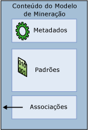

# Modelos de mineração (Analysis Services – Mineração de Dados)
[!INCLUDE[ssas-appliesto-sqlas](../../includes/ssas-appliesto-sqlas.md)]
  Um *modelo de mineração* é criado aplicando-se um algoritmo a dados, mas é mais que um algoritmo ou um contêiner de metadados: é um conjunto de dados, estatísticas e padrões que podem ser aplicados a novos dados para gerar previsões e fazer inferências sobre relações.  
  
 Esta seção explica o que é um modelo de mineração de dados e para que pode ser usado: a arquitetura básica de modelos e estruturas, as propriedades de modelos de mineração de dados e as maneiras de criar e trabalhar com modelos de mineração.  
  
 [Arquitetura do modelo de mineração](#bkmk_mdlArch)  
  
 [Definindo modelos de mineração de dados](#bkmk_mdlDefine)  
  
 [Propriedades do modelo de mineração](#bkmk_mdlProps)  
  
 [Colunas do modelo de mineração](#bkmk_mdlCols)  
  
 [Processando os modelos de mineração](#bkmk_mdlProcess)  
  
 [Exibindo e consultando modelos de mineração](#bkmk_mdlView)  
  
##   Arquitetura do modelo de mineração  
 Um modelo de mineração obtém dados de uma estrutura de mineração e analisa esses dados usando um algoritmo de mineração de dados. A estrutura e o modelo de mineração são objetos separados. A estrutura de mineração armazena informações que definem a fonte de dados. Um modelo de mineração armazena informações derivadas do processamento estatístico de dados, como os padrões encontrados em decorrência da análise.  
  
 Um modelo de mineração fica vazio até que os dados fornecidos pela estrutura de mineração sejam processados e analisados. Depois de processado, o modelo contém metadados, resultados e associações à estrutura de mineração.  
  
   
  
 Os metadados especificam o nome do modelo e o servidor em que ele está armazenado, bem como uma definição do modelo, incluindo as colunas da estrutura de mineração usadas na criação do modelo, as definições dos filtros que foram aplicados durante o processamento do modelo e o algoritmo usado para analisar os dados. Todas estas escolhas, as colunas de dados e seus tipos de dados, filtros e algoritmos, têm uma influência poderosa nos resultados da análise.  
  
 Por exemplo, você pode usar os mesmos dados para criar vários modelos, usando talvez um algoritmo de agrupamento, algoritmo de árvore de decisão e algoritmo de Naïve Bayes. Cada tipo de modelo cria conjuntos diferentes de padrões, conjuntos de itens, regras ou fórmulas, que você pode usar para fazer previsões. Geralmente cada algoritmo analisa os dados de um modo diferente, de modo que o *conteúdo* do modelo resultante também seja organizado em estruturas diferentes. Em um tipo de modelo, os dados e os padrões podem ser agrupados em *clusters*; em outro tipo de modelo, os dados podem ser organizados em árvores, ramificações e as regras que as dividem e definem.  
  
 O modelo também é afetado pelos dados nos quais você treina: mesmo modelos treinados na mesma estrutura de mineração podem render resultados diferentes se você filtrar os dados de maneira diferente ou usar sementes diferentes durante a análise. Porém, os dados reais não são armazenados no model: somente são armazenadas estatísticas resumidas, com os dados reais que residem na estrutura de mineração. Se você criou filtros nos dados quando treinou o modelo, as definições de filtro também serão salvas com o objeto modelo.  
  
 O modelo contém um conjunto de associações, que apontam para os dados armazenados em cache na estrutura de mineração. Se os dados tiverem sido armazenados em cache na estrutura e não forem limpos após o processamento, essas associações lhe permitirão detalhar dos resultados para os casos com suporte para os resultados. No entanto, os dados reais são armazenados no cache de estrutura, não no modelo.  
  
 [Arquitetura do modelo de mineração](#bkmk_mdlArch)  
  
##   Definindo modelos de mineração de dados  
 Você cria um modelo de mineração de dados seguindo essas etapas gerais a seguir:  
  
-   Crie a estrutura de mineração subjacente e inclua as colunas de dados que podem ser necessárias.  
  
-   Selecione o algoritmo que é mais adequado à tarefa analítica.  
  
-   Escolha as colunas da estrutura para usar no modelo e especifique como eles devem ser usados: quais colunas contêm os resultados que você deseja prever, quais colunas são somente para entrada e, assim, sucessivamente.  
  
-   Se desejar, defina parâmetros para ajustar o processamento pelo algoritmo.  
  
-   Popule o modelo com dados *processando* a estrutura e o modelo.  
  
 [!INCLUDE[ssASnoversion](../../includes/ssasnoversion-md.md)] fornece as seguintes ferramentas para ajudá-lo a gerenciar seus modelos de mineração:  
  
-   O Assistente de Mineração de Dados o ajuda a criar uma estrutura e o modelo de mineração relacionado. Esse é o método mais fácil de usar. O assistente cria automaticamente a estrutura de mineração necessária e o ajuda com a definição de configurações importantes.  
  
-   Uma instrução DMX CREATE MODEL pode ser usada para definir um modelo. A estrutura necessária é criada automaticamente como parte do processo; assim, não é possível reutilizar uma estrutura existente com esse método. Use esse método se você já souber exatamente qual modelo deseja criar ou se você quiser criar script para modelos.  
  
-   É possível usar uma instrução DMX ALTER STRUCTURE ADD MODEL para adicionar um novo modelo de mineração a uma estrutura existente. Use esse método se quiser fazer experiências com modelos diferentes que se baseiam no mesmo conjunto de dados.  
  
 Também é possível criar modelos de mineração programaticamente, com o uso de AMO ou XML/A, ou outros clientes, como o Cliente de Mineração de Dados para Excel. Para obter mais informações, consulte os tópicos a seguir:  
  
 [Arquitetura do modelo de mineração](#bkmk_mdlArch)  
  
##   Propriedades do modelo de mineração  
 Cada modelo de mineração tem propriedades que definem o modelo e seus metadados. Eles incluem o nome, a descrição, a data do último processamento do modelo, as permissões no modelo e os filtros nos dados que são usados para treinamento.  
  
 Cada modelo de mineração também tem propriedades derivadas da estrutura de mineração que descrevem as colunas de dados usadas pelo modelo. Se alguma coluna usada pelo modelo for uma tabela aninhada, ela também poderá ter um filtro separado aplicado.  
  
 Além disso, cada modelo de mineração contém duas propriedades especiais: <xref:Microsoft.AnalysisServices.MiningModel.Algorithm%2A> e <xref:Microsoft.AnalysisServices.MiningModelColumn.Usage%2A>.  
  
-   **Propriedade Algorithm** Especifica o algoritmo usado para criar o modelo. Os algoritmos disponíveis dependem do provedor que você está usando. Para obter uma lista dos algoritmos incluídos no [!INCLUDE[ssNoVersion](../../includes/ssnoversion-md.md)] [!INCLUDE[ssASnoversion](../../includes/ssasnoversion-md.md)], consulte [Algoritmos de mineração de dados &#40;Analysis Services – Data Mining&#41;](../../analysis-services/data-mining/data-mining-algorithms-analysis-services-data-mining.md). A propriedade **Algorithm** é aplicada ao modelo de mineração e pode ser definida apenas uma vez para cada modelo. É possível alterar o algoritmo posteriormente, mas algumas colunas do modelo de mineração poderão se tornar inválidas, se não tiverem suporte do algoritmo escolhido. Você deve reprocessar sempre o modelo seguindo uma alteração a essa propriedade.  
  
-   **Propriedade Usage** Define como cada coluna é usada pelo modelo. Você pode definir o uso da coluna como **Input**, **Predict**, **Predict Only**ou **Key**. A propriedade **Usage** é aplicada às colunas dos modelos de mineração individuais e deve ser definida individualmente para cada coluna que esteja incluída em um modelo. Se a estrutura contiver uma coluna que não é usada no modelo, o uso será definido como **Ignore**. Exemplos de dados que você poderia incluir na estrutura de mineração mas não usar em análise poderiam ser nomes de cliente ou endereços de email. Desta maneira, você pode consultá-los posteriormente sem ter que os incluí-los durante a fase de análise.  
  
 Você pode alterar o valor das propriedades do modelo de mineração após criar um modelo de mineração. No entanto, qualquer alteração, até mesmo no nome do modelo de mineração, requer que você o processe novamente. Após processar o modelo novamente, talvez você obtenha resultados diferentes.  
  
 [Arquitetura do modelo de mineração](#bkmk_mdlArch)  
  
##   Colunas do modelo de mineração  
 O modelo de mineração contém colunas de dados que são obtidos de colunas definidas na estrutura de mineração. Você pode escolher quais colunas da estrutura de mineração quer usar no modelo e pode criar cópias das colunas da estrutura de mineração e renomeá-las ou alterar seu uso. Como parte do processo de criação de modelo, você também deve definir o uso da coluna pelo modelo. Isso inclui informações como se a coluna é uma chave, se é usada para previsão, ou se pode ser ignorada pelo algoritmo.  
  
 Enquanto você estiver criando um modelo, em vez de adicionar automaticamente cada coluna de dados disponível, é recomendado revisar os dados cuidadosamente na estrutura e incluir no modelo somente as colunas que fazem sentido para a análise. Por exemplo, você deve evitar incluir várias colunas que repetem os mesmos dados e deve evitar usar colunas que têm a maioria de valores exclusivos. Se você achar que uma coluna não deve ser usada, não será necessário excluí-la da estrutura ou modelo de mineração; em vez disso, basta definir um sinalizador na coluna que especifica se ela deve ser ignorada durante a criação do modelo. Isto significa que a coluna permanecerá na estrutura de mineração, mas não será usada no modelo de mineração. Se você habilitou a análise do modelo para a estrutura de mineração, pode recuperar as informações da coluna posteriormente.  
  
 Dependendo do algoritmo escolhido, algumas colunas na estrutura de mineração talvez sejam incompatíveis com alguns tipos de modelo ou talvez dêem resultados fracos. Por exemplo, se seus dados contiverem dados numéricos contínuos, como uma coluna de Receita, e seu modelo exigir valores discretos, você poderá precisar converter os dados em intervalos discretos ou removê-los do modelo. Em alguns casos, o algoritmo converterá automaticamente ou guardará os dados para você, mas os resultados sempre podem não ser o que você deseja ou espera. Faça cópias adicionais da coluna e experimente modelos diferentes. Você também pode definir sinalizadores nas colunas individuais para indicar onde é necessário realizar processamento especial. Por exemplo, se seus dados contiverem nulls, você poderá usar um sinalizador de modelagem para controlar a manipulação. Se você desejar considerar uma coluna específica como um regressor em um modelo, poderá fazer isso com um sinalizador de modelagem.  
  
 Após criar o modelo, você poderá fazer alterações, como adicionar ou remover colunas, ou alterar o nome do modelo. No entanto, qualquer alteração, até mesmo apenas aos metadados do modelo, requer que você processe o modelo novamente.  
  
 [Arquitetura do modelo de mineração](#bkmk_mdlArch)  
  
##   Processando os modelos de mineração  
 Um modelo de mineração de dados é um objeto vazio até ser processado. Quando você processa um modelo, os dados armazenados em cache pela estrutura são passados por um filtro, caso tenha sido definido no modelo, e analisados pelo algoritmo. O algoritmo computa um conjunto de estatísticas do resumo que descreve os dados, identifica as regras e os padrões nos dados e usa essas regras e padrões para preencher o modelo.  
  
 Depois que foi processado, o modelo de mineração contém uma riqueza de informações sobre os dados e os padrões localizados por meio de análise, incluindo estatísticas, regras e fórmulas de regressão. Você pode usar os visualizadores personalizados para procurar estas informações ou pode criar consultas de mineração de dados para recuperar estas informações e usá-las para análise e apresentação.  
  
 [Arquitetura do modelo de mineração](#bkmk_mdlArch)  
  
##   Exibindo e consultando modelos de mineração  
 Após processar um modelo, você pode explorá-lo usando os visualizadores personalizados fornecidos no [!INCLUDE[ssBIDevStudioFull](../../includes/ssbidevstudiofull-md.md)] e no [!INCLUDE[ssManStudioFull](../../includes/ssmanstudiofull-md.md)]. For (para)  
  
 Também é possível criar consultas referentes ao modelo de mineração para fazer previsões ou recuperar metadados do modelo ou os padrões criados pelo modelo. Para criar consultas, use DMX.  
  
## Conteúdo relacionado  
  
|Tópicos|Links|  
|------------|-----------|  
|Saiba como compilar estruturas de mineração que podem suportar vários modelos de mineração. Conheça o uso de colunas em modelos.|[Colunas da estrutura de mineração](../../analysis-services/data-mining/mining-structure-columns.md)   [Colunas do modelo de mineração](../../analysis-services/data-mining/mining-model-columns.md)   [Conteúdo tipos & #40; mineração de dados & #41;](../../analysis-services/data-mining/content-types-data-mining.md)|  
|Aprenda algoritmos diferentes, e saiba como a escolha de algoritmo afeta o conteúdo do modelo.|[Conteúdo do modelo de mineração &#40;Analysis Services – Data Mining&#41;](../../analysis-services/data-mining/mining-model-content-analysis-services-data-mining.md)   [Algoritmos de mineração de dados & #40; Analysis Services – mineração de dados & #41;](../../analysis-services/data-mining/data-mining-algorithms-analysis-services-data-mining.md)|  
|Saiba como você pode definir propriedades no modelo que afeta sua composição e comportamento.|[Propriedades do modelo de mineração](../../analysis-services/data-mining/mining-model-properties.md)   [Modelagem sinalizadores & #40; mineração de dados & #41;](../../analysis-services/data-mining/modeling-flags-data-mining.md)|  
|Saiba sobre as interfaces programáveis para mineração de dados.|[Desenvolvendo com o Analysis Management Objects & #40; AMO & #41;](../../analysis-services/multidimensional-models/analysis-management-objects/developing-with-analysis-management-objects-amo.md)   [Referência de DMX &#40;extensões DMX&#41;](../../dmx/data-mining-extensions-dmx-reference.md)|  
|Saiba como usar os visualizadores de mineração de dados personalizados no [!INCLUDE[ssASnoversion](../../includes/ssasnoversion-md.md)].|[Visualizadores do modelo de mineração de dados](../../analysis-services/data-mining/data-mining-model-viewers.md)|  
|Exiba exemplos de diferentes tipos de consultas que você pode usar em modelos de mineração de dados.|[Consultas de mineração de dados](../../analysis-services/data-mining/data-mining-queries.md)|  
  
## Tarefas relacionadas  
 Use os links a seguir para obter mais informações específicas sobre como trabalhar com modelos de mineração de dados  
  
|Tarefa|Link|  
|----------|----------|  
|Adicionar e excluir modelos de mineração|[Adicionar um modelo de mineração a uma estrutura de mineração existente](../../analysis-services/data-mining/add-a-mining-model-to-an-existing-mining-structure.md)   [Excluir um modelo de mineração de uma estrutura de mineração](../../analysis-services/data-mining/delete-a-mining-model-from-a-mining-structure.md)|  
|Trabalhar com colunas do modelo de mineração|[Excluir uma coluna de um modelo de mineração](../../analysis-services/data-mining/exclude-a-column-from-a-mining-model.md)   [Criar um Alias para uma coluna de modelo](../../analysis-services/data-mining/create-an-alias-for-a-model-column.md)   [Alterar a diferenciação de uma coluna em um modelo de mineração](../../analysis-services/data-mining/change-the-discretization-of-a-column-in-a-mining-model.md)   [Especificar uma coluna para usar como regressor em um modelo](../../analysis-services/data-mining/specify-a-column-to-use-as-regressor-in-a-model.md)|  
|Alterar propriedades do modelo|[Alterar as propriedades de um modelo de mineração](../../analysis-services/data-mining/change-the-properties-of-a-mining-model.md)   [Aplicar um filtro a um modelo de mineração](../../analysis-services/data-mining/apply-a-filter-to-a-mining-model.md)   [Excluir um filtro de um modelo de mineração](../../analysis-services/data-mining/delete-a-filter-from-a-mining-model.md)   [Habilitar o detalhamento para um modelo de mineração](../../analysis-services/data-mining/enable-drillthrough-for-a-mining-model.md)   [Exibir ou alterar parâmetros do algoritmo](../../analysis-services/data-mining/view-or-change-algorithm-parameters.md)|  
|Copiar. mover ou gerenciar modelos|[Faça uma cópia de um modelo de mineração](../../analysis-services/data-mining/make-a-copy-of-a-mining-model.md)   [Copiar uma exibição de um modelo de mineração](../../analysis-services/data-mining/copy-a-view-of-a-mining-model.md)   [EXPORTAR & #40; DMX & #41;](../../dmx/export-dmx.md)   [IMPORT &#40;DMX&#41;](../../dmx/import-dmx.md)|  
|Popular modelos com dados ou atualizar dados em um modelo|[Processar um modelo de mineração](../../analysis-services/data-mining/process-a-mining-model.md)|  
|Trabalhar com modelos OLAP|[Criar uma dimensão de mineração de dados](../../analysis-services/data-mining/create-a-data-mining-dimension.md)|  
  
## Consulte também  
 [Objetos de banco de dados &#40;Analysis Services – Dados Multidimensionais&#41;](../../analysis-services/multidimensional-models/olap-logical/database-objects-analysis-services-multidimensional-data.md)  
  
  
