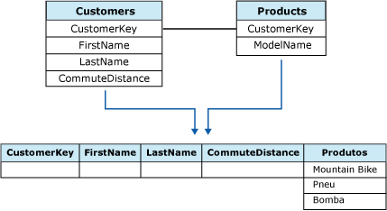

# Tabelas aninhadas (Analysis Services - Mineração de Dados)
[!INCLUDE[ssas-appliesto-sqlas](../../includes/ssas-appliesto-sqlas.md)]Em [!INCLUDE[ssNoVersion](../../includes/ssnoversion-md.md)] [!INCLUDE[ssASnoversion](../../includes/ssasnoversion-md.md)], dados devem ser alimentados com um algoritmo de mineração de dados como uma série de casos contidos em uma tabela de casos. No entanto, nem todos os casos podem ser descritos por uma única linha de dados. Por exemplo, um caso pode ser derivado de duas tabelas: uma contendo informações sobre o cliente e outra as compras do cliente. Um único cliente na tabela de informações de clientes pode ter vários itens na tabela de compras do cliente, o que dificulta a descrição dos dados em uma única linha. [!INCLUDE[ssASnoversion](../../includes/ssasnoversion-md.md)] fornece um método exclusivo para tratar desses casos, com o uso de *tabelas aninhadas*. O conceito de uma tabela aninhada é demonstrado na ilustração a seguir.  
  
   
  
 Neste diagrama, a primeira tabela, que é a tabela pai, contém informações sobre clientes e associa um identificador exclusivo para cada cliente. A segunda tabela, a tabela filho, contém as compras para cada cliente. As compras na tabela filho são relacionadas à tabela pai pelo identificador exclusivo, a coluna **CustomerKey** . A terceira tabela no diagrama mostra as duas tabelas combinadas.  
  
 Uma tabela aninhada é representada na tabela de casos como uma coluna especial com o tipo de dados **TABLE**. Para uma linha de casos específica, esse tipo de coluna contém linhas selecionadas da tabela filho que pertencem à tabela pai.  
  
 Os dados em uma tabela aninhada podem ser usados para previsão ou entrada ou para ambas. Por exemplo, você pode ter duas colunas da tabela aninhadas em um modelo: uma coluna da tabela aninhada pode conter uma lista dos produtos que um cliente comprou, enquanto a outra contém informações sobre os hobbies e interesses do cliente, possivelmente obtidos de uma pesquisa. Neste cenário, você pode usar os hobbies e interesses do cliente como uma entrada para analisar o comportamento de compra e prever prováveis compras.  
  
## Unindo tabelas de casos e tabelas aninhadas  
 Para criar uma tabela aninhada, as duas tabelas de origem devem conter uma relação definida de forma que os itens em uma das tabelas possam ser relacionados ao da outra. No [!INCLUDE[ssBIDevStudioFull](../../includes/ssbidevstudiofull-md.md)], é possível definir essa relação na exibição da fonte de dados.  
  
> [!NOTE]  
>  O campo **CustomerKey** é a chave relacional usada para vincular a tabela de casos e a tabela aninhada na definição da exibição da fonte de dados e para estabelecer a relação das colunas na estrutura de mineração. Porém, normalmente você não deveria usar essa chave relacional em modelos de mineração construídos nessa estrutura. Em geral, o melhor é omitir a coluna da chave relacional do modelo de mineração se ela servir apenas para unir as tabelas e não fornecer informações que sejam interessantes para análise.  
  
 É possível criar tabelas aninhadas programaticamente usando extensões DMX ou Objetos de Gerenciamento de Análise (AMO) ou o Assistente de Mineração de Dados e o Designer de Mineração de Dados no [!INCLUDE[ssBIDevStudioFull](../../includes/ssbidevstudiofull-md.md)].  
  
## Usando colunas da tabela aninhada em um modelo de mineração  
 Na tabela de casos, com frequência, a chave é uma ID de cliente, um nome de produto ou uma data em uma série: dados que identificam de forma exclusiva uma linha da tabela. para obter informações sobre a ferramenta de configuração e recursos adicionais. No entanto, em tabelas aninhadas, geralmente a chave não é a chave relacional (ou chave estrangeira), mas sim a coluna que representa o atributo que você está modelando.  
  
 Por exemplo, se a tabela de casos contiver pedidos e a tabela aninhada os itens do pedido, seria interessante modelar a relação entre os itens armazenados nas tabelas aninhadas de vários pedidos, que são armazenados na tabela de casos. Sendo assim, embora a tabela aninhada **Items** esteja unida à tabela de casos **Orders** pela chave relacional **OrderID**, você não deve usar **OrderID** como chave da tabela aninhada. Em vez disso, selecione a coluna **Items** como chave da tabela aninhada, pois ela contém os dados que você deseja modelar. Na maioria das vezes, é possível ignorar com segurança **OrderID** no modelo de mineração porque a relação entre a tabela de casos e a tabela aninhada já foi estabelecida pela definição da exibição da fonte de dados.  
  
 Ao escolher uma coluna para usar como chave da tabela aninhada, certifique-se de que os valores dessa coluna sejam exclusivos em cada caso. Por exemplo, se a tabela de casos representar clientes e a tabela aninhada representar itens comprados pelo cliente, certifique-se de que nenhum item aparece mais de uma vez por cliente. Se um cliente comprou o mesmo item mais de uma vez, convém criar uma outra exibição com a coluna que agrega a contagem de compras de um mesmo produto.  
  
 O modo escolhido para lidar com valores duplicados em tabelas aninhadas depende do modelo de mineração que você está criando e do problema empresarial que está resolvendo. Em alguns cenários você pode não se preocupar com o número de vezes que um cliente comprou um determinado produto, mas desejar verificar se existe pelo menos uma compra. Em outros cenários, a quantidade e a sequência de compras pode ser muito importante.  
  
 Se a ordem dos itens for importante, pode ser necessária uma coluna adicional que indica a sequência. Ao usar o algoritmo de agrupamento de sequência para criar um modelo, escolha uma coluna *key sequence* adicional para representar a ordem dos itens. A coluna key sequence é um tipo especial de chave aninhada usada somente em modelos de agrupamento de sequência e requer um tipo de dados numérico exclusivo. Por exemplo, inteiros e datas podem ser usados como uma coluna key sequence, mas todos os valores da sequência devem ser exclusivos. Além da coluna key sequence, um modelo de agrupamento de sequência também possui uma chave de tabela aninhada que representa o atributo que está sendo modelado, como os produtos que foram comprados.  
  
### Usando colunas aninhadas não chave de uma tabela aninhada  
 Depois de definir a junção entre a tabela de casos e a tabela aninhada e de ter escolhido uma coluna que contém atributos de interesse e exclusivos para ser usada como chave da tabela aninhada, você pode incluir no modelo outras colunas da tabela aninhada para usar como entrada. Todas as colunas da tabela aninhada podem ser usadas para entrada, previsão e entrada ou somente para previsão.  
  
 Por exemplo, se a tabela aninhada contiver as colunas **Product**, **ProductQuantity**e **ProductPrice**, você poderá escolher **Product** como chave da tabela aninhada, mas adicione **ProductQuantity** à estrutura de mineração para usar como entrada.  
  
## Filtrando os dados da tabela aninhada  
 No [!INCLUDE[ssCurrent](../../includes/sscurrent-md.md)], é possível criar filtros para os dados que são usados para treinar ou testar um modelo de mineração de dados. Um filtro pode ser usado para afetar a composição do modelo, ou para testar o modelo em um subconjunto de casos. Filtros também podem ser se aplicados a tabelas aninhadas. Porém, há limitações na sintaxe que pode ser usada com tabelas aninhadas.  
  
 Frequentemente, ao aplicar um filtro a uma tabela aninhada, você está testando a existência ou não de um atributo. Por exemplo, você pode aplicar um filtro que restringe os casos usados no modelo somente aos casos que têm um valor especificado na tabela aninhada. Ou poderia restringir os casos usados no modelo a clientes que não compraram um determinado item.  
  
 Ao criar filtros em tabelas aninhadas, você também pode usar operadores, como maior ou menor que. Por exemplo, você poderia restringir os casos usados no modelo a clientes que compraram pelo menos n unidades do produto de destino. A habilidade de aplicar filtros a atributos da tabela aninhada proporciona grande flexibilidade para personalizar modelos.  
  
 Para obter mais informações sobre como criar e usar filtros de modelo, consulte [Filtros para modelos de mineração &#40;Analysis Services – Data Mining&#41;](../../analysis-services/data-mining/filters-for-mining-models-analysis-services-data-mining.md).  
  
## Consulte Também  
 [Algoritmos de mineração de dados &#40;Analysis Services – Data Mining&#41;](../../analysis-services/data-mining/data-mining-algorithms-analysis-services-data-mining.md)   
 [Estruturas de Mineração &#40;Analysis Services – Data Mining&#41;](../../analysis-services/data-mining/mining-structures-analysis-services-data-mining.md)  
  
  
