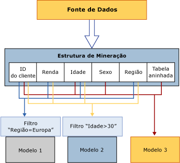

# Processando objetos de mineração de dados
[!INCLUDE[ssas-appliesto-sqlas](../../includes/ssas-appliesto-sqlas.md)]
  Um objeto de mineração de dados é apenas um contêiner vazio até que seja processado. O*processamento* de um modelo de mineração de dados também é chamado de *treinamento*.  
  
 **Processando estruturas de mineração:** uma estrutura de mineração obtém dados de uma fonte de dados externa, conforme definido pelas associações de coluna e pelos metadados de uso, e lê esses dados. Esses dados são totalmente lidos e, depois, analisados para se extrair diversas estatísticas. O Analysis Services armazena uma representação compacta de dados, que é adequada para a análise de algoritmos de mineração de dados, em um cache local. Você pode tanto manter esse cache com excluí-lo depois do processamento de seus modelos. Por padrão, o cache é armazenado. Para obter mais informações, consulte [Processar uma estrutura de mineração](../../analysis-services/data-mining/process-a-mining-structure.md).  
  
 **Processando modelos de mineração:** um modelo de mineração está vazio e contém apenas definições até que seja processado. Para processar um modelo de mineração, a estrutura de mineração na qual ele se baseia deve ter sido processada. O modelo de mineração obtém dados do cache da estrutura de mineração e aplica quaisquer filtros que tenham sido criados no modelo. Em seguida, ele submete o conjunto de dados ao algoritmo para detectar padrões. Depois que o modelo é processado, ele armazena apenas os resultados do processamento, e não os próprios dados. Para obter mais informações, consulte [Processar um modelo de mineração](../../analysis-services/data-mining/process-a-mining-model.md).  
  
 O diagrama a seguir mostra o fluxo de dados quando uma estrutura de mineração é processada e quando um modelo de mineração é processado.  
  
   
  
## Exibindo os resultados do processamento  
 Após o processamento de uma estrutura de mineração, ela conterá uma representação compacta dos dados para uso em análises estatísticas. Se o cache não foi limpo, você poderá acessar os dados dos seguintes modos:  
  
-   Criando uma consulta DMX (Data Mining Extensions) no modelo e detalhando a estrutura. Para obter mais informações, consulte [SELECT FROM &#60;model&#62;.CASES &#40;DMX&#41;](../../dmx/select-from-model-cases-dmx.md).  
  
-   Procurando um modelo com base na estrutura e usando uma das opções da interface do usuário para detalhar os casos na estrutura. Para obter mais informações, consulte [Visualizadores de Modelo de Mineração de Dados](../../analysis-services/data-mining/data-mining-model-viewers.md)ou [Detalhar dados de caso com base em um modelo de mineração](../../analysis-services/data-mining/drill-through-to-case-data-from-a-mining-model.md).  
  
-   Criando uma consulta DMX nos casos da estrutura. Para obter mais informações, consulte [SELECT FROM &#60;structure&#62;.CASES](../../dmx/select-from-structure-cases.md).  
  
 Após o processamento de um modelo de mineração, ele contém apenas os padrões derivados da análise e os mapeamento dos resultados do modelo com relação aos dados de treinamento armazenados em cache. Você poderá procurar ou consultar os resultados do modelo, chamados de *conteúdo do modelo*, ou consultar os casos da estrutura e do modelo se eles tiverem sido armazenados em cache.  
  
 O conteúdo de cada modelo de mineração depende do algoritmo que foi usado para criá-lo. Por exemplo, se você tiver um modelo de clustering e um modelo de árvores de decisão, o conteúdo deles será muito diferente, mesmo que tenham usado exatamente os mesmos dados. Para obter mais informações, consulte [Conteúdo do modelo de mineração &#40;Analysis Services – Mineração de dados&#41;](../../analysis-services/data-mining/mining-model-content-analysis-services-data-mining.md).  
  
## Requisitos de processamento  
 Os requisitos de processamento variam de acordo com a base dos modelos de mineração: apenas dados relacionais ou uma fonte de dados multidimensional.  
  
 Na fonte de dados relacional, o processamento exige apenas a criação de dados de treinamento e a execução de algoritmos de mineração nesses dados. Entretanto, modelos de mineração baseados em objetos OLAP, como dimensões e medidas, exigem que os dados subjacentes estejam em um estado processado. Isso pode exigir que os objetos multidimensionais sejam processados para popular o modelo de mineração.  
  
 Para obter mais informações, consulte [Requisitos e considerações sobre processamento &#40;Mineração de dados&#41;](../../analysis-services/data-mining/processing-requirements-and-considerations-data-mining.md).  
  
## Consulte também  
 [Consultas de detalhamento & #40; mineração de dados & #41;](../../analysis-services/data-mining/drillthrough-queries-data-mining.md)   
 [Estruturas de mineração & #40; Analysis Services – mineração de dados & #41;](../../analysis-services/data-mining/mining-structures-analysis-services-data-mining.md)   
 [Modelos de mineração & #40; Analysis Services – mineração de dados & #41;](../../analysis-services/data-mining/mining-models-analysis-services-data-mining.md)   
 [Arquitetura lógica & #40; Analysis Services – mineração de dados & #41;](../../analysis-services/data-mining/logical-architecture-analysis-services-data-mining.md)  
  
  
