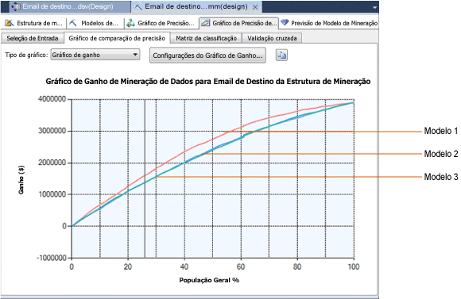

# Gráfico de ganho (Analysis Services - Mineração de dados)
[!INCLUDE[ssas-appliesto-sqlas](../../includes/ssas-appliesto-sqlas.md)]Um gráfico de ganho exibe a rentabilidade estimada associada com o uso de um modelo de mineração. Por exemplo, suponhamos que seu modelo preveja quais clientes a empresa deve contatar em um cenário comercial. Nesse caso, você adicionaria às informações de gráfico de ganho sobre o custo da condução de uma campanha de mala direta. Em seguida, no gráfico completo, você pode consultar o ganho estimado se os clientes são destinados corretamente, em relação a clientes contatados aleatoriamente.  
  
## Criar um gráfico de ganho  
 Um gráfico de lucro é semelhante a um gráfico de comparação de precisão. Você inicia criando um gráfico de comparação de precisão e, depois, adiciona as informações de custo e de lucro.  
  
 Para criar um gráfico de ganho, você precisa ter um modelo existente.  
  
 Para este exemplo, usamos o modelo de árvore de decisão Mala Direta. O modelo identifica os clientes que provavelmente comprarão uma bicicleta. Você pode aplicar o **Gráfico de Ganho** para determinar a quantos de seus clientes deve se dirigir para maximizar o ganho.  
  
 Se você não tiver o modelo de exemplo, poderá criá-lo usando o [Tutorial de mineração de dados básico](http://msdn.microsoft.com/library/6602edb6-d160-43fb-83c8-9df5dddfeb9c).  
  
1.  Abra o criador de gráfico de precisão de mineração.  
  
    -   No SQL Server Management Studio, clique com o botão direito do mouse no modelo e selecione **Exibir Gráfico de Comparação de Precisão**.  
  
    -   Em SQL Server Data Tools, abra o projeto em que você criou o modelo, e clique na guia **Gráfico de Precisão de Mineração** .  
  
2.  Na guia **Seleção de Entrada** , selecione o modelo e escolha o valor do atributo previsível.  
  
     Para este cenário específico, você está interessado apenas na rentabilidade de prever com precisão um valor: [Bike Buyer] =1.  
  
     No entanto, há outros cenários nos quais você também está interessado em prever valores falsos corretamente. Por exemplo, o custo de um falso positivo em um teste de diagnóstico médico pode ser significativo e precisa ser considerado na rentabilidade da previsão, como ocorre com o custo de falsos negativos. Nesses cenários, você mediria todos os resultados.  
  
3.  Selecione um conjunto de dados para teste. Neste exemplo, selecione o conjunto de dados para teste.  
  
4.  Agora clique na guia **Gráfico de Comparação de Precisão** .  
  
     Um gráfico de comparação de precisão é gerado automaticamente.  
  
5.  Para alterar isso para um gráfico de ganho, selecione **Gráfico de Ganho** na lista **Tipo de gráfico** .  
  
6.  Assim que você escolher o gráfico de ganho como o tipo de gráfico, a caixa de diálogo **Configuração do Gráfico de Ganho** será aberta automaticamente.  
  
     Esta caixa de diálogo ajuda a especificar os custos e os benefícios associados a uma campanha de mala direta. Para o gráfico mostrado nestes exemplos, nós usamos os valores a seguir:  
  
    |Configuração|Value|Comentários|  
    |-------------|-----------|--------------|  
    |**População**|20,000|Defina o valor para a população de destino total   Seu banco de dados pode conter muitos clientes, mas, para economizar em despesas de mala direta, você precisa se dirigir apenas aos 20.000 clientes com maior probabilidade de resposta. Você pode obter essa lista executando uma consulta de previsão e classificando pela saída de probabilidade pelo modelo previsível.|  
    |**Custo fixo**|500|Insira o custo único da criação de uma campanha de mala direta para 20.000 pessoas. Isso pode incluir a impressão, ou o custo da criação de uma campanha de email.|  
    |**Custo individual**|3|Insira o custo individual da campanha de mala direta.   Esse valor será multiplicado por um número igual ou inferior a 20.000, dependendo de quantos clientes o modelo prevê como bons clientes potenciais.|  
    |**Receita por indivíduo**|400|Insira um valor que representa a quantidade de lucro ou receita que pode ser esperada de um resultado com êxito. Nesse caso, vamos supor que a mala direta de um catálogo resulte na compra de acessórios ou de bicicletas com o valor médio de $400.   Essa quantia será usada para projetar o lucro total associado aos casos de alta probabilidade.|  
  
7.  Após definir os parâmetros necessários, clique em **OK**.  
  
8.  O gráfico é atualizado para mostrar a curva de lucro.  
  
## Entendendo o gráfico de ganho  
 O diagrama a seguir mostra o gráfico que foi baseado nestes parâmetros. O eixo Y do gráfico representa o ganho, enquanto o eixo X representa a porcentagem dos clientes que foram contatados pela campanha de mala direta.  
  
 Como vimos aqui, você pode usar um gráfico de ganho para comparar vários modelos, contanto que todos prevejam o mesmo atributo discreto.  
  
   
  
 Observe a linha vertical cinza no gráfico. Quando você clicar na linha e arrastá-la, a exibição Dica de Ferramenta exibirá a porcentagem da população de destino que é incluída na curva nesse ponto.  
  
 A **Legenda de Mineração** também é atualizada quando você arrasta a linha, visando refletir o valor percentual, a pontuação de ganho e a probabilidade prevista que associada ao percentual da população na linha vertical cinza.  
  
 Por exemplo, se estiver usando esse modelo para decidir a quem deve enviar o material promocional, você poderá decidir dirigir-se a 25% da população, com base nas probabilidades de previsão. No entanto, a área na curva de lucro do gráfico é maior entre 40% e 70%, indicando que o envio de mala direta a mais pessoas poderá maximizar o retorno, mesmo que uma porcentagem total menor responda.  
  
## Salvando gráficos  
 Quando você cria um gráfico de precisão ou um gráfico de ganho, nenhum objeto é criado no servidor. Em vez disso, as consultas são executadas em um modelo existente e os resultados são renderizados no visualizador. Se for necessário salvar os resultados, você deverá copiar o gráfico ou os resultados no Excel ou em outro arquivo.  
  
## Conteúdo relacionado  
 Os tópicos a seguir contêm mais informações sobre como você pode criar e usar gráficos de precisão.  
  
|Tópicos|Links|  
|------------|-----------|  
|Fornece um passo a passo sobre como criar um gráfico de comparação de precisão para o modelo Mala Direta Dirigida.|[Tutorial de mineração de dados básico](http://msdn.microsoft.com/library/6602edb6-d160-43fb-83c8-9df5dddfeb9c)   [Testando a precisão com gráficos de comparação de precisão &#40;Tutorial de mineração de dados básica&#41;](http://msdn.microsoft.com/library/822d414b-4a39-473f-80c3-53476e30655a)|  
|Explica os tipos de gráficos relacionados.|[Gráfico de comparação de precisão &#40;Analysis Services – Mineração de dados&#41;](../../analysis-services/data-mining/lift-chart-analysis-services-data-mining.md)   [Matriz de classificação &#40;Analysis Services – Mineração de dados&#41;](../../analysis-services/data-mining/classification-matrix-analysis-services-data-mining.md)   [Dispersão &#40;Analysis Services – Mineração de dados&#41;](../../analysis-services/data-mining/scatter-plot-analysis-services-data-mining.md)|  
|Descreve validação cruzada para modelos de mineração e estruturas de mineração.|[Validação cruzada &#40;Analysis Services – Data Mining&#41;](../../analysis-services/data-mining/cross-validation-analysis-services-data-mining.md)|  
|Descreve as etapas para criar gráficos de comparação de precisão e outros gráficos de exatidão.|[Tarefas de teste e validação e instruções &#40;Mineração de dados&#41;](../../analysis-services/data-mining/testing-and-validation-tasks-and-how-tos-data-mining.md)|  
  
## Consulte também  
 [Teste e validação &#40;Mineração de dados&#41;](../../analysis-services/data-mining/testing-and-validation-data-mining.md)   
 [Testando a precisão com gráficos de comparação de precisão &#40;Tutorial de mineração de dados básica&#41;](http://msdn.microsoft.com/library/822d414b-4a39-473f-80c3-53476e30655a)  
  
  
