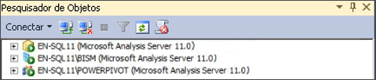

# Determina o Modo de Servidor de uma instância do Analysis Services.
[!INCLUDE[ssas-appliesto-sqlas](../../includes/ssas-appliesto-sqlas.md)]
  O Analysis Services pode ser instalado em um dos três modos de servidor: Multidimensional e Mineração de Dados (padrão), [!INCLUDE[ssGemini](../../includes/ssgemini-md.md)] para SharePoint e Tabular. O modo de servidor de uma instância do Analysis Services é determinado durante a instalação quando você escolhe opções para instalar o servidor.  
  
 O modo de servidor determina o tipo de solução que você cria e implanta. Se você não instalou o software de servidor e deseja saber em qual modo o servidor foi instalado, pode usar as informações neste tópico para determinar o modo. Para obter mais informações sobre disponibilidade de recursos em um modo específico, consulte [comparando tabulares e multidimensionais soluções ](../../analysis-services/comparing-tabular-and-multidimensional-solutions-ssas.md).  
  
 Se você não desejar usar o modo de servidor que você instalou, deverá desinstalar e reinstalar o software, escolhendo o modo que você prefere. Como alternativa, você pode instalar uma instância adicional do Analysis Services no mesmo computador de modo que tenha várias instâncias executando modos diferentes.  
  
## Ícones de servidor no Pesquisador de Objetos  
 O modo mais fácil de determinar o modo de servidor é conectar-se ao servidor no SQL Server Management Studio e observar o ícone ao lado do nome de servidor no Pesquisador de Objetos. A ilustração a seguir mostra três instâncias do Analysis Services implantadas nos modos Multidimensional, Tabular e [!INCLUDE[ssGemini](../../includes/ssgemini-md.md)] :  
  
   
  
## Exibindo uma propriedade DeploymentMode no arquivo MSMDSRV.INI  
 Alternativamente, você pode verificar a propriedade **DeploymentMode** no arquivo msmdsrv.ini que é incluído em todas as instâncias do Analysis Services. O valor desta propriedade identifica o modo do servidor. Os valores válidos são 0 (Multidimensional), 1 (SharePoint) ou 2 (Tabular). Você deve ser um administrador [!INCLUDE[ssASnoversion](../../includes/ssasnoversion-md.md)] (ou seja, um membro da função de Servidor) para abrir o arquivo msmdsrv.ini. Esse arquivo contém o XML estruturado. Você pode usar o Bloco de Notas ou outro editor de texto para exibir o arquivo.  
  
> [!CAUTION]  
>  Não altere o valor da propriedade **DeploymentMode** . Não há suporte para alterar a propriedade manualmente depois que o servidor está instalado.  
  
## Sobre a propriedade DeploymentMode  
 A propriedade**DeploymentMode** determina o contexto operacional de uma instância de servidor do Analysis Services. Esta propriedade é referenciada como 'modo de servidor' em caixas de diálogo, mensagens e documentação. Esta propriedade é inicializada através da Instalação baseada em como você instala o Analysis Services. Esta propriedade deve ser considerada apenas interna, sempre usando o valor especificado pela Instalação.  
  
 Os valores válidos para essa propriedade incluem os seguintes:  
  
|Value|Descrição|  
|-----------|-----------------|  
|0|Este é o valor padrão. Ele especifica o modo multidimensional, usado para atender bancos de dados multidimensionais que usam o armazenamento MOLAP, HOLAP e ROLAP, bem como modelos de mineração de dados.|  
|1|Especifica instâncias do Analysis Services que foram instaladas como parte de um [!INCLUDE[ssGemini](../../includes/ssgemini-md.md)] para implantação do SharePoint. Não altere a propriedade de modo de implantação da instância do Analysis Services que faz parte de uma instalação do [!INCLUDE[ssGemini](../../includes/ssgemini-md.md)] para SharePoint. [!INCLUDE[ssGemini](../../includes/ssgemini-md.md)] não serão mais executados no servidor se você alterar o modo.|  
|2|Especifica o modo de Tabela usado para hospedar bancos de dados modelo de tabela que usam o armazenamento na memória ou o armazenamento DirectQuery.|  
  
 Cada modo é exclusivo do outro. Um servidor que é configurado para o modo de tabela não pode executar bancos de dados do Analysis Services que contêm cubos e dimensões. Se o hardware subjacente der suporte a isso, você poderá instalar várias instâncias do Analysis Services no mesmo computador e configurar cada instância para usar um modo de implantação diferente. Lembre-se de que o Analysis Services é um aplicativo que utiliza vários recursos. A implantação de várias instâncias no mesmo sistema é recomendada somente para servidores high-end.  
  
## Consulte também  
 [Instalar o Analysis Services](../../analysis-services/instances/install-windows/install-analysis-services.md)   
 [Instalar o Analysis Services em modo multidimensional e de mineração de dados](http://msdn.microsoft.com/library/8a1f33e8-2bd6-4fb8-bd46-c86f2a067f60)   
 [Instalação do Power Pivot para SharePoint 2010](http://msdn.microsoft.com/en-us/8d47dde7-c941-4280-a934-e2fe3f9a938f)   
 [Conecte-se ao Analysis Services](../../analysis-services/instances/connect-to-analysis-services.md)   
 [Soluções de modelo tabular](../../analysis-services/tabular-models/tabular-models-ssas.md)   
 [Soluções de modelo multidimensional ](../../analysis-services/multidimensional-models/multidimensional-model-solutions-ssas.md)   
 [Modelos de mineração &#40; Analysis Services – mineração de dados &#41;](../../analysis-services/data-mining/mining-models-analysis-services-data-mining.md)  
  
  
