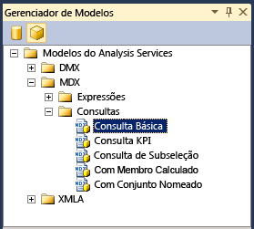

# <a name="use-analysis-services-templates-in-sql-server-management-studio"></a>Usar modelos do Analysis Services no SQL Server Management Studio
[!INCLUDE[ssas-appliesto-sqlas-all-aas](../../includes/ssas-appliesto-sqlas-all-aas.md)]

  [!INCLUDE[ssManStudioFull](../../includes/ssmanstudiofull-md.md)] fornece um conjunto de modelos para ajudá-lo a criar rapidamente scripts XMLA, consultas DMX ou MDX, criar KPIs em um cubo ou modelo de tabela, backup de script e operações de restauração e executar muitas outras tarefas. Os modelos estão localizados no **Gerenciador de Modelos** no [!INCLUDE[ssManStudio](../../includes/ssmanstudio-md.md)].  
  
 Este tópico inclui uma lista de modelos multidimensionais e de tabela, e fornece exemplos de como criar uma consulta MDX e instrução XMLA usando o Gerenciador de metadados e o Gerenciador de Modelos.  
  
 Este tópico não abrange modelos DMX. Para ver exemplos de como criar consultas de mineração de dados usando os modelos, consulte [Criar uma consulta DMX no SQL Server Management Studio](../../analysis-services/data-mining/create-a-dmx-query-in-sql-server-management-studio.md) ou [Criar uma consulta de previsão Singleton de um modelo](../../analysis-services/data-mining/create-a-singleton-prediction-query-from-a-template.md).  
  
##  <a name="bkmk_usingTE"></a> Abrir um modelo do Analysis Services  
 Todos os modelos de consultas de mecanismo de banco de dados e consultas e comandos do Analysis Services estão disponíveis no Gerenciador de Modelos.  
  
 Para abrir o **Gerenciador de Modelos**, selecione-o no menu **Exibir** . Em seguida, clique no ícone de cubo para visualizar uma lista de modelos disponíveis para o [!INCLUDE[ssASnoversion](../../includes/ssasnoversion-md.md)].  
  
   
  
 Para abrir um modelo, clique com o botão direito do mouse no nome do modelo e selecione **Abrir**ou arraste o modelo para uma janela de consulta que já esteja aberta. Depois de abrir a janela de consulta, você pode usar comandos na barra de ferramentas ou menu Consulta para ajudá-lo a criar instruções:  
  
-   Para verificar a sintaxe de uma consulta, clique em **Analisar**.  
  
-   Para executar uma consulta, clique em **Executar**.  
  
     Para parar uma consulta que está sendo executada, clique em **Cancelar Execução de Consulta**.  
  
-   Visualize os resultados de uma consulta na guia **Resultados** na parte inferior da tela.  
  
     Alterne para a guia **Mensagens** para visualizar o número de registros retornados, os erros, as instruções de consulta e qualquer outra mensagem associada à execução da consulta. Por exemplo, se você executar uma instrução DAX em um modelo em execução no modo Consulta Direta, poderá visualizar a instrução Transact-SQL que é gerada pelo mecanismo analítico na memória xVelocity (VertiPaq).  
  
##  <a name="BKMK_Building_Queries"></a> Compilar e executar uma consulta MDX em um modelo de tabela usando um modelo  
 Este exemplo mostra como criar uma consulta MDX no SQL Server Management Studio, usando um banco de dados modelo de tabela como a fonte de dados. Para repetir este exemplo em seu computador, você pode [baixar o projeto de exemplo de modelo de tabela Adventureworks](http://go.microsoft.com/fwlink/?LinkId=231183).  
  
> [!WARNING]  
>  Você não pode usar consultas MDX em modelos de tabela que foram implantados no modo Consulta Direta. No entanto, você pode enviar consultas equivalentes usando as consultas de tabela DAX com o comando EVALUATE. Para saber mais, confira [Parâmetros de consulta DAX](/dax/dax-queries#parameters-in-dax-queries).  
  
#### <a name="create-an-mdx-query-from-a-template"></a>Criar uma consulta MDX com base em um modelo  
  
1.  No [!INCLUDE[ssManStudioFull](../../includes/ssmanstudiofull-md.md)], abra a instância que contém o modelo de tabela que você deseja consultar. Clique com o botão direito do mouse no ícone de banco de dados selecione **Nova Consulta**e **MDX**.  
  
2.  No Gerenciador de Modelos, em Modelos do Analysis Services, abra **MDX**e **Consultas**. Arraste a **Consulta Básica** para a janela de consulta.  
  
3.  Usando o **Gerenciador de Metadados**, arraste os seguintes campos e medidas para o modelo de consulta:  
  
    1.  Substitua \<row_axis, mdx_set > com **[Product Category]. [ Product Category Name]** .  
  
    2.  Substitua \<column_axis, mdx_set > com **[Data]. [ Ano civil]. [Ano civil]** .  
  
    3.  Substitua \<from_clause, mdx_name > com **[Vendas pela Internet]** .  
  
    4.  Substitua \<where_clause, mdx_set > com **[Medidas]. [ Internet Total Sales]** .  
  
4.  Você pode executar a consulta no estado em que ela se encontra, mas provavelmente vai querer fazer algumas alterações, como adicionar uma função para retornar membros específicos. Por exemplo, digite **.members** depois de **[Product Category].[Product Category Name]** . Para saber mais, confira [Using Member Expressions](../../mdx/using-member-expressions.md).  
  
##  <a name="bkmk_backup"></a> Criar um script XMLA com base em um modelo  
 Os modelos de comando XMLA fornecidos no Gerenciador de Modelos podem ser usados para criar scripts para monitoramento e atualização de objetos do [!INCLUDE[ssASnoversion](../../includes/ssasnoversion-md.md)] , quer a instância esteja no modo multidimensional e de mineração de dados ou no modo de tabela. Os modelos **XMLA** incluem exemplos dos seguintes tipos de scripts:  
  
-   Operações de backup, restauração e sincronização  
  
-   Cancelar o processo ou comando especificado  
  
-   Processar um objeto  
  
-   Descobrir conjuntos de linhas de esquema  
  
-   Monitorar o status do servidor, incluindo trabalhos, conexões, transações, memória e contadores de desempenho  
  
#### <a name="create-a-backup-command-script-from-a-template"></a>Criar um script de comando de backup com base em um modelo  
  
1.  No [!INCLUDE[ssManStudioFull](../../includes/ssmanstudiofull-md.md)], abra a instância que contém o banco de dados que você deseja consultar. Clique com o botão direito do mouse no ícone de banco de dados, selecione **Nova Consulta**e selecione **XMLA**.  
  
    > [!WARNING]  
    >  Você não pode definir o contexto de uma consulta XMLA alterando a lista de restrições ou especificando um banco de dados na caixa de diálogo de conexão. Você deve abrir a janela de consulta XMLA a partir do banco de dados que deseja consultar.  
  
2.  Arraste o modelo **Backup** para a janela de consulta vazia.  
  
3.  Clique duas vezes no texto dentro de \<DatabaseID > elemento.  
  
4.  No Gerenciador de Objetos, selecione o banco de dados cujo backup você deseja realizar e arraste e solte o banco de dados entre os colchetes do elemento DatabaseID.  
  
5.  Clique duas vezes no texto dentro de \<arquivo > elemento. Digite o nome do arquivo de backup, incluindo a extensão .abf. Especifique o caminho de arquivo completo se você não estiver usando o local de backup padrão. Para obter mais informações, consulte [Fazendo backup, restaurando e sincronizando bancos de dados &#40;XMLA&#41;](../../analysis-services/multidimensional-models-scripting-language-assl-xmla/backing-up-restoring-and-synchronizing-databases-xmla.md).  
  
##  <a name="bkmk_schemarowset"></a> Gerar uma consulta de conjunto de linhas de esquema usando um modelo XMLA  
 O **Gerenciador de Modelos** contém apenas um modelo para consultas de conjunto de linhas de esquema. Para usar esse modelo, você deve estar familiarizado com os requisitos do conjunto de linhas de esquema individual que deseja usar, incluindo qualquer elemento necessário e as colunas que podem ser usadas como restrições. Para obter mais informações, consulte [Conjuntos de linhas de esquema do Analysis Services](https://docs.microsoft.com/bi-reference/schema-rowsets/analysis-services-schema-rowsets).  
  
 Observe que muitos dos conjuntos de linha de esquema também foram expostos como DMVs (Exibições de Gerenciamento Dinâmico) por questões de simplicidade. Ao usar a DMV correspondente, você pode consultar o conjunto de linhas de esquema usando uma sintaxe semelhante à do Transact-SQL. Por exemplo, as consultas a seguir retornam os mesmos resultados, mas um está em formato XML e um está em um formato de tabela. Para obter mais informações sobre os DMVs, consulte [Usar DMVs &#40;Exibições de Gerenciamento Dinâmico&#41; para monitorar o Analysis Services](../../analysis-services/instances/use-dynamic-management-views-dmvs-to-monitor-analysis-services.md).  
  
 A DMV que retorna uma lista de todos os conjuntos de linhas de esquema disponível como DMVs:  
  
```  
SELECT * FROM $system.DISCOVER_SCHEMA_ROWSETS  
```  
  
 O comando XMLA que retorna a lista de conjuntos de linhas de esquema disponíveis:  
  
```  
<Discover xmlns="urn:schemas-microsoft-com:xml-analysis">  
<RequestType>DISCOVER_SCHEMA_ROWSETS</RequestType>  
    <Restrictions>  
<RestrictionList>  
</RestrictionList>  
</Restrictions>  
    <Properties>  
<PropertyList>  
   </PropertyList>  
</Properties>  
</Discover>  
```  
  
#### <a name="get-a-list-of-data-sources-for-a-tabular-model-using-a-schema-rowset-query"></a>Obter uma lista de fontes de dados para um modelo de tabela usando uma consulta de conjunto de linhas de esquema  
  
1.  No [!INCLUDE[ssManStudioFull](../../includes/ssmanstudiofull-md.md)], abra a instância que contém o banco de dados que você deseja consultar. Clique com o botão direito do mouse no ícone de banco de dados, selecione **Nova Consulta**e selecione **XMLA**.  
  
    > [!WARNING]  
    >  Você não pode definir o contexto de uma consulta XMLA alterando a lista de restrições ou especificando um banco de dados na caixa de diálogo de conexão. Você deve abrir a janela de consulta XMLA a partir do banco de dados que deseja consultar.  
  
2.  Abra o **Gerenciador de Modelos**e arraste o modelo **Descobrir Conjuntos de Linhas de Esquema**para a janela de consulta em branco.  
  
3.  No modelo, substitua os [elemento RequestType &#40;XMLA&#41; ](https://docs.microsoft.com/bi-reference/xmla/xml-elements-properties/requesttype-element-xmla) elemento com o seguinte texto: `<RequestType>MDSCHEMA_INPUT_DATASOURCES</RequestType>`  
  
4.  Clique em **Executar**.  
  
     Resultados esperados:  
  
    ```  
    <CATALOG_NAME>AW Internet Sales Tabular Model_ 24715b71-ea74-4828-aefc-d4c12c15db64</CATALOG_NAME>   
    <DATASOURCE_NAME>SqlServer localhost AdventureWorksDW2012</DATASOURCE_NAME>   
    <DATASOURCE_TYPE>Relational</DATASOURCE_TYPE>   
    <CREATED_ON>2011-10-12T20:27:05.196667</CREATED_ON>   
    <LAST_SCHEMA_UPDATE>2011-10-12T20:27:05.196667</LAST_SCHEMA_UPDATE>   
    <DESCRIPTION />   
    <TIMEOUT>0</TIMEOUT>   
    <DBMS_NAME>Microsoft SQL Server</DBMS_NAME>   
    <DBMS_VERSION>11.00.1724</DBMS_VERSION>  
  
    ```  
  
##  <a name="bkmk_Ref"></a> Referência de modelo do Analysis Services  
 Os seguintes modelos são fornecidos para funcionar com bancos de dados do Analysis Services e os objetos no banco de dados, incluindo estruturas e modelos de mineração, cubos e modelos de tabela:  
  
|Category|Modelo de item|Descrição|  
|--------------|-------------------|-----------------|  
|DMX\Conteúdo do modelo|Consulta de conteúdo|Demonstra como usar o DMX SELECT FROM  *\<modelo >* . Instrução de conteúdo para recuperar o conteúdo do conjunto de linhas de esquema do modelo de mineração para um modelo de mineração especificado.|  
||Valores de Coluna Contínuos|Demonstra como usar o DMX SELECT DISTINCT FROM  *\<modelo >* instrução com o DMX **RangeMin** e **RangeMax** funções para recuperar um conjunto de valores de um determinado intervalo de colunas contínuas em um modelo de mineração especificado.|  
||Valores de Coluna Discretos|Demonstra como usar o DMX SELECT DISTINCT FROM  *\<modelo >* instrução recuperar um conjunto completo de valores de colunas discretas em um modelo de mineração especificado.|  
||Consulta de Detalhamento|Demonstra como usar a instrução DMX SELECT * FROM Model.CASES com a função DMX IsInNode para executar uma consulta de análise.|  
||Atributos de Modelo|Demonstra como usar a função de DMX System.GetModelAttributes para retornar uma lista de atributos usados por um modelo.|  
||Conteúdo PMML|Demonstra como usar o DMX SELECT \* FROM  *\<modelo >* . Instrução de PMML para recuperar a representação de marcação idioma PMML (Predictive Model) do modelo de mineração, para os algoritmos que suportam essa funcionalidade.|  
|DMX\Gerenciamento de Modelos|Adicionar Modelo|Demonstra como usar a instrução DMX ALTER MINING MODEL STRUCTURE para adicionar um modelo de mineração.|  
||Limpar Modelo|Demonstra como usar a instrução DMX DELETE * FROM MINING MODEL para excluir o conteúdo do modelo de mineração especificado.|  
||Limpar Casos da Estrutura|Demonstra como usar a instrução DMX DELETE FROM MINING STRUCTURE para limpar os casos de estrutura do modelo de mineração.|  
||Limpar Estrutura|Demonstra como usar a instrução DMX DELETE FROM MINING STRUCTURE para limpar uma estrutura do modelo de mineração.|  
||Criar de PMML|Demonstra como usar a instrução DMX CREATE MINING MODEL com a cláusula FROM PMML para criar um modelo de mineração a partir de uma representação PMML.|  
||Criar Estrutura Aninhada|Demonstra como usar a instrução DMX CREATE MINING STRUCTURE com a lista de definições de coluna aninhada para criar um modelo de mineração com colunas aninhadas.|  
||Criar Estrutura|Demonstra como usar a instrução do DMX CREATE MINING STRUCTURE para criar um modelo de mineração.|  
||Descartar Modelo|Demonstra como usar a instrução DMX DROP MINING MODEL para excluir um modelo de mineração existente.|  
||Descartar Estrutura|Demonstra como usar a instrução DMX DROP MINING STRUCTURE para excluir uma estrutura de mineração existente.|  
||Exportar Modelo|Demonstra como usar a instrução DMX EXPORT MINING MODEL usando as cláusulas WITH DEPENDENCIES e PASSWORD para exportar para um arquivo um modelo de mineração, incluindo a fonte de dados e a exibição da fonte de dados das quais o modelo de mineração depende.|  
||Exportar Estrutura|Demonstra como usar a instrução DMX EXPORT MINING STRUCTURE usando a cláusula WITH DEPENDENCIES para exportar para um arquivo uma estrutura de mineração, incluindo todos os modelos de mineração contidos na estrutura de mineração, a fonte de dados e a exibição da fonte de dados das quais a estrutura de mineração depende.|  
||Importar|Demonstra como usar a instrução DMX IMPORT FROM usando a cláusula WITH PASSWORD para executar uma importação.|  
||Renomear Modelo|Demonstra como usar a instrução DMX RENAME MINING MODEL para renomear um modelo de mineração existente.|  
||Renomear Estrutura|Demonstra como usar a instrução DMX RENAME MINING STRUCTURE para renomear uma estrutura de mineração existente.|  
||Modelo de Treinamento|Demonstra como usar a instrução DMX INSERT INTO MINING MODEL para treinar um modelo de mineração em uma estrutura previamente treinada.|  
||Treinar Estrutura Aninhada|Demonstra como combinar a instrução DMX INSERT INTO MINING STRUCTURE com a consulta de fonte de dados SHAPE para treinar o modelo de mineração que contém colunas aninhadas com dados que contêm tabelas aninhadas, recuperadas usando-se uma consulta, a partir da fonte de dados existente.|  
||Estrutura de Treinamento|Demonstra como combinar a instrução DMX INSERT INTO MINING STRUCTURE com a consulta de fonte de dados OPENQUERY para treinar um modelo de mineração.|  
|DMX\Consultas de Previsão|Previsão Básica|Demonstra como combinar um DMX SELECT FROM  *\<modelo >* instrução PREDICTION JOIN com a consulta de dados de origem OPENQUERY para executar uma consulta de previsão em um modelo de mineração usando dados, recuperados por meio de uma consulta, um fonte de dados existente.|  
||Previsão Aninhada|Demonstra como combinar um DMX SELECT FROM  *\<modelo >* instrução PREDICTION JOIN com as consultas de dados de origem SHAPE e OPENQUERY para executar uma consulta de previsão em um modelo de mineração usando dados que contêm aninhados tabelas, recuperados por meio de uma consulta de fonte de dados existente.|  
||Previsão Singleton Aninhada|Demonstra como usar um DMX SELECT FROM  *\<modelo >* cláusula NATURAL PREDICTION JOIN para executar uma consulta de previsão em um modelo de mineração usando um único valor, especificado explicitamente na consulta de previsão, em uma coluna cujo nome corresponde a uma coluna no modelo de mineração e que contém um conjunto de valores em uma tabela aninhada criada usando uma instrução UNION, cujos nomes também correspondem às colunas aninhadas no modelo de mineração.|  
||Previsão Singleton|Demonstra como usar um DMX SELECT FROM \<modelo > instrução NATURAL PREDICTION JOIN para executar uma consulta de previsão em um modelo de mineração usando um único valor, especificado explicitamente na consulta de previsão, em uma coluna cujo nome corresponde a uma coluna em o modelo de mineração.|  
||Chamada de Procedimento Armazenado|Demonstra como usar a instrução DMX CALL para chamar um procedimento armazenado.|  
|MDX\Expressões|Média Móvel-Fixa|Demonstra como usar as funções MDX **ParallelPeriod** e **CurrentMember** com um conjunto ordenado naturalmente para criar uma medida calculada que fornece uma média móvel de uma medida sobre um número fixo de períodos de tempo contidos em uma hierarquia de dimensão de tempo.|  
||Média Móvel-Variável|Demonstra como usar a instrução MDX **CASE** na função **Avg** para criar uma medida calculada que fornece uma média móvel de uma medida sobre um número variável de períodos de tempo contidos em uma hierarquia de dimensão de tempo.|  
||Períodos até a Data|Demonstra como usar a função MDX **PeriodsToDate** em um membro calculado.|  
||Proporção do Pai|Demonstra como usar a função MDX **Parent** para criar uma medida calculada que representa uma porcentagem proporcional de uma medida para cada filho de um membro pai na hierarquia especificada.|  
||Proporção do Total|Demonstra como usar o membro All para criar uma medida calculada que representa uma porcentagem proporcional de uma medida para cada membro da hierarquia especificada.|  
|MDX\Consultas|Consulta Básica|Demonstra uma instrução MDX SELECT básica a partir da qual você pode construir uma consulta MDX.|  
||Consulta KPI|Demonstra como usar as funções MDX **KPIValue** e **KPIGoal** para recuperar informações sobre o KPI (indicador chave de desempenho) em uma consulta MDX.|  
||Consulta de Subseleção|Demonstra como criar uma instrução MDX SELECT que recupera informações de um subcubo definidas por outra instrução SELECT.|  
||Com Membro Calculado|Demonstra como usar a cláusula WITH na instrução SELECT para definir um membro calculado limitado a uma consulta MDX.|  
||Com Conjunto Nomeado|Demonstra como usar a cláusula MDX WITH em uma instrução SELECT para definir um conjunto nomeado para uma consulta MDX.|  
|XMLA\Gerenciamento|Backup|Demonstra como usar o comando XMLA **Backup** para fazer backup de um banco de dados do [!INCLUDE[ssASnoversion](../../includes/ssasnoversion-md.md)] em arquivo.|  
||Cancelar|Demonstra como usar o comando XMLA **Cancel** para cancelar todas as operações em execução na sessão (para usuários que não são administradores ou administradores de servidor), no banco de dados (para administradores) ou na instância (para administradores de servidor).|  
||Criar banco de dados de partição remota|Demonstra como usar o comando XMLA **Create** com o elemento de banco de dados do [!INCLUDE[ssASnoversion](../../includes/ssasnoversion-md.md)] Scripting Language (ASSL) para criar um banco de dados do [!INCLUDE[ssASnoversion](../../includes/ssasnoversion-md.md)] e uma fonte de dados para armazenar partições remotas.|  
||DELETE|Demonstra como usar o comando XMLA **Delete (excluir)** para excluir um banco de dados do [!INCLUDE[ssASnoversion](../../includes/ssasnoversion-md.md)] existente.|  
||Processar Dimensão|Demonstra como usar o comando XMLA **Batch** combinado com o elemento **Parallel** e o comando **Process** para atualizar os atributos de uma dimensão usando uma operação em lote paralela.|  
||Processar Partição|Demonstra como usar o comando XMLA **Batch** combinado com o elemento **Parallel** e o comando **Process** para processar completamente uma partição usando uma operação em lote paralela.|  
||Restaurar|Demonstra como usar o comando XMLA **Restaurar** comando para restaurar um banco de dados do [!INCLUDE[ssASnoversion](../../includes/ssasnoversion-md.md)] a partir de um arquivo de backup.|  
||Sincronizar|Demonstra como usar o comando XMLA **Sincronizar** para sincronizar outro banco de dados do [!INCLUDE[ssASnoversion](../../includes/ssasnoversion-md.md)] com o banco de dados atual do [!INCLUDE[ssASnoversion](../../includes/ssasnoversion-md.md)] usando a opção SkipMembership na marca SynchronizeSecurity.|  
|XMLA\Conjuntos de linhas do esquema|Descobrir conjuntos de linhas de esquema|Demonstra como usar o método XMLA **Discover** para recuperar o conteúdo do conjunto de linhas de esquema DISCOVER_SCHEMA_ROWSETS.|  
|XMLA\Status do servidor|Conexões|Demonstra como usar o método XMLA **Discover** para recuperar o conteúdo do conjunto de linhas de esquema DISCOVER_CONNECTIONS.|  
||trabalhos|Demonstra como usar o método XMLA **Discover** para recuperar o conteúdo do conjunto de linhas de esquema DISCOVER_JOBS.|  
||Locais|Demonstra como usar o método XMLA **Discover** para recuperar o conteúdo do conjunto de linhas de esquema DISCOVER_LOCATIONS, especificando o caminho dos arquivos de backup da localização.|  
||Locks|Demonstra como usar o método XMLA **Discover** para recuperar o conteúdo do conjunto de linhas de esquema DISCOVER_LOCKS.|  
||Concessão de Memória|Demonstra como usar o método XMLA **Discover** para recuperar o conteúdo do conjunto de linhas de esquema DISCOVER_MEMORYGRANT.|  
||Contadores de desempenho|Demonstra como usar o método XMLA **Discover** para recuperar o conteúdo do conjunto de linhas de esquema DISCOVER_PERFORMANCE_COUNTERS.|  
||Sessões|Demonstra como usar o método XMLA **Discover** para recuperar o conteúdo do conjunto de linhas de esquema DISCOVER_SESSIONS.|  
||Rastreamentos|Demonstra como usar o método XMLA **Discover** para recuperar o conteúdo do conjunto de linhas de esquema DISCOVER_TRACES.|  
||Transações|Demonstra como usar o método XMLA **Discover** para recuperar o conteúdo do conjunto de linhas de esquema DISCOVER_TRANSACTIONS.|  
  
## <a name="see-also"></a>Consulte também  
 [Referência de expressões multidimensionais &#40;MDX&#41;](../../mdx/multidimensional-expressions-mdx-reference.md)   
 [Referência de DMX &#40;extensões DMX&#41;](../../dmx/data-mining-extensions-dmx-reference.md)   
 [Linguagem de script do Analysis Services &#40;ASSL para XMLA&#41;](https://docs.microsoft.com/bi-reference/assl/analysis-services-scripting-language-assl-for-xmla)   
 [Linguagem de script do Analysis Services &#40;ASSL para XMLA&#41;](https://docs.microsoft.com/bi-reference/assl/analysis-services-scripting-language-assl-for-xmla)  
  
  
