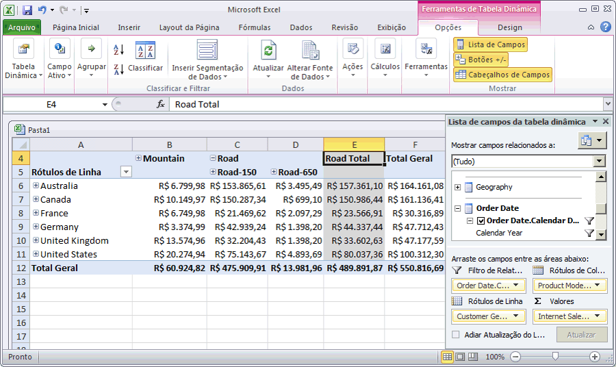

# Lição 3-5-navegando no cubo implantado
Na tarefa a seguir, você navegará no cubo do Tutorial do [!INCLUDE[ssASnoversion](../includes/ssasnoversion-md.md)] . Como nossa análise compara medidas em várias dimensões, você usará uma Tabela Dinâmica do Excel para procurar seus dados. Usar uma Tabela Dinâmica permite colocar informações de cliente, data e produto em eixos diferentes, de forma que você possa ver como as Vendas pela Internet são alteradas quando exibidas por períodos de tempo específicos, demografia de cliente e linhas de produto.  
  
### Para navegar no cubo implantado  
  
1.  Para mudar para o Designer de Cubo no [!INCLUDE[ssBIDevStudio](../includes/ssbidevstudio-md.md)], clique duas vezes no cubo **Tutorial do [!INCLUDE[ssASnoversion](../includes/ssasnoversion-md.md)]** na pasta **Cubos** do Gerenciador de Soluções.  
  
2.  Abra a guia **Navegador** e clique no botão **Reconectar** da barra de ferramentas do designer.  
  
3.  Clique no ícone de Excel para iniciar o Excel usando o banco de dados de espaço de trabalho como a fonte de dados. Quando for solicitado para habilitar conexões, clique em **Habilitar**.  
  
4.  Na Lista de Campos da Tabela Dinâmica, expanda **Internet Sales**e depois arraste a medida **Sales Amount** para a área de **Valores** .  
  
5.  Na Lista de Campos da Tabela Dinâmica, expanda **Product**.  
  
6.  Arraste a hierarquia de usuário **Product Model Lines** para a área **Colunas** .  
  
7.  Na Lista de Campos da Tabela Dinâmica, expanda **Customer**e **Local**. Depois, arraste a hierarquia **Customer Geography** da pasta de exibição Local na dimensão Customer para a área **Linhas** .  
  
8.  Na Lista de Campos da Tabela Dinâmica, expanda **Order Date**e depois arraste a hierarquia **Order Date.Calendar Date** para a área **Filtro de Relatório** .  
  
9. Clique na seta à direita do filtro **Order Date.Calendar Date** no painel de dados, desmarque a caixa de seleção do nível **(Todos)** , expanda **2006**, **H1 CY 2006**, **Q1 CY 2006**, marque a caixa de seleção como **Fevereiro de 2006**e clique em **OK**.  
  
    As vendas pela Internet por região e a linha de produto referentes ao mês de fevereiro de 2006 são exibidas, como mostra a imagem a seguir:  
  
      
  
## Próxima lição  
[Lição 4: Definindo propriedades de dimensão e atributo avançadas](../analysis-services/lesson-4-defining-advanced-attribute-and-dimension-properties.md)  
  
  
  

