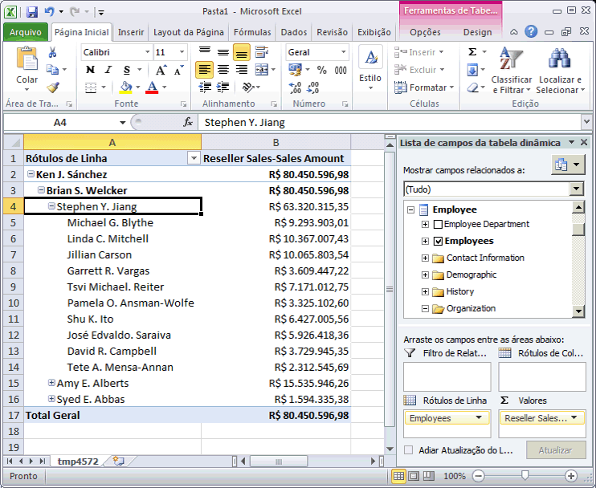
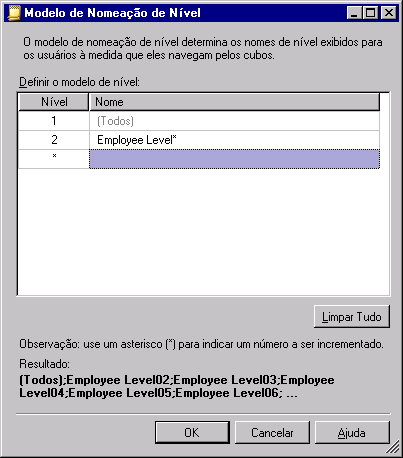
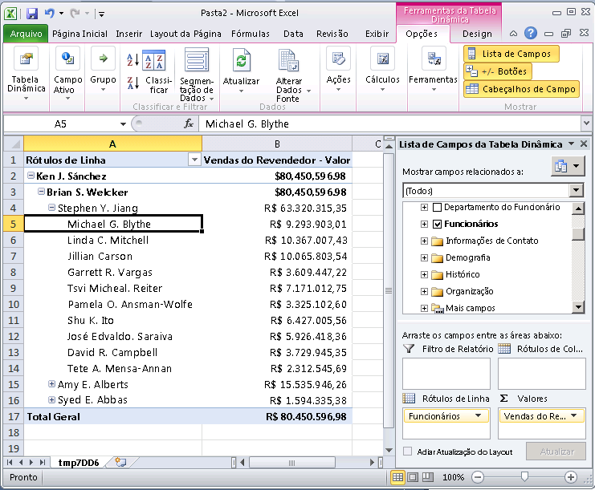

# Lição 4-2-definir propriedades de atributo pai em uma hierarquia pai-filho
Uma hierarquia pai-filho é uma hierarquia em uma dimensão que se baseia em duas colunas de tabela. Juntas, essas colunas definem as relações hierárquicas entre os membros da dimensão. A primeira coluna, chamada *coluna de chave de membro*, identifica cada membro da dimensão. A outra coluna, chamada *coluna pai*, identifica o pai de cada membro da dimensão. A propriedade **NamingTemplate** de um atributo pai determina o nome de cada nível na hierarquia pai-filho e a propriedade **MembersWithData** determina se os dados dos membros pai deverão ser exibidos.  
  
Para obter mais informações, consulte [Dimensões pai-filho](../analysis-services/multidimensional-models/parent-child-dimension.md)e [Atributos em hierarquias pai-filho](../analysis-services/multidimensional-models/parent-child-dimension-attributes.md)  
  
> [!NOTE]  
> Ao usar o Assistente para Dimensões para criar uma dimensão, o assistente reconhece as tabelas que apresentam relações pai-filho e define automaticamente a hierarquia pai-filho.  
  
Nas tarefas deste tópico, você criará um modelo de nomeação que definirá o nome de cada nível na hierarquia pai-filho na dimensão **Funcionário** . Em seguida, o atributo pai deverá ser configurado para ocultar todos os dados pai, de forma que sejam exibidas apenas as informações sobre as vendas de cada membro no nível folha.  
  
## Navegando pela dimensão Funcionário  
  
1.  No Gerenciador de Soluções, clique duas vezes em **Employee.dim** na pasta **Dimensões** para abrir o Designer de Dimensão na dimensão Funcionário.  
  
2.  Clique na guia **Navegador** , verifique se **Funcionários** está selecionado na lista **Hierarquia** e expanda o membro **Todos os Funcionários** .  
  
    Observe que **Pedro J. Martins** é o gerente de nível superior nesta hierarquia pai-filho.  
  
3.  Selecione o membro **Pedro J. Martins** .  
  
    Observe que o nome do nível para esse membro é **Nível 02**. (O nome do nível é exibido depois de **Nível atual:** logo acima do membro **Todos os Funcionários**.) Na próxima tarefa, você definirá nomes mais descritivos para cada nível.  
  
4.  Expanda **Pedro J. Martins** para exibir os nomes de funcionários subordinados a esse gerente e selecione **Vitor S. Barros** para exibir o nome desse nível.  
  
    Observe que o nome do nível para esse membro é **Nível 03**.  
  
5.  No Gerenciador de Soluções, clique duas vezes em **Analysis Services Tutorial.cube** na pasta **Cubos** para abrir o Designer do cubo do Tutorial do [!INCLUDE[ssASnoversion](../includes/ssasnoversion-md.md)] .  
  
6.  Clique na guia **Navegador** .  
  
7.  Clique no ícone do Excel e clique em **Habilitar** quando for solicitado para habilitar conexões.  
  
8.  Na Lista de Campos da Tabela Dinâmica, expanda **Reseller Sales**. Arraste **Vendas do Revendedor/Valor das Vendas para Valores** até a área Valores.  
  
9. Na Lista Campos da Tabela Dinâmica, expanda **Funcionário**e arraste a hierarquia **Funcionários** até a área **Linhas** .  
  
    Todos os membros da hierarquia Employees são adicionados à coluna A do relatório da Tabela Dinâmica.  
  
    A imagem a seguir mostra a hierarquia de Employees expandida.  
  
10.   
  
    Observe que as vendas de cada gerente no Nível 03 também são exibidas no Nível 04. Isso é porque cada gerente também é funcionário de outro gerente. Na próxima tarefa, você ocultará os valores das vendas.  
  
## Modificando as propriedades de atributo pai na dimensão Funcionário  
  
1.  Mude para o Designer de Dimensão da dimensão **Funcionário** .  
  
2.  Clique na guia **Estrutura de Dimensão** e selecione uma hierarquia de atributo **Funcionários** no painel **Atributos** .  
  
    Observe que ícone é exclusivo para esse atributo. Esse ícone indica que o atributo é a chave pai em uma hierarquia pai-filho. Observe também, na janela Propriedades, que a propriedade **Usage** do atributo é definida como **Pai**. Essa propriedade foi definida pelo Assistente para Dimensões no momento em que a dimensão foi criada. O assistente detectou a relação pai-filho automaticamente.  
  
3.  Na janela Propriedades, clique no botão Procurar (**...**) na célula da propriedade **NamingTemplate** .  
  
    Na caixa de diálogo **Modelo de Nomeação de Nível**, você define o modelo de nomeação de nível que determina os nomes de nível na hierarquia pai-filho exibidos aos usuários à medida que eles procuram os cubos.  
  
4.  Na segunda linha, na linha **\***, digite **Nível do Funcionário \*** na coluna **Nome** e clique na terceira linha.  
  
    Observe agora que, abaixo de **Resultado**, cada nível é exibido nomeado como “Nível do Funcionário” seguido de números crescentes e consecutivos.  
  
    A imagem a seguir mostra as alterações na caixa de diálogo **Modelo de Nomeação de Nível** .  
  
      
  
5.  Clique em **OK**.  
  
6.  Na janela Propriedades do atributo **Funcionários** , na célula da propriedade **MembersWithData** , selecione **NonLeafDataHidden** para alterar o valor do atributo **Funcionários** .  
  
    Isso faz com que os dados relacionados aos membros de nível não folha na hierarquia pai-filho sejam ocultados.  
  
## Navegando pela dimensão Funcionário com atributos modificados  
  
1.  No menu **Compilar** do [!INCLUDE[ssBIDevStudioFull](../includes/ssbidevstudiofull-md.md)], clique em **Implantar Tutorial do Analysis Services**.  
  
2.  Quando a implantação for concluída com êxito, mude para o Designer do cubo do Tutorial do [!INCLUDE[ssASnoversion](../includes/ssasnoversion-md.md)] e, na barra de ferramentas da guia **Navegador** , clique em **Reconectar** .  
  
3.  Clique no ícone do Excel e clique em **Habilitar**.  
  
4.  Arraste **Vendas do Revendedor/Valor das Vendas para Valores** até a área Valores.  
  
5.  Arraste a hierarquia **Funcionários** até a área Rótulos de Linha.  
  
    A imagem a seguir mostra as alterações que foram realizadas na hierarquia Funcionários. Observe que Marcos Y. Azevedo não é exibido mais como um funcionário de si próprio.  
  
      
  
## Próxima tarefa da lição  
[Agrupando membros de atributo automaticamente](../analysis-services/lesson-4-3-automatically-grouping-attribute-members.md)  
  
## Consulte também  
[Dimensões pai-filho](../analysis-services/multidimensional-models/parent-child-dimension.md)  
[Atributos em hierarquias pai-filho](../analysis-services/multidimensional-models/parent-child-dimension-attributes.md)  
  
  
  

