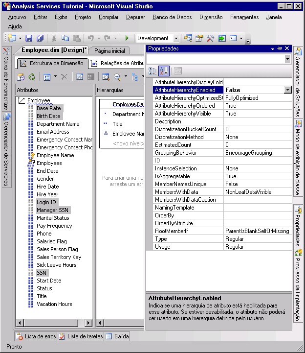
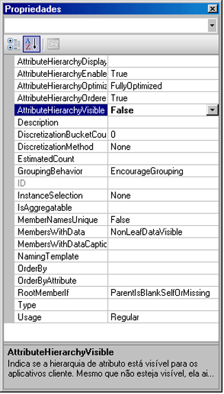

# Lição 4-4-ocultando e desabilitando as hierarquias de atributo
[!INCLUDE[ssas-appliesto-sqlas](../includes/ssas-appliesto-sqlas.md)]

Por padrão, uma hierarquia de atributo é criada para cada atributo em uma dimensão e cada hierarquia é disponibilizada para o dimensionamento de dados de fatos. Essa hierarquia é composta por um nível "Todos" e um nível de detalhe que contém todos os membros da hierarquia. Como você já aprendeu, é possível organizar atributos em hierarquias definidas pelo usuário para fornecer caminhos de navegação em um cubo. Sob certas circunstâncias, talvez você queira desativar ou ocultar alguns atributos e suas hierarquias. Por exemplo, determinados atributos como um número de previdência social ou números de identificação nacional, taxas de pagamentos, datas de aniversário e informações de logon não são atributos pelos quais os usuários poderão dimensionar as informações do cubo. Em vez disso, geralmente essas informações são exibidas apenas como detalhes de um membro de atributo específico. É possível ocultar essas hierarquias de atributos, deixando os atributos visíveis apenas como propriedades de membro de um determinado atributo. Você também pode criar membros de outros atributos, como nomes de cliente ou CEPs, visíveis somente quando eles são exibidos através de uma hierarquia de usuário em vez de serem exibidos de forma independente através de uma hierarquia de atributo. Uma razão para seguir esse procedimento pode ser o número absoluto de membros distintos na hierarquia de atributo. Por fim, para melhorar o desempenho do processamento, será preciso desativar as hierarquias de atributo que não serão usadas pelos usuários na navegação.  
  
O valor da propriedade **AttributeHierarchyEnabled** determina se uma hierarquia de atributo é criada. Se essa propriedade for definida como **False**, a hierarquia de atributo não será criada e o atributo não poderá ser usado como um nível em uma hierarquia de usuário; a hierarquia de atributo existe apenas como uma propriedade de membro. Entretanto, uma hierarquia de atributo desativada ainda pode ser usada para classificar os membros de outro atributo. Se o valor da propriedade **AttributeHierarchyEnabled** for definido como **True**, o valor da propriedade **AttributeHierarchyVisible** determinará se a hierarquia de atributo será visível, independentemente de seu uso em uma hierarquia definida pelo usuário.  
  
Quando uma hierarquia de atributo é ativada, talvez você queira especificar valores para as três propriedades adicionais a seguir:  
  
-   **IsAggregatable**  
  
    Por padrão, o nível (Todos) é definido para todas as hierarquias de atributo. Para desabilitar o nível (Todos) de uma hierarquia de atributo habilitada, defina o valor dessa propriedade como **False**.  
  
    > [!NOTE]  
    > Um atributo que tem sua propriedade **IsAggregatable** definida como falsa só pode ser usado como a raiz de uma hierarquia definida pelo usuário e deve ter um membro padrão especificado (caso contrário, o mecanismo [!INCLUDE[ssASnoversion](../includes/ssasnoversion-md.md)] escolherá um valor para você).  
  
-   **AttributeHierarchyOrdered**  
  
    Por padrão, o [!INCLUDE[ssASnoversion](../includes/ssasnoversion-md.md)] classifica os membros das hierarquias de atributo ativadas durante o processamento e armazena os membros por valor da propriedade **OrderBy** , como Name ou Key. Se você não fizer questão da classificação, poderá melhorar o desempenho do processamento definindo o valor dessa propriedade como **False**.  
  
-   **AttributeHierarchyOptimizedState**  
  
    Por padrão, o [!INCLUDE[ssASnoversion](../includes/ssasnoversion-md.md)] cria um índice para cada hierarquia de atributo ativada durante o processamento para melhorar desempenho da consulta. Porém, se uma hierarquia de atributo não for usada para pesquisa, você poderá melhorar o desempenho do processamento, definindo o valor dessa propriedade para **NotOptimized**. Entretanto, se uma hierarquia oculta for usada como o atributo de chave para a dimensão, ainda assim a criação de um índice de membros de atributo ajudará a melhorar o desempenho.  
  
Essas propriedades não serão aplicadas se uma hierarquia de atributo estiver desativada.  
  
Nas tarefas deste tópico, você desativará o número de previdência social e outros atributos na dimensão Funcionário que não serão usados para pesquisa. Você ocultará o nome do cliente e as hierarquias de atributo de CEPs na dimensão Cliente. Quanto maior o número de membros de atributo nas hierarquias, maior será o tempo de pesquisa nessas hierarquias, tornando a pesquisa mais lenta independentemente de uma hierarquia de usuário.  
  
## Definindo as propriedades da hierarquia de atributo na dimensão Funcionário  
  
1.  Alterne para o Designer de Dimensão para a dimensão Funcionário e clique na guia **Navegador** .  
  
2.  Observe se as seguintes hierarquias de atributo aparecem na lista **Hierarquia** :  
  
    -   **Taxa Básica**  
  
    -   **Birth Date**  
  
    -   **ID de Logon**  
  
    -   **Gerente SSN**  
  
    -   **SSN**  
  
3.  Alterne para a guia **Estrutura da Dimensão** e selecione os atributos a seguir no painel **Atributos** . Você pode selecionar várias medidas clicando em cada uma enquanto mantém pressionada a tecla CTRL.  
  
    -   **Taxa Básica**  
  
    -   **Birth Date**  
  
    -   **ID de Logon**  
  
    -   **Gerente SSN**  
  
    -   **SSN**  
  
4.  Na janela Propriedades, defina o valor da propriedade **AttributeHierarchyEnabled** como **False** para os atributos selecionados.  
  
    Observe no painel **Atributos** que o ícone dos atributos mudou, indicando que o atributo não está ativado.  
  
    A imagem a seguir mostra a propriedade **AttributeHierarchyEnabled** definida como False para os atributos selecionados.  
  
      
  
5.  No menu **Compilar** , clique em **Implantar Tutorial do Analysis Services**.  
  
6.  Quando o processamento tiver sido concluído com êxito, alterne para a guia **Navegador** e clique no botão **Reconectar**. Em seguida, tente navegar pelas hierarquias de atributo modificadas.  
  
    Observe que os membros dos atributos modificados não estão disponíveis para pesquisa como hierarquias de atributo na lista **Hierarquia** . Se tentar adicionar uma das hierarquias de atributo desativadas como um nível em uma hierarquia de usuário, você receberá um erro notificando que a hierarquia de atributo deve ser ativada para que possa fazer parte da hierarquia definida pelo usuário.  
  
## Definindo as propriedades da hierarquia de atributo na dimensão Cliente  
  
1.  Alterne para o Designer de Dimensão para a dimensão Cliente e clique na guia **Navegador** .  
  
2.  Observe se as seguintes hierarquias de atributo aparecem na lista **Hierarquia** :  
  
    -   **Nome Completo**  
  
    -   **Postal Code**  
  
3.  Alterne para a guia **Estrutura da Dimensão** e selecione os seguintes atributos no painel **Atributos** usando a tecla CTRL para selecionar vários atributos ao mesmo tempo:  
  
    -   **Nome Completo**  
  
    -   **Postal Code**  
  
4.  Na janela Propriedades, defina o valor da propriedade **AttributeHierarchyVisible** como **False** para os atributos selecionados.  
  
    Como os membros dessas hierarquias de atributo serão usados para dimensionar dados de fatos, classificar e otimizar os membros dessas hierarquias melhorará o desempenho. Além disso, as propriedades desses atributos não devem ser alteradas.  
  
    A imagem a seguir mostra a propriedade **AttributeHierarchyVisible** definida como False.  
  
      
  
5.  Arraste o atributo **CEP** do painel **Atributos** para a hierarquia de usuário **Geografia do Cliente** no painel **Hierarquias e Níveis** , imediatamente abaixo do nível **Cidade** .  
  
    Observe que um atributo oculto ainda pode se tornar um nível em uma hierarquia de usuário.  
  
6.  No menu **Compilar** , clique em **Implantar Tutorial do Analysis Services**.  
  
7.  Quando a implantação for concluída com êxito, alterne para a guia **Navegador** da dimensão Cliente e clique em **Reconectar**.  
  
8.  Tente selecionar qualquer uma das hierarquias de atributo modificadas da lista **Hierarquia** .  
  
    Observe que nenhuma das hierarquias de atributo modificadas aparece na lista **Hierarquia** .  
  
9. Na lista **Hierarquia** , selecione **Geografia do Cliente**e navegue pelos níveis no painel do navegador.  
  
    Observe que os níveis ocultos, **CEP** e **Nome Completo**, estão visíveis na hierarquia definida pelo usuário.  
  
## Próxima tarefa da lição  
[Classificando membros de atributo com base em um atributo secundário](../analysis-services/lesson-4-5-sorting-attribute-members-based-on-a-secondary-attribute.md)  
  
  
  
