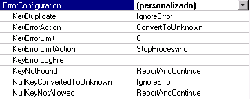
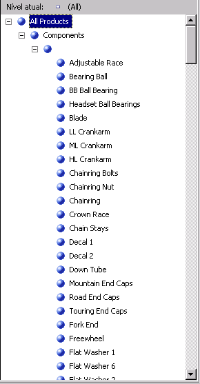
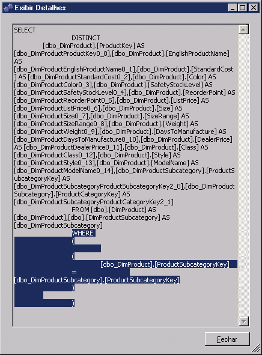
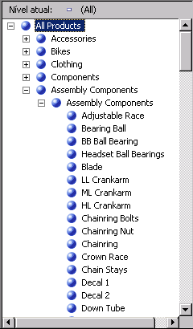

# Lição 4-7-definindo o membro desconhecido e propriedades de processamento nulo
[!INCLUDE[ssas-appliesto-sqlas](../includes/ssas-appliesto-sqlas.md)]

Quando o [!INCLUDE[ssASnoversion](../includes/ssasnoversion-md.md)] processa uma dimensão, todos os valores distintos das colunas subjacentes nas tabelas, ou nas exibições da fonte de dados, populam os atributos na dimensão. Por padrão, se o [!INCLUDE[ssASnoversion](../includes/ssasnoversion-md.md)] detecta um valor nulo durante o processamento, ele converte o valor nulo em zero no caso de colunas numéricas ou em cadeia vazia no caso de colunas de cadeia de caracteres. Você pode modificar as configurações padrão ou converter valores nulos em seu processo de extração, transformação e carregamento (caso haja algum) do data warehouse relacional subjacente. Além disso, você pode usar o [!INCLUDE[ssASnoversion](../includes/ssasnoversion-md.md)] para converter o valor nulo em um valor designado, configurando três propriedades: **UnknownMember** e **UnknownMemberName** para a dimensão e **NullProcessing** para o atributo de chave da dimensão.  
  
O Assistente para Dimensões e o Assistente para Cubos habilitarão essas propriedades com base no fato de o atributo de chave de uma dimensão permitir um valor nulo ou de o atributo raiz de uma dimensão floco de neve ter base em uma coluna que permite um valor nulo. Nesses casos, a propriedade **NullProcessing** do atributo de chave será definida como **UnknownMember** e a propriedade **UnknownMember** será configurada como **Visível**.  
  
Entretanto, ao criar dimensões floco de neve de forma incremental, como estamos fazendo na dimensão Product, ou ao definir dimensões usando o Designer de Dimensão e incorporar essas dimensões existentes em um cubo, talvez as propriedades **UnknownMember** e **NullProcessing** precisem ser definidas manualmente.  
  
Nas tarefas deste tópico, você adicionará os atributos da categoria e subcategoria de produto à dimensão Produto das tabelas floco de neve que você adicionará à exibição da fonte de dados [!INCLUDE[ssSampleDBCoShort](../includes/sssampledbcoshort-md.md)] DW. Depois, você habilitará a propriedade **UnknownMember** para a dimensão Product, especificará **Componentes do Assembly** como o valor da propriedade **UnknownMemberName** , relacionará os atributos **Subcategoria** e **Categoria** ao atributo de nome do produto. Por fim, definirá um tratamento de erro personalizado para o atributo de chave do membro que vincula as tabelas floco de neve.  
  
> [!NOTE]  
> Caso tenha adicionado os atributos Subcategoria e Categoria durante a definição do cubo do Tutorial do [!INCLUDE[ssASnoversion](../includes/ssasnoversion-md.md)] usando o Assistente para Cubos, estas etapas foram feitas automaticamente.  
  
## Revisando propriedades de tratamento de erros e de membro desconhecido na dimensão Produto  
  
1.  Mude para o Designer de Dimensão da dimensão **Produto** , clique na guia **Estrutura da Dimensão** e selecione **Produto** no painel **Atributos** .  
  
    Isso permite que você exiba e modifique as propriedades da própria dimensão.  
  
2.  Na janela Propriedades, examine as propriedades **UnknownMember** e **UnknownMemberName** .  
  
    Observe que a propriedade **UnknownMember** não está habilitada porque seu valor está definido como **Nenhum** em vez de **Visível** ou **Oculto**e que não há nenhum nome especificado para a propriedade **UnknownMemberName** .  
  
3.  Na janela Propriedades, selecione **(personalizado)** na célula da propriedade **ErrorConfiguration** e expanda a coleção de propriedades **ErrorConfiguration** .  
  
    Definir a propriedade **ErrorConfiguration** como **(personalizado)** permite que você exiba as definições de configuração de erro padrão; isso não altera as configurações.  
  
4.  Revise as propriedades de chave e de configuração de erro de chave nula, mas não faça nenhuma alteração.  
  
    Observe que, por padrão, quando as chaves nulas são convertidas para o membro desconhecido, o erro de processamento associado a essa conversão é ignorado  
  
    A imagem a seguir mostra as configurações de propriedade da coleção de propriedades **ErrorConfiguration** .  
  
      
  
5.  Clique na guia **Navegador** , verifique se a opção **Linhas de Modelo do Produto** está selecionada na lista **Hierarquia** e expanda **Todos os Produtos**.  
  
    Observe os cinco membros do nível Linha de Produto.  
  
6.  Expanda **Componentes**e expanda o membro não rotulado do nível **Nome do Modelo** .  
  
    Esse nível contém os componentes do assembly que são usados para criar outros componentes, começando com o produto **Corrida Ajustável** , como mostra a imagem a seguir.  
  
      
  
## Definindo atributos das tabelas floco de neve e uma hierarquia definida pelo usuário Categoria do Produto  
  
1.  Abra o Designer de Exibição da Fonte de Dados da exibição da fonte de dados do [!INCLUDE[ssSampleDBCoShort](../includes/sssampledbcoshort-md.md)] DW, selecione **Compras do Revendedor** no painel **Organizador de Diagramas** e clique em **Adicionar/Remover Objetos** no menu **Exibição da Fonte de Dados** do [!INCLUDE[ssBIDevStudioFull](../includes/ssbidevstudiofull-md.md)].  
  
    A caixa de diálogo **Adicionar/Remover Tabelas** é aberta.  
  
2.  Na lista **Objetos incluídos** , selecione **DimProduct (dbo)** e clique em **Adicionar Tabelas Relacionadas**.  
  
    São adicionados **DimProductSubcategory (dbo)** e **FactProductInventory (dbo)** . Remova **FactProductInventory (dbo)** de forma que apenas a tabela **DimProductSubcategory (dbo)** seja adicionada à lista **Objetos incluídos** .  
  
3.  Com a tabela **DimProductSubcategory (dbo)** selecionada por padrão como a tabela adicionada mais recentemente, clique em **Adicionar Tabelas Relacionadas** novamente.  
  
    A tabela **DimProductCategory (dbo)** é adicionada à lista **Objetos incluídos** .  
  
4.  Clique em **OK**.  
  
5.  No menu **Formatar** do [!INCLUDE[ssBIDevStudio](../includes/ssbidevstudio-md.md)], aponte para **Layout Automático**e clique em **Diagrama**.  
  
    Observe que as tabelas **DimProductSubcategory (dbo)** e **DimProductCategory (dbo)** são vinculadas uma a outra e também à tabela **ResellerSales** por meio da tabela **Product** .  
  
6.  Mude para o Designer de Dimensão da dimensão **Produto** e clique na guia **Estrutura da Dimensão** .  
  
7.  Clique com o botão direito do mouse em qualquer lugar no painel **Exibição da Fonte de Dados** e clique em **Mostrar Todas as Tabelas**.  
  
8.  No painel **Exibição da Fonte de Dados** , localize a tabela **DimProductCategory** , clique com o botão direito do mouse em **ProductCategoryKey** nessa tabela e clique em **Novo Atributo da Coluna**.  
  
9. No painel **Atributos** , altere o nome deste novo atributo para **Categoria**.  
  
10. Na janela Propriedades, clique no campo de propriedade **NameColumn** e no botão Procurar (**…**) para abrir a caixa de diálogo **Coluna de Nome** .  
  
11. Selecione **EnglishProductCategoryName** na lista **Coluna de origem** e clique em **OK**.  
  
12. No painel **Exibição da Fonte de Dados** , localize a tabela **DimProductSubcategory** , clique com o botão direito do mouse em **ProductSubcategoryKey** na tabela e clique em **Novo Atributo da Coluna**.  
  
13. No painel **Atributos** , altere o nome deste novo atributo para **Subcategoria**.  
  
14. Na janela Propriedades, clique no campo de propriedade **NameColumn** e no botão Procurar **(…)** para abrir a caixa de diálogo **Coluna de Nome** .  
  
15. Selecione **EnglishProductSubcategoryName** na lista **Coluna de origem** e clique em **OK**.  
  
16. Crie uma nova hierarquia definida pelo usuário chamada **Categorias de Produto** com os seguintes níveis na ordem de cima para baixo: **Categoria**, **Subcategoria**e **Nome do Produto**.  
  
17. Especifique **Todos os Produtos** como o valor da propriedade **AllMemberName** da hierarquia definida pelo usuário Categorias de Produto.  
  
## Navegando nas hierarquias definidas pelo usuário na dimensão Produto  
  
1.  Na barra de ferramentas da guia **Estrutura da Dimensão** do **Designer de Dimensão** da dimensão **Produto** , clique em **Processo**.  
  
2.  Clique em **Sim** para criar e implantar o projeto. Depois, clique em **Executar** para processar a dimensão **Produto** .  
  
3.  Quando o processamento for concluído com êxito, expanda **Processamento da dimensão ‘Produto’ concluído com êxito** na caixa de diálogo **Progresso do Processo** , **Processamento do atributo de dimensão ‘Nome do Produto’ concluído**e, por fim, expanda **Consultas SQL 1**.  
  
4.  Clique na consulta SELECT DISTINCT e em **Exibir Detalhes**.  
  
    Observe que uma cláusula WHERE foi adicionada à cláusula SELECT DISTINCT que remove os produtos que não têm nenhum valor na coluna ProductSubcategoryKey, como mostra a imagem a seguir:  
  
      
  
5.  Clique em **Fechar** três vezes para fechar todas as caixas de diálogo em processamento.  
  
6.  Clique na guia **Navegador** do Designer de Dimensão da dimensão **Produto** e clique em **Reconectar**.  
  
7.  Verifique se **Linhas de Modelo do Produto** é exibida na lista **Hierarquia** , expanda **Todos os Produtos**e **Componentes**.  
  
8.  Selecione **Categorias de Produto** na lista **Hierarquia** , expanda **Todos os Produtos**e **Componentes**.  
  
    Observe que nenhum dos componentes do assembly é exibido.  
  
Para modificar o comportamento mencionado na tarefa anterior, você habilitará a propriedade **UnknownMember** da dimensão Produtos, definirá um valor para a propriedade **UnknownMemberName** , definirá a propriedade **NullProcessing** dos atributos **Subcategoria** e **Nome do Modelo** como **UnknownMember**, definirá o atributo **Categoria** como um atributo relacionado do atributo **Subcategoria** e, por fim, definirá o atributo **Linha de Produto** como atributo relacionado do atributo **Nome do Modelo** . Essas ações farão com que o [!INCLUDE[ssASnoversion](../includes/ssasnoversion-md.md)] use o valor do nome do membro desconhecido para cada produto que não tem um valor para a coluna **SubcategoryKey** , como você verá na próxima tarefa.  
  
## Ativando o membro desconhecido, definindo relações de atributo e especificando as propriedades de processamento personalizado como nulas  
  
1.  Clique na guia **Estrutura de Dimensão** no Designer de Dimensão da dimensão **Produto** e selecione **Produto** no painel **Atributos** .  
  
2.  Na janela **Propriedades** , altere a propriedade **UnknownMember** para **Visível**e o valor da propriedade **UnknownMemberName** para **Componentes do Assembly**.  
  
    Alterar a propriedade **UnknownMember** para **Visível** ou **Oculto** habilita a propriedade **UnknownMember** da dimensão.  
  
3.  Clique na guia **Relações de Atributo** .  
  
4.  No diagrama, clique com o botão direito do mouse no atributo **Subcategoria** e selecione **Nova Relação de Atributo**.  
  
5.  Na caixa de diálogo **Criar Relação de Atributo** , o **Atributo de Origem** é **Subcategoria**. Defina o **Atributo Relacionado** como **Categoria**. Deixe o tipo de relação definido como **Flexível**.  
  
6.  [!INCLUDE[clickOK](../includes/clickok-md.md)]  
  
7.  No painel **Atributos** , selecione **Subcategoria**.  
  
8.  Na janela Propriedades, expanda a propriedade **KeyColumns** e depois a propriedade **DimProductSubcategory.ProductSubcategoryKey (Integer)** .  
  
9. Altere a propriedade **NullProcessing** para **UnknownMember**.  
  
10. No painel **Atributos** , selecione **Nome do Modelo**.  
  
11. Na janela Propriedades, expanda a propriedade **KeyColumns** e depois a propriedade **Product.ModelName (WChar)** .  
  
12. Altere a propriedade **NullProcessing** para **UnknownMember**.  
  
    Por causa dessas alterações, quando o [!INCLUDE[ssASnoversion](../includes/ssasnoversion-md.md)] detectar um valor nulo para o atributo **Subcategoria** ou **Nome do Modelo** durante o processamento, o valor do membro desconhecido será substituído como um valor de chave e as hierarquias definidas pelo usuário serão criadas corretamente.  
  
## Navegando na dimensão Produto novamente  
  
1.  No menu **Compilar** , clique em **Implantar Tutorial do Analysis Services**.  
  
2.  Quando a implantação for concluída com êxito, clique na guia **Navegador** do Designer de Dimensão da dimensão **Produto** e clique no botão **Reconectar**.  
  
3.  Verifique se a opção **Categoria do Produto** está selecionada na lista **Hierarquia** e expanda **Todos os Produtos**.  
  
    Observe que Componentes do Assembly aparece como um novo membro do nível Categoria.  
  
4.  Expanda o membro **Componentes do Assembly** do nível **Categoria** e expanda o membro **Componentes do Assembly** do nível **Subcategoria** .  
  
    Observe que todos os componentes do assembly agora são exibidos no nível **Nome do Produto** , como mostra a imagem a seguir.  
  
      
  
## Próxima lição  
[Lição 5: Definindo relações entre dimensões e grupos de medidas](../analysis-services/lesson-5-defining-relationships-between-dimensions-and-measure-groups.md)  
  
  
  
