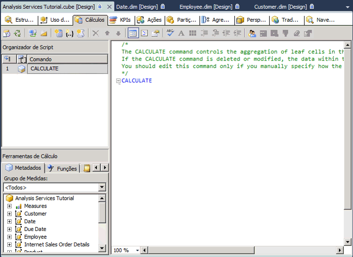
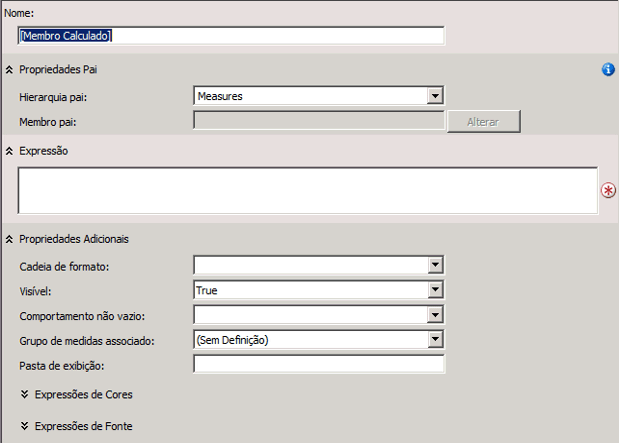
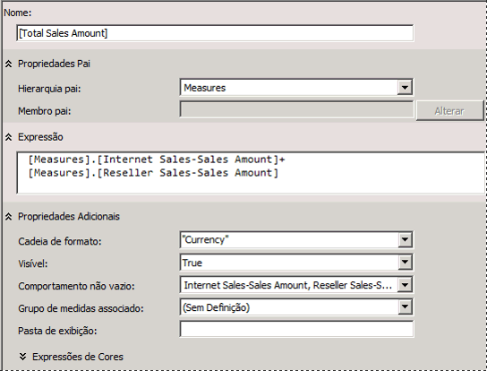
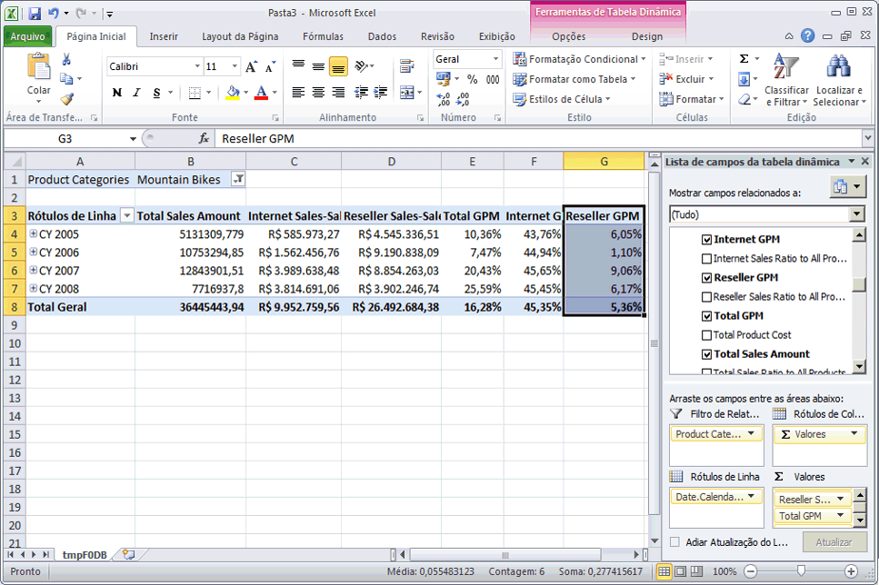

# <a name="lesson-6-1---defining-calculated-members"></a>Lição 6-1-definição de membros calculados
Membros calculados são membros de uma dimensão ou um grupo de medidas definidos com base em uma combinação de dados de cubo, operadores aritméticos, números e funções. Por exemplo, você pode criar um membro calculado que possa calcular a soma de duas medidas físicas no cubo. As definições de um membro calculado são armazenadas em cubos, mas seus valores são calculados no momento da consulta.  
  
Para criar um membro calculado, use o comando **Novo Membro Calculado** na guia **Cálculos** do Designer de Cubo. Um membro calculado pode ser criado em qualquer dimensão, inclusive a dimensão de medidas. Você também pode colocar um membro calculado dentro de uma pasta de exibição na caixa de diálogo **Propriedades de Cálculo** . Para obter mais informações, consulte [Cálculos](../analysis-services/multidimensional-models-olap-logical-cube-objects/calculations.md), [Cálculos em modelos multidimensionais](../analysis-services/multidimensional-models/calculations-in-multidimensional-models.md), e [Criar membros calculados](../analysis-services/multidimensional-models/create-calculated-members.md).  
  
Nas tarefas deste tópico, você definirá as medidas calculadas para permitir que os usuários visualizem o percentual da margem de lucro bruto e as taxas de vendas das vendas pela Internet, vendas do revendedor e de todas as vendas.  
  
## <a name="defining-calculations-to-aggregate-physical-measures"></a>Definindo cálculos para agregar medidas físicas  
  
1.  Abra o Designer de Cubo para o cubo do Tutorial do [!INCLUDE[ssASnoversion](../includes/ssasnoversion-md.md)] e clique na guia **Cálculos** .  
  
    Observe o comando padrão CALCULATE no painel **Expressões de Cálculos** e no painel **Organizador de Script** . Esse comando especifica que a medida no cubo deve ser agregada de acordo com o valor especificado por suas propriedades AggregateFunction. Geralmente, os valores de medida são somados, mas também podem ser contados ou agregados em alguma outra forma.  
  
    A imagem a seguir mostra a guia **Cálculos** do Designer de Cubo.  
  
      
  
2.  Na barra de ferramentas da guia **Cálculos** , clique em **Novo Membro Calculado**.  
  
    Um novo formulário aparece no painel **Expressões de Cálculos** no qual foram definidas as propriedades desse novo membro calculado. O novo membro também aparece no painel **Organizador de Script** .  
  
    A imagem a seguir mostra o formulário que aparece no painel **Expressões de Cálculos** quando você clica em **Novo Membro Calculado**.  
  
      
  
3.  Na caixa **Nome** , altere o nome da medida calculada para **[Valor de Vendas Total]**.  
  
    Se o nome de um membro calculado tiver algum espaço, ele deverá ser colocado entre colchetes.  
  
    Observe na lista **Hierarquia pai** que, por padrão, um novo membro calculado é criado na dimensão **Medidas** . Um membro calculado na dimensão Medidas também é conhecido como uma medida calculada.  
  
4.  Na guia **Metadados** no painel **Ferramentas de Cálculo** da guia **Cálculos** , expanda **Medidas** e **Vendas pela Internet** para exibir os metadados do grupo de medidas **Vendas pela Internet** .  
  
    Você pode arrastar os elementos de metadados do painel **Ferramentas de Cálculo** até a caixa **Expressão** e adicione operadores e outros elementos para criar expressões MDX. Como alternativa, é possível digitar uma expressão MDX diretamente na caixa **Expressão** .  
  
    > [!NOTE]  
    > Se não houver nenhum metadados no painel **Ferramentas de Cálculo** , clique em **Reconectar** na barra de ferramentas. Se isso não funcionar, talvez seja preciso processar o cubo ou iniciar a instância do [!INCLUDE[ssASnoversion](../includes/ssasnoversion-md.md)].  
  
5.  Arraste **Vendas pela Internet/Valor das Vendas** da guia **Metadados** no painel **Ferramentas de Cálculo** até a caixa **Expressão** no painel **Expressões de Cálculo** .  
  
6.  Na caixa **Expressão** , digite um sinal de adição (**+**) depois de **[Medidas].[Vendas pela Internet/Valor das Vendas]**.  
  
7.  Na guia **Metadados** do painel **Ferramentas de Cálculo** , expanda **Vendas do Revendedor**e arraste **Vendas do Revendedor/Valor das Vendas** até a caixa **Expressão** no painel **Expressões de Cálculos** após o sinal de adição (+).  
  
8.  Na lista **Cadeia de caracteres de formato** , selecione **"Moeda"**.  
  
9. Na lista **Comportamento Não Vazio** , marque as caixas de seleção **Vendas pela Internet/Valor das Vendas** e **Vendas do Revendedor/Valor das Vendas**e clique em **OK**.  
  
    As medidas especificadas na lista **Comportamento não vazio** serão usadas para resolver consultas NON EMPTY no MDX. Ao especificar uma ou mais medidas na lista **Comportamento não vazio** , o [!INCLUDE[ssASnoversion](../includes/ssasnoversion-md.md)] tratará o membro calculado como vazio se todas as medidas especificadas estiverem vazias. Se a propriedade **Comportamento não vazio** estiver em branco, o [!INCLUDE[ssASnoversion](../includes/ssasnoversion-md.md)] deverá avaliar o membro calculado para determinar se o membro está vazio.  
  
    A imagem a seguir mostra o painel **Expressões de Cálculos** preenchido com as configurações que você especificou nas etapas anteriores.  
  
      
  
10. Na barra de ferramentas da guia **Cálculos** , clique em **Exibição de Script**e verifique o script de cálculo no painel **Expressões de Cálculos** .  
  
    Observe que o novo cálculo é adicionado à expressão CALCULATE inicial; cada cálculo individual é separado por um ponto-e-vírgula. Observe também que é exibido um comentário no começo do script de cálculo. Adicionar comentários a um script de cálculo em grupos de cálculos é uma boa prática para ajudar você e outros desenvolvedores a compreenderem os scripts de cálculos complexos.  
  
11. Adicione uma nova linha ao script de cálculo após o comando **Calculate;** e antes do script de cálculo adicionado recentemente. Em seguida, adicione o seguinte texto ao script, na própria linha:  
  
    ```  
    /* Calculations to aggregate Internet Sales and Reseller Sales measures */  
    ```  
  
    A imagem a seguir mostra como os scripts de cálculos devem ser exibidos no painel **Expressões de Cálculos** neste ponto do tutorial.  
  
      
  
12. Na barra de ferramentas da guia **Cálculos** , clique em **Exibição de Formulário**, verifique se **[Valor de Vendas Total]** está selecionado no painel **Organizador de Script** e clique em **Novo Membro Calculado**.  
  
13. Altere o nome desse novo membro calculado para **[Custo Total do Produto]**e crie a seguinte expressão na caixa **Expressão** :  
  
    ```  
    [Measures].[Internet Sales-Total Product Cost] + [Measures].[Reseller Sales-Total Product Cost]  
    ```  
  
14. Na lista **Cadeia de caracteres de formato** , selecione **"Moeda"**.  
  
15. Na lista **Comportamento não vazio** , marque as caixas de seleção **Vendas pela Internet-Custo Total do Produto** e **Vendas do Revendedor-Custo Total do Produto**e clique em **OK**.  
  
    Agora estão definidos dois membros calculados, ambos visíveis no painel **Organizador de Script** . Esses membros calculados podem ser usados por outros cálculos que são definidos posteriormente no script de cálculo. É possível exibir a definição de qualquer membro calculado selecionando-o no painel **Organizador de Script** . A definição do membro calculado será exibida no painel **Expressões de Cálculos** na exibição Formulário. Os membros calculados definidos recentemente não serão exibidos no painel **Ferramentas de Cálculo** enquanto esses objetos não forem implantados. Os cálculos não exigem processamento.  
  
## <a name="defining-gross-profit-margin-calculations"></a>Definindo cálculos de margem de lucro bruto  
  
1.  Verifique se a opção **[Custo Total do Produto]** está selecionada no painel **Organizador de Script** e clique em **Novo Membro Calculado** na barra de ferramentas da guia **Cálculos** .  
  
2.  Na caixa **Nome** , altere o nome dessa nova medida calculada para **[MLB pela Internet]**.  
  
3.  Na caixa **Expressão** , crie a seguinte expressão MDX:  
  
    ```  
    ([Measures].[Internet Sales-Sales Amount] -   
    [Measures].[Internet Sales-Total Product Cost]) /  
    [Measures].[Internet Sales-Sales Amount]  
    ```  
  
4.  Na lista **Cadeia de caracteres de formato** , selecione **"Porcentagem"**.  
  
5.  Na lista **Comportamento Não Vazio** , marque a caixa de seleção **Vendas pela Internet/Valor das Vendas**e clique em **OK**.  
  
6.  Na barra de ferramentas da guia **Cálculos** , clique em **Novo Membro Calculado**.  
  
7.  Na caixa **Nome** , altere o nome dessa nova medida calculada para **[MLB do Revendedor]**.  
  
8.  Na caixa **Expressão** , crie a seguinte expressão MDX:  
  
    ```  
    ([Measures].[Reseller Sales-Sales Amount] -   
    [Measures].[Reseller Sales-Total Product Cost]) /  
    [Measures].[Reseller Sales-Sales Amount]  
    ```  
  
9. Na lista **Cadeia de caracteres de formato** , selecione **"Porcentagem"**.  
  
10. Na lista **Comportamento Não Vazio** , marque a caixa de seleção **Vendas do Revendedor/Valor das Vendas**e clique em **OK**.  
  
11. Na barra de ferramentas da guia **Cálculos** , clique em **Novo Membro Calculado**.  
  
12. Na caixa **Nome** , altere o nome dessa medida calculada para **[MLB Total]**.  
  
13. Na caixa **Expressão** , crie a seguinte expressão MDX:  
  
    ```  
    ([Measures].[Total Sales Amount] -   
    [Measures].[Total Product Cost]) /  
    [Measures].[Total Sales Amount]  
    ```  
  
    Observe que esse membro calculado faz referência a outros membros calculados. Como esse membro calculado será calculado após os membros aos quais ele faz referência, trata-se de um membro calculado válido.  
  
14. Na lista **Cadeia de caracteres de formato** , selecione **"Porcentagem"**.  
  
15. Na lista **Comportamento Não Vazio** , marque as caixas de seleção **Vendas pela Internet/Valor das Vendas** e **Vendas do Revendedor/Valor das Vendas**e clique em **OK**.  
  
16. Na barra de ferramentas da guia **Cálculos** , clique em **Exibição de Script** e verifique os três cálculos que foram adicionados ao script de cálculo.  
  
17. Adicione uma nova linha ao script de cálculo imediatamente antes do cálculo **[MLB pela Internet]** e adicione o seguinte texto ao script, na própria linha:  
  
    ```  
    /* Calculations to calculate gross profit margin */  
    ```  
  
    A imagem a seguir mostra o painel **Expressões** com os três novos cálculos.  
  
      
  
## <a name="defining-the-percent-of-total-calculations"></a>Definindo o percentual de cálculos totais  
  
1.  Na barra de ferramentas da guia **Cálculos** , clique em **Exibição de Formulário**.  
  
2.  No painel **Organizador de Script** , selecione **[MLB Total]**e clique em **Novo Membro Calculado** na barra de ferramentas da guia **Cálculos** .  
  
    Se você clicar no membro calculado final no painel **Organizador de Script** antes de clicar em **Novo Membro Calculado** , o novo membro calculado será inserido no final do script. Os scripts são executados na ordem em que aparecem no painel **Organizador de Script** .  
  
3.  Altere o nome desse novo membro calculado para **[Índice de Vendas pela Internet para Todos os Produtos]**.  
  
4.  Na caixa **Expressão** , digite o seguinte:  
  
    ```  
    Case  
        When IsEmpty( [Measures].[Internet Sales-Sales Amount] )   
        Then 0  
        Else ( [Product].[Product Categories].CurrentMember,  
               [Measures].[Internet Sales-Sales Amount]) /  
             ( [Product].[Product Categories].[(All)].[All],   
               [Measures].[Internet Sales-Sales Amount] )  
        End  
    ```  
  
    Essa expressão MDX calcula a contribuição para totalizar as vendas pela Internet de cada produto. A instrução Case junto com a função IS EMPTY garante que não ocorra um erro de divisão por zero quando um produto não for vendido.  
  
5.  Na lista **Cadeia de caracteres de formato** , selecione **"Porcentagem"**.  
  
6.  Na lista **Comportamento Não Vazio** , marque a caixa de seleção **Vendas pela Internet/Valor das Vendas**e clique em **OK**.  
  
7.  Na barra de ferramentas da guia **Cálculos** , clique em **Novo Membro Calculado**.  
  
8.  Altere o nome desse membro calculado para **[Índice de Vendas do Revendedor para Todos os Produtos]**.  
  
9. Na caixa **Expressão** , digite o seguinte:  
  
    ```  
    Case  
        When IsEmpty( [Measures].[Reseller Sales-Sales Amount] )   
        Then 0  
        Else ( [Product].[Product Categories].CurrentMember,  
               [Measures].[Reseller Sales-Sales Amount]) /  
             ( [Product].[Product Categories].[(All)].[All],   
               [Measures].[Reseller Sales-Sales Amount] )  
        End  
    ```  
  
10. Na lista **Cadeia de caracteres de formato** , selecione **"Porcentagem"**.  
  
11. Na lista **Comportamento Não Vazio** , marque a caixa de seleção **Vendas do Revendedor/Valor das Vendas**e clique em **OK**.  
  
12. Na barra de ferramentas da guia **Cálculos** , clique em **Novo Membro Calculado**.  
  
13. Altere o nome desse membro calculado para **[Índice de Vendas Total para Todos os Produtos]**.  
  
14. Na caixa **Expressão** , digite o seguinte:  
  
    ```  
    Case  
        When IsEmpty( [Measures].[Total Sales Amount] )   
        Then 0  
        Else ( [Product].[Product Categories].CurrentMember,  
               [Measures].[Total Sales Amount]) /  
             ( [Product].[Product Categories].[(All)].[All],   
               [Measures].[Total Sales Amount] )  
        End  
    ```  
  
15. Na lista **Cadeia de caracteres de formato** , selecione **"Porcentagem"**.  
  
16. Na lista **Comportamento Não Vazio** , marque as caixas de seleção **Vendas pela Internet/Valor das Vendas** e **Vendas do Revendedor/Valor das Vendas**e clique em **OK**.  
  
17. Na barra de ferramentas da guia **Cálculos** , clique em **Exibição de Script**e verifique os três cálculos que foram adicionados ao script de cálculo.  
  
18. Adicione uma nova linha ao script de cálculo logo antes do cálculo **[Índice de Vendas pela Internet para Todos os Produtos]** e adicione o seguinte texto ao script, na própria linha:  
  
    ```  
    /* Calculations to calculate percentage of product to total product sales */  
    ```  
  
    Agora estão definidos oito membros calculados e todos eles estarão visíveis no painel **Organizador de Script** quando você estiver na exibição Formulário.  
  
## <a name="browsing-the-new-calculated-members"></a>Navegando pelos novos membros calculados  
  
1.  No menu **Compilar** do [!INCLUDE[ssBIDevStudioFull](../includes/ssbidevstudiofull-md.md)], clique em **Implantar Tutorial do Analysis Services**.  
  
2.  Quando a implantação tiver sido concluída com êxito, alterne para a guia **Navegador** e clique no botão **Reconectar**.  
  
3.  Clique no ícone do Excel e clique em **Habilitar**.  
  
4.  No painel **Lista de Campos da Tabela Dinâmica** , expanda a pasta **Valores** para exibir os novos membros calculados na dimensão Medidas.  
  
5.  Arraste o **Valor de Vendas Total** , para a área de Valores e analise os resultados.  
  
    Arraste as medidas **Vendas pela Internet/Valor das Vendas** e **Vendas do Revendedor/Valor das Vendas** dos grupos de medidas **Vendas pela Internet** e **Vendas de revendedor** até a área Valores.  
  
    Observe que a medida **Valor de Vendas Total** é a soma da medida **Vendas pela Internet/Valor das Vendas** e da medida **Vendas do Revendedor/Valor das Vendas** .  
  
6.  Adicione a hierarquia definida pelo usuário **Categorias do Produto** à área de filtros da área **Filtro de Relatório** e filtre os dados por **Mountain Bikes**.  
  
    Observe que a medida **Valor de Vendas Total** é calculada para a categoria **Mountain Bikes** de vendas do produto com base nas medidas **Vendas pela Internet/Valor das Vendas** e **Vendas do Revendedor/Valor das Vendas** para **Mountain Bikes**.  
  
7.  Adicione a hierarquia definida pelo usuário **Date.Calendar Date** à área de rótulos de linhas e examine os resultados.  
  
    Observe que a medida **Valor de Vendas Total** para cada no civil é calculada para a categoria **Mountain Bikes** de vendas do produto com base nas medidas **Vendas pela Internet/Valor das Vendas** e **Vendas do Revendedor/Valor das Vendas** para **Mountain Bikes**.  
  
8.  Adicione as medidas **MLB Total**, **MLB pela Internet**e **MLB do Revendedor** à área de Valores e analise os resultados.  
  
    Observe que a margem de lucro bruto das vendas do revendedor é significativamente mais baixa que as vendas pela Internet, conforme mostrado na imagem a seguir.  
  
      
  
9. Adicione as medidas **Taxa de Vendas Total para Todos os Produtos**, **Taxa de Vendas pela Internet para Todos os Produtos**e **Taxa de Vendas do Revendedor para Todos os Produtos** à área de Valores.  
  
    Observe que, com o passar do tempo, a taxa de vendas de Mountain Bikes para todos os produtos aumentou com relação às vendas pela Internet, mas reduziu com relação às vendas do revendedor. Observe também que a taxa de vendas de Mountain Bikes para todos os produtos é mais baixa a partir das vendas do revendedor do que as vendas pela Internet.  
  
10. Altere o filtro de **Mountain Bikes** para **Bikes**e analise os resultados.  
  
    Observe que a margem de lucro bruto para todas as bicicletas vendidas pelos revendedores é negativa, pois as bicicletas de passeio e de competição estão sendo vendidas com prejuízos.  
  
11. Altere o filtro para **Acessórios**e analise os resultados.  
  
    Observe que a venda de acessórios aumentou com o passar do tempo, mas essas vendas equivalem a apenas uma pequena fração do total de vendas. Observe também que a margem de lucro bruto de vendas de acessórios é mais alta do que a de bicicletas.  
  
## <a name="next-task-in-lesson"></a>Próxima tarefa da lição  
[Definindo conjuntos nomeados](../analysis-services/lesson-6-2-defining-named-sets.md)  
  
## <a name="see-also"></a>Consulte também  
[Cálculos](../analysis-services/multidimensional-models-olap-logical-cube-objects/calculations.md)  
[Cálculos em modelos multidimensionais](../analysis-services/multidimensional-models/calculations-in-multidimensional-models.md)  
[Criar membros calculados](../analysis-services/multidimensional-models/create-calculated-members.md)  
  
  
  

