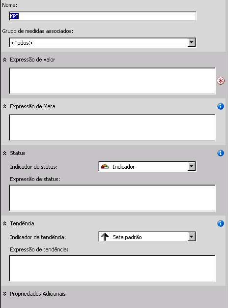

# <a name="lesson-7-1---defining-and-browsing-kpis"></a>Lição 1-7: definindo e procurando KPIs
[!INCLUDE[ssas-appliesto-sqlas](../includes/ssas-appliesto-sqlas.md)]

Para definir KPIs (indicadores chave de desempenho), você deve definir primeiramente um nome de KPI e o grupo de medidas ao qual o KPI será associado. Um KPI pode ser associado a todos ou apenas a um único grupo de medidas. Depois disso, você define os seguintes elementos do KPI:  
  
-   A expressão de valor  
  
    Uma expressão de valor é uma medida física como Vendas, uma medida calculada como Ganho ou um cálculo, que é definida dentro do KPI usando uma expressão MDX (Multidimensional Expressions).  
  
-   A expressão de meta  
  
    Uma expressão de meta é um valor, ou uma expressão MDX que resolve um valor, que define o destino da medida determinada pela expressão de valor. Por exemplo, uma expressão de meta pode ser o valor definido pelos gerentes de negócios de uma empresa para aumentar vendas ou ganhos.  
  
-   A expressão de status  
  
    Uma expressão de status é uma expressão MDX que o [!INCLUDE[ssASnoversion](../includes/ssasnoversion-md.md)] usa para avaliar o status atual da expressão de valor comparada com a expressão de meta. Uma expressão de meta é um valor normalizado entre -1 e +1, onde -1 significa muito ruim e +1 significa muito bom. A expressão de status exibe um gráfico para ajudá-lo a determinar de forma fácil o status da expressão de valor comparada com a expressão de meta.  
  
-   A expressão de tendência  
  
    Uma expressão de tendência é uma expressão MDX que o [!INCLUDE[ssASnoversion](../includes/ssasnoversion-md.md)] usa para avaliar a tendência atual da expressão de valor comparada com a expressão de meta. Uma expressão de tendência ajuda o usuário empresarial a determinar rapidamente se a expressão de valor está melhorando ou piorando com relação à expressão de meta. Você pode associar um dos vários gráficos à expressão de tendência para ajudar os usuários empresariais a entender a tendência.  
  
Além destes elementos, você define também várias propriedades de um KPI. Essas propriedades incluem uma pasta de exibição, um KPI pai caso o KPI seja computado de outros KPIs, o atual membro de tempo se houver, o peso de um KPI se houver e uma descrição do KPI.  
  
> [!NOTE]  
> Para obter mais exemplos de KPIs, consulte os exemplos de KPI na guia Modelos do painel Ferramentas de Cálculo ou nos exemplos do data warehouse de exemplo do **Adventure Works DW 2012** . Para obter mais informações sobre como instalar esse banco de dados, consulte [Instalar dados de exemplo e projetos para o tutorial de modelagem multidimensional do Analysis Services](../analysis-services/install-sample-data-and-projects.md).  
  
Na tarefa desta lição, você definirá KPIs no projeto do Tutorial do [!INCLUDE[ssASnoversion](../includes/ssasnoversion-md.md)] e depois navegará pelo cubo do Tutorial do [!INCLUDE[ssASnoversion](../includes/ssasnoversion-md.md)] usados esses KPIs. Você definirá os seguintes KPIs:  
  
-   Receita do revendedor  
  
    Este KPI é usado para mensurar como estão as vendas atual do revendedor quando comparadas às cotas de vendas para vendas de revendedores, se as vendas estão próximas da meta e qual a tendência para alcançar a meta.  
  
-   Margem de lucro bruto do produto  
  
    Este KPI é usado para determinar se a margem de lucro bruto de cada categoria de produto está próxima da meta especificada para cada categoria e também a tendência para alcançar a meta.  
  
## <a name="defining-the-reseller-revenue-kpi"></a>Definindo o KPI Receita do revendedor  
  
1.  Abra o Designer do cubo do Tutorial do [!INCLUDE[ssASnoversion](../includes/ssasnoversion-md.md)] e clique na guia **KPIs** .  
  
    A guia **KPIs** inclui vários painéis. No lado esquerdo da guia estão os painéis **Organizador de KPI** e **Ferramentas de Cálculo** . O painel de exibição, localizado na parte central da guia, contém os detalhes do KPI selecionado no painel **Organizador de KPI** .  
  
    A imagem a seguir mostra a guia **KPIs** do Designer de Cubo.  
  
      
  
2.  Na barra de ferramentas da guia **KPIs** , clique no botão **Novo KPI** .  
  
    Um modelo de KPI em branco aparece no painel de exibição, como mostra a imagem a seguir:  
  
      
  
3.  Na caixa **Nome** , digite **Receita do Revendedor**e selecione **Vendas do Revendedor** na lista **Grupo de medidas associado** .  
  
4.  Na guia **Metadados** do painel **Ferramentas de Cálculo** , expanda **Medidas**e **Vendas do Revendedor**e arraste a medida **Vendas do Revendedor-Valor de Vendas** até a caixa **Expressão de Valor** .  
  
5.  Na guia **Metadados** do painel **Ferramentas de Cálculo** , expanda **Medidas**e **Cotas de Vendas**e arraste a medida **Cota do Valor de Vendas** até a caixa **Expressão de Meta** .  
  
6.  Verifique se a opção **Medidor** está selecionada na lista **Indicador de status** . Depois, digite a seguinte expressão MDX na caixa **Expressão de status** :  
  
    ```  
    Case  
     When   
      KpiValue("Reseller Revenue")/KpiGoal("Reseller Revenue")>=.95  
       Then 1  
     When  
      KpiValue("Reseller Revenue")/KpiGoal("Reseller Revenue")<.95  
       And   
      KpiValue("Reseller Revenue")/KpiGoal("Reseller Revenue")>=.85  
       Then 0  
      Else-1  
    End  
    ```  
  
    Essa expressão MDX fornece a base para avaliar o progresso para atingir a meta. Nessa expressão, se as vendas atuais do revendedor são superiores a 85% da meta, um valor 0 é usado para popular o gráfico escolhido. Como um medidor foi o gráfico escolhido, o ponteiro desse medidor ficará no meio, entre vazio e cheio. Se as vendas atuais do revendedor forem superiores a 90%, o ponteiro do medidor ficará em ¾ entre vazio e cheio.  
  
7.  Verifique se a opção **Seta padrão** está selecionada na lista **Indicador de tendência** . Depois, digite a seguinte expressão na caixa **Expressão de tendência** :  
  
    ```  
    Case  
     When IsEmpty  
      (ParallelPeriod  
       ([Date].[Calendar Date].[Calendar Year],1,  
           [Date].[Calendar Date].CurrentMember))  
      Then 0    
     When  (  
      KpiValue("Reseller Revenue") -   
       (KpiValue("Reseller Revenue"),   
        ParallelPeriod  
         ([Date].[Calendar Date].[Calendar Year],1,  
           [Date].[Calendar Date].CurrentMember))  
          /  
          (KpiValue ("Reseller Revenue"),  
           ParallelPeriod  
            ([Date].[Calendar Date].[Calendar Year],1,  
             [Date].[Calendar Date].CurrentMember)))  
           >=.02  
      Then 1  
       When(  
        KpiValue("Reseller Revenue") -   
         (KpiValue ( "Reseller Revenue" ),  
          ParallelPeriod  
           ([Date].[Calendar Date].[Calendar Year],1,  
            [Date].[Calendar Date].CurrentMember))  
           /  
            (KpiValue("Reseller Revenue"),  
             ParallelPeriod  
              ([Date].[Calendar Date].[Calendar Year],1,  
                [Date].[Calendar Date].CurrentMember)))  
            <=.02  
      Then -1  
       Else 0  
    End  
    ```  
  
    Essa expressão MDX fornece a base para avaliar a tendência para atingir a meta definida.  
  
## <a name="browsing-the-cube-by-using-the-reseller-revenue-kpi"></a>Navegando no cubo usando o KPI Receita do revendedor  
  
1.  No menu **Compilar** do [!INCLUDE[ssBIDevStudioFull](../includes/ssbidevstudiofull-md.md)], clique em **Implantar Tutorial do Analysis Service**.  
  
2.  Quando a implantação for concluída com êxito, na barra de ferramentas da guia **KPIs** , clique no botão **Exibição de Navegador** e em **Reconectar**.  
  
    Os medidores de status e tendência são exibidos no painel **Navegador KPI** para vendas do revendedor com base nos valores para cada membro padrão de cada dimensão, juntamente com o valor do valor e da meta. O membro padrão de cada dimensão é o membro Todos do nível Todos, pois você não definiu nenhum outro membro de nenhuma dimensão como membro padrão.  
  
3.  No painel de filtros, selecione **Região de Vendas** na lista **Dimensão** , **Regiões de Vendas** na lista **Hierarquia** , **Igual** na lista **Operador** , marque a caixa de seleção **América do Norte** na lista **Expressão de Filtro** e clique em **OK**.  
  
4.  Na próxima linha do painel **Filtro** , selecione **Data** na lista **Dimensão** , selecione **Data do Calendário** na lista **Hierarquia** , selecione **Igual** na lista **Operador** , marque a caixa de seleção **Q3 CY 2007** na lista **Filtrar Expressão** e clique em **OK**.  
  
5.  Clique em qualquer lugar no painel **Navegador KPI** para atualizar os valores do **KPI Receita do Revendedor**.  
  
    Observe que as seções **Valor**, **Meta**e **Status** do KPI refletem os valores do novo período  
  
## <a name="defining-the-product-gross-profit-margin-kpi"></a>Definindo o KPI Margem de lucro bruto do produto  
  
1.  Clique no botão **Exibição de Formulário** na barra de ferramentas da guia **KPIs** e clique no botão **Novo KPI** .  
  
2.  Na caixa **Nome** , digite **Margem de lucro bruto do produto**e verifique se **<All>** é exibido na lista **Grupo de medidas associado** .  
  
3.  Na guia **Metadados** no painel **Ferramentas de Cálculo** , arraste a medida **MLB Total** até a caixa **Expressão de Valor** .  
  
4.  Na caixa **Expressão de Meta** , digite a seguinte expressão:  
  
    ```  
    Case  
        When [Product].[Category].CurrentMember Is  
          [Product].[Category].[Accessories]  
        Then .40                   
        When [Product].[Category].CurrentMember   
          Is [Product].[Category].[Bikes]  
        Then .12                  
        When [Product].[Category].CurrentMember Is  
          [Product].[Category].[Clothing]  
        Then .20  
        When [Product].[Category].CurrentMember Is  
          [Product].[Category].[Components]  
        Then .10  
        Else .12              
    End  
    ```  
  
5.  Na lista **Indicador de status** , selecione **Cilindro**.  
  
6.  Digite a seguinte expressão MDX na caixa **Expressão de status** :  
  
    ```  
    Case  
        When KpiValue( "Product Gross Profit Margin" ) /   
             KpiGoal ( "Product Gross Profit Margin" ) >= .90  
        Then 1  
        When KpiValue( "Product Gross Profit Margin" ) /   
             KpiGoal ( "Product Gross Profit Margin" ) <  .90  
             And   
             KpiValue( "Product Gross Profit Margin" ) /   
             KpiGoal ( "Product Gross Profit Margin" ) >= .80  
        Then 0  
        Else -1  
    End  
    ```  
  
    Essa expressão MDX fornece a base para avaliar o progresso para atingir a meta.  
  
7.  Verifique se **Seta padrão** está selecionada na lista **Indicador de tendência** . Depois, digite a seguinte expressão MDX na caixa **Expressão de tendência** :  
  
    ```  
    Case  
    When IsEmpty  
      (ParallelPeriod  
       ([Date].[Calendar Date].[Calendar Year],1,  
           [Date].[Calendar Date].CurrentMember))  
      Then 0    
       When VBA!Abs  
        (  
          KpiValue( "Product Gross Profit Margin" ) -   
           (  
             KpiValue ( "Product Gross Profit Margin" ),  
              ParallelPeriod  
              (   
                [Date].[ Calendar Date].[ Calendar Year],  
                1,  
                [Date].[ Calendar Date].CurrentMember  
              )  
            ) /  
            (  
              KpiValue ( "Product Gross Profit Margin" ),  
              ParallelPeriod  
              (   
                [Date].[ Calendar Date].[ Calendar Year],  
                1,  
                [Date].[ Calendar Date].CurrentMember  
              )  
            )    
          ) <=.02  
      Then 0  
      When KpiValue( "Product Gross Profit Margin" ) -   
           (  
             KpiValue ( "Product Gross Profit Margin" ),  
             ParallelPeriod  
             (   
               [Date].[ Calendar Date].[ Calendar Year],  
               1,  
               [Date].[ Calendar Date].CurrentMember  
             )  
           ) /  
           (  
             KpiValue ( "Product Gross Profit Margin" ),  
             ParallelPeriod  
             (   
               [Date].[Calendar Date].[Calendar Year],  
               1,  
               [Date].[Calendar Date].CurrentMember  
             )  
           )  >.02  
      Then 1  
      Else -1  
    End  
    ```  
  
    Essa expressão MDX fornece a base para avaliar a tendência para atingir a meta definida.  
  
## <a name="browsing-the-cube-by-using-the-total-gross-profit-margin-kpi"></a>Navegando no cubo usando o KPI Margem de lucro bruto total  
  
1.  No menu **Compilar** , clique em **Implantar Tutorial do Analysis Service**.  
  
2.  Quando a implantação for concluída com êxito, clique no botão **Reconectar** na barra de ferramentas da guia **KPIs** e clique em **Exibição de Navegador**.  
  
    O KPI **Margem de Lucro Bruto do Produto** é mostrado e exibe o valor do KPI para **Q3 CY 2007** e a região de vendas **América do Norte** .  
  
3.  No painel **Filtro** , selecione **Produto** na lista **Dimensão** , **Categoria** na lista **Hierarquia** , **Igual** na lista **Operador** , **Bicicletas** na lista **Expressão de Filtro** e clique em **OK**.  
  
    A margem de lucro bruto para a venda de bicicletas dos revendedores na América do Norte no período Q3 CY 2007 é exibida.  
  
## <a name="next-lesson"></a>Próxima lição  
[Lição 8: Definindo ações](../analysis-services/lesson-8-defining-actions.md)  
  
