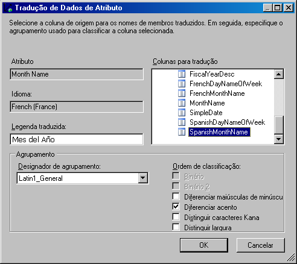
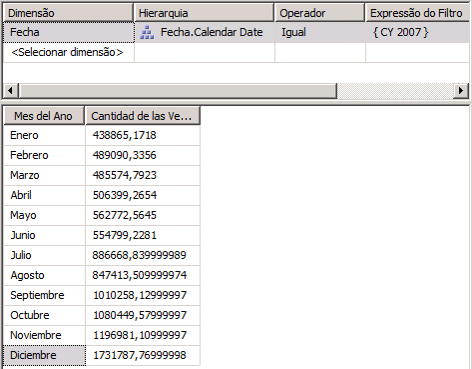

# Lição 9-2-Definindo e procurando traduções
Uma tradução é uma representação dos nomes de objetos do [!INCLUDE[ssASnoversion](../includes/ssasnoversion-md.md)] em uma linguagem específica. Os objetos incluem grupos de medidas, medidas, dimensões, atributos, hierarquias, KPIs, ações e membros calculados. As traduções oferecem suporte de servidor a aplicativos cliente que podem oferecer suporte para vários idiomas. Como cliente, basta passar o identificador de localidade (LCID) para a instância do [!INCLUDE[ssASnoversion](../includes/ssasnoversion-md.md)], que usa o LCID para determinar qual conjunto de traduções deverá ser usado quando ele fornecer metadados para os objetos do [!INCLUDE[ssASnoversion](../includes/ssasnoversion-md.md)] . Se um objeto do [!INCLUDE[ssASnoversion](../includes/ssasnoversion-md.md)] não tiver uma tradução para o idioma ou para um objeto específico, o idioma padrão será usado para retornar o metadados do objeto ao cliente. Por exemplo, se um usuário empresarial na França acessar um cubo a partir de uma estação de trabalho que tenha uma configuração local francesa, esse usuário poderá visualizar as legendas de membro e os valores de propriedade de membro na França, caso haja uma tradução francesa. Entretanto, se um usuário empresarial na Alemanha acessar o mesmo cubo a partir de uma estação de trabalho que tenha uma configuração local alemã, esse usuário poderá visualizar os nomes de membro e os valores de propriedade de membro em alemão. Para obter mais informações, consulte [Traduções de cubo](../analysis-services/multidimensional-models-olap-logical-dimension-objects/dimension-translations.md), [Traduções de dimensão](../analysis-services/multidimensional-models-olap-logical-cube-objects/cube-translations.md)e [Suporte a tradução no Analysis Services](../analysis-services/translation-support-in-analysis-services.md).  
  
Nas tarefas deste tópico, você define as traduções de metadados para um conjunto limitado de objetos de dimensões na dimensão Data e objetos de cubo no cubo do Tutorial do [!INCLUDE[ssASnoversion](../includes/ssasnoversion-md.md)] . Em seguida, será possível navegar pelas dimensões e objetos de cubo para examinar as traduções de metadados.  
  
## Especificando traduções para os metadados de dimensão Data  
  
1.  Abra o Designer de Dimensão na dimensão **Data** e clique na guia **Traduções** .  
  
    Os metadados no idioma padrão de cada objeto de dimensão aparecem. O idioma padrão no cubo do Tutorial do [!INCLUDE[ssASnoversion](../includes/ssasnoversion-md.md)] é o inglês.  
  
2.  Na barra de ferramentas da guia **Traduções** , clique no botão **Nova Tradução** .  
  
    Uma lista de idiomas é exibida na caixa de diálogo **Selecionar Idioma** .  
  
3.  Clique em **Espanhol (Espanha)**e em **OK**.  
  
    Uma nova coluna será exibida na qual você poderá definir traduções espanholas para os objetos do metadados que deseja traduzir. Neste tutorial, traduziremos apenas alguns objetos para ilustrar o processo.  
  
4.  Na barra de ferramentas da guia **Traduções** , clique no botão **Nova Tradução** , clique em **Francês (França)** na caixa de diálogo **Selecionar Idioma** e clique em **OK**.  
  
    Outra coluna de idioma será exibida e nela você poderá definir as traduções francesas.  
  
5.  Na linha do objeto **Legenda** da dimensão **Data** , digite **Fecha** na coluna de tradução para o **Espanhol (Espanha)** e **Temps** na coluna de tradução para o **Francês (França)** .  
  
6.  Na linha do objeto **Legenda** no atributo **Nome do Mês** , digite **Mes del Año** na coluna de tradução para o **Espanhol (Espanha)** e **Mois d'Année** na coluna de tradução para o **Francês (França)** .  
  
    Observe que, quando você insere essas traduções, um sinal de reticências (**…**) é exibido. Ao clicar nas reticências, você pode especificar uma coluna na tabela subjacente que fornece as traduções para cada membro da hierarquia do atributo.  
  
7.  Clique nas reticências (**…**) para obter a tradução no idioma **Espanhol (Espanha)** do atributo **Nome do Mês** .  
  
    A caixa de diálogo **Tradução de Dados de Atributo** é exibida.  
  
8.  Na lista **Colunas de tradução** , selecione **SpanishMonthName**, conforme mostrado na imagem a seguir.  
  
      
  
9. Clique em **OK**e clique nas reticências (**…**) para obter a tradução no idioma **Francês (França)** do atributo **Nome do Mês** .  
  
10. Na lista **Colunas de tradução** , selecione **FrenchMonthName**e clique em **OK**.  
  
    As etapas neste procedimento ilustram o processo de definição das traduções de metadados para objetos de dimensão e membros.  
  
## Especificando traduções para o metadados de cubo do Tutorial do Analysis Services  
  
1.  Alterne para o Designer do cubo do Tutorial do [!INCLUDE[ssASnoversion](../includes/ssasnoversion-md.md)] e mude para a guia **Traduções** .  
  
    O metadados no idioma padrão de cada objeto de cubo é exibido, como mostra a imagem a seguir. O idioma padrão no cubo do Tutorial do [!INCLUDE[ssASnoversion](../includes/ssasnoversion-md.md)] é o inglês.  
  
      
  
2.  Na barra de ferramentas da guia **Traduções** , clique no botão **Nova Tradução** .  
  
    Uma lista de idiomas é exibida na caixa de diálogo **Selecionar Idioma** .  
  
3.  Selecione **Espanhol (Espanha)**e clique em **OK**.  
  
    Uma nova coluna será exibida na qual você poderá definir traduções espanholas para os objetos do metadados que deseja traduzir. Neste tutorial, traduziremos apenas alguns objetos para ilustrar o processo.  
  
4.  Na barra de ferramentas da guia **Traduções** , clique no botão **Nova Tradução** , selecione **Francês (França)** na caixa de diálogo **Selecionar Idioma** e clique em **OK**.  
  
    Outra coluna de idioma será exibida e nela você poderá definir as traduções francesas.  
  
5.  Na linha do objeto **Legenda** da dimensão **Data** , digite **Fecha** na coluna de tradução para o **Espanhol (Espanha)** e **Temps** na coluna de tradução para o **Francês (França)** .  
  
6.  Na linha do objeto **Legenda** no grupo de medidas **Vendas pela Internet** , digite **Ventas del lnternet** na coluna de tradução para o **Espanhol (Espanha)** e **Ventes D'Internet** na coluna de tradução para o **Francês (França)** .  
  
7.  Na linha do objeto **Legenda** na medida Quantidade de Vendas pela Internet, digite **Cantidad de las Ventas del Internet** na coluna de tradução para o **Espanhol (Espanha)** e **Quantité de Ventes d'Internet** na coluna de tradução para o **Francês (França)** .  
  
    As etapas neste procedimento ilustram o processo de definição das traduções de metadados para objetos de cubo.  
  
## Navegando pelo cubo usando as traduções  
  
1.  No menu **Compilar** , clique em **Implantar Tutorial do Analysis Services**.  
  
2.  Quando a implantação for concluída com êxito, mude para a guia **Navegador** e clique em **Reconectar**.  
  
3.  Remova todas as hierarquias e medidas do painel **Dados** e selecione Tutorial do [!INCLUDE[ssASnoversion](../includes/ssasnoversion-md.md)] na lista **Perspectivas** .  
  
4.  No painel de metadados, expanda **Medidas** e **Vendas pela Internet**.  
  
    Observe que a medida **Vendas pela Internet/Valor das Vendas** é exibida em inglês (Internet Sales-Sales Amount) neste grupo de medidas.  
  
5.  Na barra de ferramentas, selecione **Espanhol (Espanha)** na lista **Idioma** .  
  
    Observe que os itens no painel de metadados são preenchidos novamente. Após o preenchimento dos itens, observe que a medida Quantidade de Vendas pela Internet não aparece mais na pasta de exibição Vendas pela Internet. Em vez disso, ela é exibida em espanhol em uma nova pasta de exibição chamada **Ventas del lnternet**, como mostra a imagem a seguir.  
  
      
  
6.  No painel de metadados, clique com o botão direito do mouse em **Cantidad de las Ventas del Internet** e selecione **Adicionar à Consulta**.  
  
7.  No painel de metadados, expanda **Fecha**, expanda **Fecha.Calendar Date**, clique com o botão direito do mouse em **Fecha.Calendar Date**e selecione **Adicionar ao Filtro**.  
  
8.  No painel **Filtro** , selecione **CY 2007** como a expressão de filtro.  
  
9. No painel de metadados, clique com o botão direito do mouse em **Mes del Ano** e selecione **Adicionar à Consulta**.  
  
    Observe que os nomes de mês são exibidos em espanhol, como mostra a imagem a seguir.  
  
      
  
10. Na barra de ferramentas, selecione **Francês (França)** na lista **Idioma** .  
  
    Observe que agora os nomes de mês e de medida são exibidos em francês.  
  
## Próxima lição  
[Lição 10: Definindo funções administrativas](../analysis-services/lesson-10-defining-administrative-roles.md)  
  
## Consulte também  
[Traduções de cubo](../analysis-services/multidimensional-models-olap-logical-dimension-objects/dimension-translations.md)  
[Traduções de cubo](../analysis-services/multidimensional-models-olap-logical-cube-objects/cube-translations.md)  
[Suporte a tradução no Analysis Services](../analysis-services/translation-support-in-analysis-services.md)  
  
  
  
