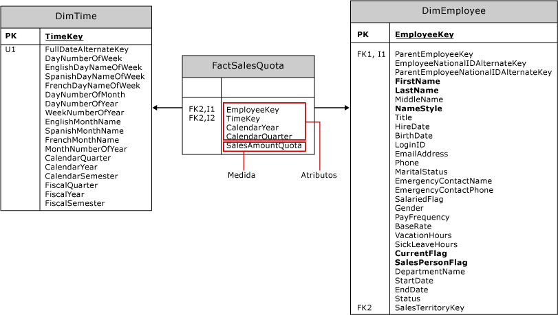

# Criar medidas e grupos de medidas em modelos multidimensionais
[!INCLUDE[ssas-appliesto-sqlas](../../includes/ssas-appliesto-sqlas.md)]
  Uma *medida* é uma agregação de valores de dados numéricos, como soma, contagem, mínima, máxima, média ou uma expressão MDX personalizada criada por você. Um *grupo de medidas* é um contêiner para uma ou mais medidas. Todas as medidas existem em um grupo de medidas, mesmo que haja somente uma medida. Um cubo deve ter pelo menos uma medida e um grupo de medidas.  
  
 Este tópico inclui as seguintes seções:  
  
-   [Abordagens para criar medidas](#bkmk_create)  
  
-   [Componentes de uma medida](#bkmk_comps)  
  
-   [Medidas de modelagem e grupos de medidas em fatos e em tabelas de fatos](#bkmk_modeling)  
  
-   [Granularidade de um grupo de medidas](#bkmk_grain)  
  
##   Abordagens para criar medidas  
 Medidas podem ser um elemento estático do cubo, criado no momento do design, sempre presente quando o cubo for acessado. Mas você também pode definir uma medida como um *membro calculado* usando uma MDX para fornecer um valor calculado para uma medida com base em outras medidas no cubo. Um membro calculado pode ter escopo para sessão ou usuário.  
  
 Para criar uma medida ou um grupo de medidas, use uma destas abordagens:  
  
|||  
|-|-|  
|Assistente para Cubos|Execute o Assistente de cubo no [!INCLUDE[ssBIDevStudioFull](../../includes/ssbidevstudiofull-md.md)] para criar um cubo.   No Gerenciador de Soluções, clique com o botão direito do mouse em **Cubos** e selecione **Novo Cubo**. Consulte [Modelagem Multidimensional &#40;Tutorial do Adventure Works&#41;](../../analysis-services/multidimensional-modeling-adventure-works-tutorial.md) se precisar de ajuda com estas etapas.   Quando você cria um cubo com base em tabelas por meio de um data warehouse existente, as definições para as medidas e o grupo de medidas se materializam como parte do processo de criação do cubo. No assistente, você escolherá quais fatos e tabelas de fatos usar como base para a medida e os objetos do grupo de medidas em seu cubo.|  
|Caixa de diálogo Nova medida|Supondo que o cubo já existe no [!INCLUDE[ssBIDevStudioFull](../../includes/ssbidevstudiofull-md.md)], clique duas vezes no nome do cubo no Gerenciador de Soluções para abri-lo no Designer de Cubo. No painel Medidas, clique com o botão direito do mouse no nó superior para criar um novo grupo de medidas, ou novas medidas, especificando uma tabela de origem, uma coluna e um tipo de agregação. O uso dessa abordagem requer que você escolha o método de agregação em uma lista fixa de funções pré-compiladas. Consulte [Use Aggregate Functions](../../analysis-services/multidimensional-models/use-aggregate-functions.md) para obter uma discussão das agregações usadas com mais frequência.|  
|membro calculado|Os membros calculados adicionam flexibilidade e capacidade de análise para um cubo no [!INCLUDE[ssASnoversion](../../includes/ssasnoversion-md.md)] , pois você pode controlar quando e como eles são criados. Às vezes, você só precisa de uma medida temporária, pela duração de uma sessão de usuário ou no Management Studio como parte de uma investigação.   Em [!INCLUDE[ssBIDevStudioFull](../../includes/ssbidevstudiofull-md.md)], abra a guia Cálculos para criar um novo membro calculado.   Escolha essa abordagem ao basear uma medida em uma expressão MDX. Consulte estes tópicos para obter mais informações: [Compilando medidas em MDX](../../analysis-services/multidimensional-models/mdx/mdx-building-measures.md), [Cálculos](../../analysis-services/multidimensional-models-olap-logical-cube-objects/calculations.md), [Cálculos em modelos multidimensionais](../../analysis-services/multidimensional-models/calculations-in-multidimensional-models.md) e [Conceitos básicos do script MDX &#40;Analysis Services&#41;](../../analysis-services/multidimensional-models/mdx/mdx-scripting-fundamentals-analysis-services.md).|  
|MDX ou XMLA|No SQL Server Management Studio, você pode executar o MDX ou XMLA para alterar um banco de dados para incluir uma nova medida calculada. Essa abordagem é útil para teste ad hoc de dados, depois que a solução for implantada em um servidor. Consulte [Document and Script an Analysis Services Database](../../analysis-services/multidimensional-models/document-and-script-an-analysis-services-database.md).|  
  
##   Componentes de uma medida  
 Uma medida é um objeto com propriedades. Além de seu nome, uma medida deve ter um tipo de agregação e uma coluna de origem ou uma expressão usada para carregar a medida com dados. Você pode modificar a definição da medida definindo suas propriedades.  
  
|||  
|-|-|  
|**origem**|A maioria das medidas é proveniente de colunas numéricas em tabelas de fatos em um data warehouse externo, como a coluna Valor das Vendas nas tabelas Vendas pela Internet e Vendas do Revendedor no data warehouse do AdventureWorks, mas você também pode criar novas medidas inteiramente com base nos cálculos definidos por você.   As colunas de atributos de tabelas de dimensões podem ser usadas para definir medidas, mas tais medidas são geralmente semiaditivas ou não aditivas em termos de seu comportamento de agregação. Para obter mais informações sobre o comportamento semiaditivo, consulte [Definir comportamento semiaditivo](../../analysis-services/multidimensional-models/define-semiadditive-behavior.md).|  
|**agregação**|Por padrão, as medidas são somadas a cada dimensão. No entanto, a propriedade **AggregateFunction** permite a modificação desse comportamento. Consulte [Use Aggregate Functions](../../analysis-services/multidimensional-models/use-aggregate-functions.md) para obter uma lista.|  
|**Propriedades**|Consulte [Configure Measure Properties](../../analysis-services/multidimensional-models/configure-measure-properties.md) para obter descrições de propriedades adicionais.|  
  
##   Medidas de modelagem e grupos de medidas em fatos e em tabelas de fatos  
 Antes de executar um assistente, é importante entender os princípios de modelagem por trás da definição da medida.  
  
 Medidas e grupos de medidas são os objetos multidimensionais que representam fatos e tabelas de fatos em um data warehouse externo. Na maioria dos casos, medidas e grupos de medidas serão baseados em objetos em uma exibição da fonte de dados que, por sua vez, são criados por meio do data warehouse subjacente.  
  
 O diagrama a seguir representa a tabela de fatos **FactSalesQuota** e duas tabelas de dimensões a ela, **DimTime** e **DimEmployee**. No cubo de exemplo do Adventure Works, essas tabelas são usadas como base para o grupo de medidas Cotas de vendas e as dimensões Tempo e Funcionário.  
  
   
  
 A tabela de fatos contém dois tipos básicos de colunas: colunas de atributos e colunas de medidas.  
  
-   As colunas de atributos são usadas para criar relações de chave estrangeira com tabelas de dimensões, de modo que os dados quantificáveis nas colunas de medidas possam ser organizados por dados contidos nas tabelas de dimensões. As colunas de atributos também são usadas para definir a granularidade de uma tabela de fatos e seu grupo de medidas.  
  
-   As colunas de medidas definem as medidas contidas por um grupo de medidas.  
  
 Quando você executa o Assistente de cubo, as chaves estrangeiras são filtradas. Na lista de colunas restantes à sua escolha, você verá as colunas de medidas, além de colunas de atributos que não são identificadas como uma chave estrangeira. No exemplo **FactSalesQuote** , o assistente oferecerá **CalendarYear** e **CalendarQuarter** além de **SalesAmountQuota**. Somente a coluna de medidas **SalesAmountQuota** resultará em uma medida viável para o seu modelo multidimensional. As outras colunas com base em data existem para qualificar cada valor da cota. Você deve excluir as outras colunas, **CalendarYear** e **CalendarQuarter**, da lista de medidas no Assistente de Cubo (ou removê-las do grupo de medidas posteriormente no designer).  
  
 O que se aproveita dessa discussão é que nem todas as colunas oferecidas pelo assistente são úteis como uma medida. Contar com a compreensão dos dados e como eles serão usados ao decidir quais colunas usar como medidas. Lembre-se de que é possível clicar com o botão direito do mouse em uma tabela na exibição da fonte de dados para explorar os dados, o que pode ajudá-lo a identificar quais colunas usar como medidas. Consulte [Explorar dados em uma exibição da fonte de dados &#40;Analysis Services&#41;](../../analysis-services/multidimensional-models/explore-data-in-a-data-source-view-analysis-services.md) para obter mais informações.  
  
> [!NOTE]  
>  Nem todas as medidas são derivadas diretamente de um valor armazenado em uma coluna da tabela de fatos. Por exemplo, a medida **Conta de Identificação do Vendedor** definida no grupo de medidas **Cota de Vendas** do cubo de exemplo do Adventure Works é realmente baseado na contagem de valores exclusivos (ou contagem distinta) na coluna **EmployeeKey** da tabela de fatos **FactSalesQuota** .  
  
##   Granularidade de um grupo de medidas  
 Grupos de medidas têm uma granularidade associada que se refere ao nível de detalhes suportados por uma tabela de fatos. A granularidade é definida por meio da relação de chave estrangeira em uma dimensão.  
  
 Por exemplo, a tabela de fatos **FactSalesQuota** tem uma relação de chave estrangeira com a tabela **DimEmployee** , cada registro da tabela **FactSalesQuota** está relacionado a um único funcionário e, além disso, a granularidade do grupo de medidas. conforme exibido por meio da dimensão do Funcionário, está no nível do funcionário individual.  
  
 A granularidade do grupo de medidas nunca pode ser definida como menor que o nível mais baixo da dimensão da qual o grupo de medidas é exibido, mas a granularidade pode ser maior usando atributos adicionais. Por exemplo, a tabela de fatos **FactSalesQuota** usa três colunas, **TimeKey**, **CalendarYear**e **CalendarQuarter**para definir a granularidade da relação com a tabela **DimTime** . Como resultado, a granularidade do grupo de medidas conforme exibido pela dimensão Temporal é por trimestre de calendário e não por dia, que é o nível mais baixo da dimensão Temporal.  
  
 Você pode especificar a granularidade do grupo de medidas com relação a uma dimensão específica usando a guia **Dimensão do Uso** do Designer de Cubo. Para obter mais informações sobre as relações da dimensão, consulte [Dimension Relationships](../../analysis-services/multidimensional-models-olap-logical-cube-objects/dimension-relationships.md).  
  
## Consulte também  
 [Cubos em modelos multidimensionais](../../analysis-services/multidimensional-models/cubes-in-multidimensional-models.md)   
 [Medidas e grupos de medidas](../../analysis-services/multidimensional-models/measures-and-measure-groups.md)  
  
  
