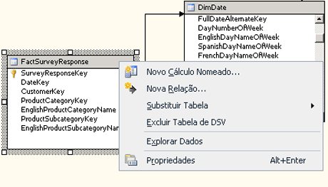

# <a name="define-named-calculations-in-a-data-source-view-analysis-services"></a>Definir cálculos nomeados em uma exibição da fonte de dados (Analysis Services)
[!INCLUDE[ssas-appliesto-sqlas](../../includes/ssas-appliesto-sqlas.md)]Um cálculo nomeado é uma expressão SQL representada como uma coluna calculada. Essa expressão aparece e se comporta como uma coluna da tabela. Um cálculo nomeado permite que você estenda o esquema relacional das tabelas ou exibições existentes sem modificar as tabelas ou exibições da fonte de dados subjacente. Considere os seguintes exemplos:  
  
-   Crie um único cálculo nomeado que é derivado de várias colunas em uma tabela de fato (por exemplo, criando Quantidade de Imposto multiplicando uma taxa de imposto por um preço de venda).  
  
-   Construa um nome amigável de usuário para um membro de dimensão.  
  
-   Como um aprimoramento de desempenho de consulta, crie um cálculo nomeado no DSV em vez de criar um membro calculado em um cubo. Cálculos nomeados são calculados durante o processamento, enquanto os membros calculados são calculados no momento da consulta.  
  
## <a name="creating-named-calculations"></a>Criando cálculos nomeados  
  
> [!NOTE]  
>  Não é possível adicionar um cálculo nomeado a uma consulta nomeada nem usar como base de uma consulta nomeada uma tabela que contém um cálculo nomeado.  
  
 Ao criar um cálculo nomeado, você especifica uma expressão SQL e, opcionalmente, uma descrição do cálculo. A expressão SQL pode fazer referência a outras tabelas da exibição da fonte de dados. Depois de definido o cálculo nomeado, a expressão é um cálculo nomeado enviado ao provedor da fonte de dados e validado como a instrução SQL a seguir, na qual `<Expression>` contém a expressão que define o cálculo nomeado.  
  
```  
SELECT   
   <Table Name in Data Source>.*,   
   <Expression> AS <Column Name>   
FROM   
   <Table Name in Data Source> AS <Table Name in Data Source View>  
```  
  
 O tipo de dados da coluna é determinado pelo tipo de dados do valor escalar retornado pela expressão. Se o provedor não encontrar erros na expressão, a coluna será adicionada à tabela.  
  
 Colunas às quais a expressão faz referência não devem ser qualificadas ou devem ser qualificadas somente pelo nome da tabela. Por exemplo, para fazer referência à coluna SaleAmount em uma tabela, o valor `SaleAmount` ou `Sales.SaleAmount` é válido, mas `dbo.Sales.SaleAmount` produzirá um erro.  
  
 A expressão não é encerrada entre parênteses automaticamente. Portanto, se uma expressão, como uma instrução SELECT, exigir parênteses, digite-os na caixa **Expressão** . Por exemplo, a expressão a seguir será válida somente se você digitar os parênteses.  
  
```  
(SELECT Description FROM Categories WHERE Categories.CategoryID = CategoryID)  
```  
  
## <a name="add-or-edit-a-named-calculation"></a>Adicionar ou editar um cálculo nomeado  
  
1.  No [!INCLUDE[ssBIDevStudioFull](../../includes/ssbidevstudiofull-md.md)], abra o projeto ou conecte-se ao banco de dados que contém a exibição da fonte de dados na qual você deseja definir um cálculo nomeado.  
  
2.  No Gerenciador de Soluções, expanda a pasta **Exibições da Fonte de Dados** e clique duas vezes na exibição da fontes de dados.  
  
3.  No painel **Tabelas** ou **Diagrama** , clique com o botão direito do mouse na tabela na qual você deseja definir o cálculo nomeado e, em seguida, clique em **Novo Cálculo Nomeado**. Clique com o botão direito do mouse no nome de tabela, e não em um atributo. O menu deverá ser semelhante ao seguinte:  
  
       
  
    > [!NOTE]  
    >  Para localizar uma tabela ou exibição, use a opção **Localizar Tabela** clicando no menu **Exibição da Fonte de Dados** ou clicando com o botão direito do mouse em uma área livre dos painéis **Tabelas** ou **Diagrama** .  
  
4.  Na caixa de diálogo **Criar Cálculo Nomeado** , faça o seguinte:  
  
    -   Na caixa de texto **Nome da coluna** , digite o nome da nova coluna.  
  
    -   Na caixa de texto **Descrição** , digite uma descrição para a nova coluna.  
  
    -   Na caixa de texto **Expressão** , digite a expressão que produz o conteúdo da nova coluna no dialeto SQL apropriado para o provedor de dados.  
  
5.  Clique em **OK**.  
  
     A coluna de cálculo nomeado aparece como a última coluna na tabela de exibição da fonte de dados. Um símbolo de calculadora indica que a coluna contém um cálculo nomeado.  
  
## <a name="delete-a-named-calculation"></a>Excluir um cálculo nomeado  
 Quando você tenta excluir um cálculo nomeado, recebe uma lista de objetos definidos no projeto ou no banco de dados que serão invalidados pela exclusão. Revise a lista com cuidado antes de excluir o cálculo.  
  
## <a name="see-also"></a>Consulte Também  
 [Definir consultas nomeadas em uma exibição da fonte de dados &#40;Analysis Services&#41;](../../analysis-services/multidimensional-models/define-named-queries-in-a-data-source-view-analysis-services.md)  
  
  
