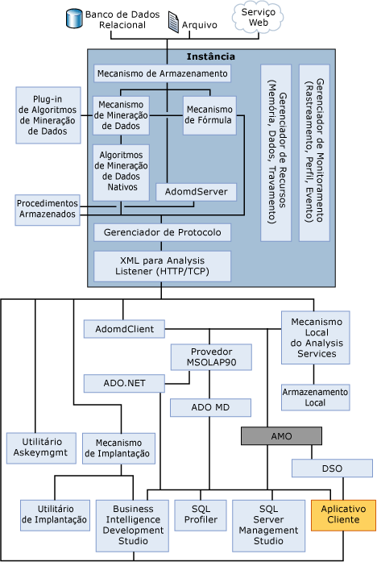

# Componentes do servidor de mecanismo OLAP
  O componente do servidor [!INCLUDE[msCoName](../../../includes/msconame-md.md)] [!INCLUDE[ssNoVersion](../../../includes/ssnoversion-md.md)] [!INCLUDE[ssASnoversion](../../../includes/ssasnoversion-md.md)] é o **msmdsrv.exe** aplicativo, que é executado como um serviço do Windows. Esse aplicativo consiste em componentes de segurança, um componente de ouvinte do XML for Analysis (XMLA), um componente de processador de consulta e vários outros componentes internos que executam as seguintes funções:  
  
-   Análise de instruções recebidas dos clientes  
  
-   Gerenciamento de metadados  
  
-   Tratamento de transações  
  
-   Processamento de cálculos  
  
-   Armazenagem de dimensões e dados de célula  
  
-   Criação de agregações  
  
-   Programação de consultas  
  
-   Cache de objetos  
  
-   Gerenciamento de recursos do servidor  
  
## Diagrama de arquitetura  
 Uma instância do [!INCLUDE[ssASnoversion](../../../includes/ssasnoversion-md.md)] executada como serviço e comunicação autônomos com o serviço ocorre por meio do XMLA, usando HTTP ou TCP. AMO é uma camada entre o aplicativo de usuário e a instância do [!INCLUDE[ssASnoversion](../../../includes/ssasnoversion-md.md)]. Essa camada fornece acesso a objetos administrativos do [!INCLUDE[ssASnoversion](../../../includes/ssasnoversion-md.md)]. AMO é uma biblioteca de classe que recebe comandos de um aplicativo cliente e os converte em mensagens de XMLA para a instância do [!INCLUDE[ssASnoversion](../../../includes/ssasnoversion-md.md)] . AMO apresenta objetos de instância do [!INCLUDE[ssASnoversion](../../../includes/ssasnoversion-md.md)] como classes para o aplicativo de usuário final, com membros de método que executam comandos e membros de propriedade que mantêm os dados para os objetos [!INCLUDE[ssASnoversion](../../../includes/ssasnoversion-md.md)] .  
  
 A ilustração a seguir mostra a arquitetura de componentes do [!INCLUDE[ssASnoversion](../../../includes/ssasnoversion-md.md)], inclusive todos os elementos principais executados dentro da instância do [!INCLUDE[ssASnoversion](../../../includes/ssasnoversion-md.md)] e todos os componentes de usuário que interagem com a instância. A ilustração também mostra que o único modo de acessar a instância é usando o ouvinte do XML for Analysis (XMLA) ou usando HTTP ou TCP.  
  
   
  
## Ouvinte XMLA  
 O componente ouvinte XMLA processa todas as comunicações de XMLA entre o [!INCLUDE[ssASnoversion](../../../includes/ssasnoversion-md.md)] e seus clientes. O parâmetro de configuração do [!INCLUDE[ssASnoversion](../../../includes/ssasnoversion-md.md)] **Porta** no arquivo msmdsrv.ini pode ser usado para especificar uma porta na qual uma instância do [!INCLUDE[ssASnoversion](../../../includes/ssasnoversion-md.md)] ouve. Um valor 0 nesse arquivo indica que o [!INCLUDE[ssASnoversion](../../../includes/ssasnoversion-md.md)] ouve na porta padrão. A menos que especificado de outro modo, o [!INCLUDE[ssASnoversion](../../../includes/ssasnoversion-md.md)] usa as seguintes portas TCP padrão:  
  
|Porta|Description|  
|----------|-----------------|  
|2383|Instância padrão do [!INCLUDE[ssNoVersion](../../../includes/ssnoversion-md.md)][!INCLUDE[ssASnoversion](../../../includes/ssasnoversion-md.md)].|  
|2382|Redirecionador para outras instâncias do [!INCLUDE[ssNoVersion](../../../includes/ssnoversion-md.md)] [!INCLUDE[ssASnoversion](../../../includes/ssasnoversion-md.md)].|  
|Atribuído dinamicamente na inicialização do servidor|Instância nomeada do [!INCLUDE[ssNoVersion](../../../includes/ssnoversion-md.md)] [!INCLUDE[ssASnoversion](../../../includes/ssasnoversion-md.md)].|  
  
 Consulte [configurar o Firewall do Windows para permitir acesso ao Analysis Services](../../../analysis-services/instances/configure-the-windows-firewall-to-allow-analysis-services-access.md) para obter mais detalhes.  
  
## Consulte também  
 [Regras de nomenclatura &#40; do objeto Analysis Services &#41;](../../../analysis-services/multidimensional-models/olap-physical/object-naming-rules-analysis-services.md)   
 [Arquitetura física &#40; Analysis Services - dados multidimensionais &#41;](../../../analysis-services/multidimensional-models/olap-physical/understanding-microsoft-olap-physical-architecture.md)   
 [Arquitetura lógica &#40; Analysis Services - dados multidimensionais &#41;](../../../analysis-services/multidimensional-models/olap-logical/understanding-microsoft-olap-logical-architecture.md)  
  
  
