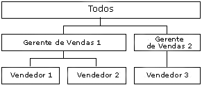

# Atributos de dimensão pai-filho
[!INCLUDE[ssas-appliesto-sqlas](../../includes/ssas-appliesto-sqlas.md)]
  No [!INCLUDE[msCoName](../../includes/msconame-md.md)] [!INCLUDE[ssNoVersion](../../includes/ssnoversion-md.md)] [!INCLUDE[ssASnoversion](../../includes/ssasnoversion-md.md)], normalmente é feita uma suposição geral sobre o conteúdo dos membros de uma dimensão. Membros folha contêm dados extraídos diretamente das fontes de dados subjacentes; membros não folha contêm dados provenientes de agregações realizadas pelos membros filho.  
  
 No entanto, em uma hierarquia pai-filho, alguns membros não folha também podem ter dados provenientes de fontes de dados subjacentes, além dos dados agregados dos membros filho. Para esses membros não folha de uma hierarquia pai-filho, são criados membros filho especiais gerados pelo sistema, contendo dados da tabela de fatos subjacente. Denominados *membros de dados*, eles contêm um valor que é diretamente associado a um membro não folha e é independente do valor resumido calculado a partir dos descendentes do membro não folha.  
  
 Os membros de dados ficam disponíveis somente para dimensões com hierarquias pai-filho e são visíveis apenas se o atributo pai permitir. Use o Designer de Dimensão para controlar a visibilidade de membros de dados. Para expor os membros de dados, defina a propriedade **MembersWithData** do atributo pai como **NonLeafDataVisible**. Para ocultar os membros de dados contidos pelo atributo pai, defina a propriedade **MembersWithData** no atributo pai como **NonLeafDataHidden**.  
  
 Essa configuração não substitui o comportamento de agregação normal de membros não folha; o membro de dados é sempre incluído como membro filho para a agregação. No entanto, uma fórmula de acúmulo personalizado pode ser usada para anular o comportamento de agregação normal. A função MDX [DataMember](../../mdx/datamember-mdx.md) fornece a capacidade de acessar o valor do membro de dados associado independentemente do valor da propriedade **MembersWithData** .  
  
 A propriedade **MembersWithDataCaption** do atributo pai fornece ao [!INCLUDE[ssASnoversion](../../includes/ssasnoversion-md.md)] o modelo de nomeação usado para gerar os nomes dos membros de dados.  
  
## Usando membros de dados  
 Os membros de dados são úteis ao agregar medidas a dimensões organizacionais que possuem hierarquias pai-filho. Por exemplo, o diagrama a seguir mostra uma dimensão com três níveis, representando o volume de vendas brutas de produtos. O primeiro nível mostra o volume de vendas brutas de todos os vendedores. O segundo contém o volume de vendas brutas de todos os vendedores agrupados por gerente e o terceiro nível contém o volume de vendas brutas de todos os vendedores agrupado por vendedor.  
  
   
  
 Em geral, o valor do membro Gerente de Vendas 1 seria proveniente da agregação dos valores dos membros Vendedores 1 e Vendedores 2. No entanto, como Gerente de Vendas 1 também pode vender produtos, ele também pode conter dados provenientes da tabela de fatos, pois haveria vendas brutas associadas a ele.  
  
 Além disso, as comissões de cada membro dos vendedores podem variar. Nesse caso, são usadas duas escalas diferentes para computar as comissões de cada venda bruta dos gerentes, diferente do total de vendas brutas gerado pelos vendedores. Portanto, é importante poder acessar os dados da tabela de fatos subjacente para membros não folha. A função MDX **DataMember** pode ser usada para recuperar o volume de vendas brutas individual do membro Gerente de Vendas 1 e uma expressão de acúmulo personalizado pode ser usada para excluir o membro de dados do valor agregado do membro Gerente de Vendas 1, apresentando o volume de vendas brutas dos vendedores associados a esse membro.  
  
## Consulte também  
 [Referência de propriedades de atributo de dimensão](../../analysis-services/multidimensional-models/dimension-attribute-properties-reference.md)   
 [Dimensões pai-filho](../../analysis-services/multidimensional-models/parent-child-dimension.md)  
  
  
