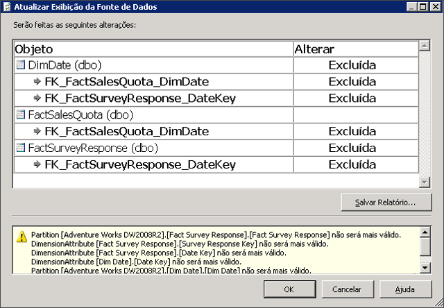

# Atualizar o esquema em uma exibição da fonte de dados (Analysis Services)
[!INCLUDE[ssas-appliesto-sqlas](../../includes/ssas-appliesto-sqlas.md)]
Depois de definir uma DSV (exibição da fonte de dados) em um projeto ou banco de dados do [!INCLUDE[ssASnoversion](../../includes/ssasnoversion-md.md)], o esquema de uma fonte de dados subjacente pode ser alterado. Essas alterações não são detectadas nem atualizadas automaticamente em um projeto de desenvolvimento. Além disso, se você implantou o projeto em um servidor, agora encontrará erros de processamento se o Analysis Services não puderem mais se conectar à fonte de dados externa.  
  
 Para atualizar o DSV de modo que corresponda à fonte de dados externa, você poderá atualizar o DSV no BIDS (Business Intelligence Development Studio). Atualizar o DSV detecta alterações às fontes de dados externas nas quais o DSV está baseado, e cria uma lista de alterações que enumera as adições ou exclusões na fonte de dados externa. Você pode em seguida aplicar o conjunto de alterações para o DSV que o realinhará à fonte de dados subjacentes. Observe que o trabalho adicional é geralmente necessário para atualizar ainda mais os cubos e as dimensões no projeto que usa o DSV.  
  
 Este tópico inclui as seguintes seções:  
  
 [Alterações com suporte na atualização](#bkmk_changlist)  
  
 [Atualize um DSV nas SQL Server Data Tools](#bkmk_DSVrefresh)  
  
##   Alterações com suporte na atualização  
 A atualização de DSV pode incluir qualquer uma das seguintes ações:  
  
-   Exclusão de tabelas, colunas e relações  
  
-   Adição de colunas e relações, como é aplicado a tabelas que já estão incluídas no DSV  
  
-   Adição de novas restrições exclusivas. Se houver uma chave primária lógica para uma tabela da DSV e for adicionada uma chave física à tabela da fonte de dados, a chave lógica será removida e substituída pela chave física.  
  
 A atualização nunca adiciona novas tabelas a um DSV. Se você quiser adicionar uma nova tabela, faça isso manualmente. Para obter mais informações, consulte [Como adicionar ou remover tabelas ou exibições em uma exibição da fonte de dados &#40;Analysis Services&#41;](../../analysis-services/multidimensional-models/adding-or-removing-tables-or-views-in-a-data-source-view-analysis-services.md).  
  
##   Atualize um DSV nas SQL Server Data Tools  
 Para atualizar um DSV, clique duas vezes no DSV do Gerenciador de soluções no [!INCLUDE[ssBIDevStudioFull](../../includes/ssbidevstudiofull-md.md)].  Isso inicia o criador do DSV.  Em seguida, clique no botão Atualizar exibição da fonte de dados no designer ou escolha **atualização** no menu exibição da fonte de dados.  
  
 Durante a atualização, o [!INCLUDE[ssASnoversion](../../includes/ssasnoversion-md.md)] consulta todas as fontes de dados relacionais subjacentes para determinar se houve mudanças nas tabelas/exibições incluídas na DSV. Se for possível estabelecer conexões com todas as fontes de dados subjacentes e se tiver sido feita alguma alteração, você as verá na caixa de diálogo **Atualizar Exibição da Fonte de Dados** .  
  
   
  
 A caixa de diálogo lista tabelas, colunas, restrições e relações que serão excluídas da exibição da DSV. O relatório também lista qualquer consulta nomeada ou cálculo nomeado que não possa ser preparado(a) com sucesso. Os objetos afetados são listados no modo de exibição de árvore, com as colunas e relações aninhadas em tabelas e o tipo de alteração (exclusão ou adição) indicado para cada objeto. Os ícones de objeto de exibição da fonte de dados padrão indicam o tipo de objeto afetado.  
  
 A atualização baseia-se totalmente nos nomes dos objetos subjacentes. Portanto, se um dos objetos subjacentes for renomeado na fonte de dados, o Designer de Exibição da Fonte de Dados tratará os objetos renomeados como duas operações distintas: uma exclusão e uma adição. Nesse caso, pode ser necessário adicionar manualmente o objeto renomeado de volta à exibição da fonte de dados. Também pode ser necessário recriar relações ou chaves primárias lógicas.  
  
> [!IMPORTANT]  
>  Caso você saiba que uma tabela de uma fonte de dados foi renomeada, convém usar o comando **Substituir Tabela** para substituir a tabela pela outra renomeada antes de atualizar a exibição da fonte de dados. Para obter mais informações, consulte [Substituir uma tabela ou uma consulta nomeada em uma exibição da fonte de dados &#40;Analysis Services&#41;](../../analysis-services/multidimensional-models/replace-a-table-or-a-named-query-in-a-data-source-view-analysis-services.md).  
  
 Depois de analisar o relatório, você pode aceitar as alterações ou cancelar a atualização para rejeitar qualquer alteração. Todas as alterações devem ser aceitas ou rejeitadas juntas. Você não pode escolher itens individuais na lista. Pode também salvar um relatório das alterações.  
  
## Consulte também  
 [Exibições da fonte de dados em modelos multidimensionais](../../analysis-services/multidimensional-models/data-source-views-in-multidimensional-models.md)  
  
  
