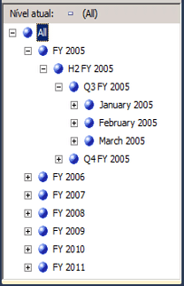
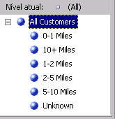
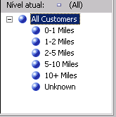

# Lição 4 – 5 – classificando membros de atributo com base em um atributo secundário
[!INCLUDE[ssas-appliesto-sqlas](../../includes/ssas-appliesto-sqlas.md)]
Na Lição 3, você aprendeu a classificar membros de atributo com base no nome ou valor de chave deles. Aprendeu também a usar uma chave de membro composta para afetar os membros de atributo e a ordem de classificação. Para obter mais informações, consulte [Modificando a dimensão de data](lesson-3-4-modifying-the-date-dimension.md). No entanto, se nem o nome e nem a chave do atributo primário fornecerem a ordem de classificação desejada, você poderá usar um atributo secundário para obter a ordem desejada. Com a definição de uma relação entre os atributos, você pode usar o segundo atributo para classificar os membros do primeiro atributo.  
  
As relações de atributos definem as relações ou dependências entre atributos. Em uma dimensão com base em apenas uma tabela relacional, todos os atributos são geralmente relacionados uns aos outros através do atributo de chave. Isso acontece porque todos os atributos de uma dimensão fornecem informações sobre os membros vinculados pelo atributo de chave da dimensão aos fatos de uma tabela de fatos para cada grupo de medidas relacionado. Em uma dimensão com base em várias tabelas relacionais, os atributos são geralmente vinculados com base na chave de junção entre as tabelas. Se os dados subjacentes derem suporte, os atributos relacionados poderão ser usados para especificar uma ordem de classificação. Por exemplo, você pode criar um novo atributo que forneça a lógica de classificação para um atributo relacionado.  
  
O Designer de Dimensão permite que você defina relações adicionais entre atributos ou altere as relações padrão para aumentar o desempenho. A principal restrição ao criar uma relação de atributo é certificar-se de que o atributo referenciado não possui mais que um valor para qualquer membro no atributo ao qual ele está relacionado. Ao definir uma relação entre dois atributos, você pode defini-la como rígida ou flexível dependendo se as relações entre os membros mudarem com o tempo. Por exemplo, um funcionário pode mudar para uma região de vendas diferente, mas uma cidade não mudará para um estado diferente. Se uma relação for definida como rígida, as agregações do atributo não serão recalculadas toda vez que a dimensão for processada de forma incremental. Porém, se a relação entre membros mudar, a dimensão deve ser processada completamente. Para obter mais informações, consulte [Relações de atributo](../multidimensional-models-olap-logical-dimension-objects/attribute-relationships.md), [Definir relações de atributo](../multidimensional-models/attribute-relationships-define.md), [Configurar propriedades de relação de atributo](../multidimensional-models/attribute-relationships-configure-attribute-properties.md)e [Especificando relações de atributo entre atributos em uma hierarquia definida pelo usuário](lesson-4-6-specifying-attribute-relationships-in-user-defined-hierarchy.md).  
  
Nas tarefas deste tópico, você definirá um novo atributo na dimensão **Data** com base em uma coluna existente na tabela de dimensão subjacente. Você usará este novo atributo para classificar os membros mês do calendário cronologicamente, em vez de alfabeticamente. Você também definirá um novo atributo na dimensão **Cliente** com base no cálculo nomeado que você usará para classificar os membros de atributo **Distância do Trabalho** . Nas tarefas do próximo tópico, você aprenderá a usar relações de atributo para aumentar o desempenho de consulta.  
  
## Definindo uma relação de atributo e uma ordem de classificação na dimensão Data  
  
1.  Abra o Designer de Dimensão na dimensão **Data** e examine a propriedade **OrderBy** do atributo **Nome do Mês** na janela Propriedades.  
  
    Observe que os membros do atributo **Nome do Mês** são ordenados pelos seus valores de chave.  
  
2.  Mude para a guia **Navegador** , verifique se **Data do Calendário** está selecionada na lista **Hierarquia** e expanda os níveis da hierarquia definida pelo usuário para examinar a ordem de classificação dos meses do calendário.  
  
    Observe que os membros da hierarquia de atributo são classificados com base nos valores ASCII das chaves de membros deles, que são mês e ano. Nesse caso, classificar pelo nome ou pela chave do atributo não classifica os meses do calendário cronologicamente. Para resolver isso, você classificará os membros da hierarquia de atributo com base em um novo atributo, o atributo **MonthNumberOfYear** . Você criará este atributo com base em uma coluna que existe convenientemente na tabela da dimensão **Data** .  
  
3.  Mude para a guia **Estrutura da Dimensão** da dimensão Data, clique com o botão direito do mouse em **MonthNumberOfYear** no painel **Exibição da Fonte de Dados** e clique em **Novo Atributo da Coluna**.  
  
4.  No painel **Atributos** , selecione **Número do Mês do Ano**e defina a propriedade **AttributeHierarchyEnabled** como **False** na janela Propriedades, a propriedade **AttributeHierarchyOptimizedState** como **NotOptimized**e a propriedade **AttributeHierarchyOrdered** como **False**.  
  
    Essas configurações ocultarão o atributo dos usuários e melhorarão o tempo de processamento. Esse atributo não será usado para navegação. Ele será usado apenas para classificar os membros de outro atributo.  
  
    > [!NOTE]  
    > Classificar as propriedades alfabeticamente na janela Propriedades simplificará esta tarefa, pois as três propriedades serão classificadas subjacentes umas às outras.  
  
5.  Clique na guia **Relações de Atributo** .  
  
    Observe que todos os atributos na dimensão **Data** estão relacionados diretamente ao atributo **Data** , que é uma chave de membro que relaciona os membros da dimensão aos fatos nos grupos de medidas relacionados. Não há nenhuma relação definida entre os atributos **Nome do Mês** e **Número do Mês do Ano** .  
  
6.  No diagrama, clique com o botão direito do mouse no atributo **Nome do Mês** e selecione **Nova Relação de Atributo**.  
  
7.  Na caixa de diálogo **Criar Relação de Atributo** , o **Atributo de Origem** é **Nome do Mês**. Defina o **Atributo Relacionado** como **Número do Mês do Ano**.  
  
8.  Na lista **Tipo de relação** , defina o tipo de relação como **Rígida**.  
  
    As relações entre os membros dos atributos **Nome do Mês** e **Número do Mês do Ano** não mudarão ao longo do tempo. Como resultado, o Analysis Services não descartará agregações para essa relação durante o processamento incremental. Se ocorrer uma mudança, um erro de processamento ocorrerá durante o processamento incremental e será necessário fazer um processamento completo da dimensão. Agora, você está pronto para definir a ordem de classificação dos membros de **Nome do Mês**.  
  
9. [!INCLUDE[clickOK](../../includes/clickok-md.md)]  
  
10. Clique na guia **Estrutura da Dimensão** .  
  
11. Selecione **Nome do Mês** no painel **Atributos** e altere o valor da propriedade **OrderBy** na janela Propriedades para **AttributeKey** e o valor da propriedade **OrderByAttribute** para **Número do Mês do Ano**.  
  
12. No menu **Compilar** , clique em **Implantar Tutorial do Analysis Services**.  
  
13. Quando a implantação for concluída com êxito, mude para a guia **Navegador** da dimensão Data, clique em **Reconectar**e procure as hierarquias de usuário **Data do Calendário** e **Data Fiscal** para verificar se os meses agora estão classificados em ordem cronológica.  
  
    Observe que os meses agora estão classificados em ordem cronológica, como mostra a imagem a seguir:  
  
      
  
## Definindo relações de atributo e ordem de classificação na dimensão Cliente  
  
1.  Mude para a guia **Navegador** no Designer de Dimensão da dimensão Cliente e procure os membros da hierarquia de atributo **Distância do Trabalho** .  
  
    Observe que os membros dessa hierarquia de atributo são classificados com base nos valores ASCII da chave de membro. Nesse caso, classificar pelo nome ou chave do atributo não classifica as distâncias do trabalho da menor para a maior. Nesta tarefa, você classifica os membros da hierarquia de atributo com base no cálculo nomeado **CommuteDistanceSort** que atribui o número de classificação apropriado a cada valor distinto na coluna. Para economizar tempo, esse cálculo nomeado já foi adicionado à tabela **Cliente** na exibição da fonte de dados [!INCLUDE[ssSampleDBCoShort](../../includes/sssampledbcoshort-md.md)] DW. Você pode alternar para essa exibição da fonte de dados para exibir o script SQL que é usado para esse cálculo nomeado. Para obter mais informações, consulte [Definir cálculos nomeados em uma exibição da fonte de dados &#40;Analysis Services&#41;](../multidimensional-models/define-named-calculations-in-a-data-source-view-analysis-services.md).  
  
    A imagem a seguir mostra os membros da hierarquia de atributo **Distância do Trabalho** , classificados pelos valores ASCII da chave de membro.  
  
      
  
2.  Mude para a guia **Estrutura da Dimensão** no Designer de Dimensão da dimensão Cliente, clique com o botão direito do mouse em **CommuteDistanceSort** na tabela **Cliente** do painel **Exibição da Fonte de Dados** e clique em **Novo Atributo da Coluna**.  
  
3.  No painel **Atributos** , selecione **Classificação da Distância do Trabalho**e defina a propriedade **AttributeHierarchyEnabled** desse atributo como **False** na janela Propriedades, a propriedade **AttributeHierarchyOptimizedState** como **NotOptimized**e a propriedade **AttributeHierarchyOrdered** como **False**.  
  
    Essas configurações ocultarão o atributo dos usuários e melhorarão o tempo de processamento. Esse atributo não será usado para navegação. Ele será usado apenas para classificar os membros de outro atributo.  
  
4.  Selecione **Geografia**e defina sua propriedade **AttributeHierarchyVisible** como **False** na janela Propriedades, a propriedade **AttributeHierarchyOptimizedState** como **NotOptimized**e a propriedade **AttributeHierarchyOrdered** como **False**.  
  
    Essas configurações ocultarão o atributo dos usuários e melhorarão o tempo de processamento. Esse atributo não será usado para navegação. Ele será usado apenas para ordenar os membros de outro atributo. Como **Geografia** tem propriedades de membro, sua propriedade **AttributeHierarchyEnabled** deve ser definida como **True**. Portanto, para ocultar o atributo, você define a propriedade **AttributeHierarchyVisible** como **False**.  
  
5.  Clique na guia **Relações de Atributo** .  
  
6.  Na lista de atributos, clique com o botão direito do mouse em **Distância do Trabalho** e selecione **Nova Relação de Atributo**.  
  
7.  Na caixa de diálogo **Criar Relação de Atributo** , o **Atributo de Origem** é **Distância do Trabalho**. Defina o **Atributo Relacionado** como **Classificação da Distância do Trabalho**.  
  
8.  Na lista **Tipo de relação** , defina o tipo de relação como **Rígida**.  
  
    A relação entre os membros dos atributos **Distância do Trabalho** e **Classificação da Distância do Trabalho** não mudará ao longo do tempo.  
  
9. [!INCLUDE[clickOK](../../includes/clickok-md.md)]  
  
    Agora, você está pronto para definir a ordem de classificação do atributo **Distância do Trabalho** .  
  
10. Clique na guia **Estrutura da Dimensão** .  
  
11. No painel **Atributos** , selecione **Distância do Trabalho**e altere o valor da propriedade **OrderBy** para **AttributeKey**na janela Propriedades e o valor da propriedade **OrderByAttribute** para **Classificação da Distância do Trabalho**.  
  
12. No menu **Compilar** , clique em **Implantar Tutorial do Analysis Services**.  
  
13. Quando a implantação for concluída com êxito, mude para a guia **Navegador** no Designer de Dimensão da dimensão Cliente. Depois, clique em **Reconectar**e procure a hierarquia de atributo **Distância do Trabalho** .  
  
    Observe que os membros da hierarquia de atributo agora estão classificados em ordem lógica com base no aumento da distância, como mostra a imagem a seguir:  
  
      
  
## Próxima tarefa da lição  
[Especificando relações de atributo entre atributos em uma hierarquia definida pelo usuário](lesson-4-6-specifying-attribute-relationships-in-user-defined-hierarchy.md)  
  
  
  
