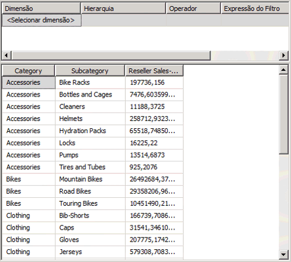
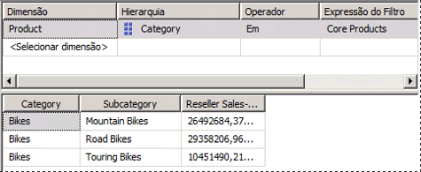
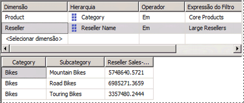

# <a name="lesson-6-2---defining-named-sets"></a>Lição 6-2: definindo conjuntos nomeados
[!INCLUDE[ssas-appliesto-sqlas](../../includes/ssas-appliesto-sqlas.md)]

Um conjunto nomeado é uma linguagem MDX (Multidimensional Expressions) que retorna um conjunto de membros de dimensão. Os conjuntos nomeados podem ser definidos e salvos como parte da definição de cubo; você também pode criar conjuntos nomeados em aplicativos cliente. É possível criar conjuntos nomeados combinando dados de cubo, operadores aritméticos, números e funções. Os conjuntos nomeados podem ser usados em consultas MDX em aplicativos cliente e também podem ser usados para definir conjuntos em subcubos. Um subcubo é uma coleção de conjuntos em interjunção que restringe o espaço do cubo ao subespaço definido para instruções subsequentes. Definir um espaço de cubo restrito é um conceito fundamental para a geração de scripts de MDX.  
  
Os conjuntos nomeados simplificam as consultas MDX e fornecem aliases úteis para expressões de conjunto complexas. Por exemplo, é possível definir um conjunto nomeado chamado Grandes Revendedores que contenha o conjunto de membros na dimensão Revendedor com o maior número de funcionários. Os usuários finais podem usar o conjunto nomeado Grandes Revendedores em consultas ou você pode usar o conjunto nomeado para definir um conjunto em um subcubo. As definições de conjunto nomeado são armazenadas em cubos, mas seus valores existem apenas na memória. Para criar um conjunto nomeado, use o comando **Novo Conjunto Nomeado** da guia **Cálculos** do Designer de Cubo. Para obter mais informações, consulte [Cálculos](../multidimensional-models-olap-logical-cube-objects/calculations.md)e [Criar conjuntos nomeados](../multidimensional-models/create-named-sets.md).  
  
Nas tarefas deste tópico, você definirá dois conjuntos nomeados: um chamado Produtos Principais e outro chamado Grandes Revendedores.  
  
## <a name="defining-a-core-products-named-set"></a>Definindo um conjunto nomeado chamado Produtos Principais  
  
1.  Alterne para a guia **Cálculos** do Designer de Cubo para o cubo do Tutorial do [!INCLUDE[ssASnoversion](../../includes/ssasnoversion-md.md)] e clique na guia **Exibição de Formulário** na barra de ferramentas.  
  
2.  Clique em **[Índice de Vendas Total para Todos os Produtos]** no painel **Organizador de Script** e clique em **Novo Conjunto Nomeado** na barra de ferramentas da guia **Cálculos** .  
  
    Ao definir um novo cálculo na guia **Cálculos** , lembre-se de que os cálculos são resolvidos na ordem em que eles aparecem no painel **Organizador de Script** . O foco definido dentro desse painel ao criar um novo cálculo determina a ordem de execução do cálculo; um novo cálculo é definido imediatamente após o cálculo no qual você definiu o foco.  
  
3.  Na caixa **Nome** , altere o nome do novo conjunto nomeado para **[Principais Produtos]**.  
  
    No painel **Organizador de Script** , observe o único ícone que diferencia a um conjunto nomeado de um comando de script ou um membro calculado.  
  
4.  Na guia **Metadados** no painel **Ferramentas de Cálculo** , expanda **Produto**, **Categoria**, **Membros**e **Todos os Produtos**.  
  
    > [!NOTE]  
    > Se não houver nenhum metadados no painel **Ferramentas de Cálculo** , clique em **Reconectar** na barra de ferramentas. Se isso não funcionar, talvez seja preciso processar o cubo ou iniciar a instância do [!INCLUDE[ssASnoversion](../../includes/ssasnoversion-md.md)].  
  
5.  Arraste **Bicicletas** para a caixa **Expressão** .  
  
    Agora você criou uma expressão de conjunto que retornará o conjunto de membros que consta na categoria Bicicleta na dimensão Produto .  
  
## <a name="defining-a-large-resellers-named-set"></a>Definindo um conjunto nomeado chamado Grandes Revendedores  
  
1.  Clique com o botão direito do mouse em **[Principais Produtos]** no painel **Organizador de Script** e clique em **Novo Conjunto Nomeado**.  
  
2.  Na caixa **Nome** , altere o nome desse conjunto nomeado para **[Grandes Revendedores]**.  
  
3.  Na caixa **Expressão** , digite **Exists()**.  
  
    Você usará a função Exists para retornar o conjunto de membros da hierarquia de atributo Reseller Name que faz interseção com o conjunto de membros na hierarquia de atributo Number of Employees que contém o maior número de funcionários.  
  
4.  Na guia **Metadados** no painel **Ferramentas de Cálculo** , expanda a dimensão **Revendedor** e a hierarquia de atributo **Nome do Revendedor** .  
  
5.  Arraste o nível **Nome do Revendedor** até o parêntese da expressão de conjunto Exists.  
  
    Você usará a função Members para retornar todos os membros desse conjunto. Para obter mais informações, consulte [Membros &#40;Set&#41; &#40;MDX&#41;](../../mdx/members-set-mdx.md).  
  
6.  Após a expressão de conjunto parcial, digite um ponto e adicione a função Members. A expressão deverá ter a seguinte aparência:  
  
    ```  
    Exists([Reseller].[Reseller Name].[Reseller Name].Members)  
    ```  
  
    Agora que você definiu o primeiro conjunto de Exists expressão de conjunto, você estará pronto para adicionar o segundo conjunto – o conjunto de membros da dimensão revendedor que contém o maior número de funcionários.  
  
7.  Na guia **Metadados** no painel **Ferramentas de Cálculo** , expanda **Número de Funcionários** na dimensão Revendedor, expanda **Membros**e **Todos os Revendedores**.  
  
    Observe que os membros dessa hierarquia de atributo não estão agrupados.  
  
8.  Abra o Designer de Dimensão para a dimensão **Revendedor** e clique em **Número de Funcionários** no painel **Atributos** .  
  
9. Na janela Propriedades, altere a propriedade **DiscretizationMethod** para **Automatic**e altere a propriedade **DiscretizationBucketCount** para **5**. Para obter mais informações, consulte [Agrupar membros de atributo &#40;Diferenciação&#41;](../multidimensional-models/attribute-properties-group-attribute-members.md).  
  
10. No menu **Compilar** do [!INCLUDE[ssBIDevStudioFull](../../includes/ssbidevstudiofull-md.md)], clique em **Implantar Tutorial do Analysis Services**.  
  
11. Quando a implantação for concluída com êxito, alterne para o Designer de Cubo do cubo do Tutorial do [!INCLUDE[ssASnoversion](../../includes/ssasnoversion-md.md)] e, em seguida, na barra de ferramentas da guia **Cálculos** , clique em **Reconectar** .  
  
12. Na guia **Metadados** no painel **Ferramentas de Cálculo** , expanda **Número de Funcionários** na dimensão **Revendedor** , expanda **Membros**e **Todos os Revendedores**.  
  
    Observe que agora os membros dessa hierarquia de atributo estão contidos em cinco grupos, numerados de 0 a 4. Para visualizar o número de um grupo, posicione o ponteiro do mouse sobre o grupo desejado para exibir uma InfoDica. Para o intervalo `2 -17`, o InfoTip deve conter `[Reseller].[Number of Employees].&[0]`.  
  
    Os membros dessa hierarquia de atributo são agrupados, porque a propriedade DiscretizationBucketCount está definida como **5** e a propriedade DiscretizationMethod está definida como **Automático**.  
  
13. Na caixa **Expressão** , adicione uma vírgula na expressão de conjunto Exists após a função Members e antes do parêntese de fechamento; em seguida, arraste **83 – 100** do painel **Metadados** e coloque-o após a vírgula.  
  
    Agora você concluiu a expressão de conjunto Exists que retornará o conjunto de membros que fazem interseção com esses dois conjuntos especificados: o conjunto de todos os revendedores e o conjunto de revendedores que contam com 83 a 100 funcionários, quando o conjunto nomeado Grandes Revendedores for colocado em um eixo.  
  
    A imagem a seguir mostra o painel **Expressões de Cálculo** do conjunto nomeado **[Grandes Revendedores]** .  
  
    ![Painel expressões de cálculo para [grandes revendedores]](../media/l6-named-set-02.gif "painel expressões de cálculo para [grandes revendedores]")  
  
14. Na barra de ferramentas da guia **Cálculos** , clique em **Exibição de Script**e verifique os dois conjuntos nomeados que foram adicionados ao script de cálculo.  
  
15. Adicione uma nova linha ao script de cálculo imediatamente antes do primeiro comando CREATE SET e, em seguida, adicione o seguinte texto ao script, na própria linha:  
  
    ```  
    /* named sets */  
    ```  
  
    Agora, foram definidos dois conjuntos nomeados, visíveis no painel **Organizador de Script** . Neste momento, você já pode implantar esses conjuntos nomeados e procurar por essas medidas no cubo do Tutorial do [!INCLUDE[ssASnoversion](../../includes/ssasnoversion-md.md)] .  
  
## <a name="browsing-the-cube-by-using-the-new-named-sets"></a>Navegando pelo cubo usando Novos Conjuntos Nomeados  
  
1.  No menu **Compilar** do [!INCLUDE[ssBIDevStudio](../../includes/ssbidevstudio-md.md)], clique em **Implantar Tutorial do Analysis Services**.  
  
2.  Quando a implantação for concluída com êxito, clique na guia **Navegador** e no botão **Reconectar**.  
  
3.  Limpe a grade no painel de dados.  
  
4.  Adicione a medida **Vendas do Revendedor/Valor das Vendas** à área de dados.  
  
5.  Expanda a dimensão Produto e adicione Categoria e Subcategoria à área de linha, conforme mostrado na imagem a seguir.  
  
      
  
6.  No painel **Metadados** , na dimensão **Produto** , arraste **Produtos Principais** para a área de filtro.  
  
    Observe que apenas o membro **Bicicleta** do atributo **Categoria** e os membros das subcategorias de **Bicicleta** permanecem no cubo. Isto ocorre porque o conjunto nomeado **Produtos de Núcleo** é usado para definir um subcubo. Esse subcubo limita os membros do atributo **Categoria** na dimensão **Produto** dentro do subcubo aos membros do conjunto nomeado **Produtos Principais** , como mostra a imagem a seguir.  
  
      
  
7.  No painel **Metadados** , expanda **Revendedor**, adicione **Grandes Revendedores** à área de filtro.  
  
    Observe que a medida Valor das Vendas do Revendedor no painel Dados exibe apenas o valor das vendas de bicicletas dos grandes revendedores. Observe também que agora o painel Filtro exibe os dois conjuntos nomeados que são usados para definir esse subcubo específico, como mostra a imagem a seguir.  
  
      
  
## <a name="next-lesson"></a>Próxima lição  
[Lição 7: Definindo indicadores chave de desempenho &#40;KPIs&#41;](lesson-7-defining-key-performance-indicators-kpis.md)  
  
## <a name="see-also"></a>Consulte também  
[Cálculos](../multidimensional-models-olap-logical-cube-objects/calculations.md)  
[Criar conjuntos nomeados](../multidimensional-models/create-named-sets.md)  
  
  
  
