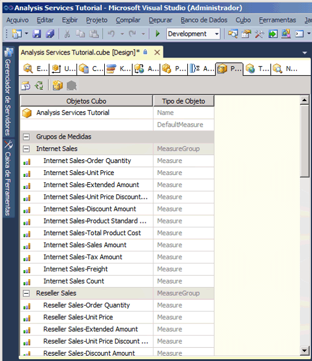
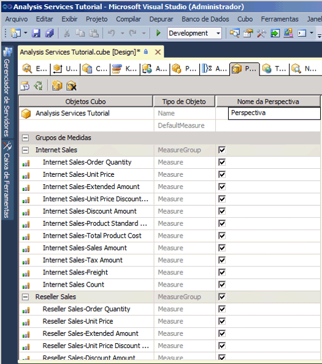
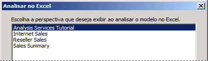
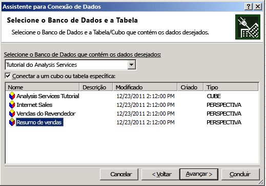
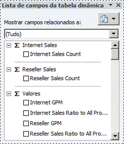

# Lição 9-1: definindo e procurando perspectivas
[!INCLUDE[ssas-appliesto-sqlas](../../includes/ssas-appliesto-sqlas.md)]

Uma perspectiva pode simplificar a exibição de um cubo para propósitos específicos. Por padrão, os usuários podem ver todos os elementos em um cubo para o qual têm permissões. O quê os usuários visualizam ao exibir um cubo completo do [!INCLUDE[ssASnoversion](../../includes/ssasnoversion-md.md)] é a perspectiva padrão para o cubo. Uma exibição de todo o cubo pode ser muito complexa para os usuários pesquisarem, principalmente para usuários que precisam apenas interagir com uma pequena parte do cubo para satisfazer seus requisitos de inteligência empresarial e geração de relatórios.  
  
Para reduzir a aparente complexidade de um cubo, você pode criar subconjuntos visíveis do cubo, chamados *perspectivas*, que mostram aos usuários somente uma parte dos grupos de medidas, medidas, dimensões, atributos, hierarquias, KPIs (Indicadores Chave de Desempenho), ações e membros calculados no cubo. Isso pode ser particularmente útil para trabalhar com aplicativos cliente que foram escritos em uma versão anterior do [!INCLUDE[ssASnoversion](../../includes/ssasnoversion-md.md)]. Esses clientes não têm conceito de exibição de pastas ou perspectivas, por exemplo, mas uma perspectiva é exibida para clientes antigos como se fosse um cubo. Para obter mais informações, consulte [Perspectivas](../multidimensional-models-olap-logical-cube-objects/perspectives.md)e [Perspectivas em modelos multidimensionais](../multidimensional-models/perspectives-in-multidimensional-models.md).  
  
> [!NOTE]  
> Uma perspectiva não é um mecanismo de segurança; é na verdade uma ferramenta que fornece uma experiência melhor ao usuário. Toda a segurança de uma perspectiva é herdada do cubo subjacente.  
  
Nas tarefas deste tópico, você definirá várias perspectivas diferentes e depois navegará no cubo usando essas novas perspectivas.  
  
## Definindo uma perspectiva Vendas pela Internet  
  
1.  Abra o Designer do cubo do Tutorial do [!INCLUDE[ssASnoversion](../../includes/ssasnoversion-md.md)] e clique na guia **Perspectivas** .  
  
    Todos os objetos e seus tipos de objeto são exibidos no painel **Perspectivas** , como mostra a imagem a seguir.  
  
      
  
2.  Na barra de ferramentas da guia **Perspectivas** , clique no botão **Nova Perspectiva** .  
  
    Uma nova perspectiva é exibida na coluna **Nome da Perspectiva** com o nome padrão **Perspectiva**, como mostra a imagem a seguir. Observe que a caixa de seleção de cada objeto está selecionada. Até que você desmarque a caixa de seleção de um objeto, essa perspectiva é idêntica à perspectiva padrão deste cubo.  
  
      
  
3.  Altere o nome da perspectiva para **Vendas pela Internet**.  
  
4.  Na próxima linha, defina DefaultMeasure como **Vendas pela Internet/Valor das Vendas**.  
  
    Quando os usuários procurarem no cubo usando essa perspectiva, esta será a medida que eles verão, a menos que especifiquem alguma outra medida.  
  
    > [!NOTE]  
    > Também é possível definir a medida padrão para todo o cubo do Tutorial do [!INCLUDE[ssASnoversion](../../includes/ssasnoversion-md.md)] na guia **Estrutura do Cubo** na janela Propriedades do cubo.  
  
5.  Desmarque a caixa de seleção dos seguintes objetos:  
  
    -   Grupo de medidas**Vendas do Revendedor**  
  
    -   Grupo de medidas**Cotas de Vendas**  
  
    -   Grupo de medidas**Cotas de Vendas 1**  
  
    -   Dimensão de cubo**Revendedor**  
  
    -   Dimensão de cubo**Geografia do Revendedor**  
  
    -   Dimensão de cubo**Região de Vendas**  
  
    -   Dimensão de cubo**Funcionário**  
  
    -   Dimensão de cubo**Promoção**  
  
    -   **Receita do Revendedor**  
  
    -   Conjunto nomeado**Grandes Revendedores**  
  
    -   Membro calculado**Valor Total das Vendas**  
  
    -   Membro calculado**Custo Total do Produto**  
  
    -   Membro calculado**MLB do Revendedor**  
  
    -   Membro calculado**MLB Total**  
  
    -   Membro calculado**Índice de Vendas do Revendedor para Todos os Produtos**  
  
    -   Membro calculado**Índice Total de Vendas para Todos os Produtos**  
  
    Esses objetos não estão relacionados às vendas pela Internet.  
  
    > [!NOTE]  
    > Dentro de cada dimensão, você também pode selecionar individualmente as hierarquias e atributos definidos pelos usuários que você quer que apareçam na perspectiva.  
  
## Definindo a perspectiva Vendas do Revendedor  
  
1.  Na barra de ferramentas da guia **Perspectivas** , clique no botão **Nova Perspectiva** .  
  
2.  Altere o nome da nova perspectiva para **Vendas do Revendedor**.  
  
3.  Defina **Vendas do Revendedor/Valor das Vendas** como a medida padrão.  
  
    Quando os usuários navegarem pelo cubo usando essa perspectiva, essa será a medida que eles verão, a menos que especifiquem alguma outra medida.  
  
4.  Desmarque a caixa de seleção dos seguintes objetos:  
  
    -   Grupo de medidas**Vendas pela Internet**  
  
    -   Grupo de medidas**Motivo de Vendas pela Internet**  
  
    -   Dimensão de cubo**Cliente**  
  
    -   Dimensão de cubo**Detalhes do Pedido de Vendas pela Internet**  
  
    -   Dimensão de cubo**Motivo de Vendas**  
  
    -   Ação de detalhamento**Ação de Detalhamento Detalhes de Vendas pela Internet**  
  
    -   Membro calculado**Valor Total das Vendas**  
  
    -   Membro calculado**Custo Total do Produto**  
  
    -   Membro calculado**MLB pela Internet**  
  
    -   Membro calculado**MLB Total**  
  
    -   Membro calculado**Índice de Vendas pela Internet para Todos os Produtos**  
  
    -   Membro calculado**Índice Total de Vendas para Todos os Produtos**  
  
    Esses objetos não estão relacionados às vendas do revendedor.  
  
## Definindo uma perspectiva Resumo das Vendas  
  
1.  Na barra de ferramentas da guia **Perspectivas** , clique no botão **Nova Perspectiva** .  
  
2.  Altere o nome da nova perspectiva para **Resumo de Vendas**.  
  
    > [!NOTE]  
    > Você não pode especificar uma medida calculada como a medida padrão.  
  
3.  Desmarque a caixa de seleção dos seguintes objetos:  
  
    -   Grupo de medidas**Vendas pela Internet**  
  
    -   Grupo de medidas**Vendas do Revendedor**  
  
    -   Grupo de medidas**Motivo de Vendas pela Internet**  
  
    -   Grupo de medidas**Cotas de Vendas**  
  
    -   Grupo de medidas**Cotas de Vendas1**  
  
    -   Dimensão de cubo**Detalhes do Pedido de Vendas pela Internet**  
  
    -   Dimensão de cubo**Motivo de Vendas**  
  
    -   Ação de detalhamento**Ação de Detalhamento Detalhes de Vendas pela Internet**  
  
4.  Selecione a caixa de seleção dos seguintes objetos:  
  
    -   Medida**Contagem das Vendas pela Internet**  
  
    -   Medida**Contagem das Vendas do Revendedor**  
  
## Navegando no cubo usando cada perspectiva  
  
1.  No menu **Compilar** , clique em **Implantar Tutorial do Analysis Services**.  
  
2.  Quando a implantação for concluída com êxito, mude para a guia **Navegador** e clique no botão **Reconectar** .  
  
3.  Inicie o Excel.  
  
4.  A análise no Excel avisa para você escolher quais perspectivas devem ser usadas ao procurar o modelo no Excel, conforme mostrado na imagem a seguir.  
  
      
  
5.  Como alternativa, você pode iniciar o Excel no menu Iniciar do Windows, definir uma conexão com o banco de dados de tutorial do Analysis Services no localhost, e pode escolher uma perspectiva no assistente de Conexão de Dados, como mostrado na imagem a seguir.  
  
      
  
6.  Selecione **Vendas pela Internet** na lista **Perspectiva** e examine as medidas e dimensões no painel de metadados.  
  
    Observe que somente aqueles objetos especificados na perspectiva Vendas pela Internet são exibidos.  
  
7.  No painel de metadados, expanda **Medidas**.  
  
    Observe que somente o grupo de medidas **Vendas pela Internet** é exibido, juntamente com os membros calculados **MLB pela Internet** e **Índice de Vendas pela Internet para Todos os Produtos** .  
  
8.  No modelo, selecione Excel novamente. Selecione **Resumo de Vendas**.  
  
    Observe que em cada grupo de medidas, somente uma medida é exibida, como mostra a imagem a seguir:  
  
      
  
## Próxima tarefa da lição  
[Definindo e procurando traduções](lesson-9-2-defining-and-browsing-translations.md)  
  
## Consulte também  
[Perspectives](../multidimensional-models-olap-logical-cube-objects/perspectives.md)  
[Perspectivas em modelos multidimensionais](../multidimensional-models/perspectives-in-multidimensional-models.md)  
  
  
  
