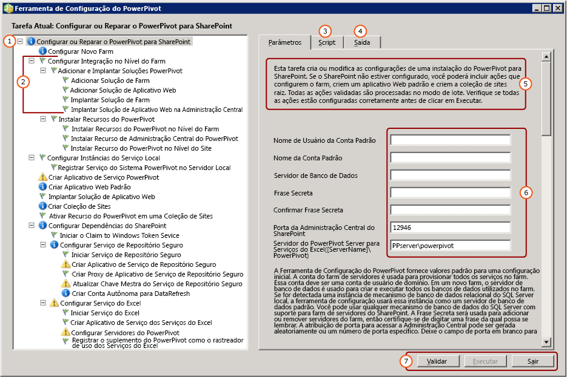

# <a name="configure-or-repair-power-pivot-for-sharepoint-2013"></a>Configurar ou reparar o PowerPivot para SharePoint 2013
[!INCLUDE[ssas-appliesto-sqlas](../../includes/ssas-appliesto-sqlas.md)]
Para configurar ou reparar uma instalação do [!INCLUDE[ssCurrent](../../includes/sscurrent-md.md)][!INCLUDE[ssGemini](../../includes/ssgemini-md.md)] para SharePoint 2013, use a Ferramenta de Configuração do [!INCLUDE[ssGemini](../../includes/ssgemini-md.md)] para SharePoint. A ferramenta de configuração começa examinando o sistema e retorna uma lista de ações necessárias para concluir ou reparar uma instalação. O Assistente de Configuração do [!INCLUDE[ssCurrent](../../includes/sscurrent-md.md)] instala a Ferramenta de Configuração do [!INCLUDE[ssGemini](../../includes/ssgemini-md.md)] para SharePoint 2010, bem como a Ferramenta de Configuração do [!INCLUDE[ssGemini](../../includes/ssgemini-md.md)] para SharePoint 2013. Este tópico descreve a Ferramenta de Configuração do [!INCLUDE[ssGemini](../../includes/ssgemini-md.md)] para SharePoint 2013. Para saber mais sobre o SharePoint 2010, confira [Configurar ou Reparar o Power Pivot para SharePoint 2010 (Ferramenta de Configuração do Power Pivot)](http://msdn.microsoft.com/en-us/d61f49c5-efaa-4455-98f2-8c293fa50046).  
  
 **[!INCLUDE[applies](../../includes/applies-md.md)]**  SharePoint 2013  
  
 **Neste tópico:**  
  
 [Antes de iniciar](#bkmk_before)  
  
 [Para usar a Ferramenta de Configuração do Power Pivot para SharePoint 2013](#bkmk_using)  
  
 [Etapas de configuração](#bkmk_steps)  
  
 [Valores de entrada usados para configurar o servidor](#bkmk_input)  
  
 [Próximas etapas](#bkmk_nextsteps)  
  
##  <a name="bkmk_before"></a> Antes de iniciar  
 A Ferramenta de Configuração do [!INCLUDE[ssGemini](../../includes/ssgemini-md.md)] para SharePoint 2013 examina arquivos de programas, configurações do Registro e portas disponíveis. Para aproveitar ao máximo as ferramentas, examine os requisitos a seguir.  
  
-   Requisitos gerais para executar a ferramenta de configuração [Power Pivot Configuration Tools](../../analysis-services/power-pivot-sharepoint/power-pivot-configuration-tools.md).  
  
-   [!INCLUDE[ssGemini](../../includes/ssgemini-md.md)] para SharePoint 2013 prefere o aplicativo Web configurado para a autenticação baseada em declarações. Se a Ferramenta de Configuração do [!INCLUDE[ssGemini](../../includes/ssgemini-md.md)] para SharePoint 2013 criar o aplicativo para você, ela o configurará para usar a autenticação do Windows baseada em declarações. Para obter mais informações sobre os requisitos de autenticação, consulte [Power Pivot Authentication and Authorization](../../analysis-services/power-pivot-sharepoint/power-pivot-authentication-and-authorization.md).  
  
-   A porta 80 deverá estar disponível para a ferramenta de Configuração do[!INCLUDE[ssGemini](../../includes/ssgemini-md.md)] para SharePoint 2013 para criar um aplicativo Web.  
  
##  <a name="bkmk_using"></a> Para usar a Ferramenta de Configuração do Power Pivot para SharePoint 2013  
 A primeira página da ferramenta fornece um resumo dos valores de entrada usados para configurar o farm do SharePoint. Além dos valores de entrada que você fornece, são usados valores padrão para configurar o sistema. Os nomes padrão são usados para aplicativos de serviço, bancos de dados de aplicativo de serviço e propriedades de aplicativo de serviço.  
  
> [!TIP]  
>  Se a ferramenta de configuração verificar o computador e retornar uma lista de tarefas em branco no painel esquerdo, nenhum recurso ou configuração que precise de definição foi detectado. Para modificar a configuração do SharePoint ou do [!INCLUDE[ssGemini](../../includes/ssgemini-md.md)] , use o Windows PowerShell ou páginas de gerenciamento na Administração Central do SharePoint. Para obter mais informações, consulte [Administração e configuração de servidor do Power Pivot na Administração Central](../../analysis-services/power-pivot-sharepoint/power-pivot-server-administration-and-configuration-in-central-administration.md).  
  
 Os valores para contas de serviço são usados para vários serviços. Por exemplo, a ferramenta de configuração usa a conta padrão na primeira página para definir todas as identidades do pool de aplicativos. Você pode alterar estas contas posteriormente modificando as propriedades de aplicativo de serviço em Administração Central.  
  
 A ferramenta fornece uma interface com guias que inclui entradas de parâmetros, script do Windows PowerShell e mensagens de status.  
  
 A ferramenta usa o Windows PowerShell para configurar o servidor. Você pode clicar na guia **Script** para revisar o script do Windows PowerShell que a ferramenta usa para configurar o servidor.  
  
   
  
||Description|  
|-|-----------------|  
|**(1)**|Janela Lista de tarefas.|  
|**(2)**|Ações individuais.|  
|**(3)**|Os scripts do Windows PowerShell criados pela ferramenta de configuração.|  
|**(4)**|Mensagens de log criadas quando você inicia a validação ou executa ações.|  
|**(5)**|Descrição da página.|  
|**(6)**|Parâmetros de entrada|  
|**(7)**|O botão **Executar** é habilitado após a validação das ações.|  
  
##  <a name="bkmk_steps"></a> Etapas de configuração  
 O link para a ferramenta de configuração fica visível apenas quando o [!INCLUDE[ssGemini](../../includes/ssgemini-md.md)] para SharePoint 2013 está instalado no servidor local.  
  
1.  No menu **Iniciar** , aponte para **Todos os Programas**, clique em [!INCLUDE[ssCurrentUI](../../includes/sscurrentui-md.md)], em **Ferramentas de Configuração**e em **[!INCLUDE[ssGemini](../../includes/ssgemini-md.md)] para SharePoint 2013**.  
  
2.  Clique em **Configurar ou Reparar o [!INCLUDE[ssGemini](../../includes/ssgemini-md.md)] para SharePoint**.  
  
3.  Expanda a janela para o tamanho total. Você verá uma barra de botões na parte inferior da janela que inclui os comandos **Validar**, **Executar**e **Sair** .  
  
4.  **Conta Padrão:** Na guia Parâmetros, digite uma conta de usuário de domínio para **Nome de Usuário da Conta Padrão**. Esta conta é usada para provisionar serviços essenciais, inclusive o pool de aplicativos do serviço [!INCLUDE[ssGemini](../../includes/ssgemini-md.md)] . Não especifique uma conta interna, como Serviço de Rede ou Sistema Local. A ferramenta bloqueia configurações que especificam contas internas.  
  
     **Frase Secreta:** digite uma frase secreta. Se o farm do SharePoint for novo, a frase secreta será usada sempre que novos servidores ou aplicativos forem adicionados ao farm do SharePoint. Se o farm existir, insira a frase secreta que permite adicionar um aplicativo de servidor ao farm.  
  
5.  **Porta:** opcionalmente, digite um número de porta para se conectar ao aplicativo Web Administração Central ou use o número fornecido gerado aleatoriamente. A ferramenta de configuração verifica se o número está disponível antes de oferecê-lo como opção.  
  
6.  Na página principal, digite o nome de um Servidor do [!INCLUDE[ssCurrent](../../includes/sscurrent-md.md)][!INCLUDE[ssGemini](../../includes/ssgemini-md.md)] em execução no modo do SharePoint.  
  
7.  Opcionalmente, revise os valores de entrada restantes usados para concluir cada ação. Para obter mais informações sobre cada um, consulte [Valores de entrada usados para configurar o servidor](#bkmk_input) neste tópico.  
  
8.  Opcionalmente, remova as ações que você não deseja processar. Por exemplo, se desejar configurar o Serviço de Repositório Seguro, clique em **Configurar Serviço de Repositório Seguro**e desmarque a caixa de seleção **Inclua esta ação na lista de tarefas**.  
  
9. Clique em **Validar** para verificar se a ferramenta tem informações suficientes para processar as ações na lista.  
  
10. Clique em **Executar** para processar todas as ações na lista de tarefas. O botão **Executar** fica disponível depois que você valida as ações. Se **Executar** não estiver habilitado, clique em **Validar** primeiro.  
  
     Se você visualizar uma mensagem de erro semelhante à seguinte, verifique se a instância de banco de dados do SQL Server foi iniciada.  
  
    ```  
    Cannot connect to the database server instance  
    ```  
  
11. [Verify a Power Pivot for SharePoint Installation](../../analysis-services/instances/install-windows/verify-a-power-pivot-for-sharepoint-installation.md).  
  
##  <a name="bkmk_input"></a> Valores de entrada usados para configurar o servidor  
 A Ferramenta de Configuração do [!INCLUDE[ssGemini](../../includes/ssgemini-md.md)] usa uma combinação de valores de entrada que você digita e valores padrão que ele detecta ou usa automaticamente.  
  
 A lista de ações exibida na ferramenta de configuração depende da configuração atual dos farms do SharePoint. Por exemplo, se o farm do SharePoint já estiver configurado, você não verá ações que configuram o farm ou criam um aplicativo Web. Você pode executar a ferramenta a qualquer momento para configurar, reparar ou detectar erros de configuração. Se os serviços obrigatórios como Serviços do Excel ou Serviço de Repositório Seguro não estiverem sendo executados no farm, a ferramenta detectará os serviços ausentes e fornecerá opções para habilitá-los. Se nenhuma ação for necessária, a lista de tarefas estará vazia.  
  
 A tabela a seguir descreve os valores que são usados para configurar o servidor.  
  
|Página|Valor de entrada|Origem|Description|  
|----------|-----------------|------------|-----------------|  
|**Configurar ou Reparar o [!INCLUDE[ssGemini](../../includes/ssgemini-md.md)] para SharePoint**|Conta padrão|Usuário atual|A conta padrão é uma conta de usuário de domínio do Windows usada para provisionar serviços compartilhados no farm. Ela é usada para provisionar o seguinte:|  
||||-<br />                    [!INCLUDE[ssGemini](../../includes/ssgemini-md.md)] Padrão|  
||||- Serviço de Repositório Seguro|  
||||- Serviços do Excel|  
||||- A identidade do pool de aplicativos Web|  
||||- O administrador de conjunto de sites|  
||||- A conta autônoma de atualização de dados do [!INCLUDE[ssGemini](../../includes/ssgemini-md.md)] .|  
||||Por padrão, a conta de domínio do usuário atual é usada.<br /><br /> Observação: é recomendável substituir o valor padrão, a menos que você esteja configurando um servidor para fins de avaliação e de não produção.<br /><br /> É possível alterar as identidades do serviço após a configuração ou o reparo usando a Administração Central.<br /><br /> Opcionalmente, na ferramenta de Configuração do [!INCLUDE[ssGemini](../../includes/ssgemini-md.md)] , especifique contas dedicadas para o seguinte:|  
||||- Aplicativo Web, usando a página **Criar Aplicativo Web Padrão** (presumindo que a ferramenta esteja criando um aplicativo Web para o farm).|  
||||-<br />                    [!INCLUDE[ssGemini](../../includes/ssgemini-md.md)] , usando a página **Criar Conta Autônoma para Atualização de Dados** nesta ferramenta.|  
||Servidor de Banco de Dados|Instância nomeada local do [!INCLUDE[ssGemini](../../includes/ssgemini-md.md)] , se estiver disponível.|Se uma instância de mecanismo de banco de dados for instalada como uma instância nomeada do [!INCLUDE[ssGemini](../../includes/ssgemini-md.md)] , a ferramenta populará o campo de servidor de banco de dados com este nome de instância. Se você não instalou o mecanismo de banco de dados, este campo estará vazio.<br /><br /> O**Servidor de Banco de Dados**  é um parâmetro obrigatório. Pode ser qualquer versão ou edição de SQL Server que tenha suporte para farms do SharePoint.|  
||Frase Secreta|Entradas de usuário|Se estiver criando um novo farm, a frase secreta que você inserir será usada como a frase secreta para o farm. Se você estiver adicionando o [!INCLUDE[ssGemini](../../includes/ssgemini-md.md)] para SharePoint a um farm existente, digite a frase secreta de farm existente.|  
||Porta da Administração Central do SharePoint|Padrão, se necessário|Se o farm não estiver configurado, a ferramenta fornecerá opções para criar o farm, inclusive criar um ponto de extremidade de HTTP para a Administração Central. Ele escolhe um número de porta gerado aleatoriamente que não esteja em uso.|  
||[!INCLUDE[ssGemini](../../includes/ssgemini-md.md)] para Serviços do Excel ([ServerName]\ [!INCLUDE[ssGemini](../../includes/ssgemini-md.md)])|Entradas de usuário|O servidor do [!INCLUDE[ssGemini](../../includes/ssgemini-md.md)] é necessário para que os Serviços do Excel habilitem os recursos principais do [!INCLUDE[ssGemini](../../includes/ssgemini-md.md)] . O nome do servidor digitado nesta página também é adicionado à lista na página **Configurar Servidores do [!INCLUDE[ssGemini](../../includes/ssgemini-md.md)]**.|  
|**Configurar Novo Farm**|Servidor de Banco de Dados<br /><br /> Conta do Farm<br /><br /> Frase Secreta<br /><br /> Porta da Administração Central do SharePoint|Padrão, se necessário|O padrão das configurações é o valor inserido na página principal.|  
|**Criar um aplicativo de serviço do [!INCLUDE[ssGemini](../../includes/ssgemini-md.md)]**|Nome do Aplicativo de Serviço|Default|[!INCLUDE[ssGemini](../../includes/ssgemini-md.md)] padrão é **Default [!INCLUDE[ssGemini](../../includes/ssgemini-md.md)] Padrão**. Você pode substituir um valor diferente na ferramenta.|  
||Servidor de Banco de Dados|Padrão|O servidor de banco de dados que hospeda o banco de dados do aplicativo de serviço [!INCLUDE[ssGemini](../../includes/ssgemini-md.md)] . O nome do servidor padrão é o mesmo servidor de banco de dados usado para o farm. Você pode substituir um valor diferente do nome de servidor padrão.|  
||Nome do Banco de Dados|Padrão|O nome do banco de dados a ser criado para o Banco de Dados de Aplicativo de Serviço [!INCLUDE[ssGemini](../../includes/ssgemini-md.md)] . O nome de banco de dados padrão é baseado no nome de aplicativo de serviço, seguido por um GUID para garantir um nome exclusivo. Você pode substituir um valor diferente na ferramenta.|  
|**Criar Aplicativo Web Padrão**|Nome do Aplicativo Web|Padrão, se necessário|Se nenhum aplicativo Web existir, a ferramenta criará um. O aplicativo Web será configurado para a autenticação de modo clássico e escutará na porta 80. O tamanho máximo de carregamento de arquivo é definido para 2047, o máximo permitido pelo SharePoint. O maior tamanho de carregamento de arquivo é para acomodar os arquivos grandes do [!INCLUDE[ssGemini](../../includes/ssgemini-md.md)] que serão carregados no servidor.|  
||URL|Padrão, se necessário|A ferramenta cria uma URL baseada no nome do servidor, usando as mesmas convenções de nomenclatura de arquivo que o SharePoint.|  
||Pool de Aplicativos|Padrão, se necessário|A ferramenta cria um pool de aplicativos padrão no IIS.|  
||Conta e Senha do Pool de Aplicativos|Padrão, se necessário|A conta do pool de aplicativos é baseada na conta padrão, mas você pode substituí-la na ferramenta.|  
||Servidor de Banco de Dados|Padrão, se necessário|A instância de banco de dados padrão é pré-selecionada para armazenar o banco de dados de conteúdo do aplicativo, mas você pode especificar uma instância do SQL Server diferente na ferramenta.|  
||Nome do Banco de Dados|Padrão, se necessário|O nome do banco de dados do aplicativo. O nome de banco de dados é baseado nas convenções de nomenclatura de arquivo de SharePoint, mas você pode escolher um nome diferente.|  
|**Implantar Solução de Aplicativo Web**|URL|Padrão, se necessário|A URL padrão é do aplicativo Web padrão.|  
||Tamanho Máximo do Arquivo (em MB)|Padrão, se necessário|A configuração padrão é 2047. As bibliotecas de documentos do SharePoint também têm um tamanho máximo, e a configuração do [!INCLUDE[ssGemini](../../includes/ssgemini-md.md)] não deve exceder a configuração da biblioteca de documentos. Para obter mais informações, consulte [Configurar o tamanho máximo de upload de arquivo &#40;Power Pivot para SharePoint&#41;](../../analysis-services/power-pivot-sharepoint/configure-maximum-file-upload-size-power-pivot-for-sharepoint.md).|  
|**Criar Coleção de Sites**|Administrador do Site|Padrão, se necessário|A ferramenta usa a conta padrão. Você pode anulá-la na página **Criar Coleção de Sites** .|  
||Contact Email|Padrão, se necessário|Se o Microsoft Outlook estiver configurado no servidor, a ferramenta usará o endereço de email do usuário atual. Caso contrário, um valor de espaço reservado será usado.|  
||URL de site|Padrão, se necessário|A ferramenta cria uma URL de site, usando as mesmas convenções de nomenclatura de URL que o SharePoint.|  
||Título do site|Padrão, se necessário|A ferramenta adiciona o **Site do [!INCLUDE[ssGemini](../../includes/ssgemini-md.md)]** como o título padrão.|  
|**Ativar Recurso do [!INCLUDE[ssGemini](../../includes/ssgemini-md.md)] em uma Coleção de Sites**|URL de site||URL da coleção de sites para a qual você está ativando recursos do [!INCLUDE[ssGemini](../../includes/ssgemini-md.md)] .|  
||Habilite o recurso premium para este site||Habilite o recurso “PremiumSite” do site do SharePoint.|  
|**Criar Aplicativo de Serviço de Repositório Seguro**|Nome do Aplicativo de Serviço|Padrão, se necessário|Digite o nome do aplicativo do serviço de Repositório Seguro.|  
||Servidor de Banco de Dados|Entradas de usuário|Digite o nome do servidor de banco de dados a ser usado para o aplicativo de serviço de Repositório Seguro.|  
|**Criar Proxy de Aplicativo de Serviço de Repositório Seguro**|Nome do Aplicativo de Serviço|Padrão, se necessário|Digite o nome do aplicativo de serviço de Repositório Seguro que você digitou na página anterior.|  
||Proxy de aplicativo de serviço|Padrão, se necessário|Digite o nome do proxy de aplicativo do serviço de Repositório Seguro. O nome aparecerá no grupo de conexões padrão que associa aplicativos a aplicativos Web de conteúdo do SharePoint.|  
|**Atualizar Chave Mestra do Serviço de Repositório Seguro**|Proxy de aplicativo de serviço|Padrão, se necessário|Digite o nome do proxy do aplicativo de serviço de Repositório Seguro que você digitou na página anterior.|  
||Frase Secreta|Entradas de usuário|A chave mestra é usada para criptografia de dados. Por padrão, a frase secreta usada para gerar a chave é a mesma que é usada para provisionar novos servidores no farm. Você pode substituir a frase secreta padrão por uma frase secreta exclusiva.|  
|**Criar Conta Autônoma para DataRefresh**|ID do Aplicativo de Destino|Padrão, se necessário|Crie um aplicativo de destino para armazenar as credenciais para a atualização de dados autônoma do [!INCLUDE[ssGemini](../../includes/ssgemini-md.md)] .<br /><br /> A ID do aplicativo pode ser um texto descritivo.|  
||Nome Amigável para Aplicativo de Destino|Padrão, se necessário||  
||Nome de Usuário e Senha da Conta Autônoma|Padrão, se necessário|Digite as credenciais de uma conta de usuário do Windows que é usada pelo aplicativo de destino para executar a atualização de dados autônoma. Para obter mais informações, consulte [Configurar atualizações de dados do Excel Services usando uma conta de serviço autônoma no SharePoint Server 2013](http://technet.microsoft.com/library/hh525344\(office.15\).aspx) (http://technet.microsoft.com/en-us/library/hh525344(office.15).aspx).|  
||URL de site|Padrão, se necessário|Digite a URL do site da coleção de sites associada ao aplicativo de destino. Para associar a coleções de sites adicionais, use a Administração Central do SharePoint.|  
|**Criar Aplicativo de Serviço dos Serviços do Excel**|Nome do Aplicativo de Serviço|Padrão, se necessário|Digite um nome de aplicativo de serviço. Um banco de dados de aplicativos de serviço com o mesmo nome será criado no servidor de banco de dados do farm do SharePoint.|  
|**Configurar Servidores [!INCLUDE[ssGemini](../../includes/ssgemini-md.md)]**|Nome do Aplicativo de Serviço|Padrão, se necessário|Nome do aplicativo de serviço que você digitou na página anterior.|  
||[!INCLUDE[ssGemini](../../includes/ssgemini-md.md)] Nome do servidor||Lista de servidores registrados do [!INCLUDE[ssGemini](../../includes/ssgemini-md.md)] .<br /><br /> O nome do servidor digitado na página principal é adicionado automaticamente a essa página.|  
|**Registre o Suplemento do [!INCLUDE[ssGemini](../../includes/ssgemini-md.md)] como Controlador de Uso de Serviços do Excel**|Nome do Aplicativo de Serviço||Nome do aplicativo de serviço que você digitou na página anterior.|  
|||||  
  
 Se a ferramenta de Configuração do [!INCLUDE[ssGemini](../../includes/ssgemini-md.md)] para SharePoint 2013 criar o farm, ela criará os bancos de dados exigidos no servidor de banco de dados, usando as mesmas convenções de nomenclatura de arquivo do SharePoint. Não é possível alterar o nome do banco de dados do farm.  
  
 Se a ferramenta criar uma coleção de sites, criará um banco de dados de conteúdo no servidor de banco de dados, usando as mesmas convenções de nomenclatura de arquivo que o SharePoint. Não é possível alterar o nome do banco de dados do conteúdo.  
  
## <a name="verify-the-configuration"></a>Verificar a configuração  
 Consulte a seção "Verificar configuração do [!INCLUDE[ssGemini](../../includes/ssgemini-md.md)]" em [Configurar o PowerPivot e implantar soluções &#40;SharePoint 2013&#41;](../../analysis-services/instances/install-windows/configure-power-pivot-and-deploy-solutions-sharepoint-2013.md).  
  
##  <a name="bkmk_nextsteps"></a> Próximas etapas  
 Depois de concluir a instalação do servidor, há várias tarefas pós-instalação que devem ser executadas:  
  
-   Conceder permissões do SharePoint a indivíduos e grupos. Essa tarefa é necessária para permitir o acesso a sites e conteúdo.  
  
-   Alterar as identidades do pool de aplicativos de serviço para execução em uma conta diferente. Especificar identidades diferentes para serviços e aplicativos é uma prática recomendada do SharePoint para uma implantação segura.  
  
-   Criar sites confiáveis adicionais nos Serviços do Excel para que você possa variar as permissões e os parâmetros de configuração que funcionam melhor para o acesso a dados [!INCLUDE[ssGemini](../../includes/ssgemini-md.md)] .  
  
-   Instale provedores de dados geralmente usados para habilitar a atualização de dados do lado do servidor.  
  
### <a name="grant-sharepoint-permissions-to-workbook-users"></a>Conceder permissões do SharePoint a usuários de pastas de trabalho  
 Os usuários precisarão de permissões do SharePoint para publicar ou exibir pastas de trabalho. Conceda permissões de **Exibição** a usuários que precisam exibir pastas de trabalho publicadas e permissões de **Colaboração** a usuários que publicam ou gerenciam pastas de trabalho. Você deve ser um administrador do conjunto de sites para conceder permissões.  
  
1.  Em um site do SharePoint 2013, clique no ícone configurações  e, em seguida, clique em **configurações do Site**.  
  
2.  Clique em **Permissões de Site** no grupo de **Usuários e Permissões** .  
  
3.  Crie grupos quando necessário se você desejar um conjunto de usuários com permissões **Colaborar** e outro grupo para um conjunto de usuários apenas com permissões **Exibir** .  
  
4.  Insira o usuário de domínio do Windows ou as contas do grupo que devem ter associação nos grupos. Como anteriormente, não use endereços de email ou grupos de distribuição se o aplicativo estiver configurado para autenticação clássica.  
  
### <a name="install-data-providers-used-in-data-refresh-and-check-user-permissions"></a>Instalar provedores de dados usados na atualização de dados e verificar permissões de usuário  
 A atualização de dados do servidor permite que os usuários reimportem dados atualizados para suas pastas de trabalho no modo autônomo. Para que a atualização de dados seja bem-sucedida, o servidor executando o Analysis Services no modo do SharePoint deverá ter os mesmos provedores de dados que foram usados originalmente para importar os dados. Além disso, a conta de usuário na qual a atualização de dados é executada frequentemente requer permissões de leitura nas fontes de dados externas. Verifique os requisitos para habilitar e configurar a atualização de dados para garantir êxito no resultado. Para saber mais, confira [Atualização de dados Power Pivot com SharePoint 2010](http://msdn.microsoft.com/en-us/01b54e6f-66e5-485c-acaa-3f9aa53119c9).  
  
> [!NOTE]  
>  Para o [!INCLUDE[ssCurrent](../../includes/sscurrent-md.md)][!INCLUDE[ssGemini](../../includes/ssgemini-md.md)] para SharePoint 2013, os provedores de dados são instalados quando você executa o instalador **spPowerPivot.msi** e a Ferramenta de Configuração do [!INCLUDE[ssGemini](../../includes/ssgemini-md.md)] para SharePoint 2013. Para obter mais informações, consulte [Instalar ou desinstalar o suplemento do Power Pivot para SharePoint &#40;SharePoint 2013&#41;](../../analysis-services/instances/install-windows/install-or-uninstall-the-power-pivot-for-sharepoint-add-in-sharepoint-2013.md).  
  
### <a name="change-application-pool-and-service-identities-in-sharepoint"></a>Alterar o pool de aplicativos e as identidades de serviço no SharePoint  
 A Ferramenta de Configuração do [!INCLUDE[ssGemini](../../includes/ssgemini-md.md)] provisiona recursos do farm, aplicativos e serviços a serem executados em uma única conta. Isso simplifica a instalação, mas não resulta em uma implantação que atende aos requisitos de segurança de um farm do SharePoint. Para criar uma implantação mais robusta, altere os pools de aplicativos e as identidades de serviço para serem executados em contas diferentes após a conclusão da instalação. Para obter mais informações, consulte [Configurar contas de serviço do Power Pivot](../../analysis-services/power-pivot-sharepoint/configure-power-pivot-service-accounts.md).  
  
### <a name="create-additional-trusted-sites-in-excel-services"></a>Crie sites de confiança adicionais nos Serviços do Excel  
 Você pode adicionar sites confiáveis nos Serviços do Excel para variar as permissões e os parâmetros de configuração em sites que fornecem pastas de trabalho do Excel e dados [!INCLUDE[ssGemini](../../includes/ssgemini-md.md)] . Para obter mais informações, consulte [Create a trusted location for Power Pivot sites in Central Administration](../../analysis-services/power-pivot-sharepoint/create-a-trusted-location-for-power-pivot-sites-in-central-administration.md).  
  
### <a name="build-a-includessgeminiincludesssgemini-mdmd-workbook"></a>Criar uma pasta de trabalho [!INCLUDE[ssGemini](../../includes/ssgemini-md.md)]  
 Depois de instalar os componentes do servidor em um farm, você poderá criar sua primeira pasta de trabalho do Excel 2013 que usa os dados [!INCLUDE[ssGemini](../../includes/ssgemini-md.md)] inseridos e, em seguida, publicá-la em uma biblioteca do SharePoint. Opcionalmente, você pode carregar ou publicar uma pasta de trabalho de exemplo do [!INCLUDE[ssGemini](../../includes/ssgemini-md.md)] para verificar o acesso a dados [!INCLUDE[ssGemini](../../includes/ssgemini-md.md)] no SharePoint. Para obter mais informações, consulte o seguinte:  
  
-   [Power Pivot ajuda](https://support.office.com/en-us/article/Power-Pivot-Help-241aac41-92e3-4e46-ae58-2f2cd7dbcf4f) (https://support.office.com/en-us/article/Power-Pivot-Help-241aac41-92e3-4e46-ae58-2f2cd7dbcf4f).  
  
-   [Iniciar o suplemento Power Pivot no Excel 2013](http://office.microsoft.com/excel-help/start-powerpivot-in-excel-2013-add-in-HA102837097.aspx?CTT=5&origin=HA102837110) (http://office.microsoft.com/excel-help/start-powerpivot-in-excel-2013-add-in-HA102837097.aspx?CTT=5&amp;origin=HA102837110).  
  
### <a name="add-additional-analysis-services-servers-in-sharepoint-mode"></a>Adicionar mais servidores do Analysis Services no modo do SharePoint  
 Com o tempo, se você determinar a necessidade de armazenamento de dados e recursos de processamento adicionais, poderá adicionar mais servidores executando o Analysis Services no modo do SharePoint ao farm. Para o [!INCLUDE[ssCurrent](../../includes/sscurrent-md.md)][!INCLUDE[ssGemini](../../includes/ssgemini-md.md)] para SharePoint 2013, instale novos servidores do [!INCLUDE[ssASnoversion](../../includes/ssasnoversion-md.md)] no modo do SharePoint e configure os Serviços do Excel. Para obter mais informações, consulte a seção “Além da instalação do servidor único” de [Instale o Analysis Services no modo do Power Pivot](../../analysis-services/instances/install-windows/install-analysis-services-in-power-pivot-mode.md).  
  
## <a name="additional-resources"></a>Recursos adicionais  
  [enviar comentários e informações de contato por meio do SQL Server Feedback](https://feedback.azure.com/forums/908035-sql-server).  
  
## <a name="see-also"></a>Consulte também  
 [Instalar ou desinstalar o suplemento do Power Pivot para SharePoint &#40;SharePoint 2013&#41;](../../analysis-services/instances/install-windows/install-or-uninstall-the-power-pivot-for-sharepoint-add-in-sharepoint-2013.md)   
 [Ferramentas de configuração do Power Pivot](../../analysis-services/power-pivot-sharepoint/power-pivot-configuration-tools.md)   
 [Administração e configuração de servidor do Power Pivot na Administração Central](../../analysis-services/power-pivot-sharepoint/power-pivot-server-administration-and-configuration-in-central-administration.md)   
 [Atualizar pastas de trabalho e atualização de dados agendada &#40; SharePoint 2013 &#41;](../../analysis-services/instances/install-windows/upgrade-workbooks-and-scheduled-data-refresh-sharepoint-2013.md)  
  
  
