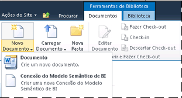
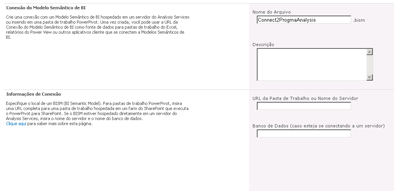

# Criar uma conexão de modelo semântico de BI para uma pasta de trabalho do Power Pivot
  Use as informações neste tópico para configurar uma conexão de modelo semântico do BI que redireciona para uma pastas de trabalho do [!INCLUDE[ssGemini](../../includes/ssgemini-md.md)] no mesmo farm.  
  
 Depois de criar uma conexão de modelo semântico de BI e configurar as permissões do SharePoint, você pode usá-lo como uma fonte de dados para Excel ou relatórios do [!INCLUDE[ssCrescent](../../includes/sscrescent-md.md)] .  
  
 Este tópico inclui as seções a seguir. Execute cada tarefa na ordem fornecida.  
  
 [Examinar pré-requisitos](#bkmk_prereq)  
  
 [Criar uma conexão](#bkmk_create)  
  
 [Configurar permissões de SharePoint na conexão de modelo semântico de BI](#bkmk_permissions)  
  
 [Configurar permissões do SharePoint na pasta de trabalho](#bkmk_userdb)  
  
 [Próximas etapas](#bkmk_next)  
  
##   Examinar pré-requisitos  
 É necessário ter permissões Colaborar ou superior para criar um arquivo de conexão de modelo semântico de BI.  
  
 Você deve ter uma biblioteca que dá suporte ao tipo de conteúdo da conexão de modelo semântico de BI. Para obter mais informações, consulte [Adicionar um tipo de conteúdo de conexão de modelo semântico de BI a uma biblioteca &#40;Power Pivot para SharePoint&#41;](../../analysis-services/power-pivot-sharepoint/add-bi-semantic-model-connection-content-type-to-library.md).  
  
 Você deve saber a URL do [!INCLUDE[ssGemini](../../includes/ssgemini-md.md)] pasta de trabalho para o qual você está configurando uma conexão de modelo semântico de BI (por exemplo, `http://adventure-works/shared documents/myworkbook.xlsx`). A pasta de trabalho deve estar no mesmo farm.  
  
 Todos os computadores e usuários que participam da sequência de conexão devem estar no mesmo domínio ou domínio confiável (confiança bidirecional).  
  
##   Criar uma conexão  
  
1.  Na biblioteca que conterá a conexão de modelo semântico de BI, clique em **Documentos** na faixa de opções do SharePoint. Clique na seta para baixo em Novo Documento e selecione **Arquivo de Conexão de BISM** para abrir uma nova página de Conexão de Modelo Semântico de BI.  
  
       
  
2.  Defina a propriedade **Server** como a URL do SharePoint da pasta de trabalho do [!INCLUDE[ssGemini](../../includes/ssgemini-md.md)] (por exemplo, `http://mysharepoint/shared documents/myWorkbook.xlsx`. Em uma implantação do [!INCLUDE[ssGemini](../../includes/ssgemini-md.md)] para SharePoint, dados podem ser carregados em qualquer servidor no farm. Por isso, as conexões da fonte de dados para dados do [!INCLUDE[ssGemini](../../includes/ssgemini-md.md)] especificam apenas o caminho para a pasta de trabalho. O Serviço de Sistema do [!INCLUDE[ssGemini](../../includes/ssgemini-md.md)] determina qual servidor carrega os dados.  
  
     Não use a propriedade **Database** ; ela não é usado ao especificar o local de uma pasta de trabalho do [!INCLUDE[ssGemini](../../includes/ssgemini-md.md)] .  
  
     Sua página deve ser similar à ilustração a seguir.  
  
       
  
     Opcionalmente, se você tiver permissões do SharePoint para a pasta de trabalho, uma etapa de validação adicional será executada, garantindo que o local seja válido. Se você não tiver permissão para acessar os dados, terá a opção de salvar a conexão de modelo semântico de BI sem a resposta de validação.  
  
##   Configurar permissões de SharePoint na conexão de modelo semântico de BI  
 A capacidade para usar uma conexão de modelo semântico de BI como uma fonte de dados para uma pasta de trabalho do Excel ou relatório do Reporting Services exige permissões de **Leitura** no item de conexão do modelo semântico de BI em uma biblioteca do SharePoint. O nível de permissão de leitura inclui a permissão **Abrir Itens** que habilita o carregamento de informações da conexão de modelo semântico de BI em um aplicativo de área de trabalho do Excel.  
  
 Há várias maneiras de conceder permissões no SharePoint. As instruções a seguir explicam como criar um novo grupo chamado **Usuários do BISM** que tem o nível de permissão de **Leitura** .  
  
 Você deve ser proprietário do site para alterar permissões.  
  
1.  Em Ações do Site, clique em **Permissões do Site**.  
  
2.  Clique em **Criar Grupo** e dê o nome de **Usuários do BISM**ao novo grupo.  
  
3.  Escolha o nível de permissão de **Leitura** e clique em **Criar**.  
  
4.  Selecione **Usuários do BISM** em Pessoas e Grupos.  
  
5.  Aponte para Novo, clique em **Adicionar Usuários**e adicione contas de usuário ou grupo.  
  
     Estes usuários e grupos agora terão permissões de Leitura em todo o site, incluindo todas as bibliotecas e listas que herdam permissões do nível do site. Se estas permissões forem muito altas, você poderá remover este grupo seletivamente de bibliotecas específicas, listas ou itens.  
  
 Para remover permissões seletivamente no nível do item, faça o seguinte:  
  
1.  Em uma biblioteca, selecione um documento. Clique na seta para baixo à direita e clique em **Gerenciar Permissões**.  
  
2.  Por padrão, um item herda permissões. Para alterar as permissões de documentos individuais nessa biblioteca, clique em **Parar de Herdar Permissões**.  
  
3.  Marque a caixa de seleção junto a **Usuários do BISM**.  
  
4.  Clique em **Remover Permissões do Usuário**.  
  
##   Configurar permissões do SharePoint na pasta de trabalho  
 Se você estiver usando um banco de dados do [!INCLUDE[ssGemini](../../includes/ssgemini-md.md)] dentro de uma pasta de trabalho do Excel, as permissões do SharePoint na pasta de trabalho do Excel determinarão o acesso a dados pela conexão de modelo semântico de BI. Todos os usuários que acessam a pasta de trabalho devem ter permissões de Leitura na pasta de trabalho para usá-la como uma fonte de dados externa.  
  
 Se você tiver criado um grupo de **Usuários de BISM** usando as instruções na seção anterior, as contas de usuário e grupo que são membros de **Usuários de BISM** terão permissões suficientes na pasta de trabalho, assim como o arquivo de conexão do modelo semântico de BI, contanto que a pasta de trabalho use permissões herdadas.  
  
##   Próximas etapas  
 Depois de criar e proteger uma conexão de modelo semântico de BI, você poderá especificá-la como uma fonte de dados. Para obter mais informações, consulte [Usar uma conexão de modelo semântico de BI no Excel ou Reporting Services](../../analysis-services/power-pivot-sharepoint/use-a-bi-semantic-model-connection-in-excel-or-reporting-services.md).  
  
## Consulte também  
 [Conexão de modelo semântico de BI &#40;.bism&#41; do Power Pivot](../../analysis-services/power-pivot-sharepoint/power-pivot-bi-semantic-model-connection-bism.md)   
 [Usar uma Conexão de modelo semântico de BI no Excel ou Reporting Services](../../analysis-services/power-pivot-sharepoint/use-a-bi-semantic-model-connection-in-excel-or-reporting-services.md)   
 [Criar uma conexão de modelo semântico de BI com um banco de dados de modelo de tabela](../../analysis-services/power-pivot-sharepoint/create-a-bi-semantic-model-connection-to-a-tabular-model-database.md)  
  
  

