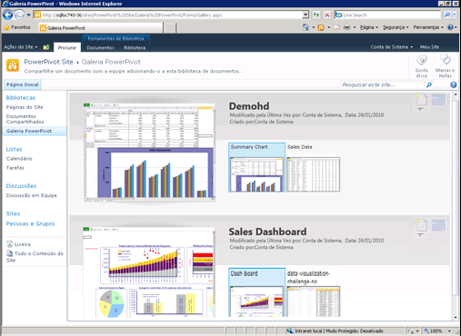

# Criar e personalizar a galeria do Power Pivot
[!INCLUDE[ssas-appliesto-sqlas](../../includes/ssas-appliesto-sqlas.md)]
  [!INCLUDE[ssGemini](../../includes/ssgemini-md.md)] é um tipo especial de biblioteca de documentos do SharePoint que fornece visualização avançada e gerenciamento de documentos das pastas de trabalho do Excel publicadas e relatórios dos Reporting Services que contêm dados do [!INCLUDE[ssGemini](../../includes/ssgemini-md.md)] .  
  
##   Neste tópico  
  
-   [Pré-requisitos](#prereq)  
  
-   [Visão geral](#overview)  
  
-   [Criar a Galeria do Power Pivot](#createlib)  
  
-   [Personalizar uma biblioteca da Galeria do Power Pivot](#customize)  
  
-   [Desabilitar ou ocultar o botão de atualização](#bkmk_hide_refresh_button)  
  
-   [Alternar para exibição de teatro ou exibição de galeria](#switch)  
  
##   Pré-requisitos  
  
-   Você deve ter o Silverlight. O Silverlight pode ser baixado e instalado por meio do Microsoft Update. Se você exibir uma biblioteca da Galeria [!INCLUDE[ssGemini](../../includes/ssgemini-md.md)] usando um navegador que não tenha o Silverlight, clique na página para instalá-lo. É necessário fechar e reabrir o navegador depois de instalá-lo.  
  
    > [!NOTE]  
    >  A Galeria do PowerPivot requer o Microsoft Silverlight.  O navegador Microsoft Edge não dá suporte ao Silverlight.   
    > Para exibir o conteúdo da biblioteca no Edge, clique na guia **Biblioteca** , na galeria do PowerPivot e, em seguida, altere a exibição da biblioteca de documentos para **Todos os documentos**.    
    > Para alterar a exibição padrão, clique na guia **Biblioteca** e depois clique em Modificar exibição. Clique em "Fazer desta a exibição padrão" e, em seguida, clique em OK para salvar a exibição padrão.  
    >  Para obter mais informações sobre ao que o Edge dá suporte, consulte o blog do Windows, [Uma ruptura com o passado, parte 2: adeus ao ActiveX, VBScript...](https://blogs.windows.com/msedgedev/2015/05/06/a-break-from-the-past-part-2-saying-goodbye-to-activex-vbscript-attachevent/)  
  
-   Você deve ser proprietário do site para criar uma biblioteca.  
  
-   É necessário ter permissões de colaboração ou superior para publicar ou carregar um arquivo.  
  
-   [!INCLUDE[ssGemini](../../includes/ssgemini-md.md)] não pode estar em um site restrito. O site principal que contém Galeria do [!INCLUDE[ssGemini](../../includes/ssgemini-md.md)] deve ser adicionado ao site confiável ou à zona de intranet local.  
  
-   A solução de aplicativo Web do [!INCLUDE[ssGemini](../../includes/ssgemini-md.md)] deve ter sido implantada no aplicativo, e o recurso [!INCLUDE[ssGemini](../../includes/ssgemini-md.md)] deve ter sido ativado para a coleção de sites. Para obter mais informações, consulte [Implantar soluções Power Pivot para SharePoint](../../analysis-services/power-pivot-sharepoint/deploy-power-pivot-solutions-to-sharepoint.md) e[Ativar a Integração de Recursos do Power Pivot para as Coleções de Sites na Administração Central](../../analysis-services/power-pivot-sharepoint/activate-power-pivot-integration-for-site-collections-in-ca.md).  
  
-   Para exibir ou criar um relatório do Reporting Services baseado em uma pasta de trabalho do [!INCLUDE[ssGemini](../../includes/ssgemini-md.md)] , a pasta de trabalho e o relatório devem estar na mesma Galeria [!INCLUDE[ssGemini](../../includes/ssgemini-md.md)] . O relatório deve usar uma pasta de trabalho do [!INCLUDE[ssGemini](../../includes/ssgemini-md.md)] que contenha dados incorporados, ou a pasta de trabalho deve conter pelo menos uma fonte de dados externa que seja uma pasta de trabalho do [!INCLUDE[ssGemini](../../includes/ssgemini-md.md)] .  
  
##   Visão geral  
 [!INCLUDE[ssGemini](../../includes/ssgemini-md.md)] é um modelo de biblioteca disponível quando você instala o [!INCLUDE[ssGeminiLong](../../includes/ssgeminilong-md.md)] em um servidor do SharePoint. A Galeria [!INCLUDE[ssGemini](../../includes/ssgemini-md.md)] combina uma visualização precisa do conteúdo do arquivo com fatos sobre a origem do documento. É possível ver imediatamente quem criou o documento e quando ele foi modificado pela última vez. Para criar imagens de visualização, a Galeria [!INCLUDE[ssGemini](../../includes/ssgemini-md.md)] usa um serviço de instantâneo capaz de ler pastas de trabalho [!INCLUDE[ssGemini](../../includes/ssgemini-md.md)] e relatórios do Reporting Services que contenham dados do [!INCLUDE[ssGemini](../../includes/ssgemini-md.md)] . Se você publicar um arquivo que não possa ser lido pelo serviço de instantâneo, nenhuma imagem de visualização estará disponível para esse arquivo.  
  
 As imagens de visualização se baseiam na maneira como a pasta de trabalho é processada pelos Serviços do Excel. A representação na Galeria [!INCLUDE[ssGemini](../../includes/ssgemini-md.md)] deve ser idêntica àquela que você vê ao exibir uma pasta de trabalho [!INCLUDE[ssGemini](../../includes/ssgemini-md.md)] em um navegador. No entanto, a visualização tem uma área da superfície limitada. Partes de uma pasta de trabalho ou de um relatório podem ser recortadas para ela se ajustar ao espaço disponível. Talvez você precise abrir uma pasta de trabalho ou um relatório para exibir o documento em sua totalidade.  
  
 Há suporte total para a atualização dados de pastas de trabalho do [!INCLUDE[ssGemini](../../includes/ssgemini-md.md)] a partir de fontes de dados externas na Galeria [!INCLUDE[ssGemini](../../includes/ssgemini-md.md)] , mas isso exige configuração adicional. O administrador de um farm ou serviço deve adicionar a Galeria [!INCLUDE[ssGemini](../../includes/ssgemini-md.md)] como um local confiável dos Serviços do Excel. Para obter mais informações, consulte [Criar um local confiável para sites do Power Pivot na Administração Central](../../analysis-services/power-pivot-sharepoint/create-a-trusted-location-for-power-pivot-sites-in-central-administration.md).  
  
##   Criar a Galeria do Power Pivot  
 [!INCLUDE[ssGemini](../../includes/ssgemini-md.md)] é criada para você durante a instalação do [!INCLUDE[ssGeminiLong](../../includes/ssgeminilong-md.md)] usando-se a opção de instalação Novo Servidor. Se você adicionar o [!INCLUDE[ssGeminiShort](../../includes/ssgeminishort-md.md)] a um farm existente ou se desejar uma biblioteca adicional, poderá criar uma nova para seu aplicativo ou site.  
  
1.  1.  **SharePoint 2010**: clique em **Ações de Site** no canto superior esquerdo da home page do site.  
  
    2.  Clique em **Mais Opções**.  
  
    3.  Em Bibliotecas, clique em **Galeria do [!INCLUDE[ssGemini](../../includes/ssgemini-md.md)]**.  
  
    1.  **SharePoint 2013**: clique no ícone configurações . Clique em **Conteúdo do Site**  
  
    2.  Clique em **Adicionar um aplicativo**.  
  
    3.  Clique em **Galeria do [!INCLUDE[ssGemini](../../includes/ssgemini-md.md)]**.  
  
2.  Digite um nome para a biblioteca. Inclua informações descritivas que ajudem os usuários a identificarem essa biblioteca como uma visualização avançada das pastas de trabalho do [!INCLUDE[ssGemini](../../includes/ssgemini-md.md)] e dos relatórios do Reporting Services.  
  
3.  Clique em **Criar**.  
  
4.  Peça ao administrador do farm ou do serviço para adicionar a Galeria [!INCLUDE[ssGemini](../../includes/ssgemini-md.md)] como um local confiável para os Serviços do Excel. Esta etapa será necessária evitar erros se um usuário configurar uma pasta de trabalho para atualização de dados do [!INCLUDE[ssGemini](../../includes/ssgemini-md.md)] . Para obter mais informações sobre essa tarefa, consulte [Criar um local confiável para sites do PowerPivot na Administração Central](../../analysis-services/power-pivot-sharepoint/create-a-trusted-location-for-power-pivot-sites-in-central-administration.md).  
  
 Um link para a biblioteca da Galeria [!INCLUDE[ssGemini](../../includes/ssgemini-md.md)] é exibido no painel Início Rápido da navegação do site atual.  
  
 Você poderá criar bibliotecas da Galeria [!INCLUDE[ssGemini](../../includes/ssgemini-md.md)] adicionais se estiver impondo permissões diferentes para diferentes conjuntos de sites ou sites individuais.  
  
##   Personalizar uma biblioteca da Galeria do Power Pivot  
 [!INCLUDE[ssGemini](../../includes/ssgemini-md.md)] é uma biblioteca de documentos do SharePoint. Portanto, você pode usar ferramentas de biblioteca padrão no SharePoint para alterar as configurações de biblioteca ou trabalhar com documentos individuais na biblioteca. Cada biblioteca que você cria pode ser personalizada de forma independente para usar configurações diferentes de exibição ou biblioteca.  
  
 A ordem de classificação e os filtros podem ser modificados para alterar onde as pastas de trabalho aparecem na lista. Por padrão, os documentos são listados na ordem na qual eles foram adicionados, onde o último documento publicado aparece na parte inferior da lista. Depois que um documento é publicado, ele retém seu local na lista. Atualizar e republicar o documento atualizam seu local na lista.  
  
 Não é possível habilitar ou desabilitar a visualização para documentos específicos. O serviço de instantâneo irá gerar imagens de visualização para todas as pastas de trabalho do [!INCLUDE[ssGemini](../../includes/ssgemini-md.md)] e para os relatórios do Reporting Services baseados em pastas de trabalho do [!INCLUDE[ssGemini](../../includes/ssgemini-md.md)] que estejam armazenadas na mesma biblioteca. Essas imagens podem ser exibidas por todos os usuários que tenham permissões de exibição no documento.  
  
 Não é possível estender a Galeria [!INCLUDE[ssGemini](../../includes/ssgemini-md.md)] para fornecer visualização de outros tipos de documento. A visualização só tem suporte das pastas de trabalho do Excel 2010 ou do SQL Server 2008 R2 Reporting Services que contenham dados [!INCLUDE[ssGemini](../../includes/ssgemini-md.md)] .  
  
 Não é possível alterar as configurações que controlam as informações de origem do documento. Os fatos exibidos sobre documentos individuais, como quem adicionou ou modificou a pasta de trabalho por último, são determinados por um conjunto fixo de colunas que não podem ser modificadas.  
  
#### Alterar a ordem de classificação, adicione filtros ou limite o número de documentos  
 [!INCLUDE[ssGemini](../../includes/ssgemini-md.md)] sempre mostra os valores 'Última modificação' e 'Criado por'. Você não pode desabilitar estas colunas. Você não pode habilitar outras colunas para a biblioteca. Use as seguintes instruções para alterar a ordem de classificação, adicionar um filtro ou limitar o número de documentos visíveis.  
  
1.  Em um site do SharePoint, abra a Galeria do [!INCLUDE[ssGemini](../../includes/ssgemini-md.md)] .  
  
2.  Na faixa de opções, clique em **Biblioteca**.  
  
3.  **SharePoint 2010:** em Exibições Personalizadas, clique em **Modificar esta Exibição**.  
  
     **SharePoint 2013:** em **Gerenciar Exibições**, clique em **Modificar Exibição**.  
  
4.  Em Classificação, especifique os critérios que serão usados para determinar como pastas de trabalho aparecem na lista. Por padrão, os documentos são listados na ordem em que são adicionados.  
  
5.  Em Filtro, especifique os critérios que serão usados para mostrar ou ocultar pastas de trabalho com base em valores condicionais definidos em colunas. Por exemplo, você pode querer ocultar todas as pastas de trabalho criadas antes de uma determinada data.  
  
6.  Em Limite de Itens, especifique as opções úteis para as bibliotecas da Galeria [!INCLUDE[ssGemini](../../includes/ssgemini-md.md)] que contêm um número muito grande de documentos. Você pode limitar o número real de itens que aparecem na lista ou exibir itens em lotes.  
  
7.  Clique em **OK** para salvar as alterações.  
  
####   Desabilitar ou ocultar o botão de atualização  
 Você não pode ocultar o botão **Gerenciar Atualização de Dados** . No entanto, o botão estará desabilitado se o usuário não tiver permissões suficientes.  
  
   
  
 Os proprietários ou autores de pastas de trabalho precisam ter permissão **Colaborar** para agendar a atualização de dados em uma pasta de trabalho. Os usuários com permissões de colaboração podem abrir e editar a página de configuração de atualização de dados da pasta de trabalho para especificar as credenciais e informações de agendamento usadas para atualizar os dados.  
  
 Portanto, os usuários que somente tiverem os níveis de permissão **Exibição** ou **Leitura** não poderão acessar o botão de atualização. O botão Atualizar está visível, mas desabilitado. Para obter mais informações, consulte [Permissões de usuários e níveis de permissão no SharePoint 2013](http://technet.microsoft.com/library/cc721640.aspx).  
  
##   Alternar para exibição de teatro ou exibição de galeria  
 A visualização varia de acordo como você configura a exibição da biblioteca. Na exibição de Galeria, é possível passar o ponteiro do mouse sobre planilhas individuais na pasta de trabalho para focalizar uma planilha na área de visualização.  
  
   
  
 A seguinte tabela descreve os layouts diferentes para apresentar esboços em miniatura de cada página visualizada:  
  
|Exibição|Description|  
|----------|-----------------|  
|Exibição de Galeria (padrão)|Galeria é a exibição padrão para uma Galeria [!INCLUDE[ssGemini](../../includes/ssgemini-md.md)] . A visualização é exibida à esquerda. As miniaturas menores de cada planilha são exibidas ao lado dela em uma ordem sequencial da esquerda para a direita.|  
|Todos os documentos|Esse é o layout padrão para bibliotecas de documentos. É possível escolher essa exibição para gerenciar documentos individuais ou exibir o conteúdo da biblioteca em um formato de lista.   Use essa exibição para editar propriedades, excluir ou mover documentos individuais.   Se habilitou o controle de versão, você deverá usar essa exibição para fazer check-in ou check-out de documentos da biblioteca.|  
|Exibição de Teatro e Exibição de Carrossel|Essas serão exibições especializados que funcionarão melhor se você estiver mostrando um número pequeno de documentos relacionados. A rotação total de miniaturas inclui todas as páginas em todos os documentos na biblioteca. Se você tiver um número grande de documentos, essas exibições poderão não ser práticas para usuários que desejam localizar ou abrir uma pasta de trabalho específica do [!INCLUDE[ssGemini](../../includes/ssgemini-md.md)] .   Exibição de teatro: A área de visualização é centralizada. Miniaturas menores de cada planilha são exibidas na parte mais inferior da página, em qualquer lado.   Exibição de carrossel: A área de visualização é centralizada. As miniaturas pouco antes e depois da miniatura atual estão próximas à área de visualização.|  
  
### Alternar para uma exibição diferente  
  
1.  Em um site do SharePoint, abra a Galeria do [!INCLUDE[ssGemini](../../includes/ssgemini-md.md)] .  
  
2.  Na faixa de opções, clique em **Biblioteca**.  
  
3.  Em Gerenciar Exibições, em Exibição Atual, selecione a exibição que você deseja usar na lista. As exibições predefinidas incluem Galeria, Teatro e Carrossel. Também é possível escolher Todos os Documentos se você quiser mover, excluir ou gerenciar documentos na biblioteca.  
  
## Consulte também  
 [Solução de problemas de instalação do Power Pivot para SharePoint](../../analysis-services/troubleshoot-a-power-pivot-for-sharepoint-installation.md)   
 [Usar a Galeria Power Pivot](../../analysis-services/power-pivot-sharepoint/use-power-pivot-gallery.md)   
 [Criar um local confiável para sites do PowerPivot](../../analysis-services/power-pivot-sharepoint/create-a-trusted-location-for-power-pivot-sites-in-central-administration.md)   
 [Excluir Galeria do Power Pivot](../../analysis-services/power-pivot-sharepoint/delete-power-pivot-gallery.md)  
  
  
