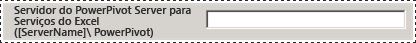
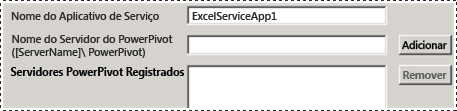
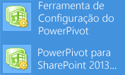
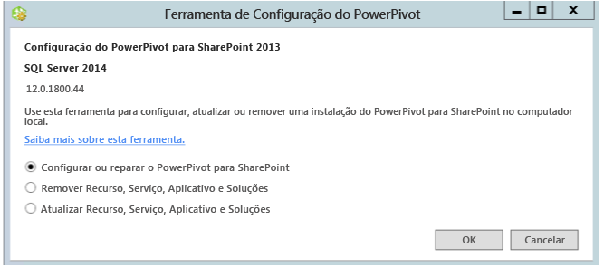

# Power Pivot Configuration Tools
[!INCLUDE[ssas-appliesto-sqlas](../../includes/ssas-appliesto-sqlas.md)]
  Configure, repare ou remova um [!INCLUDE[ssCurrent](../../includes/sscurrent-md.md)] [!INCLUDE[ssGeminiShort](../../includes/ssgeminishort-md.md)] com as Ferramentas de Configuração do [!INCLUDE[ssGemini](../../includes/ssgemini-md.md)] .  
  
 O Assistente de Instalação do [!INCLUDE[ssCurrent](../../includes/sscurrent-md.md)] não instala o as ferramentas de configuração do [!INCLUDE[ssGemini](../../includes/ssgemini-md.md)] para SharePoint. As ferramentas de configuração estarão disponíveis para download em uma versão futura do [!INCLUDE[ssCurrent](../../includes/sscurrent-md.md)].  
  
 Este tópico descreve o uso geral das ferramentas do [!INCLUDE[ssGemini](../../includes/ssgemini-md.md)] e as diferenças entre elas.  
  
 **[!INCLUDE[applies](../../includes/applies-md.md)]**  SharePoint 2013  
  
 **Neste tópico:**  
  
-   [Requisitos para usar as ferramentas de configuração](#bkmk_requirements)  
  
-   [Duas versões da ferramenta de configuração](#bkmk_twoversions)  
  
-   [Visão geral do uso de uma ferramenta de configuração do Power Pivot](#bkmk_overview)  
  
-   [Iniciar uma das ferramentas de configuração do Power Pivot](#bmkm_start_tool)  
  
##   Requisitos para usar as ferramentas de configuração  
  
-   Você deve ser um administrador de farm.  
  
-   Você deve ser um administrador de servidor na instância do Analysis Services (somente SharePoint 2010).  
  
-   Você deve ser o db_owner no banco de dados de configuração do farm.  
  
-   Não há requisitos de porta TCP/IP para usar as ferramentas de configuração. Portanto, não é preciso configurar o firewall para acomodar as ferramentas de configuração. A ferramenta configuração espera que os aplicativos Web e serviços compartilhados estejam disponíveis como parte da plataforma SharePoint. Pode ser necessário configurar o firewall para o servidor [!INCLUDE[ssASnoversion](../../includes/ssasnoversion-md.md)] . Para obter mais informações, consulte [Configure the Windows Firewall to Allow Analysis Services Access](../../analysis-services/instances/configure-the-windows-firewall-to-allow-analysis-services-access.md).  
  
##   Duas versões da ferramenta de configuração  
 O Assistente de Configuração do [!INCLUDE[ssCurrent](../../includes/sscurrent-md.md)] instala a Ferramenta de Configuração do [!INCLUDE[ssGemini](../../includes/ssgemini-md.md)] para SharePoint 2010, bem como a Ferramenta de Configuração do [!INCLUDE[ssGemini](../../includes/ssgemini-md.md)] para SharePoint 2013.  
  
 As ferramentas podem ser usada apenas com uma instância do [!INCLUDE[ssCurrent](../../includes/sscurrent-md.md)] ou [!INCLUDE[ssSQL11SP1](../../includes/sssql11sp1-md.md)] do [!INCLUDE[ssGeminiShort](../../includes/ssgeminishort-md.md)]. Não use-as com instalações do [!INCLUDE[ssKilimanjaro](../../includes/sskilimanjaro-md.md)] .  
  
|Name|Versão com suporte do SharePoint|Configuração detalhada|  
|----------|-------------------------------------|----------------------------|  
|[!INCLUDE[ssGemini](../../includes/ssgemini-md.md)] para configuração do SharePoint 2013|SharePoint 2013|[Configurar ou reparar o Power Pivot para SharePoint 2013 &#40;Power Pivot Configuration Tool&#41;](../../analysis-services/power-pivot-sharepoint/configure-or-repair-power-pivot-for-sharepoint-2013.md)|  
|[!INCLUDE[ssGemini](../../includes/ssgemini-md.md)] Ferramenta de Configuração|SharePoint 2010 com SharePoint 2010|[Configurar ou reparar o Power Pivot para SharePoint 2010 (Ferramenta de Configuração do Power Pivot)](http://msdn.microsoft.com/d61f49c5-efaa-4455-98f2-8c293fa50046)|  
  
###   Diferenças entre as duas ferramentas de configuração  
 As duas versões da ferramenta de configuração são semelhantes, mas há diferenças nas etapas de configuração executadas pelas duas ferramentas. As diferenças se devem a alterações entre o SharePoint 2010 e o SharePoint 2013, mas também a diferenças na arquitetura entre a versão do SQL Server 2012 SP1 do [!INCLUDE[ssGemini](../../includes/ssgemini-md.md)] para SharePoint e as versões anteriores do [!INCLUDE[ssGemini](../../includes/ssgemini-md.md)] para SharePoint.  
  
 A tabela a seguir descreve recursos novos e modificados na **Ferramenta de configuração do [!INCLUDE[ssGemini](../../includes/ssgemini-md.md)] para SharePoint 2013**. A tabela também descreve recursos da **Ferramenta de Configuração do [!INCLUDE[ssGemini](../../includes/ssgemini-md.md)]** que não estão na Ferramenta de Configuração do [!INCLUDE[ssGemini](../../includes/ssgemini-md.md)] para SharePoint 2013. As linhas da tabela estão na mesma ordem que as guias nas ferramentas de configuração.  
  
|[!INCLUDE[ssGemini](../../includes/ssgemini-md.md)] para configuração do SharePoint 2013|[!INCLUDE[ssGemini](../../includes/ssgemini-md.md)] Ferramenta de Configuração|  
|--------------------------------------------------------------|-----------------------------------------------|  
|A página principal tem uma nova opção para **[!INCLUDE[ssGemini](../../includes/ssgemini-md.md)] para Serviços do Excel**. A opção dá suporte à nova arquitetura com o [!INCLUDE[ssASnoversion](../../includes/ssasnoversion-md.md)] executado fora do farm do SharePoint. Você configura Serviços do Excel para usar um ou mais servidores do [!INCLUDE[ssASnoversion](../../includes/ssasnoversion-md.md)] em execução no modo do SharePoint.   ||  
||A ferramenta 2010 inclui a página **Registrar o SQL Server Analysis Services ([!INCLUDE[ssGemini](../../includes/ssgemini-md.md)]) no servidor local** para configurar uma instância local do [!INCLUDE[ssASnoversion](../../includes/ssasnoversion-md.md)]. Essa página não faz parte da ferramenta 2013 porque não há instância local do [!INCLUDE[ssASnoversion](../../includes/ssasnoversion-md.md)].   |  
||A página **Criar Aplicativo de Serviço [!INCLUDE[ssGemini](../../includes/ssgemini-md.md)]** tem uma opção adicional de **Atualizar pastas de trabalho para habilitar a atualização de dados**. Essa opção não está disponível na ferramenta 2013.   |  
|A ferramenta 2013 tem uma nova página **Configurar Servidores do [!INCLUDE[ssGemini](../../includes/ssgemini-md.md)]** . Essa página dá suporte à nova arquitetura do [!INCLUDE[ssASnoversion](../../includes/ssasnoversion-md.md)] executado fora do farm do SharePoint. Por padrão, o nome do servidor digitado na página principal na caixa de texto **Servidor do [!INCLUDE[ssGemini](../../includes/ssgemini-md.md)] para Serviços do Excel** também será listado em **Configurar Servidores do [!INCLUDE[ssGemini](../../includes/ssgemini-md.md)]** .   ||  
|A ferramenta 2013 tem uma nova página **Registrar o Suplemento [!INCLUDE[ssGemini](../../includes/ssgemini-md.md)] como Rastreador de Uso de Serviços do Excel**. Os Serviços do Excel no SharePoint 2010 não rastreiam dados de uso do [!INCLUDE[ssGemini](../../includes/ssgemini-md.md)].||  
||A ferramenta 2010 inclui a página **Adicionar MSOLAP.5 como um provedor confiável** para registrar MSOLAP, de modo que os Serviços do Excel no SharePoint 2010 podem carregar modelos do [!INCLUDE[ssGemini](../../includes/ssgemini-md.md)] . Essa página não faz parte da ferramenta 2013. Os Serviços do Excel para SharePoint 2013 não usam o provedor MSOLAP para carregar modelos.|  
  
##   Visão geral do uso de uma ferramenta de configuração do Power Pivot  
 Quando você inicia uma das Ferramentas de Configuração do [!INCLUDE[ssGemini](../../includes/ssgemini-md.md)] , a ferramenta avalia a instalação existente para determinar quais operações são aplicáveis. Em uma nova instalação, apenas a tarefa de configuração está disponível. Depois que o servidor estiver configurado, a tarefa de remoção será exibida. Se você tiver iniciado com uma instância do [!INCLUDE[ssKilimanjaro](../../includes/sskilimanjaro-md.md)] , a atualização também será habilitada na lista de tarefas disponíveis.  
  
 Se não estiver familiarizado com a Administração Central ou o Windows PowerShell, você poderá executar a ferramenta de configuração como uma alternativa para concluir uma instalação do [!INCLUDE[ssGeminiShort](../../includes/ssgeminishort-md.md)] .  
  
 Além disso, a ferramenta pode detectar se o farm está configurado ou se recursos necessários estão ausentes. Se os arquivos de programa do SharePoint estiverem instalados, mas o farm não estiver configurado, a ferramenta fornecerá ações para configurar o farm e a instalação do [!INCLUDE[ssGeminiShort](../../includes/ssgeminishort-md.md)] .  
  
 Você pode examinar a guia **Script** para saber e compreender como configurar o [!INCLUDE[ssGemini](../../includes/ssgemini-md.md)] e o SharePoint usando o Windows PowerShell. Para obter mais informações, consulte o seguinte:  
  
-   [Configuração do Power Pivot usando o Windows PowerShell](../../analysis-services/power-pivot-sharepoint/power-pivot-configuration-using-windows-powershell.md)  
  
-   [Referência do PowerShell para Power Pivot para SharePoint](../../analysis-services/powershell/powershell-reference-for-power-pivot-for-sharepoint.md)  
  
> [!NOTE]
>  A ferramenta não configura o Reporting Services. Se estiver adicionando o Reporting Services a seu ambiente do SharePoint, você precisará instalar e configurar o Reporting Services separadamente. Para obter mais informações, consulte o seguinte:  
> 
>  -   [Instalar o Primeiro Servidor de Relatório no Modo do SharePoint](../../reporting-services/install-windows/install-the-first-report-server-in-sharepoint-mode.md).  
> -   [Instalar o Reporting Services no Modo do SharePoint para SharePoint 2010](http://msdn.microsoft.com/47efa72e-1735-4387-8485-f8994fb08c8c).  
  
##   Iniciar uma das ferramentas de configuração do Power Pivot  
  
1.  Na tela **Iniciar** , digite **powerpivot**  
  
     Na tela **Iniciar** , digite **powerpivot** ou, no menu **Iniciar** , clique em **Todos os Programas**, em [!INCLUDE[ssCurrentUI](../../includes/sscurrentui-md.md)], em **Ferramentas de Configuração**e em um dos seguintes itens:  
  
    -   **[!INCLUDE[ssGemini](../../includes/ssgemini-md.md)] Ferramenta de Configuração**.  
  
    -   **OR**  
  
    -   **[!INCLUDE[ssGemini](../../includes/ssgemini-md.md)] para configuração do SharePoint 2013**.  
  
       
  
     **Observação:** As ferramentas estão disponíveis apenas quando [!INCLUDE[ssGeminiShort](../../includes/ssgeminishort-md.md)] está instalado no servidor local.  
  
2.  Na inicialização, as ferramentas de configuração verificam o status de sua instalação e fornecem tarefas que são válidas para a instalação.  
  
3.  Dependendo do estado atual da instalação, uma ou mais destas tarefas podem ser executadas:  
  
    1.  Clique em **Configurar ou Reparar o [!INCLUDE[ssGemini](../../includes/ssgemini-md.md)] para SharePoint** para concluir as tarefas de pós-instalação ou para reparar uma instalação.  
  
    2.  Clique em **Remover Recursos, Serviços, Aplicativos e Soluções** para remover recursos e soluções do farm.  
  
    3.  Clique em **Atualizar Recursos, Serviços, Aplicativos e Soluções** para atualizar recursos e soluções que foram instaladas usando uma versão anterior do [!INCLUDE[ssGeminiShort](../../includes/ssgeminishort-md.md)].  
  
     Por exemplo, a imagem mostra a página de inicialização da ferramenta de configuração do [!INCLUDE[ssGemini](../../includes/ssgemini-md.md)] para SharePoint 2013.  
  
       
  
 Cada tarefa é composta de ações individuais que abordam algum aspecto da configuração do servidor. Por exemplo, a tarefa de configuração inclui ações para implantar soluções, criar um aplicativo de serviço do [!INCLUDE[ssGemini](../../includes/ssgemini-md.md)] , ativar recursos e configurar a atualização de dados. A lista de ações variará de acordo com o estado atual da instalação. Se uma ação não for necessária, a ferramenta a excluirá da lista de tarefas.  
  
 Quando você clica em Executar, a ferramenta processa todas as ações em modo de lote. Embora cada ação apareça como um item separado na lista de tarefas, todas as ações incluídas na tarefa são processadas em conjunto. Apenas as ações aprovadas em uma verificação de validação são processadas. Você pode precisar adicionar ou alterar alguns dos valores de entrada para ser aprovado para verificação de validação.  
  
## Conteúdo relacionado  
 [Atualizar Power Pivot para SharePoint](../../database-engine/install-windows/upgrade-power-pivot-for-sharepoint.md) Descreve o fluxo de trabalho que atualiza uma instalação existente que já está em um farm.  
  
 [Desinstalar o Power Pivot para SharePoint](../../sql-server/install/uninstall-power-pivot-for-sharepoint.md) Descreve o fluxo de trabalho que remove serviços, soluções e páginas de aplicativos do [!INCLUDE[ssGemini](../../includes/ssgemini-md.md)] para SharePoint de um farm.  
  
 [Configuração do Power Pivot usando o Windows PowerShell](../../analysis-services/power-pivot-sharepoint/power-pivot-configuration-using-windows-powershell.md)  
  
 [Administração e configuração de servidor do Power Pivot na Administração Central](../../analysis-services/power-pivot-sharepoint/power-pivot-server-administration-and-configuration-in-central-administration.md)  
  
  
