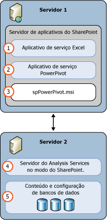

# Power Pivot para SharePoint (SSAS)
[!INCLUDE[ssas-appliesto-sqlas](../../includes/ssas-appliesto-sqlas.md)]Um [!INCLUDE[ssASnoversion](../../includes/ssasnoversion-md.md)] servidor [!INCLUDE[ssGemini](../../includes/ssgemini-md.md)] modo fornece hospedagem de servidor de [!INCLUDE[ssGemini](../../includes/ssgemini-md.md)] dados em um farm do SharePoint. [!INCLUDE[ssGemini](../../includes/ssgemini-md.md)] são um modelo de dados analíticos que você cria usando um dos seguintes:  
  
-   O suplemento [!INCLUDE[ssGemini](../../includes/ssgemini-md.md)] do Excel 2010  
  
-   Excel 2013  
  
-   Excel 2016  
  
 **[!INCLUDE[applies](../../includes/applies-md.md)]**  [!INCLUDE[ssGeminiShort](../../includes/ssgeminishort-md.md)] 2016 | [!INCLUDE[ssGeminiShort](../../includes/ssgeminishort-md.md)] 2013  
  
 O servidor que hospeda esses dados exige o SharePoint, os Serviços do Excel e uma instalação do [!INCLUDE[ssGemini](../../includes/ssgemini-md.md)] para SharePoint. Os dados são carregados no [!INCLUDE[ssGemini](../../includes/ssgemini-md.md)] para as instâncias do SharePoint, nas quais podem ser atualizados em intervalos agendados usando a funcionalidade de atualização de dados do [!INCLUDE[ssGemini](../../includes/ssgemini-md.md)] que o servidor fornece para as pastas de trabalho do Excel 2010 que o [!INCLUDE[ssGemini](../../includes/ssgemini-md.md)] fornece para as pastas de trabalho do Excel 2013 e 2016.  
  
## Power Pivot para SharePoint 2016  
 [!INCLUDE[ssCurrent](../../includes/sscurrent-md.md)] [!INCLUDE[ssGeminiShort](../../includes/ssgeminishort-md.md)] dá suporte ao uso de Serviços do Excel do [!INCLUDE[msCoName](../../includes/msconame-md.md)] SharePoint 2016 e [!INCLUDE[offOnlineServer](../../includes/offonlineserver-md.md)] de pastas de trabalho do Excel com modelos de dados e relatórios do [!INCLUDE[ssRSnoversion](../../includes/ssrsnoversion-md.md)] Power View.  
  
 O Excel no [!INCLUDE[offOnlineServer](../../includes/offonlineserver-md.md)] inclui a funcionalidade de modelo de dados para habilitar a interação com uma pasta de trabalho [!INCLUDE[ssGemini](../../includes/ssgemini-md.md)] no navegador. Você não precisa implantar o [!INCLUDE[ssGemini](../../includes/ssgemini-md.md)] para o suplemento do SharePoint 2016 no farm. Você só precisa instalar um servidor [!INCLUDE[ssASnoversion](../../includes/ssasnoversion-md.md)] no modo [!INCLUDE[ssGemini](../../includes/ssgemini-md.md)] e registrar o servidor com [!INCLUDE[offOnlineServer](../../includes/offonlineserver-md.md)].  
  
 Implantar o [!INCLUDE[ssGemini](../../includes/ssgemini-md.md)] para o suplemento do SharePoint 2016 permite mais funcionalidades e recursos em seu farm do SharePoint. Os recursos adicionais incluem a Galeria [!INCLUDE[ssGemini](../../includes/ssgemini-md.md)] e a Atualização de Dados da Agenda.  
  
   
  
## Power Pivot para SharePoint 2013  
 [!INCLUDE[ssCurrent](../../includes/sscurrent-md.md)] [!INCLUDE[ssGeminiShort](../../includes/ssgeminishort-md.md)] oferece suporte ao [!INCLUDE[msCoName](../../includes/msconame-md.md)] uso de Serviços do Excel do SharePoint 2013 de pastas de trabalho do Excel com modelos de dados e [!INCLUDE[ssRSnoversion](../../includes/ssrsnoversion-md.md)] relatórios do Power View.  
  
 Os Serviços do Excel no SharePoint 2013 incluem a funcionalidade de modelo de dados para habilitar a interação com uma pasta de trabalho [!INCLUDE[ssGemini](../../includes/ssgemini-md.md)] no navegador. Você não precisa implantar o [!INCLUDE[ssGemini](../../includes/ssgemini-md.md)] para o suplemento do SharePoint 2013 no farm. Você só precisará instalar um servidor do [!INCLUDE[ssASnoversion](../../includes/ssasnoversion-md.md)] no modo do SharePoint e registrar o servidor nas configurações do **Modelo de Dados** dos Serviços do Excel.  
  
 Implantar o [!INCLUDE[ssGemini](../../includes/ssgemini-md.md)] para o suplemento do SharePoint 2013 permite mais funcionalidades e recursos em seu farm do SharePoint. Os recursos adicionais incluem a Galeria [!INCLUDE[ssGemini](../../includes/ssgemini-md.md)] , Atualização de Dados da Agenda e o Painel de Gerenciamento do [!INCLUDE[ssGemini](../../includes/ssgemini-md.md)] .  
  
   
  
##   Nesta seção  
 [Administração e configuração de servidor do Power Pivot na Administração Central](../../analysis-services/power-pivot-sharepoint/power-pivot-server-administration-and-configuration-in-central-administration.md)  
  
 [Configuração do Power Pivot usando o Windows PowerShell](../../analysis-services/power-pivot-sharepoint/power-pivot-configuration-using-windows-powershell.md)  
  
 [Ferramentas de Configuração do Power Pivot](../../analysis-services/power-pivot-sharepoint/power-pivot-configuration-tools.md)  
  
 [Autenticação e autorização do Power Pivot](../../analysis-services/power-pivot-sharepoint/power-pivot-authentication-and-authorization.md)  
  
 [Configurar regras de integridade do Power Pivot](../../analysis-services/power-pivot-sharepoint/configure-power-pivot-health-rules.md)  
  
 [Painel de Gerenciamento Power Pivot e dados de uso](../../analysis-services/power-pivot-sharepoint/power-pivot-management-dashboard-and-usage-data.md)  
  
 [Galeria do Power Pivot](http://msdn.microsoft.com/library/2a0db616-e08e-4062-aac8-979f8cad7794)  
  
 [Acesso a dados do Power Pivot](../../analysis-services/power-pivot-sharepoint/power-pivot-data-access.md)  
  
 [Atualização de Dados PowerPivot](../../analysis-services/power-pivot-sharepoint/power-pivot-data-refresh.md)  
  
 [Feeds de dados do Power Pivot](../../analysis-services/power-pivot-sharepoint/power-pivot-data-feeds.md)  
  
 [Conexão de modelo semântico de BI &#40;.bism&#41; do Power Pivot](../../analysis-services/power-pivot-sharepoint/power-pivot-bi-semantic-model-connection-bism.md)  
  
 **Nas outras seções**  
  
## Tópicos adicionais  
 [Atualizar Power Pivot para SharePoint](../../database-engine/install-windows/upgrade-power-pivot-for-sharepoint.md)  
  
 [Instale o Analysis Services no modo do Power Pivot.](../../analysis-services/instances/install-windows/install-analysis-services-in-power-pivot-mode.md)  
  
 [Referência do PowerShell para Power Pivot para SharePoint](../../analysis-services/powershell/powershell-reference-for-power-pivot-for-sharepoint.md)  
  
 [Custos e topologias de licença de exemplo para o Business Intelligence do SQL Server 2016](http://msdn.microsoft.com/library/682b8711-407a-48d1-9807-415d4c24dad6)  
  
## Consulte Também  
 [Planejamento e Implantação do Power Pivot](http://go.microsoft.com/fwlink/?linkID=220972)   
 [Recuperação de desastres para PowerPivot para SharePoint](http://go.microsoft.com/fwlink/p/?LinkId=389570)  
  
  
