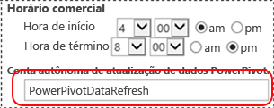

# Agendar atualização de dados e fontes de dados - nenhuma autenticação do Windows
[!INCLUDE[ssas-appliesto-sqlas](../../includes/ssas-appliesto-sqlas.md)]Este tópico descreve um fluxo de trabalho de [!INCLUDE[ssGemini](../../includes/ssgemini-md.md)] para SharePoint agendar atualização de dados que pode usar dados de fontes que **não** oferecer suporte à autenticação do Windows. Por exemplo, fontes de dados Oracle ou IDM DB2. As ilustrações e as etapas neste tópico fazem referência a fontes de dados Oracle, mas o mesmo fluxo de trabalho aplica-se a outras fontes de dados.  
  
||  
|-|  
|**[!INCLUDE[applies](../../includes/applies-md.md)]** SharePoint 2010 &#124; SharePoint 2013.|  
  
 **Visão geral:** Crie dois aplicativos de destino de repositório seguro. Configure o primeiro aplicativo de destino (PowerPivotDataRefresh) para usar as credenciais do Windows. Configure o segundo aplicativo de destino com as credenciais de uma fonte de dados que não ofereça suporte à autenticação do Windows; por exemplo, um banco de dados Oracle. O segundo aplicativo de destino também usa o primeiro aplicativo de destino para a conta autônoma de atualização de dados.  
  
   
  
-   **(1) PowerPivotDatarefresh:** uma ID de aplicativo de destino de repositório seguro definida com a autenticação do Windows.  
  
-   **(2) OracleAuthentication:** uma ID de aplicativo de destino de repositório seguro definida com as credenciais do Oracle.  
  
-   **(3)** O aplicativo de serviço [!INCLUDE[ssGemini](../../includes/ssgemini-md.md)] é configurado para usar o aplicativo de destino “PowerPivotDataRefresh” da **Conta Autônoma de Atualização de Dados**.  
  
-   **(4)** A pasta de trabalho PowerPivot usa dados Oracle. As configurações de atualização da pasta de trabalho especificam a conexão da fonte de dados para usar o aplicativo de destino **(2)** para credenciais.  
  
## Pré-requisitos  
  
-   Existe um aplicativo de serviço [!INCLUDE[ssGemini](../../includes/ssgemini-md.md)] .  
  
-   Existe um aplicativo de Serviço de Repositório Seguro.  
  
-   Existe uma pasta de trabalho do Excel com um modelo de dados do [!INCLUDE[ssGemini](../../includes/ssgemini-md.md)] .  
  
## Para criar uma ID de aplicativo de destino que usa a Autenticação do Windows  
  
1.  Na Administração Central do SharePoint, clique em **Gerenciar Aplicativos de Serviço**.  
  
2.  Clique no nome do aplicativo de Serviço de Repositório Seguro.  
  
3.  Na página **Gerenciar** , clique em **Nova**.   
  
4.  Na página **Criar Novo Aplicativo de Destino de Repositório Seguro** , configure os seguintes valores:  
  
    -   **ID de Aplicativo de Destino:** PowerPivotDataRefresh.  
  
    -   **Nome para Exibição:** PowerPivotDataRefresh.  
  
    -   **Email de Contato:** ?  
  
    -   **Tipo de Aplicativo de Destino:** Grupo.  
  
    -   **URL da Página de Aplicativo de Destino:** Nenhuma.  
  
5.  Clique em **Avançar**.  
  
6.  Na página Credenciais, deixe os dois nomes de campo padrão e os tipos de campo de **Nome de Usuário do Windows** e **Senha do Windows**.  
  
7.  Clique em **Avançar**.  
  
8.  Na página **Configurações de Associação** , adicione pelo menos um **Administrador de Aplicativo de Destino** e adicione os membros que precisam acessar o aplicativo de destino.  
  
9. Clique em **OK**.  
  
10. Uma nova ID de aplicativo de destino será adicionada à lista. Selecione a ID do aplicativo de destino e clique em **definir credenciais**.  
  
11. Digite o nome de usuário do Windows e a senha do Windows, e clique em **OK**.  
  
## Para criar uma ID de aplicativo de destino que usa as credenciais do Oracle  
  
1.  Na Administração Central do SharePoint, clique em **Gerenciar Aplicativos de Serviço**.  
  
2.  Clique no nome do aplicativo de Serviço de Repositório Seguro.  
  
3.  Sobre o **gerenciar** , clique em **novo**.  
  
4.  Na página **Criar Novo Aplicativo de Destino de Repositório Seguro** , configure os seguintes valores:  
  
    -   **ID do Aplicativo de Destino:** OracleAuthentication.  
  
    -   **Nome para Exibição:** OracleAuthentication.  
  
    -   **Email de Contato:** ?  
  
    -   **Tipo de Aplicativo de Destino:** Grupo.  
  
    -   **URL da Página de Aplicativo de Destino:** Nenhuma.  
  
5.  Clique em **Avançar**.  
  
6.  Na página **Credenciais** , altere o primeiro nome de campo para **Oracle User ID** e o **Tipo de Campo** para **User Name**.  
  
     Altere o segundo nome de campo para **Oracle Password** e o **Tipo de Campo** para **Password**.  
  
7.  Clique em **Avançar**.  
  
8.  Na página **Configurações de Associação** , adicione pelo menos um **Administrador de Aplicativo de Destino** e adicione os membros que precisam acessar o aplicativo de destino.  
  
9. Clique em **OK**.  
  
10. Uma nova ID de aplicativo de destino será adicionada à lista. Selecione a ID do aplicativo de destino e clique em **definir credenciais**.  
  
11. Digite a ID do Usuário Oracle e a Senha Oracle, e clique em **OK**.  
  
 Para obter mais informações, consulte a seção “Para criar um aplicativo de destino para autenticação do SQL Server” em [Usar repositório seguro com a autenticação do SQL Server (SharePoint Server 2013)](http://technet.microsoft.com/library/gg298949.aspx) (http://technet.microsoft.com/library/gg298949.aspx).  
  
## Para configurar o aplicativo de serviço do Power Pivot  
  
1.  Na Administração Central do SharePoint, clique em Gerenciar Aplicativos de Serviço.  
  
2.  Clique no nome do Aplicativo de Serviço do [!INCLUDE[ssGemini](../../includes/ssgemini-md.md)] ; por exemplo, “Aplicativo de Serviço do [!INCLUDE[ssGemini](../../includes/ssgemini-md.md)] Padrão”.  
  
3.  Clique em **Definir configurações do aplicativo de serviço** na seção Ações.  
  
4.  Na seção **Atualização de Dados** , defina a **[!INCLUDE[ssGemini](../../includes/ssgemini-md.md)] Conta Autônoma de Atualização de Dados PowerPivot**como**PowerPivotDataRefresh** e clique em **OK**.  
  
       
  
## Para configurar a pasta de trabalho  
  
1.  Navegue até a pasta de trabalho de [!INCLUDE[ssGemini](../../includes/ssgemini-md.md)] galeria e clique em **gerenciar atualização de dados**.  
  
2.  Se a página **Histórico de Atualização de Dados** for exibida, clique em **Configurar Agendamento**.  
  
3.  Clique em **Habilitar**.  
  
4.  Clique em **Também atualizar o mais rápido possível**.  
  
5.  Na seção **Credenciais** , clique em **Usar a conta de atualização de dados configurada pelo administrador**.  
  
6.  Limpe **Todas as fontes de dados**.  
  
7.  Selecione **Atualizar** para a fonte de dados que usa os dados Oracle. O nome da fonte de dados pode ser alterado no Microsoft Excel através do menu **Dados**, **Conexões**, **Propriedades** .  
  
8.  Abaixo da sua fonte de dados, selecione **Usar Agendamento Padrão**.  
  
9. Selecione **Conecte-se usando as credenciais salvas no SSS (Serviço de Repositório Seguro) para fazer logon na fonte de dados. Insira a ID usada para pesquisar as credenciais na caixa ID do SSS**.  
  
10. Na caixa **ID:** , digite **OracleAuthentication**.  
  
11. Clique em **OK**.  
  
     Se uma mensagem de erro semelhante a `The provided Secure Store target application is either incorrectly configured or does not exist`for exibida.  
  
     Há duas soluções comuns:  
  
    -   Verifique se a ID do aplicativo de destino está correta.  
  
    -   Verifique se você definiu as credenciais do aplicativo de destino.  
  
## Para verificar a atualização de dados com a nova autenticação  
 Ao clicar em **OK**, você verá a página **Histórico de Atualização** . Em alguns minutos, você verá um novo item no histórico de atualização porque, na etapa anterior, selecionou **Também atualizar o mais rápido possível**. O valor padrão do  **Trabalho de Timer da Atualização de Dados do [!INCLUDE[ssGemini](../../includes/ssgemini-md.md)]** é um minuto. Se um novo item não aparecer no histórico de atualização, aguarde alguns minutos e atualize o navegador. Se, ainda assim, o novo item não aparecer, verifique o valor atual do trabalho de timer.  
  
## Mais informações  
  
-   [Configurar o Serviço de Repositório Seguro no SharePoint 2013](http://technet.microsoft.com/library/ee806866.aspx).  
  
-   Consulte a seção “Atualização de dados agendada” de [Atualização de dados do Power Pivot com o SharePoint 2013 e o SQL Server 2012 SP1 (Analysis Services)](http://msdn.microsoft.com/library/jj879294.aspx#bkmk_windows_auth_interactive_data_refresh).  
  
  
