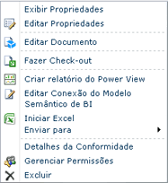

# Usar uma conexão de modelo semântico de BI no Excel ou Reporting Services
[!INCLUDE[ssas-appliesto-sqlas](../../includes/ssas-appliesto-sqlas.md)]Este tópico explica como usar as conexões de modelo semântico de BI que você criou usando as instruções em outros tópicos. Se você ainda não tiver criado um modelo semântico de BI, veja [Criar uma conexão de modelo semântico de BI para uma pasta de trabalho do Power Pivot](../../analysis-services/power-pivot-sharepoint/create-a-bi-semantic-model-connection-to-a-power-pivot-workbook.md) e [Criar uma conexão de modelo semântico de BI para um banco de dados modelo de tabela](../../analysis-services/power-pivot-sharepoint/create-a-bi-semantic-model-connection-to-a-tabular-model-database.md).  
  
##   Conecte do Excel  
 Você pode especificar uma conexão de modelo semântico de BI como uma fonte de dados em Excel ou qualquer outro aplicativo de negócios que use dados de modelo de tabela do Analysis Services. Esta seção explica as duas abordagens para conectar-se a dados de modelo semântico de BI usando o Excel.  
  
 As conexões de modelo semântico de BI do Excel exigem que você tenha o Excel 2010 e o provedor de OLE DB do MSOLAP.5 instalados em sua estação de trabalho. Informações adicionais sobre requisitos de conexão são fornecidas mais adiante nesta seção.  
  
 **Iniciando do SharePoint**  
  
-   Clique com o botão direito do mouse em uma conexão de modelo semântico de BI em uma biblioteca e selecione **Iniciar o Excel**.  
  
   
  
 Clique em **Habilitar** quando solicitado para habilitar conexões de dados. O Excel abre uma pasta de trabalho que contém uma lista de campos de Tabela Dinâmica populada com campos da fonte de dados subjacente.  
  
 **Iniciando do Excel**  
  
1.  Inicie o Excel e abra a pasta de trabalho. Na Guia Dados, em Obter Dados Externos, clique em **De Outras Fontes**.  
  
2.  Clique em **Do Analysis Services** e use o Assistente de Conexão de Dados para importar os dados.  
  
3.  Insira a URL do SharePoint do arquivo de conexão de modelo semântico de BI (por exemplo, `http://mysharepoint/shared documents/myData.bism`). Aceite o log padrão em opção de credenciais, **Usar Autenticação do Windows**. Clique em **Avançar**.  
  
4.  Na próxima página, clique novamente em **Avançar** . Embora você seja solicitado a selecionar um banco de dados, pode usar apenas o banco de dados especificado na conexão de modelo semântico de BI.  
  
5.  Na última página, você pode fornecer um nome e uma descrição amigáveis. Clique em **Concluir**e, depois, em **OK** na caixa de diálogo Importar Dados para importar os dados.  
  
 Para que as conexões tenham êxito, você precisa ter o Excel 2010 e o MSOLAP.5.dll instalados no computador cliente. Você pode obter o provedor instalando a versão do [!INCLUDE[ssGemini](../../includes/ssgemini-md.md)] para Excel que é atual para esta versão ou pode baixar apenas o provedor OLE DB do Analysis Services da [página de download do Feature Pack](http://go.microsoft.com/fwlink/?linkid=214066).  
  
 Para confirmar que esse MSOLAP.5.dll é a versão atual, verifique **HKEY_CLASSES_ROOT\MSOLAP** no Registro. **CurVer** deve ser definido como MSOLAP.5.  
  
 Você também deve ter permissões de leitura no arquivo do modelo semântico de BI no SharePoint. Permissões de leitura incluem direitos de download. O Excel baixa a informações de conexão de modelo semântico de BI do SharePoint e abre uma conexão direta com o banco de dados através de **HTTP Get**. Solicitações de conexão não fluem através do SharePoint pois as informações de conexão de modelo semântico de BI são armazenadas localmente.  
  
 Se você estiver conectando a um banco de dados de modelo de tabela que é executado em um servidor do Analysis Services, as permissões do SharePoint não serão suficientes. Você também deve ter as permissões de leitura de banco de dados no servidor. Esta etapa deve ter sido executada quando você criou a conexão de modelo semântico de BI. Para obter mais informações, veja [Criar uma conexão de modelo semântico de BI para um banco de dados modelo de tabela](../../analysis-services/power-pivot-sharepoint/create-a-bi-semantic-model-connection-to-a-tabular-model-database.md).  
  
##   Conectar do Reporting Services no SharePoint  
 Você pode usar uma conexão de modelo semântico de BI da mesma maneira que usa a maioria das fontes de dados, especificando o arquivo como uma fonte de dados no documento ou uma ferramenta que use os dados. Embora uma conexão de modelo semântico de BI aponte para um banco de dados em outro servidor, você usa o arquivo de conexão como se fosse a fonte de dados. A URL do SharePoint da conexão de modelo semântico de BI é um local de fonte de dados válido para relatórios do [!INCLUDE[ssCrescent](../../includes/sscrescent-md.md)] que usam dados de modelo semântico de BI.  
  
 Para o design de relatórios ad hoc no SharePoint, o usuário que cria o relatório deve ter permissões do SharePoint no arquivo de conexão de modelo semântico de BI (.bism) e no banco de dados do modelo semântico de business intelligence. O contexto de segurança da conexão é o usuário interativo que está criando o relatório.  
  
  
