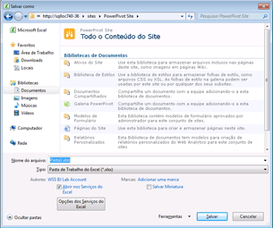

# Usar Galeria do Power Pivot
[!INCLUDE[ssas-appliesto-sqlas](../../includes/ssas-appliesto-sqlas.md)]
  [!INCLUDE[ssGemini](../../includes/ssgemini-md.md)] A Galeria é uma biblioteca de documentos do SharePoint que fornece visualização avançada e gerenciamento de documentos das pastas de trabalho do Excel publicadas e relatórios dos Reporting Services que contêm dados do [!INCLUDE[ssGemini](../../includes/ssgemini-md.md)] .  
  
> [!NOTE]  
>  Dependendo de como seu servidor está configurado, talvez você veja mensagens de erro ou aviso na área de visualização para documentos específicos. As mensagens podem ser exibidas quando uma pasta de trabalho do Excel estiver definida para atualizar automaticamente os dados sempre que for aberta. As mensagens de aviso de atualização de dados serão exibidas como a imagem de visualização se os Serviços do Excel forem configurados para mostrar mensagens de erro Aviso em atualização de dados. Os administradores de farm ou serviço podem modificar parâmetros de configuração para permitir que uma visualização da planilha real seja exibida. Para obter mais informações, consulte [Criar um local confiável para sites do Power Pivot na Administração Central](../../analysis-services/power-pivot-sharepoint/create-a-trusted-location-for-power-pivot-sites-in-central-administration.md).  
  
##   Neste tópico  
 [Pré-requisitos](#prereq)  
  
 [Ícones na Galeria do Power Pivot](#icons)  
  
 [Salvar uma pasta de trabalho do Excel na Galeria do Power Pivot](#add)  
  
 [Criar novos relatórios ou pastas de trabalho com base em uma pasta de trabalho do Power Pivot publicada](#newdocs)  
  
 [Abrir uma pasta de trabalho ou relatório no modo de página inteira](#view)  
  
 [Agendar atualização de dados para pastas de trabalho do PowerPivot na Galeria do Power Pivot](#newdr)  
  
 [Excluir uma pasta de trabalho ou relatório na Galeria do Power Pivot](#delete)  
  
 [Atualizar uma imagem em miniatura](#image)  
  
 [Problemas conhecidos](#bkmk_known_issues)  
  
##   Pré-requisitos  
  
> [!NOTE]  
>  A Galeria do PowerPivot requer o Microsoft Silverlight.  O navegador Microsoft Edge não dá suporte ao Silverlight.   
> Para exibir o conteúdo da biblioteca no Microsoft Edge, clique na guia **Biblioteca** , na galeria do PowerPivot e, em seguida, altere a exibição da biblioteca de documentos para **Todos os documentos**.    
> Para alterar a exibição padrão, clique na guia **Biblioteca** e depois clique em Modificar exibição. Clique em "Fazer desta a exibição padrão" e, em seguida, clique em OK para salvar a exibição padrão.  
>  Para obter mais informações sobre quais Edge dá suporte, consulte o blog do Windows, [uma ruptura com o passado, parte 2: Adeus ao ActiveX, VBScript...](https://blogs.windows.com/msedgedev/2015/05/06/a-break-from-the-past-part-2-saying-goodbye-to-activex-vbscript-attachevent/)  
  
 Para obter uma lista completa dos pré-requisitos, consulte [Criar e personalizar a galeria do Power Pivot](../../analysis-services/power-pivot-sharepoint/create-and-customize-power-pivot-gallery.md).  
  
##   Ícones na Galeria do Power Pivot  
 Os ícones fornecem um indicativo visual quanto à disponibilidade do conteúdo e ao status.  
  
|Ícone|Descrição|  
|----------|-----------------|  
||O ícone de ampulheta é exibido quando uma imagem em miniatura de cada página no documento está sendo gerada. Atualize a página para exibir a atualização da imagem.|  
||O ícone de página é exibido quando uma pasta de trabalho ou um relatório tem mais páginas do que as que podem ser exibidas na Galeria do [!INCLUDE[ssGemini](../../includes/ssgemini-md.md)] . Para exibir todas as páginas, você deve usar um aplicativo cliente.|  
||O ícone de erro é exibido quando uma imagem em miniatura não pode ser renderizada para o documento. O documento é publicado na biblioteca, mas não pode ser renderizado nas exibições da Galeria do [!INCLUDE[ssGemini](../../includes/ssgemini-md.md)] personalizadas. Você pode exibir o documento em um aplicativo cliente, como o suplemento [!INCLUDE[ssGemini](../../includes/ssgemini-md.md)] para Excel.|  
||O ícone de conteúdo indisponível é exibido quando o documento carregado não pode ser renderizado na Galeria do [!INCLUDE[ssGemini](../../includes/ssgemini-md.md)] . Os tipos de documento com suporte incluem pastas de trabalho do [!INCLUDE[ssGemini](../../includes/ssgemini-md.md)] e relatórios criados no Construtor de Relatórios do Reporting Services do SQL Server 2008 R2.   Esse ícone também aparecerá se você reciclar um documento da Lixeira.   Se você estiver obtendo esse ícone para um documento que apresentou previamente uma imagem de visualização válida, você poderá atualizar a imagem editando uma propriedade de documento e salvando suas alterações.|  
||O ícone de conteúdo bloqueado é exibido quando as imagens em miniatura são desabilitadas propositalmente para esse documento. [!INCLUDE[ssGemini](../../includes/ssgemini-md.md)] A Galeria não gera imagens em miniatura para pastas de trabalho do Excel que contêm dados do [!INCLUDE[ssGemini](../../includes/ssgemini-md.md)] , ou para pastas de trabalho do [!INCLUDE[ssGemini](../../includes/ssgemini-md.md)] ou relatórios do Reporting Services que não atendem aos requisitos de geração de instantâneos. Para obter mais informações, consulte a seção Pré-requisitos neste tópico.|  
  
##   Salvar uma pasta de trabalho do Excel na Galeria do Power Pivot  
 É possível publicar pastas de trabalho do [!INCLUDE[ssGemini](../../includes/ssgemini-md.md)] na biblioteca usando todas as técnicas de compartilhamento fornecidas pelo Excel 2010. Por exemplo, no Excel 2010, é possível usar a opção Salvar Como para especificar um caminho total ou parcial do SharePoint para uma biblioteca.  
  
1.  Salve o arquivo.  
  
2.  1.  **Excel 2010:** No menu Arquivo, clique em **salvar e enviar**.  
  
    2.  Clique em **Salvar no SharePoint**.  
  
    3.  Clique em **Opções de Publicação** se desejar usar Opções de Serviços do Excel para selecionar folhas ou parâmetros individuais a serem publicados. Por exemplo, a guia Parâmetros em Opções de Serviços do Excel permite escolher quais slicers aparecem na pasta de trabalho publicada.  
  
    1.  **Excel 2013:**  No menu Arquivo, clique em **salvar**.  
  
    2.  Clique em **Opções de Exibição do Navegador** se desejar usar Opções de Serviços do Excel para selecionar folhas ou parâmetros individuais a serem publicados. Por exemplo, a guia Parâmetros em Opções de Serviços do Excel permite escolher quais slicers aparecem na pasta de trabalho publicada.  
  
3.  Na caixa de diálogo Salvar como, em Nome do arquivo, insira uma URL completa ou parcial para a Galeria do [!INCLUDE[ssGemini](../../includes/ssgemini-md.md)] . Se você inserir uma parte do endereço da URL, como o nome do servidor, poderá procurar o site para localizar a Galeria do [!INCLUDE[ssGemini](../../includes/ssgemini-md.md)] . Para fazer isso, clique em **Salvar** para abrir uma conexão com o servidor especificado.  
  
       
  
1.  Usando a caixa de diálogo Salvar como, selecione a Galeria do [!INCLUDE[ssGemini](../../includes/ssgemini-md.md)] em seu site.  
  
2.  Clique em **Abrir** para abrir a biblioteca.  
  
3.  Clique em **Salvar** para publicar a pasta de trabalho na biblioteca.  
  
 Em uma janela do navegador, verifique se o documento aparece na Galeria do [!INCLUDE[ssGemini](../../includes/ssgemini-md.md)] . Documentos recém-publicados aparecerão na lista. As configurações da biblioteca determinam onde o documento aparece (por exemplo, classificado em ordem crescente por data, ou alfabeticamente por nome). Talvez seja necessário atualizar a janela do navegador para exibir as adições mais recentes.  
  
#### Carregar uma pasta de trabalho na Galeria do Power Pivot  
 Você também poderá carregar uma pasta de trabalho se quiser iniciar do SharePoint e selecionar em seu computador qual arquivo publicar.  
  
1.  Em um site do SharePoint, abra a Galeria do [!INCLUDE[ssGemini](../../includes/ssgemini-md.md)] .  
  
2.  Em faixa de opções de Biblioteca, clique em **Documentos**.  
  
3.  Em **Carregar Documento**, selecione uma opção de carregamento e insira o nome e o local do arquivo que você deseja carregar. As configurações da biblioteca determinam onde o documento aparece. Talvez seja necessário atualizar a janela do navegador para exibir a adição mais recente.  
  
##   Criar novos relatórios ou pastas de trabalho com base em uma pasta de trabalho do Power Pivot publicada  
 Para pastas de trabalho do [!INCLUDE[ssGemini](../../includes/ssgemini-md.md)] que você publica na Galeria do [!INCLUDE[ssGemini](../../includes/ssgemini-md.md)] , somente é possível criar pastas de trabalho adicionais ou relatórios do Reporting Services que usam a pasta de trabalho publicada como uma fonte de dados conectada.  
  
|||  
|-|-|  
||Clique na parte de seta para baixo do botão Novo Relatório para iniciar o Construtor de Relatórios ou o Excel 2010. [!INCLUDE[ssGemini](../../includes/ssgemini-md.md)] A Galeria deve usar uma das exibições pré-criadas (Teatro, Galeria ou Carrossel) para o botão Novo Relatório estar disponível.|  
  
#### Criar relatórios no Construtor de Relatórios  
 A criação de um novo relatório baseado em uma pasta de trabalho DO [!INCLUDE[ssGemini](../../includes/ssgemini-md.md)] existente na biblioteca exige a configuração do Reporting Services para integração do SharePoint para os mesmos sites que contêm a Galeria do [!INCLUDE[ssGemini](../../includes/ssgemini-md.md)] . Quando você selecionar a opção Criar Relatório do Construtor de Relatórios, o Construtor de Relatórios será baixado do servidor de relatórios e instalado na estação de trabalho local em primeiro uso. Um arquivo de relatório de espaço reservado é criado para o novo relatório e salvo na Galeria do [!INCLUDE[ssGemini](../../includes/ssgemini-md.md)] . As informações de conexão para a pasta de trabalho do [!INCLUDE[ssGemini](../../includes/ssgemini-md.md)] são criadas para você como uma nova fonte de dados no relatório. Como uma próxima etapa, você pode criar conjuntos de dados e layout de relatório no workspace de design. À medida que você usar o Construtor de Relatórios para montar seu relatório, você poderá salvar suas alterações e o resultado final no documento de relatório na galeria. Para evitar desconexões de dados posteriormente, certifique-se de manter juntos os arquivos de relatório e pasta de trabalho na mesma biblioteca.  
  
#### Abrir Nova Pasta de Trabalho do Excel  
 Para criar uma nova pasta de trabalho do Excel a partir de uma pasta de trabalho existente, você já deve ter o Excel e o [!INCLUDE[ssGeminiClient](../../includes/ssgeminiclient-md.md)] no computador local. A escolha de Abrir Nova Pasta de Trabalho do Excel abre um arquivo de pasta de trabalho em branco (.xlsx) e carrega dados do [!INCLUDE[ssGemini](../../includes/ssgemini-md.md)] em segundo plano, como uma fonte de dados conectada. Somente os dados da janela do [!INCLUDE[ssGemini](../../includes/ssgemini-md.md)] na pasta de trabalho original são usados na nova pasta de trabalho. Tabelas Dinâmicas ou Gráficos Dinâmicos são excluídos da pasta de trabalho original. A nova pasta de trabalho vincula a dados na pasta de trabalho original. Os dados não são copiados na própria pasta de trabalho nova.  
  
##   Abrir uma pasta de trabalho ou relatório no modo de página inteira  
 Clique em qualquer imagem em miniatura visível do documento visualizado para abri-la em modo de página inteira, independentemente da visualização da Galeria [!INCLUDE[ssGemini](../../includes/ssgemini-md.md)] . [!INCLUDE[ssGemini](../../includes/ssgemini-md.md)] serão abertas em um navegador. Os relatórios do Reporting Services serão abertos na web part ReportViewer, que faz parte da implantação do Reporting Services em um servidor do SharePoint.  
  
 Um método alternativo para exibir a pasta de trabalho em um navegador é abri-lo no Excel em uma estação de trabalho cliente. Você deve ter o Excel 2013 ou Excel 2010 e o suplemento [!INCLUDE[ssGeminiClient](../../includes/ssgeminiclient-md.md)] para exibir o arquivo. Você pode usar o Excel 2007 para abrir o arquivo, mas não pode usá-lo para dinamizar os dados. Por isso, o Excel 2013 ou Excel 2010 são recomendados para exibição e criação de dados do [!INCLUDE[ssGemini](../../includes/ssgemini-md.md)] . Se você não tiver os aplicativos necessários, use um navegador para exibir a pasta de trabalho do SharePoint.  
  
##   Agendar atualização de dados para pastas de trabalho do PowerPivot na Galeria do Power Pivot  
 [!INCLUDE[ssGemini](../../includes/ssgemini-md.md)] em uma pasta de trabalho do Excel publicada podem ser atualizados em intervalos agendados.  
  
|||  
|-|-|  
||Clique no botão Gerenciar Atualização de Dados para criar ou exibir uma agenda que recupera dados atualizados de fontes de dados conectadas. Para obter instruções sobre como criar uma agenda, consulte [Agendar uma atualização de dados (Power Pivot para SharePoint)](http://msdn.microsoft.com/8571208f-6aae-4058-83c6-9f916f5e2f9b).|  
  
##   Excluir uma pasta de trabalho ou relatório na Galeria do Power Pivot  
 Para excluir um documento da biblioteca, primeiro alterne para a exibição Todos os Documentos.  
  
1.  Em um site do SharePoint, abra a Galeria do [!INCLUDE[ssGemini](../../includes/ssgemini-md.md)] .  
  
2.  Na faixa de opções, clique em **Biblioteca**.  
  
3.  Em Gerenciar Exibições, na lista Exibição Atual, clique na seta para baixo e selecione Todos os Documentos.  
  
4.  Selecione a pasta de trabalho ou o relatório que você deseja excluir.  
  
5.  Em Documentos (Arquivos), em Gerenciar, clique no botão **Excluir Documento** .  
  
##   Atualizar uma imagem em miniatura  
 Use as etapas a seguir para gerar novamente uma imagem em miniatura para um documento na Galeria do [!INCLUDE[ssGemini](../../includes/ssgemini-md.md)] .  
  
1.  Mude a Galeria do [!INCLUDE[ssGemini](../../includes/ssgemini-md.md)] para a exibição Todos os Documentos. Para isso, clique em **Biblioteca** na faixa de opções e altere a **Modo de exibição atual** para **Todos os Documentos**.  
  
2.  Selecione a pasta de trabalho ou relatório para o qual você deseja atualizar a imagem em miniatura.  
  
3.  Clique na seta para baixo à direita e selecione **Editar Propriedades**.  
  
4.  Clique em **Salvar**. Salvar o documento forçará o serviço de instantâneo a gerar novamente a imagem de visualização.  
  
##   Problemas conhecidos  
  
### Não há suporte ao tipo de documento  
 O tipo de conteúdo **Documento de Galeria do [!INCLUDE[ssGemini](../../includes/ssgemini-md.md)]** não tem suporte. Se você habilitar o tipo de conteúdo **Documento de Galeria do [!INCLUDE[ssGemini](../../includes/ssgemini-md.md)]** para uma biblioteca de documentos e tentar criar um novo documento desse tipo, verá uma mensagem de erro semelhante a uma destas:  
  
-   'Novo documento' exige um navegador de aplicativo e da web compatível com o Microsoft Sharepoint Foundation. Para adicionar um documento à biblioteca de documentos, clique no botão 'Carregar documento'.  
  
-   "O endereço de Internet ' nome http://[server] / Reportgallery/Gallery/ReportGallery/Forms/Template.xlsx ' não é válido." " O Microsoft Excel não pode acessar o arquivo ' nome http://[server] / Reportgallery/Gallery/ReportGallery/Forms/Template.xlsx '. Há várias razões possíveis:  
  
 O tipo de conteúdo do **Documento de Galeria do [!INCLUDE[ssGemini](../../includes/ssgemini-md.md)]** não é adicionado automaticamente nas bibliotecas de documentos. Você não encontrará esse problema, a menos que habilite manualmente o tipo de conteúdo sem suporte.  
  
## Consulte também  
 [Create a trusted location for Power Pivot sites in Central Administration](../../analysis-services/power-pivot-sharepoint/create-a-trusted-location-for-power-pivot-sites-in-central-administration.md)   
 [Excluir Galeria do Power Pivot](../../analysis-services/power-pivot-sharepoint/delete-power-pivot-gallery.md)   
 [Criar e personalizar a galeria do Power Pivot](../../analysis-services/power-pivot-sharepoint/create-and-customize-power-pivot-gallery.md)   
 [Agendar uma atualização de dados (Power Pivot para SharePoint)](http://msdn.microsoft.com/8571208f-6aae-4058-83c6-9f916f5e2f9b)  
  
  
