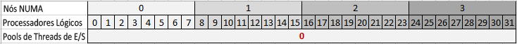
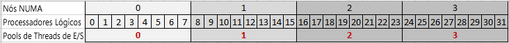
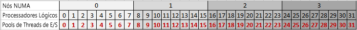

# Propriedades de pool de threads
  [!INCLUDE[ssASnoversion](../../includes/ssasnoversion-md.md)] usa multi-threading para várias operações, melhorando o desempenho global do servidor ao executar vários trabalhos em paralelo. Para gerenciar threads com mais eficiência, o [!INCLUDE[ssASnoversion](../../includes/ssasnoversion-md.md)] usa pools de threads para pré-alocar threads e facilitar a disponibilidade do thread para o próximo trabalho.  
  
 Cada instância do [!INCLUDE[ssASnoversion](../../includes/ssasnoversion-md.md)] mantém seu próprio conjunto de pools de threads. Há diferenças em como as instâncias tabulares e multidimensionais usam pools de threads. Por exemplo, apenas instâncias multidimensionais usam o pool de thread **IOProcess** . Dessa forma, a propriedade **PerNumaNode** , descrita neste tópico, não é significativa para instâncias tabulares. Na seção [Referência de Propriedade](#bkmk_propref) abaixo, os requisitos do modo são indicados para cada propriedade.
  
 Este tópico contém as seguintes seções:  
  
-   [Gerenciamento de threads no Analysis Services](#bkmk_threadarch)  
  
-   [Referência à propriedade do pool de threads](#bkmk_propref)  
  
-   [Definir GroupAffinity para relacionar threads para processadores em um grupo de processador](#bkmk_groupaffinity)  
  
-   [Definir PerNumaNode para relacionar threads de E/S para processadores em um nó NUMA](#bkmk_pernumanode)  
  
-   [Determinar as configurações do pool de threads atual](#bkmk_currentsettings)  
  
-   [Propriedades dependentes ou relacionadas](#bkmk_related)  
  
-   [Sobre MSMDSRV.INI](#bkmk_msmdrsrvini)  
  
> [!NOTE]  
>  A implantação tabular em sistemas NUMA está fora do escopo deste tópico. Embora as soluções tabulares possam ser implantadas com êxito em sistemas NUMA, as características de desempenho da tecnologia de banco de dados na memória usada pelos modelos tabulares podem mostrar benefícios limitados em arquiteturas altamente dimensionadas. Para obter mais informações, consulte [Estudo de caso do Analysis Services: utilizando modelos de tabela em soluções comerciais de larga escala](http://msdn.microsoft.com/library/dn751533.aspx) e [Dimensionando o hardware de uma solução de tabela](http://go.microsoft.com/fwlink/?LinkId=330359).  
  
##   Gerenciamento de threads no Analysis Services  
 [!INCLUDE[ssASnoversion](../../includes/ssasnoversion-md.md)] usa multi-threading para aproveitar os recursos de CPU disponíveis aumentando o número de tarefas que podem ser executadas em paralelo. O mecanismo de armazenamento é multi-threaded. Exemplos de trabalho multi-threaded executados dentro do mecanismo de armazenamento incluem o processamento de objetos em paralelo ou a manipulação de consultas distintas que foram empurradas para o mecanismo de armazenamento, ou o retorno de valores de dados solicitados por uma consulta. O mecanismo da fórmula, devido à natureza serial dos cálculos que avalia, tem thread único. Cada consulta é executada principalmente em um único thread, solicitando e geralmente aguardando os dados retornados pelo mecanismo de armazenamento. Os threads de consulta têm execuções mais longas e são liberados somente depois que a consulta inteira é concluída.  
  
 Por padrão, em versões [!INCLUDE[ssSQL11](../../includes/sssql11-md.md)] e posteriores, o [!INCLUDE[ssASnoversion](../../includes/ssasnoversion-md.md)] usará todos os processadores lógicos disponíveis, até 640 em sistemas que executam edições posteriores do Windows e do SQL Server. Ao iniciar, o processo msmdsrv.exe será atribuído a um determinado grupo de processador, mas, com o passar do tempo, os threads podem ser agendados em qualquer processador lógico, em qualquer grupo de processador.  
  
 Um efeito colateral de usar um grande número de processadores é que você às vezes pode observar degradação de desempenho porque as cargas de consulta e processamento são distribuídas em um número grande de processadores e a contenção para estruturas de dados compartilhados aumenta. Isso pode ocorrer especialmente em sistemas avançados que usam a arquitetura NUMA, mas também em sistemas não NUMA que executam vários aplicativos com uso intenso de dados no mesmo hardware.  
  
 Para aliviar esse problema, você pode definir a afinidade entre tipos de operações do [!INCLUDE[ssASnoversion](../../includes/ssasnoversion-md.md)] e um conjunto específico de processadores lógicos. A propriedade **GroupAffinity** permite criar máscaras de afinidade personalizadas que especificam qual recurso do sistema deve ser usado para cada um dos tipos de pool de threads gerenciados pelo [!INCLUDE[ssASnoversion](../../includes/ssasnoversion-md.md)].
 
Recomendamos a CU1 (Atualização Cumulativa 1) do SQL Server 2016 ou posterior para configurar **GroupAffinity** em instâncias tabulares. 
  
 **GroupAffinity** é uma afinidade personalizada pode ser definida em qualquer um dos pools de threads usados para várias cargas de trabalho do [!INCLUDE[ssASnoversion](../../includes/ssasnoversion-md.md)] :  
  
-   **ThreadPool \ Parsing \ Short**  é um pool de análise para solicitações curtas. As solicitações que se ajustam em uma única mensagem de rede são consideradas curtas. 
  
-   **ThreadPool \ Parsing \ Long**  é um pool de análise para todas as solicitações restantes que não se ajustam em uma única mensagem da rede. 
  
    > [!NOTE]  
    >  Um thread desses pools de análise pode ser usado para executar uma consulta. As consultas que são executadas rapidamente, como uma solicitação de Descoberta ou Cancelamento rápido, são muitas vezes executados imediatamente em vez de colocados na fila para o pool de threads de Consulta. 
  
-   **ThreadPool \ Query** é o pool de threads que executa todas as solicitações que não são manipuladas pelo pool de threads da análise. Os threads neste pool de threads executarão todos os tipos de operações, como Descobertas, comandos MDX, DAX, DMX e DDL. A
  
-   **ThreadPool \ IOProcess** é usado para trabalhos de E/S associados às consultas do mecanismo de armazenamento no mecanismo multidimensional. O trabalho realizado por esses threads não deve ter dependências em outros threads. Esses threads geralmente verificarão um único segmento de uma partição e realizarão filtragem e agregação nos dados do segmento. Os threads do**IOProcess** são muito sensíveis às configurações de hardware de NUMA. Dessa maneira, esse pool de threads tem a propriedade de configuração **PerNumaNode** que pode ser usada para ajustar o desempenho se for necessário. 
  
-   **ThreadPool \ Process** é usada para trabalhos do mecanismo de armazenamento de duração mais longa, incluindo agregações, indexação e operações de confirmação. O modo de armazenamento ROLAP também usa threads do pool de threads de processamento.  

- **VertiPaq \ ThreadPool** é o pool de threads para executar verificações de tabela em um modelo tabular.
  
 Para atender solicitações, o [!INCLUDE[ssASnoversion](../../includes/ssasnoversion-md.md)] pode exceder o limite máximo do pool de threads, solicitando threads adicionais se forem necessários para executar o trabalho. No entanto, quando um thread conclui a execução de sua tarefa, se a contagem atual de threads for maior que o limite máximo, o thread será simplesmente finalizado, em vez de retornado para o pool de threads.  
  
> [!NOTE]  
>  Exceder a contagem máxima do pool de threads é uma proteção chamada somente quando certas condições de deadlock ocorrem. Para evitar a criação de threads fugitivos além do máximo, os threads são criados gradativamente (depois de um pequeno atraso) depois que o limite máximo for atingido. Exceder a contagem máximo de threads pode levar a uma diminuição na execução da tarefa. Se os contadores de desempenho mostrarem que as contagens de thread estão regularmente além do tamanho máximo do pool de threads, você poderá considerar isso um indicador de que os tamanhos do pool são muito pequenos para o grau de simultaneidade solicitada pelo sistema.  
  
 Por padrão, o tamanho do pool de threads é determinado pelo [!INCLUDE[ssASnoversion](../../includes/ssasnoversion-md.md)]e é baseado no número de núcleos. Você pode observar os valores padrão selecionados examinando o arquivo msmdsrv.log depois da inicialização do servidor. Como um exercício de ajuste de desempenho, você pode aumentar o tamanho do pool de threads, assim como outras propriedades, para melhorar o desempenho da consulta ou do processamento.  
  
##   Referência à propriedade do pool de threads  
 Esta seção descreve as propriedades do pool de threads encontradas no arquivo msmdsrv.ini de cada instância do [!INCLUDE[ssASnoversion](../../includes/ssasnoversion-md.md)] . Um subconjunto dessas propriedades também aparece no SQL Server Management Studio.  
  
 As propriedades são listadas em ordem alfabética.  
  
|Nome|Tipo|Description|Padrão|Orientação|  
|----------|----------|-----------------|-------------|--------------|  
|**IOProcess** \ **Concurrency**|double|Um valor de ponto flutuante de precisão dupla que determina o algoritmo para definir um destino no número de threads que podem ser enfileirados ao mesmo tempo.|2,0|Uma propriedade avançada que não deve ser alterada, exceto sob orientação do suporte da [!INCLUDE[msCoName](../../includes/msconame-md.md)] .   A simultaneidade é usada para inicializar os pools de threads, que são implementados usando portas de conclusão de E/S no Windows. Consulte [Portas de conclusão de E/S](http://msdn.microsoft.com/library/windows/desktop/aa365198\(v=vs.85\).aspx) para obter detalhes.   Aplica-se a somente modelos multidimensionais.|  
|**IOProcess** \ **GroupAffinity**|cadeia de caracteres|Uma matriz de valores hexadecimais que corresponde a grupos de processador no sistema, usada para definir afinidade de threads no pool de threads IOProcess para processadores lógicos em cada grupo de processador.|none|Você pode usar essa propriedade para criar afinidades personalizadas. A propriedade é vazia por padrão.   Consulte [Definir GroupAffinity para relacionar threads para processadores em um grupo de processador](#bkmk_groupaffinity) para obter detalhes.   Aplica-se a somente modelos multidimensionais.|  
|**IOProcess** \ **MaxThreads**|int|Um inteiro de 32 bits assinado que especifica o número máximo de threads para incluir no pool de threads.|0|0 indica que o servidor determina os padrões. Por padrão, o servidor define esse valor como 64 ou 10 vezes o número de processadores lógicos, o que for maior. Por exemplo, em um sistema de 4 núcleos com hyperthreading, o máximo do pool de threads é 80 threads.   Se você definir esse valor como um valor negativo, o servidor multiplica esse valor pelo número de processadores lógicos. Por exemplo, quando definido como -10 em um servidor que tem 32 processadores lógicos, o máximo é 320 threads.   O valor máximo está sujeito aos processadores disponíveis por todas as máscaras de afinidade personalizadas que você definiu anteriormente. Por exemplo, se você já definiu a afinidade do pool de threads para usar 8 de 32 processadores, e você definir agora MaxThreads como -10, o limite superior no pool de threads seria 10 vezes 8 ou 80 threads.   Os valores reais usados para esta propriedade do pool de threads são gravados no arquivo de log msmdsrv após a inicialização do serviço.   Mais informações sobre como ajustar as configurações do pool de threads podem ser localizadas no [Guia de operações do Analysis Services](http://msdn.microsoft.com/library/hh226085.aspx).   Aplica-se a somente modelos multidimensionais.|  
|**IOProcess** \ **MinThreads**|int|Um inteiro de 32 bits assinado que especifica o número mínimo de threads para pré-alocar para o pool de threads.|0|0 indica que o servidor determina os padrões. Por padrão, o mínimo é 1.   Se você definir esse valor como um valor negativo, o servidor multiplica esse valor pelo número de processadores lógicos.   Os valores reais usados para esta propriedade do pool de threads são gravados no arquivo de log msmdsrv após a inicialização do serviço.   Mais informações sobre como ajustar as configurações do pool de threads podem ser localizadas no [Guia de operações do Analysis Services](http://msdn.microsoft.com/library/hh226085.aspx).   Aplica-se a somente modelos multidimensionais.|  
|**IOProcess** \ **PerNumaNode**|int|Um inteiro de 32 bits assinado que determina o número de pools de threads criados para o processo msmdsrv.|-1|Os valores válidos são -1, 0, 1, 2   -1 = O servidor seleciona uma estratégia diferente do pool de threads de E/S com base no número de nós NUMA. Em sistemas com menos de 4 nós NUMA, o comportamento do servidor é o mesmo que 0 (um pool de threads do IOProcess é criado para o sistema). Em sistemas com 4 ou mais nós, o comportamento é o mesmo que 1 (os pools de threads do IOProcess são criados para cada nó).   0 = Desabilita os pools de threads por nó NUMA de modo que haja somente um pool de threads do IOProcess usado pelo processo msmdsrv.exe.   1 = Habilita um pool de threads do IOProcess para cada nó NUMA.   2 = Um pool de threads do IOProcess para cada processador lógico. Os threads em cada pool de threads são relacionados ao nó NUMA do processador lógico, com o processador ideal definido para o processador lógico.   Consulte [Definir PerNumaNode para relacionar threads de E/S para processadores em um nó NUMA](#bkmk_pernumanode) para obter detalhes.   Aplica-se a somente modelos multidimensionais.|  
|**IOProcess** \ **PriorityRatio**|int|Um inteiro de 32 bits assinado que pode ser usado para garantir que os threads de prioridade inferior sejam executados mesmo quando uma fila de prioridade mais alta não estiver vazia.|2|Uma propriedade avançada que não deve ser alterada, exceto sob orientação do suporte da [!INCLUDE[msCoName](../../includes/msconame-md.md)] .   Aplica-se a somente modelos multidimensionais.|  
|**IOProcess** \ **StackSizeKB**|int|Um inteiro de 32 bits assinado que pode ser usado para ajustar a alocação de memória durante a execução do thread.|0|Uma propriedade avançada que não deve ser alterada, exceto sob orientação do suporte da [!INCLUDE[msCoName](../../includes/msconame-md.md)] .   Aplica-se a somente modelos multidimensionais.|  
|**Parsing**  \ **Long** \ **Concurrency**|double|Um valor de ponto flutuante de precisão dupla que determina o algoritmo para definir um destino no número de threads que podem ser enfileirados ao mesmo tempo.|2,0|Uma propriedade avançada que não deve ser alterada, exceto sob orientação do suporte da [!INCLUDE[msCoName](../../includes/msconame-md.md)] .   A simultaneidade é usada para inicializar os pools de threads, que são implementados usando portas de conclusão de E/S no Windows. Consulte [Portas de conclusão de E/S](http://msdn.microsoft.com/library/windows/desktop/aa365198\(v=vs.85\).aspx) para obter detalhes.|  
|**Parsing**  \ **Long** \ **GroupAffinity**|cadeia de caracteres|Uma matriz de valores hexadecimais que corresponde a grupos de processador no sistema, usada para definir afinidade de analisar gramaticalmente threads para processadores lógicos em cada grupo de processador.|none|Você pode usar essa propriedade para criar afinidades personalizadas. A propriedade é vazia por padrão.   Consulte [Definir GroupAffinity para relacionar threads para processadores em um grupo de processador](#bkmk_groupaffinity) para obter detalhes.|  
|**Parsing**  \ **Long** \ **NumThreads**|int|Uma propriedade de inteiro de 32 bits assinada que define o número de threads que podem ser criados para comandos longos.|0|0 indica que o servidor determina os padrões. O comportamento padrão é definir **NumThreads** como um valor absoluto de 4 ou 2 vezes o número de processadores lógicos, o que for maior.   Se você definir esse valor como um valor negativo, o servidor multiplica esse valor pelo número de processadores lógicos. Por exemplo, quando definido como -10 em um servidor que tem 32 processadores lógicos, o máximo é 320 threads.   O valor máximo está sujeito aos processadores disponíveis por todas as máscaras de afinidade personalizadas que você definiu anteriormente. Por exemplo, se você já definiu a afinidade do pool de threads para usar 8 de 32 processadores, e você definir agora NumThreads como -10, o limite superior no pool de threads seria 10 vezes 8 ou 80 threads.   Os valores reais usados para esta propriedade do pool de threads são gravados no arquivo de log msmdsrv após a inicialização do serviço.|  
|**Parsing**  \ **Long** \ **PriorityRatio**|int|Um inteiro de 32 bits assinado que pode ser usado para garantir que os threads de prioridade inferior sejam executados mesmo quando uma fila de prioridade mais alta não estiver vazia.|0|Uma propriedade avançada que não deve ser alterada, exceto sob orientação do suporte da [!INCLUDE[msCoName](../../includes/msconame-md.md)] .|  
|**Parsing**  \ **Long** \ **StackSizeKB**|int|Um inteiro de 32 bits assinado que pode ser usado para ajustar a alocação de memória durante a execução do thread.|0|Uma propriedade avançada que não deve ser alterada, exceto sob orientação do suporte da [!INCLUDE[msCoName](../../includes/msconame-md.md)] .|  
|**Parsing**  \ **Short** \ **Concurrency**|double|Um valor de ponto flutuante de precisão dupla que determina o algoritmo para definir um destino no número de threads que podem ser enfileirados ao mesmo tempo.|2,0|Uma propriedade avançada que não deve ser alterada, exceto sob orientação do suporte da [!INCLUDE[msCoName](../../includes/msconame-md.md)] .   A simultaneidade é usada para inicializar os pools de threads, que são implementados usando portas de conclusão de E/S no Windows. Consulte [Portas de conclusão de E/S](http://msdn.microsoft.com/library/windows/desktop/aa365198\(v=vs.85\).aspx) para obter detalhes.|  
|**Parsing**  \ **Short** \ **GroupAffinity**|cadeia de caracteres|Uma matriz de valores hexadecimais que corresponde a grupos de processador no sistema, usada para definir afinidade de analisar gramaticalmente threads para processadores lógicos em cada grupo de processador.|none|Você pode usar essa propriedade para criar afinidades personalizadas. A propriedade é vazia por padrão.   Consulte [Definir GroupAffinity para relacionar threads para processadores em um grupo de processador](#bkmk_groupaffinity) para obter detalhes.|  
|**Parsing**  \ **Short** \ **NumThreads**|int|Uma propriedade de inteiro de 32 bits assinada que define o número de threads que podem ser criados para comandos curtos.|0|0 indica que o servidor determina os padrões. O comportamento padrão é definir **NumThreads** como um valor absoluto de 4 ou 2 vezes o número de processadores lógicos, o que for maior.   Se você definir esse valor como um valor negativo, o servidor multiplica esse valor pelo número de processadores lógicos. Por exemplo, quando definido como -10 em um servidor que tem 32 processadores lógicos, o máximo é 320 threads.   O valor máximo está sujeito aos processadores disponíveis por todas as máscaras de afinidade personalizadas que você definiu anteriormente. Por exemplo, se você já definiu a afinidade do pool de threads para usar 8 de 32 processadores, e você definir agora NumThreads como -10, o limite superior no pool de threads seria 10 vezes 8 ou 80 threads.   Os valores reais usados para esta propriedade do pool de threads são gravados no arquivo de log msmdsrv após a inicialização do serviço.|  
|**Parsing**  \ **Short** \ **PriorityRatio**|int|Um inteiro de 32 bits assinado que pode ser usado para garantir que os threads de prioridade inferior sejam executados mesmo quando uma fila de prioridade mais alta não estiver vazia.|0|Uma propriedade avançada que não deve ser alterada, exceto sob orientação do suporte da [!INCLUDE[msCoName](../../includes/msconame-md.md)] .|  
|**Parsing**  \ **Short** \ **StackSizeKB**|int|Um inteiro de 32 bits assinado que pode ser usado para ajustar a alocação de memória durante a execução do thread.|64 * processadores lógicos|Uma propriedade avançada que não deve ser alterada, exceto sob orientação do suporte da [!INCLUDE[msCoName](../../includes/msconame-md.md)] .|  
|**Process** \ **Concurrency**|double|Um valor de ponto flutuante de precisão dupla que determina o algoritmo para definir um destino no número de threads que podem ser enfileirados ao mesmo tempo.|2,0|Uma propriedade avançada que não deve ser alterada, exceto sob orientação do suporte da [!INCLUDE[msCoName](../../includes/msconame-md.md)] .   A simultaneidade é usada para inicializar os pools de threads, que são implementados usando portas de conclusão de E/S no Windows. Consulte [Portas de conclusão de E/S](http://msdn.microsoft.com/library/windows/desktop/aa365198\(v=vs.85\).aspx) para obter detalhes.|  
|**Process** \ **GroupAffinity**|cadeia de caracteres|Uma matriz de valores hexadecimais que corresponde a grupos de processador no sistema, usada para definir afinidade de processar threads para processadores lógicos em cada grupo de processador.|none|Você pode usar essa propriedade para criar afinidades personalizadas. A propriedade é vazia por padrão.   Consulte [Definir GroupAffinity para relacionar threads para processadores em um grupo de processador](#bkmk_groupaffinity) para obter detalhes.|  
|**Process** \ **MaxThreads**|int|Um inteiro de 32 bits assinado que especifica o número máximo de threads para incluir no pool de threads.|0|0 indica que o servidor determina os padrões. Por padrão, o servidor define esse valor como um valor absoluto de 64 ou o número de processadores lógicos, o que for maior. Por exemplo, em um sistema de 64 núcleos com hyperthreading habilitado (resultando em 128 processadores lógicos, o máximo do pool de threads é 128 threads.   Se você definir esse valor como um valor negativo, o servidor multiplica esse valor pelo número de processadores lógicos. Por exemplo, quando definido como -10 em um servidor que tem 32 processadores lógicos, o máximo é 320 threads.   O valor máximo está sujeito aos processadores disponíveis por todas as máscaras de afinidade personalizadas que você definiu anteriormente. Por exemplo, se você já definiu a afinidade do pool de threads para usar 8 de 32 processadores, e você definir agora MaxThreads como -10, o limite superior no pool de threads seria 10 vezes 8 ou 80 threads.   Os valores reais usados para esta propriedade do pool de threads são gravados no arquivo de log msmdsrv após a inicialização do serviço.   Mais informações sobre como ajustar as configurações do pool de threads podem ser localizadas no [Guia de operações do Analysis Services](http://msdn.microsoft.com/library/hh226085.aspx).|  
|**Process** \ **MinThreads**|int|Um inteiro de 32 bits assinado que especifica o número mínimo de threads para pré-alocar para o pool de threads.|0|0 indica que o servidor determina os padrões. Por padrão, o mínimo é 1.   Se você definir esse valor como um valor negativo, o servidor multiplica esse valor pelo número de processadores lógicos.   Os valores reais usados para esta propriedade do pool de threads são gravados no arquivo de log msmdsrv após a inicialização do serviço.   Mais informações sobre como ajustar as configurações do pool de threads podem ser localizadas no [Guia de operações do Analysis Services](http://msdn.microsoft.com/library/hh226085.aspx).|  
|**Process** \ **PriorityRatio**|int|Um inteiro de 32 bits assinado que pode ser usado para garantir que os threads de prioridade inferior sejam executados mesmo quando uma fila de prioridade mais alta não estiver vazia.|2|Uma propriedade avançada que não deve ser alterada, exceto sob orientação do suporte da [!INCLUDE[msCoName](../../includes/msconame-md.md)] .|  
|**Process** \ **StackSizeKB**|int|Um inteiro de 32 bits assinado que pode ser usado para ajustar a alocação de memória durante a execução do thread.|0|Uma propriedade avançada que não deve ser alterada, exceto sob orientação do suporte da [!INCLUDE[msCoName](../../includes/msconame-md.md)] .|  
|**Query**  \ **Concurrency**|double|Um valor de ponto flutuante de precisão dupla que determina o algoritmo para definir um destino no número de threads que podem ser enfileirados ao mesmo tempo.|2,0|Uma propriedade avançada que não deve ser alterada, exceto sob orientação do suporte da [!INCLUDE[msCoName](../../includes/msconame-md.md)] .   A simultaneidade é usada para inicializar os pools de threads, que são implementados usando portas de conclusão de E/S no Windows. Consulte [Portas de conclusão de E/S](http://msdn.microsoft.com/library/windows/desktop/aa365198\(v=vs.85\).aspx) para obter detalhes.|  
|**Query** \ **GroupAffinity**|cadeia de caracteres|Uma matriz de valores hexadecimais que corresponde a grupos de processador no sistema, usada para definir afinidade de processar threads para processadores lógicos em cada grupo de processador.|none|Você pode usar essa propriedade para criar afinidades personalizadas. A propriedade é vazia por padrão.   Consulte [Definir GroupAffinity para relacionar threads para processadores em um grupo de processador](#bkmk_groupaffinity) para obter detalhes.|  
|**Query**  \ **MaxThreads**|int|Um inteiro de 32 bits assinado que especifica o número máximo de threads para incluir no pool de threads.|0|0 indica que o servidor determina os padrões. Por padrão, o servidor define esse valor como um valor absoluto de 10 ou 2 vezes o número de processadores lógicos, o que for maior. Por exemplo, em um sistema de 4 núcleos com hyperthreading, a contagem máxima de threads é 16.   Se você definir esse valor como um valor negativo, o servidor multiplica esse valor pelo número de processadores lógicos. Por exemplo, quando definido como -10 em um servidor que tem 32 processadores lógicos, o máximo é 320 threads.   O valor máximo está sujeito aos processadores disponíveis por todas as máscaras de afinidade personalizadas que você definiu anteriormente. Por exemplo, se você já definiu a afinidade do pool de threads para usar 8 de 32 processadores, e você definir agora MaxThreads como -10, o limite superior no pool de threads seria 10 vezes 8 ou 80 threads.   Os valores reais usados para esta propriedade do pool de threads são gravados no arquivo de log msmdsrv após a inicialização do serviço.   Mais informações sobre como ajustar as configurações do pool de threads podem ser localizadas no [Guia de operações do Analysis Services](http://msdn.microsoft.com/library/hh226085.aspx).|  
|**Query** \ **MinThreads**|int|Um inteiro de 32 bits assinado que especifica o número mínimo de threads para pré-alocar para o pool de threads.|0|0 indica que o servidor determina os padrões. Por padrão, o mínimo é 1.   Se você definir esse valor como um valor negativo, o servidor multiplica esse valor pelo número de processadores lógicos.   Os valores reais usados para esta propriedade do pool de threads são gravados no arquivo de log msmdsrv após a inicialização do serviço.   Mais informações sobre como ajustar as configurações do pool de threads podem ser localizadas no [Guia de operações do Analysis Services](http://msdn.microsoft.com/library/hh226085.aspx).|  
|**Query** \ **PriorityRatio**|int|Um inteiro de 32 bits assinado que pode ser usado para garantir que os threads de prioridade inferior sejam executados mesmo quando uma fila de prioridade mais alta não estiver vazia.|2|Uma propriedade avançada que não deve ser alterada, exceto sob orientação do suporte da [!INCLUDE[msCoName](../../includes/msconame-md.md)] .|  
|**Query**  \ **StackSizeKB**|int|Um inteiro de 32 bits assinado que pode ser usado para ajustar a alocação de memória durante a execução do thread.|0|Uma propriedade avançada que não deve ser alterada, exceto sob orientação do suporte da [!INCLUDE[msCoName](../../includes/msconame-md.md)] .|  
|**VertiPaq** \ **CPUs**|int|Um inteiro de 32 bits assinado que especifica o número máximo de processadores que serão usados em consultas de tabela.|0|0 indica que o servidor determina os padrões. Por padrão, o servidor define esse valor como um valor absoluto de 10 ou 2 vezes o número de processadores lógicos, o que for maior. Por exemplo, em um sistema de 4 núcleos com hyperthreading, a contagem máxima de threads é 16.   Se você definir esse valor como um valor negativo, o servidor multiplica esse valor pelo número de processadores lógicos. Por exemplo, quando definido como -10 em um servidor que tem 32 processadores lógicos, o máximo é 320 threads.   O valor máximo está sujeito aos processadores disponíveis por todas as máscaras de afinidade personalizadas que você definiu anteriormente. Por exemplo, se você já definiu a afinidade do pool de threads para usar 8 de 32 processadores, e você definir agora MaxThreads como -10, o limite superior no pool de threads seria 10 vezes 8 ou 80 threads.   Os valores reais usados para esta propriedade do pool de threads são gravados no arquivo de log msmdsrv após a inicialização do serviço.|  
  |**VertiPaq** \ **GroupAffinity**|cadeia de caracteres|Uma matriz de valores hexadecimais que corresponde a grupos de processador no sistema, usada para definir afinidade de processar threads para processadores lógicos em cada grupo de processador.|none|Você pode usar essa propriedade para criar afinidades personalizadas. A propriedade é vazia por padrão.   Consulte [Definir GroupAffinity para relacionar threads para processadores em um grupo de processador](#bkmk_groupaffinity) para obter detalhes. Aplica-se somente a Tabular.| 
    
##   Definir GroupAffinity para relacionar threads para processadores em um grupo de processador  
 O**GroupAffinity** é fornecido para fins de ajuste avançado. Você pode usar a propriedade **GroupAffinity** para definir a afinidade entre pools de threads do [!INCLUDE[ssASnoversion](../../includes/ssasnoversion-md.md)] e processadores específicos; no entanto, para a maioria das instalações, o [!INCLUDE[ssASnoversion](../../includes/ssasnoversion-md.md)] tem o melhor desempenho quando pode usar todos os processadores lógicos disponíveis. Consequentemente, a afinidade de grupo não é especificada por padrão.  
  
 Se os testes de desempenho indicarem uma necessidade de otimização da CPU, você poderá usar uma abordagem de alto nível, como o uso do Gerenciador de Recursos do Windows Server para definir a afinidade entre processadores lógicos e um processo do servidor. Essa abordagem pode ser mais simples de implementar e gerenciar do que definir afinidades personalizadas para pools de threads individuais.  
  
 Se essa abordagem for insuficiente, você poderá obter maior precisão definindo afinidades personalizadas para pools de threads. As configurações personalizadas de afinidade têm mais probabilidade de serem recomendadas em grandes sistemas de vários núcleos (NUMA ou não NUMA) que vivenciam degradação de desempenho devido a pools de threads difundidos em um intervalo grande demais de processadores. Embora você possa definir a **GroupAffinity** em sistemas com menos de 64 processadores lógicos, o benefício é insignificante e pode até mesmo diminuir o desempenho.  
  
> [!NOTE]  
>  **GroupAffinity** é restrito por edições que limitam o número de núcleos usados pelo [!INCLUDE[ssASnoversion](../../includes/ssasnoversion-md.md)]. Na inicialização, o [!INCLUDE[ssASnoversion](../../includes/ssasnoversion-md.md)] usa informações de edição e as propriedades de **GroupAffinity** para computar máscaras de afinidade para cada pool de thread gerenciado pelo [!INCLUDE[ssASnoversion](../../includes/ssasnoversion-md.md)]. A edição Standard pode usar no máximo 24 núcleos. Se você instalar a edição Standard do [!INCLUDE[ssASnoversion](../../includes/ssasnoversion-md.md)] em um sistema grande de vários núcleos com mais de 24 núcleos, o [!INCLUDE[ssASnoversion](../../includes/ssasnoversion-md.md)] usará somente 24 deles. Para obter mais informações sobre valores máximos de processador, consulte os limites de escala da caixa cruzada em [Recursos por edições no SQL Server](https://msdn.microsoft.com/library/cc645993.aspx).  
  
### Sintaxe  
 O valor é hexadecimal para cada grupo de processador, com o hexadecimal representando os processadores lógicos que o [!INCLUDE[ssASnoversion](../../includes/ssasnoversion-md.md)] tenta usar primeiro ao atribuir threads para um determinado pool de threads.  
  
 **Máscara de bits para processadores lógicos**  
  
 Você pode ter até 64 processadores lógicos em um único grupo de processador. A máscara de bits é 1 (ou 0) para cada processador lógico no grupo que é usado (ou não) por um pool de threads. Quando você computa a máscara de bits, calcula o valor hexadecimal como o valor para **GroupAffinity**.  
  
 **Vários grupos de processador**  
  
 Os grupos de processador são determinados na inicialização do sistema. **GroupAffinity** aceita valores hexadecimais para cada grupo de processador em uma lista delimitada por vírgula. Considerando vários grupos de processador (até 10 em sistemas de alta capacidade), você pode ignorar grupos individuais especificando 0x0. Por exemplo, em um sistema com quatro grupos de processador (0, 1, 2, 3), você pode excluir os grupos 0 e 2 inserindo 0x0 para o primeiro e o terceiro valores.  
  
 `<GroupAffinity>0x0, 0xFF, 0x0, 0xFF</GroupAffinity>`  
  
### Etapas para computar a máscara de afinidade do processador  
 Você pode definir **GroupAffinity** no msmdsrv.ini ou em páginas de propriedades do servidor no SQL Server Management Studio.  
  
1.  **Determine o número de processadores e grupos de processador**  
  
     Você pode baixar [Utilitário de Coreinfo do winsysinternals](http://technet.microsoft.com/sysinternals/cc835722.aspx).  
  
     Execute **coreinfo** para obter essas informações da seção Processador lógico para mapa do grupo. Uma linha separada é gerada para cada processador lógico.  
  
2.  Sequencie os processadores, da direita para a esquerda: `7654 3210`  
  
     O exemplo a seguir mostra apenas 8 processadores (0 a 7), mas um grupo de processador pode ter no máximo 64 processadores lógicos e pode haver até 10 grupos de processador em um servidor do Windows de classe empresarial.  
  
3.  **Computar a máscara de bits para os grupos de processador que você deseja usar**  
  
     `7654 3210`  
  
     Substitua o número por um 0 ou 1, dependendo se você deseja excluir ou incluir o processador lógico. Em um sistema que tem oito processadores, o cálculo poderá ter esta aparência se você quiser usar os processadores 7, 6, 5, 4 e 1 para o Analysis Services:  
  
     `1111 0010`  
  
4.  **Converter o número binário em um valor hexadecimal**  
  
     Usando uma calculadora ou uma ferramenta de conversão, converta o número binário para seu equivalente hexadecimal. Em nosso exemplo, `1111 0010` converte para `0xF2`.  
  
5.  **Insira o valor hexadecimal na propriedade GroupAffinity**  
  
     No msmdsrv.ini ou na página de propriedades de servidor no Management Studio, defina **GroupAffinity** para o valor calculado na etapa 4.  
  
> [!IMPORTANT]  
>  A configuração **GroupAffinity** é uma tarefa manual que abrange várias etapas. Ao calcular **GroupAffinity**, verifique os cálculos com cuidado. Embora o [!INCLUDE[ssASnoversion](../../includes/ssasnoversion-md.md)] retornará um erro se a máscara inteira for inválida, uma combinação de configurações válidas e inválidas faz o [!INCLUDE[ssASnoversion](../../includes/ssasnoversion-md.md)] ignorar a propriedade. Por exemplo, se a máscara de bits inclui valores adicionais, o [!INCLUDE[ssASnoversion](../../includes/ssasnoversion-md.md)] ignora a configuração, usando todos os processadores no sistema. Não há nenhum erro ou aviso para alertá-lo quando essa ação ocorre, mas você pode verificar o arquivo msmdsrv.log para saber como as afinidades são de fato definidas.  
  
##   Definir PerNumaNode para relacionar threads de E/S para processadores em um nó NUMA  
 Para instâncias multidimensionais do Analysis Services, você pode definir **PerNumaNode** no pool de threads do **IOProcess** para melhor otimizar a programação e a execução de thread. Embora **GroupAffinity** identifique qual conjunto de processadores lógicos usar para um determinado pool de threads, **PerNumaNode** vai além especificando se deve criar vários pools de threads, relacionados ainda mais a alguns subconjuntos dos processadores lógicos permitidos.  
  
> [!NOTE]  
>  No Windows Server 2012, use o Gerenciador de Tarefas para exibir o número de nós NUMA no computador. No Gerenciador de Tarefas, na guia Desempenho, selecione **CPU** e clique com o botão direito do mouse na área do gráfico para exibir nós NUMA. Como alternativa, [baixe](http://technet.microsoft.com/sysinternals/cc835722.aspx) o utilitário Coreinfo do Windows Sysinternals e execute `coreinfo –n` para retornar nós NUMA e processadores lógicos em cada nó.  
  
 Os valores válidos para **PerNumaNode** são -1, 0, 1 e 2, conforme descrito na seção [Referência à propriedade do pool de threads](#bkmk_propref) neste tópico.  
  
### Padrão (recomendado)  
 Em sistemas com nós NUMA, recomendamos usar a configuração padrão de PerNumaNode=-1, permitindo que o [!INCLUDE[ssASnoversion](../../includes/ssasnoversion-md.md)] ajuste o número de pools de threads e a afinidade do thread com base na contagem de nós. Se o sistema tiver menos de 4 nós, o [!INCLUDE[ssASnoversion](../../includes/ssasnoversion-md.md)] implementará os comportamentos descritos por **PerNumaNode**=0, enquanto que **PerNumaNode**=1 será usado em sistemas com 4 ou mais nós.  
  
### Escolhendo um valor  
 Você também pode substituir o padrão para usar outro valor válido.  
  
 **Configurando PerNumaNode=0**  
  
 Nós NUMA são ignorados. Haverá apenas um pool de threads do IOProcess, e todos os threads nesse pool de threads serão relacionados a todos os processadores lógicos. Por padrão (onde PerNumaNode=-1), essa é a configuração operacional se o computador tiver menos de 4 nós NUMA.  
  
   
  
 **Configurando PerNumaNode=1**  
  
 Os pools de threads do IOProcess são criados para cada nó NUMA. Ter pools de threads separados melhora o acesso coordenado a recursos locais, como o cache local em um nó NUMA.  
  
   
  
 **Configurando PerNumaNode=2**  
  
 Essa configuração é para sistemas muito avançados que executam cargas de trabalho intensivas do [!INCLUDE[ssASnoversion](../../includes/ssasnoversion-md.md)] . Essa propriedade define a afinidade do pool de threads do IOProcess no seu nível mais granular, criando e ajustando pools de threads separados no nível do processador lógico.  
  
 No exemplo a seguir, em um sistema que tem 4 nós NUMA e 32 processadores lógicos, definir **PerNumaNode** como 2 resultaria em 32 pools de threads do IOProcess. Os threads nos primeiros 8 pools de threads seriam relacionados a todos os processadores lógicos no nó NUMA 0, mas com o processador ideal definido como 0, 1, 2, até 7. Os próximos 8 pools de threads seriam relacionados a todos os processadores lógicos no nó NUMA 1, mas com o processador ideal definido como 8, 9, 10, até 15 e assim por diante.  
  
   
  
 Nesse nível de afinidade, o agendador sempre tenta usar primeiro o processador lógico ideal, dentro do nó NUMA preferencial. Se o processador lógico não estiver disponível, o agendador escolherá outro processador dentro do mesmo nó ou dentro do mesmo grupo de processador se nenhum outro thread estiver disponível. Para obter mais informações e exemplos, consulte [Parâmetros de configuração do Analysis Services 2012 (blog do Wordpress)](http://go.microsoft.com/fwlink/?LinkId=330387).  
  
###   Distribuição de trabalho entre os threads do IOProcess  
 Enquanto você decide se define a propriedade **PerNumaNode** , conhecer como os threads do **IOProcess** são usados pode ajudá-lo a tomar uma decisão mais informada.  
  
 Lembre-se de que o **IOProcess** é usado para trabalhos de E/S associados às consultas do mecanismo de armazenamento no mecanismo multidimensional.  
  
 Quando um segmento é verificado, o mecanismo identifica a partição à qual o segmento pertence e tenta enfileirar o trabalho do segmento para o pool de threads usado pela partição. Normalmente, todos os segmentos que pertencem a uma partição enfileirarão suas tarefas no mesmo pool de threads. Em sistemas NUMA, esse comportamento é particularmente vantajoso porque todas as verificações para uma partição usarão a memória no cache do sistema de arquivos que é atribuído localmente a esse nó NUMA.  
  
 Os seguintes cenários sugerem ajustes que podem muitas vezes melhorar o desempenho da consulta em sistemas NUMA:  
  
-   Para grupos de medidas que são particionados de maneira inadequada (por exemplo, tendo uma única partição), aumente o número de partições. Usar apenas uma partição fará o mecanismo sempre enfileirar tarefas em um pool de threads (pool de threads 0). Adicionar mais partições permite que o mecanismo use pools de threads adicionais.  
  
     Como alternativa, se você não puder criar partições adicionais, tente definir **PerNumaNode**=0 como uma maneira de aumentar o número de threads disponíveis para o pool de threads 0.  
  
-   Para bancos de dados nos quais as verificações de segmento são distribuídas uniformemente por várias partições, definir **PerNumaNode** como 1 ou 2 pode melhorar o desempenho da consulta porque aumenta o número total de pools de threads do **IOProcess** usados pelo sistema.  
  
-   Para soluções que têm várias partições, mas somente uma é excessivamente verificada, tente definir **PerNumaNode**=0 para ver se melhora o desempenho.  
  
 Embora as verificações de partição e dimensão usem o pool de threads do **IOProcess** , as verificações de dimensão somente usam o pool de threads 0. Isso pode levar a uma carga ligeiramente irregular nesse pool de threads, mas o desequilíbrio deve ser temporário, porque as verificações de dimensão tendem a ser muito rápidas e pouco frequentes.  
  
> [!NOTE]  
>  Ao alterar uma propriedade do servidor, lembre-se de que a opção de configuração aplica-se a todos os bancos de dados em execução na instância atual. Escolher as configurações que beneficiam os bancos de dados mais importantes, ou o maior número de bancos de dados. Você não pode definir a afinidade do processador no nível do banco de dados, nem pode definir a afinidade entre partições individuais e processadores específicos.  
  
 Para obter mais informações sobre arquitetura do trabalho, consulte a seção 2.2 no [Guia de desempenho do SQL Server Analysis Services](http://www.microsoft.com/download/details.aspx?id=17303).  
  
##   Propriedades dependentes ou relacionadas  
 Como explicado na seção 2.4 do [Guia de operações do Analysis Services](http://msdn.microsoft.com/library/hh226085.aspx), se você aumentar o pool de threads de processamento, deverá verificar se as configurações do **CoordinatorExecutionMode** , bem como as configurações do **CoordinatorQueryMaxThreads** , têm valores que permitem fazer uso completo do tamanho do pool de threads aumentado.  
  
 O Analysis Services usa um thread coordenador para coletar os dados necessários para concluir uma solicitação de processamento ou consulta. O coordenador primeiro enfileira um trabalho para cada partição que deve ser tocada. Cada um desses trabalhos em seguida continua a enfileirar mais trabalhos, dependendo do número total de segmentos que devem ser verificados na partição.  
  
 O valor padrão para **CoordinatorExecutionMode** é -4, significando um limite de 4 trabalhos em paralelo por núcleo, que restringe o número total de trabalhos do coordenador que podem ser executados em paralelo por uma solicitação de subcubo no mecanismo de armazenamento.  
  
 O valor padrão para **CoordinatorQueryMaxThreads** é 16, o que limita o número de trabalhos do segmento que podem ser executados em paralelo para cada partição.  
  
##   Determinar as configurações do pool de threads atual  
 Em cada inicialização do serviço, a saída do [!INCLUDE[ssASnoversion](../../includes/ssasnoversion-md.md)] gera as configurações atuais do pool de threads no arquivo msmdsrv.log, inclusive threads mínimo e máximo, máscara de afinidade do processador e a simultaneidade.  
  
 O exemplo a seguir é um trecho do arquivo de log, mostrando as configurações padrão para o pool de threads de consulta (MinThread=0, MaxThread=0, Concurrency=2), em um sistema de 4 núcleos com o hyperthreading habilitado. A máscara de afinidade é 0xFF, indicando 8 processadores lógicos. Observe que os zeros à esquerda são pré-anexados à máscara. Você pode ignorar os zeros à esquerda.  
  
 `"10/28/2013 9:20:52 AM) Message: The Query thread pool now has 1 minimum threads, 16 maximum threads, and a concurrency of 16.  Its thread pool affinity mask is 0x00000000000000ff. (Source: \\?\C:\Program Files\Microsoft SQL Server\MSAS11.MSSQLSERVER\OLAP\Log\msmdsrv.log, Type: 1, Category: 289, Event ID: 0x4121000A)"`  
  
 Lembre-se de que o algoritmo para a configuração **MinThread** e **MaxThread** incorporam a configuração do sistema, especialmente o número de processadores. A postagem do blog a seguir oferece ideias sobre como os valores são calculados: [Parâmetros de configuração do Analysis Services 2012 (blog do Wordpress)](http://go.microsoft.com/fwlink/?LinkId=330387). Observe que essas configurações e comportamentos estão sujeitos ao ajuste em versões subsequentes.  
  
 A lista a seguir mostra exemplos de outras configurações de máscara de afinidade, para combinações diferentes de processadores:  
  
-   Afinidade para processadores 3-2-1-0 em um sistema de 8 núcleos resulta nessa máscara de bits: 00001111, e um valor hexadecimal: 0xF  
  
-   Afinidade para processadores 7-6-5-4 em um sistema de 8 núcleos resulta nessa máscara de bits: 11110000, e um valor hexadecimal: 0xF0  
  
-   Afinidade para processadores 5-4-3-2 em um sistema de 8 núcleos resulta nessa máscara de bits: 00111100, e um valor hexadecimal: 0x3C  
  
-   Afinidade para processadores 7-6-1-0 em um sistema de 8 núcleos resulta nessa máscara de bits: 11000011, e um valor hexadecimal: 0xC3  
  
 Lembre-se de que, nos sistemas que têm vários grupos de processador, uma máscara de afinidade separada é gerada para cada grupo, em uma lista separada por vírgulas.  
  
##   Sobre MSMDSRV.INI  
 O arquivo msmdsrv.ini contém os parâmetros de configuração para uma instância do [!INCLUDE[ssASnoversion](../../includes/ssasnoversion-md.md)] , afetando todos os bancos de dados que são executados nessa instância. Você não pode usar propriedades de configuração de servidor para otimizar o desempenho de apenas um banco de dados para a exclusão de todos os outros. No entanto, você pode instalar várias instâncias do [!INCLUDE[ssASnoversion](../../includes/ssasnoversion-md.md)] e configurar cada instância para usar as propriedades que beneficiam os bancos de dados que compartilham características ou cargas de trabalho semelhantes.  
  
 Todas as propriedades de configuração de servidor estão incluídas no arquivo msmdsrv.ini. Os subconjuntos das propriedades mais prováveis de serem modificadas também aparecem nas ferramentas de administração, como o SSMS.  
  
 O conteúdo de msmdsrv.ini é idêntico para as instâncias de tabela e multidimensionais do [!INCLUDE[ssASnoversion](../../includes/ssasnoversion-md.md)]. Porém, algumas configurações aplicam-se apenas a um modo. As diferenças no comportamento com base no modo do servidor são observadas na documentação de referência da propriedade.  
  
> [!NOTE]  
>  Para obter instruções sobre como configurar propriedades, consulte [Propriedades do servidor no Analysis Services](../../analysis-services/server-properties/server-properties-in-analysis-services.md).  
  
## Consulte também  
 [Sobre Processos e Threads](http://msdn.microsoft.com/library/windows/desktop/ms681917\(v=vs.85\).aspx)   
 [Vários processadores](http://msdn.microsoft.com/library/windows/desktop/ms684251\(v=vs.85\).aspx)   
 [Grupos de processador](http://msdn.microsoft.com/library/windows/desktop/dd405503\(v=vs.85\).aspx)   
 [Alterações de Pool de Thread Analysis Services no SQL Server 2012](http://blogs.msdn.com/b/psssql/archive/2012/01/31/analysis-services-thread-pool-changes-in-sql-server-2012.aspx)   
 [Configurações de análise de configuração Services 2012 (Blog do Wordpress)](http://go.microsoft.com/fwlink/?LinkId=330387)   
 [Suporte a sistemas que têm mais de 64 processadores](http://msdn.microsoft.com/library/windows/hardware/gg463349.aspx)   
 [Guia de operações do SQL Server Analysis Services](http://go.microsoft.com/fwlink/?LinkID=225539)  
  
  
