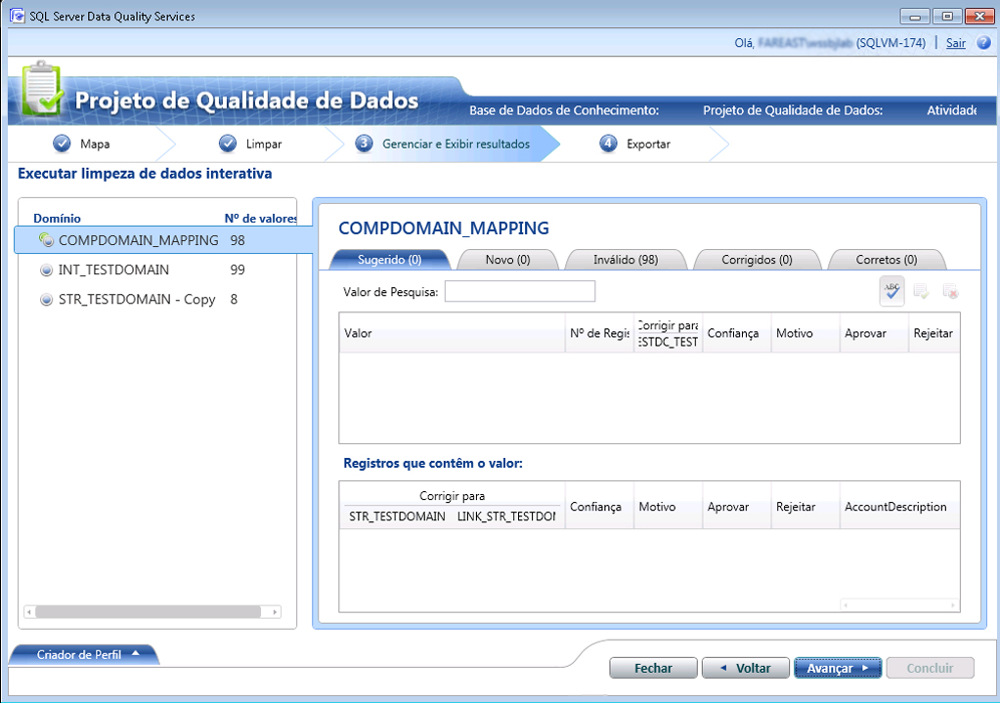

# Limpar dados usando o conhecimento (externo) dos dados de referência
  Este tópico descreve como limpar dados usando o conhecimento dos provedores de dados de referência. Embora todas as etapas de execução de uma atividade de limpeza permaneçam inalteradas para a limpeza dos dados usando o conhecimento dos provedores de dados de referência, conforme explicado em [Limpar dados usando o conhecimento &#40;interno&#41; do DQS](../data-quality-services/cleanse-data-using-dqs-internal-knowledge.md), este tópico fornece informações específicas à limpeza de dados usando o serviço de dados de referência no DQS ([!INCLUDE[ssDQSnoversion](../includes/ssdqsnoversion-md.md)]).  
  
 Quando você usa o recurso do serviço de dados de referência no DQS para limpar os dados, o processo de limpeza do DQS envia os valores de domínio mapeados ao provedor de serviço de dados de referência como uma solicitação em lote. O serviço de dados de referência responde com as seguintes informações:  
  
-   Correção sugerida  
  
-   Confiança  
  
-   Informações adicionais sobre o domínio mapeado. Os dados de referência também podem padronizar, analisar ou enriquecer a origem com dados adicionais. Essas informações adicionais são fornecidas nos campos adicionais da resposta.  
  
 Após obter a resposta de serviço de dados de referência, acontecerá o seguinte no DQS durante a atividade de limpeza:  
  
-   Com base nos valores de **Limite de Correção Automática** e **Confiança Mínima** especificados durante o mapeamento dos domínios com serviço de dados de referência, os valores do domínio serão corrigidos automaticamente ou sugeridos com base no nível de confiança.  
  
    > [!NOTE]  
    >  Os valores de limite especificados durante o mapeamento de um domínio para um serviço de dados de referência são aplicados durante a limpeza dos dados através do conhecimento no serviço de dados de referência, e não os especificados na guia **Configurações Gerais** da seção **Configuração** . Para obter informações sobre como especificar valores de limite para a limpeza de dados de referência, consulte a etapa 9 em [Anexar um domínio ou um domínio de composição aos dados de referência](../data-quality-services/attach-domain-or-composite-domain-to-reference-data.md).  
  
-   Os valores de domínio são categorizados da seguinte maneira: **Sugerido**, **Novo**, **Inválido**, **Corrigido**e **Correto**.  
  
-   Os dados adicionais são acrescentados à origem, e as informações estão disponíveis junto com os dados limpos para exportação.  
  
## Antes de começar  
  
###   Pré-requisitos  
 Os domínios necessários de uma base de dados de conhecimento do DQS precisam ser mapeados para o serviço de dados de referência apropriado. Além disso, a base de dados de conhecimento deve conter conhecimento sobre o tipo de dados que você deseja limpar. Por exemplo, se você quiser limpar a fonte de dados que contém endereços americanos, mapeie os domínios para um provedor de serviço de dados de referência que fornece dados de alta qualidade sobre endereços americanos. Para obter mais informações, consulte [Anexar domínio ou domínio composto para dados de referência](../data-quality-services/attach-domain-or-composite-domain-to-reference-data.md).  
  
###   Segurança  
  
####   Permissões  
 Você deve ter a função dqs_kb_editor ou dqs_kb_operator no banco de dados DQS_MAIN para executar a limpeza de dados.  
  
##   Limpar os dados usando o conhecimento dos dados de referência  
 Continuaremos com o mesmo exemplo de uso dos domínios que mapeamos no tópico anterior, [Anexar um domínio ou um domínio de composição aos dados de referência](../data-quality-services/attach-domain-or-composite-domain-to-reference-data.md), com o Serviço de dados Melissa no Microsoft Azure Marketplace. Agora, usaremos os mesmos domínios para limpar alguns endereços de exemplo americanos. As etapas para limpeza dos dados são as mesmas, conforme descrito em [Limpar dados usando o conhecimento &#40;interno&#41; do DQS](../data-quality-services/cleanse-data-using-dqs-internal-knowledge.md). No entanto, chamaremos sua atenção sempre que necessário durante o processo.  
  
1.  Crie um projeto de qualidade de dados e selecione a atividade **Limpeza** . Consulte [Create a Data Quality Project](../data-quality-services/create-a-data-quality-project.md).  
  
2.  Na página **Mapa** , mapeie os quatro domínios a seguir com as colunas apropriadas da fonte de dados: **Linha de Endereço**, **Cidade**, **Estado**e **CEP**. Clique em **Avançar**.  
  
    > [!NOTE]  
    >  Como você mapeou os quatro domínios do domínio composto **Verificação de Endereço** , a limpeza de dados será feita no nível do domínio composto, e não no nível do domínio individual.  
  
3.  Na página **Limpar** , execute o processo de limpeza assistido por computador clicando em **Iniciar**. Após o processo de limpeza, clique em **Avançar**.  
  
    > [!NOTE]  
    >  Na página **Limpar** , o DQS exibirá informações sobre os domínios anexados ao serviço de dados de referência de duas maneiras:  
    >   
    >  -   Uma mensagem é exibida abaixo do botão **Iniciar**: “Os domínios \<Domain1>, \<Domain2>,… \<DomainN> são limpos com o uso do provedor de serviços de dados de referência”. Neste exemplo, a seguinte mensagem será exibida: "A verificação de domínio de endereço é limpa com o provedor de serviços de dados de referência".  
    > -   Um ícone, , é exibido na área **Criador de Perfil** nos domínios anexados ao provedor de serviços de dados de referência. Neste exemplo, o ícone será exibido no domínio composto **Verificação de Endereço** .  
  
4.  Na página **Gerenciar e exibir resultados** , revise seus valores de domínio. O serviço de dados de referência pode exibir mais de uma sugestão, se disponível, para um valor, dependendo do número máximo de sugestões especificado na caixa **Candidatos Sugeridos** durante o mapeamento do domínio para o serviço de dados de referência. Por exemplo, são exibidas duas sugestões para os seguintes endereços americanos:  
  
     **Valor original:**  
  
    |Linha de Endereço|Cidade|Estado|CEP|  
    |------------------|----------|-----------|---------|  
    |1 msft way|Redmond||98052|  
  
     **Valores sugeridos:**  
  
    |Linha de Endereço|Cidade|Estado|CEP|  
    |------------------|----------|-----------|---------|  
    |1 Microsoft Way|Redmond|WA|98052|  
    |PO Box 1|Redmond|WA|98073|  
  
       
  
    > [!NOTE]  
    >  Para domínios compostos, o DQS realça também os domínios individuais com uma cor diferente, que foram corrigidos durante o processo de limpeza assistido por computador. Por exemplo, neste caso, os domínios **Linha de Endereço** e **Estado** foram corrigidos e, portanto, são realçados em ciano.  
  
5.  Depois que você revisar todos os valores de domínio, clique em **Avançar** para exportar os dados.  
  
6.  Na página **Exportar** , você observará que, além das informações normais sobre a atividade de limpeza de cada domínio (Origem, Razão, Confiança e Status), há informações adicionais fornecidas pelo serviço de dados de referência Melissa Data sobre seus dados de endereço, como latitude e longitude do endereço, nome do município, tipo de endereço (edifício, rua etc.) e assim por diante.  
  
7.  Exporte os dados para o destino necessário (SQL Server, CSV ou Excel) e clique em **Concluir** para fechar o projeto.  
  
    > [!IMPORTANT]  
    >  Se você estiver usando uma versão de 64 bits do Excel, não poderá exportar os dados limpos para um arquivo do Excel; você só poderá exportar para um banco de dados do SQL Server ou para um arquivo .csv.  
  
  
