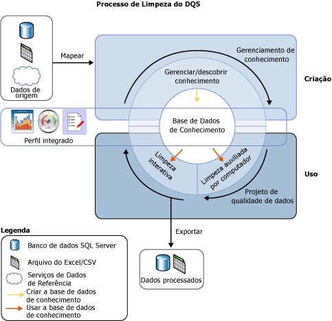
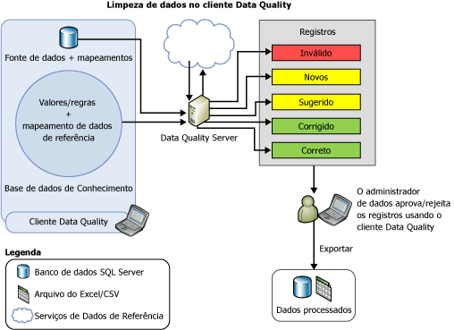

# Data Cleansing
  Limpeza de dados é o processo de analisar a qualidade de dados em uma fonte de dados, aprovando/rejeitando as sugestões manualmente pelo sistema e fazer alterações assim aos dados. A limpeza de dados no [!INCLUDE[ssDQSnoversion](../includes/ssdqsnoversion-md.md)] (DQS) inclui um processo auxiliado por computador que analisa a conformidade dos dados em relação ao conhecimento de uma base de dados de conhecimento, e um processo interativo que permite que o administrador de dados examine e modifique resultados de processo auxiliado por computador para garantir que a limpeza de dados seja executada exatamente como desejado.  
  
 O administrador de dados também pode executar a limpeza de dados no processo de empacotamento do Integration Services. Neste caso, o administrador de dados deve usar um componente do [!INCLUDE[ssDQSCleansingLong](../includes/ssdqscleansinglong-md.md)] que executa automaticamente a limpeza de dados com o uso de uma base de conhecimento existente. Para obter mais informações, consulte [Transformação de Limpeza DQS](../integration-services/data-flow/transformations/dqs-cleansing-transformation.md).  
  
 O recurso de limpeza de dados no DQS tem os seguintes benefícios:  
  
-   Identifica dados incompletos ou incorretos em sua fonte de dados (arquivo do Excel ou banco de dados do SQL Server) e então corrige ou o alerta sobre os dados inválidos.  
  
-   Oferece processo de duas etapas para limpar os dados: *auxiliado por computador* e *interativo*. O processo por computador usa o conhecimento em uma base de conhecimento de DQS para processar os dados automaticamente e sugere substituições/correções. A próxima etapa, interativa, permite que o administrador de dados aprove, rejeite ou modifique as alterações propostas pelo DQS durante a limpeza auxiliada por computador.  
  
-   Unifica e enriquece dados de cliente usando valores de domínio, regras de domínio e dados de referência. Por exemplo, padronize o uso do termo alterando "R." por "Rua", enriqueça os dados inserindo elementos ausentes ao alterar "1 Microsoft way Redmond 98006" por "1 Microsoft Way, Redmond, WA 98006".  
  
-   Oferece uma interface de assistente simples, intuitiva e consistente para que o usuário navegue pelos dados e inspecione erros em um conjunto muito grande de dados.  
  
 A ilustração seguinte mostra como a limpeza de dados é feita no DQS:  
  
   
  
##   Limpeza auxiliada por computador  
 O processo de limpeza de dados do DQS aplica a base de conhecimento aos dados a serem limpos e propõe alterações nos dados. O administrador de dados tem acesso a cada alteração proposta, o que permite que ele avalie e corrija as alterações. Para executar a limpeza de dados, o administrador de dados procede da seguinte maneira:  
  
1.  Crie um projeto de qualidade de dados, selecione uma base de dados de conhecimento na qual você deseja analisar e limpar seus dados de origem e selecione a atividade **Limpeza** . Vários projetos de qualidade de dados podem usar a mesma base de dados de conhecimento.  
  
2.  Especifique a tabela de banco de dados/exibição ou um arquivo do Excel que contenha os dados de origem a serem limpos. O banco de dados ou o arquivo do Excel pode ser o mesmo que foi usado para a descoberta de conhecimento ou pode ser um banco de dados ou arquivo do Excel diferente.  
  
    > [!NOTE]  
    >  Se você selecionar a mesma fonte de dados para atividades de descoberta de conhecimento e de limpeza, não haverá nenhuma alteração aos dados. É recomendado que você execute a descoberta de conhecimento em dados de exemplo e posteriormente limpe seus dados de origem em relação ao conhecimento compilado durante a atividade de descoberta de conhecimento.  
  
3.  Mapeie os campos de dados a ser limpos para os domínios/domínios compostos apropriados na base de dados de conhecimento. Se você mapear um campo para um domínio composto, o mapeamento acontecerá entre o campo e o domínio composto, e não com os domínios individuais no domínio composto. Além disso, a limpeza de dados para o campo mapeado é feita com base nas regras especificadas para o domínio composto, e não para os domínios individuais no domínio composto. Para obter mais informações sobre domínios compostos, consulte [DQS Knowledge Bases and Domains](../data-quality-services/dqs-knowledge-bases-and-domains.md).  
  
4.  Execute o processo de limpeza auxiliada por computador clicando em **Iniciar** na página **Limpeza** .  
  
 O processo de limpeza de dados localiza a melhor correspondência de uma instância de dados a valores de domínio de dados conhecidos. O processo aplica conhecimento de qualidade de dados a todos os dados de origem, ao contrário do processo de descoberta da base de dados de conhecimento que é executado em um percentual dos dados de exemplo.  
  
 O processo auxiliado por computador exibe informações de qualidade dos dados no [!INCLUDE[ssDQSClient](../includes/ssdqsclient-md.md)] que serão usadas no processo de limpeza interativo. Além da aderência às regras de erro de sintaxe, o DQS também usa dados de referência e algoritmos avançados para categorizar dados com o uso do *nível de confiança*. O nível de confiança indica a extensão de certeza do DQS para a correção ou sugestão. O nível de confiança é baseado nos valores de limite a seguir:  
  
-   Um valor de3 *limite da correção automática* acima do qual o DQS irá sugerir e fazer uma alteração, a menos que o administrador de dados a rejeite. Você pode especificar o valor de limite de correção automática na guia **Configurações Gerais** na tela **Configuração** . Para obter mais informações, consulte [Configurar valores de limite para limpeza e correspondência](../data-quality-services/configure-threshold-values-for-cleansing-and-matching.md).  
  
-   Um valor de *limite de sugestão automática* abaixo do limite de correção automática, acima do qual o DQS irá sugerir e fazer uma alteração caso o administrador de dados a aprove. Você pode especificar o valor de limite de sugestão automática na guia **Configurações Gerais** na tela **Configuração** . Para obter mais informações, consulte [Configurar valores de limite para limpeza e correspondência](../data-quality-services/configure-threshold-values-for-cleansing-and-matching.md).  
  
 Qualquer valor com um nível de confiança debaixo do valor de limite de sugestão automática é deixado como está pelo DQS, a menos que o administrador de dados especifique uma alteração.  
  
##   Limpeza interativa  
 Com base no processo de limpeza auxiliada por computador, o DQS fornece ao administrador de dados as informações necessárias para que ele tome uma decisão sobre a alteração dos dados. O DQS categoriza os dados sob estas cinco guias:  
  
-   **Sugerido**: valores de domínio para os quais o DQS encontrou sugestões com um nível de confiança superior ao valor de *limite de sugestão automática* , mas inferior ao valor do *limite de correção automática* . Você deve revisar esses valores e aprovar ou rejeitar conforme apropriado.  
  
-   **Novo**: valores válidos para os quais o DQS não tem informações suficientes (sugestão) e, portanto, não podem ser mapeados para nenhuma outra guia. Posteriormente, essa guia também conterá valores que tenham um nível de confiança inferior ao valor de *limite de sugestão automática* , porém alto o suficiente para ser marcado como válido.  
  
-   **Inválido**: valores que foram marcados como inválidos no domínio na base de dados de conhecimento ou os valores que falharam em uma regra de domínio ou em dados de referência. Esta guia também conterá valores rejeitados pelo usuário em quaisquer das outras quatro guias durante o processo de limpeza interativo.  
  
-   **Corrigido**: valores corrigidos pelo DQS durante o processo de limpeza automatizado uma vez que o DQS localizou uma correção para o valor com um nível de confiança acima do valor do *limite de correção automática* . Esta guia também conterá valores para os quais o usuário especificou um valor correto na coluna **Corrigir para** durante a limpeza interativa e então aprovou clicando no botão de opção na coluna **Aprovar** em quaisquer das outras quatro guias.  
  
-   **Correto**: valores avaliados como corretos. Por exemplo, o valor correspondeu a um valor de domínio. Se preciso for, você poderá anular a limpeza do DQS ao rejeitar valores desta guia ou especificando uma palavra alternativa na coluna **Corrigir para** e depois clicando no botão de opção da coluna **Aceitar** . Essa guia também contém os valores que foram aprovados pelo usuário durante a limpeza interativa clicando no botão de opção na coluna **Aprovar** nas guias **Novo** ou **Inválido** .  
  
> [!NOTE]  
>  Nas guias **Sugerido**, **Corrigido**e **Correto** , o DQS exibe o valor principal para um domínio, se aplicável, no coluna **Corrigir para** em relação ao respectivo valor de domínio.  
  
 O administrador de dados usa o cliente do [!INCLUDE[ssDQSClient](../includes/ssdqsclient-md.md)] para ver as alterações propostas pelo DQS e decidir se elas devem ser implementadas ou não. Ele pode verificar se os valores designados como corretos pelo DQS estão realmente corretos. Ele pode verificar se as alterações já feitas pelo DQS, com um alto nível de confiança, deveriam ter sido feitas. Ele pode decidir se deve aprovar as alterações sugeridas automaticamente. E pode examinar os valores que não foram alterados, no caso de desejar fazer uma alteração não localizada pelo processo assistido pelo computador.  
  
 O DQS mesclará todas as alterações feitas pelo administrador de dados com os resultados da limpeza de dados auxiliada por computador. Essas alterações ficarão no projeto, mas não serão adicionadas à base de conhecimento. Durante a limpeza de dados, a base de conhecimento associada é somente leitura.  
  
 Quando o processo de limpeza de dados for concluído, você poderá optar por exportar os dados processados para uma nova tabela no banco de dados do SQL Server, para um arquivo .csv ou para um arquivo do Excel. Os dados de origem nos quais a limpeza é executada são mantidos em seu estado original. O administrador de dados pode usar os dados limpos separados para corrigir os dados de origem reais.  
  
 A ilustração a seguir mostra como a limpeza de dados é feita usando o aplicativo [!INCLUDE[ssDQSClient](../includes/ssdqsclient-md.md)] :  
  
   
  
##   Correção de valor principal  
 A correção do valor principal se aplica a valores de domínio que possuem sinônimos, e o usuário deseja usar um dos valores de sinônimo como o valor principal, em vez de outros para a representação consistente do valor. Por exemplo, "Rio de Janeiro", "RJ" e "cidade maravilhosa" são sinônimos e o usuário deseja usar "Rio de Janeiro" como o valor principal em vez de "RJ" e "Cidade Maravilhosa". O DQS oferece suporte à correção do valor principal durante o processo de limpeza para ajudar você a padronizar seus dados. A correção de valor principal só será feita se o domínio tiver sido habilitado para o mesmo ao ser criado. Por padrão, todos os domínios são habilitados para a correção de valor principal, a menos que você tenha desmarcado a caixa de seleção **Usar Valores Principais** durante a criação de um domínio. Para obter mais informações sobre essa caixa de seleção, consulte [Set Domain Properties](../data-quality-services/set-domain-properties.md).  
  
##   Padronizar dados limpos  
 É possível optar por exportar os dados limpos no formato padronizado com base no formato de saída definido para domínios. Durante a criação de um domínio, você poderá selecionar a formatação que será aplicada quando forem gerados os valores de dados no domínio. Para obter mais informações sobre como especificar formatos de saída de um domínio, consulte a lista **Saída de Formato para** em [Set Domain Properties](../data-quality-services/set-domain-properties.md).  
  
 Durante a exportação dos dados limpos na página **Exportar** no assistente de projeto de qualidade de dados de limpeza, especifique se deseja que os dados limpos sejam exportados no formato padronizado marcando a caixa de seleção **Padronizar Saída** . Por padrão, os dados limpos são exportados no formato unificado, ou seja, a caixa de seleção está marcada. Para obter mais informações sobre como exportar os dados limpos, consulte [Limpar dados usando o conhecimento do DQS &#40;interno&#41;](../data-quality-services/cleanse-data-using-dqs-internal-knowledge.md).  
  
##   Tarefas Relacionadas  
  
|Descrição da tarefa|Tópico|  
|----------------------|-----------|  
|Descreve como configurar valores de limites para a atividade de limpeza.|[Configure Threshold Values for Cleansing and Matching](../data-quality-services/configure-threshold-values-for-cleansing-and-matching.md)|  
|Descreve como limpar dados usando conhecimento criado no DQS.|[Limpar dados usando o conhecimento &#40;interno&#41; do DQS](../data-quality-services/cleanse-data-using-dqs-internal-knowledge.md)|  
|Descreve como limpar dados usando conhecimento do serviço de dados de referência.|[Limpar dados usando o conhecimento &#40;externo&#41; dos dados de referência](../data-quality-services/cleanse-data-using-reference-data-external-knowledge.md)|  
|Descreve como limpar um domínio composto.|[Limpar dados em um domínio de composição](../data-quality-services/cleanse-data-in-a-composite-domain.md)|  
  
## Consulte Também  
 [Projetos de qualidade de dados &#40;DQS&#41;](../data-quality-services/data-quality-projects-dqs.md)   
 [Correspondência de dados](../data-quality-services/data-matching.md)  
  
  
