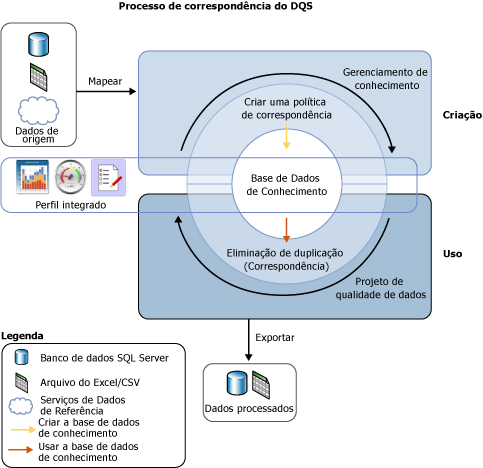

# Correspondência de dados

[!INCLUDE [SQL Server - Windows only ASDBMI  ](../includes/applies-to-version/sqlserver.md)]

  O processo de correspondência de dados do [!INCLUDE[ssDQSnoversion](../includes/ssdqsnoversion-md.md)] (DQS) ajuda você a reduzir a duplicação de dados e a aprimorar a exatidão dos dados em uma fonte de dados. A correspondência analisa o grau de duplicação em todos os registros de uma única fonte de dados, retornando probabilidades ponderadas de uma correspondência entre cada conjunto de registros comparados. Você pode decidir então quais registros são correspondências e executar a ação apropriada nos dados de origem.  
  
 O processo de correspondência do DQS tem os seguintes benefícios:  
  
-   A correspondência permite que você elimine as diferenças entre os valores de dados que deveriam ser iguais, determinando o valor correto e reduzindo os erros que as diferenças de dados podem causar. Por exemplo, nomes e endereços são frequentemente os dados que identificam uma fonte de dados, em particular os dados do cliente, mas os dados podem se tornar incorretos e se deteriorar com o tempo. A execução da correspondência para identificar e corrigir esses erros pode facilitar muito o uso e a manutenção dos dados.  
  
-   A correspondência permite que você garanta que os valores equivalentes, mas inseridos em um formato ou estilo diferente, sejam renderizados de maneira uniforme.  
  
-   A correspondência identifica correspondências exatas e aproximadas, permitindo que você remova dados duplicados na medida em que eles forem definidos. Você define o ponto no qual uma correspondência aproximada é realmente uma correspondência. Você define quais campos são avaliados para a correspondência e quais não são.  
  
-   O DQS permite que você crie uma política de correspondência usando um processo auxiliado por computador, modifique-a interativamente com base nos resultados correspondentes e adicione-a a uma base de dados de conhecimento que seja reutilizável.  
  
-   Você pode reindexar dados copiados da origem para a tabela de preparo ou não reindexá-los, dependendo do estado da política de correspondência e dos dados de origem. Não reindexar pode melhorar o desempenho.  
  
 Você pode executar o processo de correspondência em conjunto com outros processos de limpeza de dados para melhorar qualidade de dados global. Você também pode executar a eliminação de duplicação de dados usando a funcionalidade DQS interna do Master Data Services. Para obter mais informações, consulte [Visão geral do MDS &#40;Master Data Services&#41;](../master-data-services/master-data-services-overview-mds.md).  
  
 A ilustração seguinte mostra como a correspondência de dados é feita no DQS:  
  
   
  
##  Como executar a correspondência de dados  
 Assim como acontece com outros processos de qualidade de dados no DQS, você executa a correspondência ao criar uma base de dados de conhecimento e ao executar uma atividade de correspondência em um projeto de qualidade de dados nas seguintes etapas:  
  
1.  Criar uma política de correspondência na base de dados de conhecimento  
  
2.  Executar um processo de eliminação de duplicação em uma atividade de correspondência que faça parte de um projeto de qualidade de dados.  
  
###   Criando uma política de correspondência  
 Você prepara a base de dados de conhecimento para executar a correspondência ao criar uma política de correspondência na base de dados de conhecimento para definir como o DQS atribui a probabilidade de correspondência. Uma política de correspondência consiste em uma ou mais regras de correspondência que identificam que domínios serão usados quando o DQS avaliar o grau de correspondência entre dois registros e que especificam o peso carregado por cada valor de domínio na avaliação de correspondência. Você especifica na regra se os valores do domínio precisam ser uma correspondência exata ou se podem ser apenas semelhantes, e com que grau de semelhança. Você também especifica se a correspondência de domínio é um pré-requisito.  
  
 A atividade de política de correspondência do assistente de Gerenciamento de Base de Conhecimento analisa dados de exemplo ao aplicar cada regra de correspondência para comparar dois registros por vez no intervalo de registros. Os registros cujas pontuações de correspondência sejam maiores do que um mínimo especificado são agrupados em clusters nos resultados correspondentes. Esses resultados correspondentes não são adicionados à base de dados de conhecimento; são utilizados para o ajuste das regras de correspondência. A criação de uma política de correspondência pode ser um processo iterativo no qual você modifica regras de correspondência com base nos resultados correspondentes ou nas estatísticas de criação de perfis.  
  
 Você pode especificar para um domínio que as cadeias de caracteres de dados sejam normalizadas no carregamento dos dados da fonte de dados para o domínio. Este processo consiste na substituição de caracteres especiais por um nulo ou um espaço, o que quase sempre remove a diferença entre duas cadeias de caracteres. Isso pode aumentar a precisão da correspondência e frequentemente permite que um resultado correspondente ultrapasse o limite mínimo de correspondência, sendo que sem a normalização ele não passaria.  
  
> [!NOTE]  
>  Os valores nulos nos campos correspondentes de dois registros serão considerados como uma correspondência.  
  
 A política de correspondência é executada em domínios mapeados para os dados de exemplo. Você pode especificar se os dados serão ou não copiados da fonte de dados para a tabela de preparo e reindexados quando a política de correspondência for executada. Isso pode ser feito durante a criação da base de dados de conhecimento ou durante a execução do projeto de correspondência. Não reindexar pode resultar em um desempenho aprimorado. A reindexação não será necessária se o seguinte for verdade: a política de correspondência não foi alterada e você não atualizou a fonte de dados, remapeou a política, selecionou uma nova fonte de dados ou mapeou um ou mais domínios novos.  
  
 Cada regra de correspondência é salva na base de dados de conhecimento quando criada. Entretanto, uma base de dados de conhecimento só estará disponível para uso em um projeto de qualidade de dados quando for publicada. Além disso, até que a base de dados de conhecimento seja publicada, as regras de correspondência contidas nela não poderão ser alteradas por um usuário diferente da pessoa que a criou.  
  
###   Executando um projeto de correspondência  
 O DQS executa a eliminação de duplicação de dados ao comparar cada linha dos dados de origem a todas as outras linhas, usando a política de correspondência definida na base de dados de conhecimento e gerando uma probabilidade de que as linhas sejam uma correspondência. Isso é feito em um projeto de qualidade de dados com um tipo de Correspondência. A correspondência é uma das principais etapas de um projeto de qualidade de dados. Ela é mais bem executada após a limpeza de dados, de forma que os dados a serem correspondidos estejam livres de erros. Antes de executar um processo de correspondência, você pode exportar os resultados do projeto de limpeza para uma tabela de dados ou para um arquivo .csv e então criar um projeto de correspondência no qual serão mapeados os resultados da limpeza para os domínios do projeto de correspondência.  
  
 Um projeto de correspondência de dados consiste em um processo auxiliado por computador e em um processo interativo. O projeto de correspondência aplica as regras de correspondência da política de correspondência à fonte de dados a ser avaliada. Esse processo avalia a probabilidade de quaisquer duas linhas serem correspondências em uma pontuação de correspondência. Somente os registros com uma probabilidade de correspondência maior do que um valor definido pelo administrador de dados na política de correspondência serão considerados como uma correspondência.  
  
 Quando o DQS executa a análise de correspondência, cria clusters de registros considerados como correspondências pelo DQS. O DQS identifica aleatoriamente um dos registros em cada cluster como o registro dinâmico ou inicial. O administrador de dados verifica os resultados correspondentes e rejeita qualquer registro que não seja uma correspondência adequada para um cluster. Em seguida, o administrador de dados seleciona uma regra de sobrevivência que o DQS usará para determinar o registro que sobreviverá ao processo de correspondência e substituirá os registros correspondentes. A regra de sobrevivência pode ser um "Registro dinâmico" (o padrão), "registro mais longo e mais completo", "registro mais completo" ou "registro mais longo". O DQS determina o registro sobrevivente (inicial) de cada cluster baseado em que registro corresponde com mais exatidão aos critérios ou critério da regra de sobrevivência. Se vários registros de um determinado cluster cumprirem a regra de sobrevivência, o DQS selecionará um deles aleatoriamente. O DQS oferece a você a opção de exibição de clusters com registros em comum como um único cluster por meio da seleção "mostrar clusters sem sobreposição". Você deve executar o processo de correspondência para exibir os resultados de acordo com esta configuração.  
  
 Você pode exportar os resultados do processo de correspondência para uma tabela do SQL Server ou para um arquivo .csv. Você pode exportar resultados correspondentes de duas formas: primeiro, os registros correspondentes e os registros não correspondentes, ou segundo, os registros de sobrevivência que incluem somente o registro sobrevivente para um cluster e os resultados não correspondentes. Nos registros de sobrevivência, se o mesmo registro for identificado como o sobrevivente para vários clusters, ele será exportado somente uma vez.  
  
## Nesta seção  
 Você pode executar as seguintes tarefas relacionadas à correspondência no DQS:  
  
|Descrição da tarefa|Tópico|  
|-|-|  
|Criar e testar regras de correspondência em uma política de correspondência|[Criar uma política de correspondência](../data-quality-services/create-a-matching-policy.md)|  
|Executar a correspondência em um projeto de qualidade de dados|[Executar um projeto de correspondência](../data-quality-services/run-a-matching-project.md)|  
  
  
