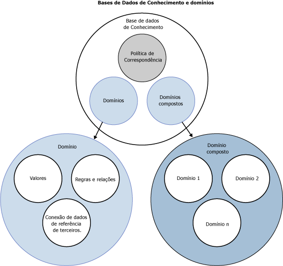

# Bases de Dados de Conhecimento DQS e domínios

[!INCLUDE[appliesto-ss-xxxx-xxxx-xxx-md-winonly](../includes/appliesto-ss-xxxx-xxxx-xxx-md-winonly.md)]

  Este tópico descreve o que é uma base de dados de conhecimento no [!INCLUDE[ssDQSnoversion](../includes/ssdqsnoversion-md.md)] (DQS). Para limpar dados, você tem que ter conhecimento sobre os dados. Para preparar conhecimento para um projeto de qualidade de dados, compile e mantenha uma KB (base de dados de conhecimento) que o DQS possa usar para identificar dados incorretos ou inválidos. O DQS permite que você use processos interativos e assistidos por computador para criar, compilar e atualizar sua base de dados de conhecimento. O conhecimento em uma base de dados de conhecimento é mantido em domínios, cada qual específico para um campo de dados. A base de dados de conhecimento é um repositório de conhecimento sobre seus dados que permitem que você entenda seus dados e mantenha sua integridade.  
  
 As bases de conhecimento do DQS têm os seguintes benefícios:  
  
-   Criar conhecimento sobre dados é um processo detalhado. O processo de DQS de extrair conhecimento sobre dados automaticamente, de dados de exemplo, facilita muito mais o processo.  
  
-   O DQS permite ver sua análise dos dados e aumentar o conhecimento na base de dados de conhecimento criando regras e alterando os valores de dados. Você pode fazer isso repetidamente para aprimorar o conhecimento com o passar do tempo.  
  
-   Você pode aproveitar o conhecimento da qualidade de dados pré-existentes baseando a base de dados de conhecimento em uma base existente, importando o conhecimento de domínio de arquivos para a base de dados de conhecimento, importando conhecimento de um projeto de volta para uma base de dados de conhecimento, ou usando a base de dados de conhecimento padrão do DQS, os Dados do DQS.  
  
-   Você pode assegurar a qualidade de seus dados comparando-os aos dados mantidos por um provedor de dados de referência.  
  
-   Há uma separação clara entre criar uma base de dados de conhecimento e aplicá-la no processo de correção de dados, que dá a você a flexibilidade de criar e atualizar a base de dados de conhecimento.  
  
 O administrador de dados usa o aplicativo [!INCLUDE[ssDQSClient](../includes/ssdqsclient-md.md)] para executar e controlar as etapas assistidas por computador e para executar as etapas interativas.  
  
 A ilustração a seguir exibe vários componentes em uma base de dados de conhecimento e um domínio no DQS:  
  
   
  
##   Como criar e compilar uma base de dados de conhecimento do DQS  
 Criar uma base de dados de conhecimento do DQS envolve os processos e componentes a seguir:  
  
 **Descoberta da Base de Dados de Conhecimento**  
 Um processo assistido por computador que cria conhecimento em uma base de dados de conhecimento processando um exemplo de dados  
  
 **Gerenciamento de Domínio**  
 Um processo interativo que permite que o administrador de dados verifique e modifique o conhecimento que existe em domínios de base de dados de conhecimento, cada um dos quais associados a um campo de dados. Isto pode incluir configurar as propriedades de campo, criando regras, alterando valores específicos, usando serviços de dados de referência ou configurando relacionamentos baseados em termos ou entre campos.  
  
 **Serviços de Dados de Referência**  
 Um processo de gerenciamento de domínio que permite validar seus dados em relação a dados mantidos e garantidos por um provedor de dados de referência.  
  
 **Política de Correspondência**  
 Uma política que define como o DQS processa registros para identificar duplicatas potenciais e não correspondências, que se integra à base de dados de conhecimento em um processo interativo e assistido por computador.  
  
##   Descoberta da Base de Dados de Conhecimento  
 A criação da base de dados de conhecimento é inicialmente um processo guiado por computador. A atividade de descoberta de conhecimento cria uma base de dados de conhecimento analisando um exemplo de dados por meio de critérios de qualidade de dados, com a procura de inconsistências de dados e erros de sintaxe, e a proposição de alterações nos dados. Esta análise é baseada em algoritmos criados no DQS.  
  
 O administrador de dados prepara o processo com a vinculação de uma base de conhecimento a uma tabela ou exibição de banco de dados do SQL Server que contêm dados de exemplo similares aos dados que a base de conhecimento será usada para analisar. Em seguida, o administrador de dados mapeia um domínio da base de conhecimento para cada coluna dos dados de exemplo a serem analisados. Um domínio pode ser um domínio único que é mapeado para um campo único ou pode ser um domínio composto que consiste em vários domínios únicos, cada um dos quais mapeado para parte dos dados em um único campo (consulte "Domínios Compostos" abaixo). Quando você executa a descoberta da base de dados de conhecimento, o DQS extrai informações de qualidade de dados dos dados de exemplo nos domínios da base de conhecimento. Quando você tiver executado a análise de descoberta de conhecimento, terá uma base de dados de conhecimento com a qual será possível realizar a correção de dados.  
  
 A base de dados de conhecimento do DQS é extensível. De dentro da atividade de Descoberta da Base de Dados de Conhecimento, você pode adicionar conhecimento de modo interativo à base de dados de conhecimento depois da análise de descoberta de conhecimento assistida por computador. Você pode adicionar manualmente alterações de valor e pode importar valores de domínio de um arquivo do Excel. Além disso, você poderá executar o processo de descoberta da base de dados de conhecimento novamente no futuro se os dados no exemplo tiverem sido alterados. Você pode aplicar mais conhecimento de dentro de uma atividade de Gerenciamento de Domínio e de dentro da atividade de Correspondência de Dados (veja abaixo).  
  
 O processo de descoberta da base de dados de conhecimento não precisa ser executado nos mesmos dados nos quais a correção de dados é executada. O DQS fornece a flexibilidade de criar conhecimento a partir de um conjunto de campos de banco de dados e aplicá-lo a um segundo conjunto de dados relacionados que precisam ser limpos. O administrador de dados pode criar uma nova base de conhecimento a partir do zero ou baseá-lo em uma base de conhecimento existente ou pode importar uma base de dados de conhecimento de um arquivo de dados. Você também pode executar novamente a descoberta da base de dados de conhecimento em uma base de dados de conhecimento existente. É possível manter várias bases de conhecimento em um único [!INCLUDE[ssDQSServer](../includes/ssdqsserver-md.md)]. Você também pode conectar várias instâncias de um aplicativo à mesma base de conhecimento. O DQS impede conflitos de simultaneidade por meio do bloqueio da base de conhecimento ao usuário que a abre em uma sessão de gerenciamento de conhecimento.  
  
### Não diferenciação de maiúsculas e minúsculas no DQS  
 Os valores no DQS não diferenciam maiúsculas e minúsculas. Isso significa que, quando o DQS executa a descoberta da base de dados de conhecimento, gerenciamento de domínio, ou correspondência, não distingue valores por maiúsculas ou minúsculas. Se você adicionar um valor no gerenciamento de valor que difere de outro valor somente por maiúsculas ou minúsculas, eles serão considerados o mesmo valor, não sinônimos. Se os dois valores que diferenciam somente maiúsculas e minúsculas forem comparados no processo de correspondência, eles serão considerados uma correspondência exata.  
  
 No entanto, você pode controlar as letras maiúsculas e minúsculas de valores que você exporta nos resultados da limpeza. Faça isso configurando a propriedade de domínio **Formatar Saída para** (consulte [Definir propriedades de domínio](../data-quality-services/set-domain-properties.md)) e usando a caixa de seleção **Padronizar Saída** ao exportar os resultados da limpeza (consulte [Limpar dados usando o conhecimento &#40;interno&#41; do DQS](../data-quality-services/cleanse-data-using-dqs-internal-knowledge.md)).  
  
##   Gerenciamento de Domínio  
 O gerenciamento de domínio permite que o administrador de dados altere e aumente interativamente os metadados que são gerados pela atividade de descoberta da base de dados de conhecimento assistida por computador. Cada alteração que você faz é para um domínio da base de dados de conhecimento. Na atividade de gerenciamento de domínio, você pode fazer o seguinte:  
  
-   Criar um novo domínio. O novo domínio pode ser vinculado ou copiado de um domínio existente.  
  
-   Defina as propriedades de domínio que se aplicam a cada termo no domínio.  
  
-   Aplique regras de domínio que realizam validação ou padronização para um intervalo de valores que você definir.  
  
-   Aplique interativamente as alterações a qualquer valor de dados específico no domínio.  
  
-   Use o verificador ortográfico do DQS para verificar a sintaxe, a ortografia e a estrutura de frase de valores da cadeia de caracteres.  
  
-   Importe um domínio de um arquivo de dados .dqs ou valores de domínio de um arquivo do Microsoft Excel.  
  
-   Importe valores que foram encontrados por um processo de limpeza no projeto de qualidade de dados de volta para uma base de dados de conhecimento.  
  
-   Anexe um domínio aos dados de referência mantidos por um provedor de dados de referência, com o resultado da comparação dos valores de domínio com os dados de referência para determinar sua integridade e exatidão. Você também pode definir configurações de provedor de dados.  
  
-   Aplique relações baseadas em termos para um único domínio.  
  
 Quando a atividade de gerenciamento de domínio estiver concluída, você poderá publicar a base de dados de conhecimento para usar em um projeto de dados.  
  
### Definindo propriedades do domínio  
 As propriedades de domínio definem e orientam o processamento que será aplicado aos valores associados. Você pode definir o tipo de dados e o idioma dos valores, especificar que os dados de origem serão limpos com o valor principal (se esta opção estiver marcada, os dados de origem serão limpos com o termo correto mas não com o valor principal), garantir a normalização de dados configurando a formatação que será aplicada quando os valores de dados no domínio são gerados, além de definir que os algoritmos (erro de sintaxe, verificador ortográfico e normalização de cadeia de caracteres) serão aplicados.  
  
### Serviços de Dados de Referência  
 No processo de gerenciamento de domínio, você pode anexar dados de referência online a um domínio. É assim que se compara os dados em seu domínio com os dados mantidos por um provedor de dados de referência. Você deve primeiro configurar o provedor de dados de referência por meio dos recursos de configuração do DQS na seção **Administração** do aplicativo do [!INCLUDE[ssDQSClient](../includes/ssdqsclient-md.md)] . Para obter mais informações, consulte [Reference Data Services in DQS](../data-quality-services/reference-data-services-in-dqs.md).  
  
### Aplicando regras de domínio  
 Você pode criar regras de domínio para validação de dados. Uma regra de domínio garante a exatidão de dados, variando de uma restrição básica, como os possíveis termos que um valor da cadeia de caracteres pode ter, até uma expressão regular mais complexa, como os formulários válidos de um endereço de email.  
  
 Para um domínio composto, você pode criar uma regra de CD que especifica uma relação entre um valor em um domínio único e um valor em outro domínio único, ambos fazendo parte de um domínio composto.  
  
### Definindo valores de domínio  
 Depois de compilar uma base de dados de conhecimento, você poderá popular e exibir valores de dados em cada domínio da base de dados de conhecimento. Depois da descoberta da base de dados de conhecimento, o DQS mostrará quantas vezes cada termo aparece, qual o status de cada termo e as correções propostas. Você pode gerenciar este conhecimento da seguinte maneira:  
  
-   Altere o status de um valor, tornando-o correto, errado ou não válido  
  
-   Adicione um valor específico para ou exclua um valor específico da base de dados de conhecimento  
  
-   Altere a relação de um valor para outro, incluindo a designação de uma substituição para um termo que está errado ou não válido  
  
-   Adicionar, remover ou alterar o conhecimento associado ao domínio.  
  
 Os valores podem ser criados especificamente pelo usuário ou como parte da descoberta de dados ou funcionalidades de importação. Isto permite que você alinhe o domínio ao negócio e torne-o facilmente extensível.  
  
 Você pode definir os valores de domínio na atividade de gerenciamento do domínio, ou na etapa de Gerenciamento de Valores de Domínio no final da atividade de descoberta da base de dados de conhecimento. A funcionalidade do valor de domínio é a mesmo em ambas as atividades.  
  
### Definindo relações entre termos  
 Em gerenciamento de domínio, você pode especificar uma relação baseada em termos para um único domínio, especificando uma alteração para um único valor.  
  
### Domínios compostos  
 Um domínio composto é uma estrutura que abrange dois ou mais domínios únicos que contêm conhecimentos sobre dados comuns. Exemplos de dados que podem ser endereçados por domínios compostos são o nome, sobrenome e o nome do meio em um campo de nome e a rua, o número da casa, a cidade, o estado, o CEP e o país em um campo de endereço. Quando você mapear um único campo para um domínio composto, o DQS analisa os dados de um campo nos vários domínios da composição.  
  
 Às vezes um único domínio não representa dados de campo por completo. Agrupar dois ou mais domínios em um domínio composto pode permitir que você represente os dados de uma maneira eficiente. Veja a seguir as vantagens de usar domínios compostos:  
  
-   Analisar os diferentes domínios únicos que compõem um domínio composto pode ser uma maneira mais efetiva de avaliar a qualidade de dados.  
  
-   Quando você usa um domínio composto, também pode criar regras de domínio cruzado que permitem verificar se a relação entre os dados em vários domínios é apropriada. Por exemplo, você pode verificar se a cadeia de caracteres "Londres" em um domínio de cidade corresponde à cadeia de caracteres "Inglaterra" em um domínio de país. Observe que as regras do domínio cruzado são levadas em consideração depois das regras de domínio.  
  
-   Os dados em domínios compostos podem ser anexados a uma fonte de dados de referência e, nesse caso, o domínio composto será enviado para o provedor de dados de referência. Isto geralmente é feito com dados de endereço.  
  
 A maneira como os dados representados por um domínio composto é analisada é determinada pelas propriedades do domínio composto. Os dados podem ser analisados por um delimitador, pela ordem dos domínios, ou com base no conhecimento nos domínios anexados ao domínio composto (selecionando a propriedade **Usar Análise da Base de Dados de Conhecimento** no domínio composto). Para obter mais informações, consulte [Set Composite Domain Properties](../data-quality-services/create-a-composite-domain.md#CompositeDomainProperties).  
  
 Os domínios compostos são gerenciados diferentemente de domínios únicos. Você não gerencia valores em um domínio composto; você o faz para os domínios únicos que compõem o domínio composto. No entanto, da lista de domínios na atividade de Gerenciamento de Domínio, você pode ver as relações entre os diferentes valores em um domínio composto e as estatísticas que se aplicam a eles. Por exemplo, você pode ver quantas instâncias existem de um único endereço composto dos mesmos cinco valores da cadeia de caracteres. Na etapa de Descoberta da atividade de Descoberta da Base de Dados de Conhecimento, a análise é executada nos domínios únicos dentro de um domínio composto, não no domínio composto. No entanto, na limpeza interativa, você limpa os dados no domínio composto, não nos domínios únicos.  
  
 A correspondência pode ser executada nos domínios únicos que compõem o domínio composto, mas não no próprio domínio composto.  
  
##   Correspondência de dados  
 Além de fazer alterações manuais a uma base de dados de conhecimento por meio do gerenciamento de domínio, você poderá adicionar conhecimento correspondente a uma base de dados de conhecimento. Para preparar o DQS para o processo de eliminação de duplicação de dados, você deverá criar uma política compatível que o DQS usará para calcular a probabilidade de uma correspondência. A política inclui uma ou mais regras correspondentes que o administrador de dados cria para identificar como o DQS deve comparar linhas de dados. O administrador de dados determina quais campos de dados na linha devem ser comparados e quanto peso cada campo deve ter na comparação. O administrador de dados também determinará quanto de probabilidade será considerada uma correspondência. O DQS adiciona as regras de correspondência à base de dados de conhecimento para serem usadas para executar a atividade de correspondência no projeto de qualidade de dados.  
  
 Para obter mais informações sobre a base de dados de conhecimento e a correspondência de dados, consulte [Correspondência de dados](../data-quality-services/data-matching.md).  
  
## Nesta seção  
 Você pode realizar as operações a seguir em uma base de dados de conhecimento e seus domínios:  
  
|||  
|-|-|  
|Crie, abra, adicione conhecimento para e execute descoberta em uma base de dados de conhecimento|[Criar uma base de dados de conhecimento](../data-quality-services/building-a-knowledge-base.md)|  
|Realize operações de importação e exportação em domínios e bases de dados de conhecimento|[Importar e exportar conhecimento](../data-quality-services/importing-and-exporting-knowledge.md)|  
|Crie um único domínio, uma regra de domínio, relações baseadas em termos e altere os valores de domínio|[Gerenciar um domínio](../data-quality-services/managing-a-domain.md)|  
|Crie um domínio composto, crie uma regra de domínio cruzado e use relações de valor|[Gerenciar um domínio de composição](../data-quality-services/managing-a-composite-domain.md)|  
|Usar a base de dados de conhecimento de dados do DQS criada no DQS|[Usando a base de dados de conhecimento padrão do DQS](../data-quality-services/using-the-dqs-default-knowledge-base.md)|  
  
  
