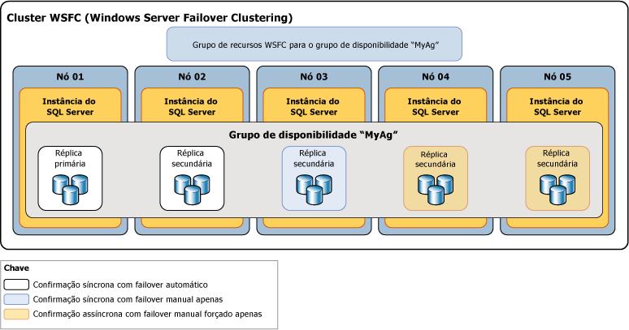

# Diferenças entre os modos de disponibilidade de um Grupo de Disponibilidade AlwaysOn
[!INCLUDE[appliesto-ss-xxxx-xxxx-xxx-md](../../../includes/appliesto-ss-xxxx-xxxx-xxx-md.md)]

  No [!INCLUDE[ssHADR](../../../includes/sshadr-md.md)], o *modo de disponibilidade* é uma propriedade de réplica que determina se uma determinada réplica de disponibilidade pode ser executada em modo de confirmação síncrona. Para cada réplica de disponibilidade, o modo de disponibilidade deve ser configurado para o modo de confirmação síncrona, modo de confirmação assíncrona ou modo somente configuração.  Se a réplica primária for configurada para o *modo de confirmação assíncrona*, ela não aguardará qualquer réplica secundária gravar registros de log de transação de entrada no disco (para *proteger o log*). Se uma determinada réplica secundária for configurada para modo de confirmação assíncrona, a réplica primária não aguardará que essa réplica secundária proteja o log. Se a réplica primária e uma determinada réplica secundária forem ambas configuradas para *modo de confirmação síncrona*, a réplica primária aguardará que a réplica secundária confirme que protegeu o log (a menos que a réplica secundária não execute ping na réplica primária dentro do *período do tempo limite de sessão*dela). 
  

> [!NOTE]  
>  Se período do tempo limite de sessão primário for excedido por uma réplica secundária, a réplica primária deslocará temporariamente em modo de confirmação assíncrona para a réplica secundária. Quando a réplica secundária se reconecta com a réplica primária, elas retomam o modo de confirmação síncrona.  
  
##   Modos de disponibilidade com suporte  
 [!INCLUDE[ssHADR](../../../includes/sshadr-md.md)] é compatível com três modos de disponibilidade: modo de confirmação assíncrona, modo de confirmação síncrona e apenas configuração da seguinte maneira:  
  
-   O*Modo de confirmação assíncrona* é uma solução de recuperação de desastre que funciona bem quando as réplicas de disponibilidade são distribuídas em distâncias consideráveis. Se cada réplica secundária estiver sendo executada no modo de confirmação assíncrona, a réplica primária não esperará que nenhuma réplica secundária proteja o log. Em vez disso, imediatamente após gravar um registro de log no arquivo de log local, a réplica primária enviará a confirmação de transação ao cliente. A réplica primária é executada com latência de transação mínima em relação a uma réplica secundária configurada para o modo de confirmação assíncrona.  Se a réplica primária atual estiver configurada para o modo de disponibilidade de confirmação assíncrona, ela confirmará transações de forma assíncrona para todas as réplicas secundárias, independentemente de suas configurações de modo de disponibilidade individuais.  
  
     Para obter mais informações, consulte [Modo de disponibilidade de confirmação assíncrona](#AsyncCommitAvMode), posteriormente neste tópico.  
  
-   O*Modo de confirmação síncrona* enfatiza a alta disponibilidade sobre o desempenho, à custa do aumento da latência da transação. No modo de confirmação síncrona, as transações aguardam para enviar a confirmação de transação para o cliente até que a réplica secundária proteja o log no disco. Quando sincronização de dados começar em um banco de dados secundário, a réplica secundária começará a aplicar registros de log de entrada do banco de dados primário correspondente. Assim que todo registro de log for protegido, o banco de dados secundário entrará no estado SYNCHRONIZED. Portanto, cada nova transação é protegida pela réplica secundária antes de o registro de log ser gravado no arquivo de log local. Quando todos os bancos de dados secundários de uma determinada réplica secundária são sincronizados, o modo de confirmação síncrona oferece suporte ao failover manual e, opcionalmente, ao failover automático.  
  
     Para obter mais informações, consulte [Modo de disponibilidade de confirmação síncrona](#SyncCommitAvMode), posteriormente neste tópico.  

-   O *modo somente configuração* se aplica a grupos de disponibilidade que não estão em um Cluster de Failover do Windows Server. Uma réplica no modo somente configuração não contém dados do usuário. No modo somente configuração, o banco de dados mestre de réplica armazena metadados de configuração do grupo de disponibilidade. Para obter mais informações, consulte [Grupo de disponibilidade com réplica somente configuração](../../../linux/sql-server-linux-availability-group-ha.md).
  
 A ilustração a seguir mostra um grupo de disponibilidade com cinco réplicas de disponibilidade. A réplica primária e a réplica secundária estão configuradas para modo de confirmação síncrona com failover automático. Outra réplica secundária está configurada para o modo de confirmação síncrona apenas com failover manual planejado e duas réplicas secundárias estão configuradas para o modo de confirmação assíncrona, que dá suporte somente a failover manual forçado (geralmente denominado *failover forçado*).  
  
   
  
 O comportamento de sincronização e de failover entre duas réplicas de disponibilidade depende do modo de disponibilidade de ambas as réplicas. Por exemplo, para que a confirmação síncrona ocorra, a réplica primária atual e a réplica secundária em questão devem ser configuradas para confirmação síncrona. Da mesma forma, para que o failover automático ocorra, ambas as réplicas precisam ser configuradas para failover automático. Portanto, o comportamento do cenário de implantação ilustrado anteriormente pode ser resumido na tabela a seguir, que explora o comportamento com cada réplica primária potencial:  
  
|Réplica Primária Atual|Destinos de failover automático|Comportamento do modo de confirmação síncrona com|Comportamento do modo de confirmação assíncrona com|Failover automático possível|  
|-----------------------------|--------------------------------|--------------------------------------------|---------------------------------------------|---------------------------------|  
|01|02|02 e 03|04|Sim|  
|02|01|01 e 03|04|Sim|  
|03||01 e 02|04|Não|  
|04|||01, 02 e 03|Não|  
  
 Normalmente, o Nó 04 como uma réplica de confirmação assíncrona é implantado em um site de recuperação de desastre. A permanência dos Nós 01, 02 e 03 no modo de confirmação assíncrona depois do failover no Nó 04 impede a degradação de desempenho potencial em seu grupo de disponibilidade devido à alta latência da rede entre os dois sites.  
  
##   Asynchronous-Commit Availability Mode  
 No *modo de confirmação assíncrona*, a réplica secundária nunca é sincronizada com a réplica primária. Embora um determinado banco de dados secundário possa ficar em dia com o banco de dados primário correspondente, qualquer banco de dados secundário pode se atrasar em qualquer ponto. O modo de confirmação assíncrona pode ser útil em um cenário de recuperação de desastre no qual a réplica primária e a réplica secundária estão separadas por uma distância significativa e no qual você não deseja que pequenos erros afetem a réplica primária, ou em situações em que o desempenho é mais importante do que a proteção de dados sincronizada. Além disso, como a réplica primária não espera por confirmações da réplica secundária, os problemas na réplica secundária nunca afetam a réplica primária.  
  
 Uma réplica secundária de confirmação assíncrona tenta acompanhar os registros de log recebidos da réplica primária. Mas bancos de dados secundários de confirmação assíncrona sempre permanecem não sincronizados e têm a tendência de ficarem desatualizados em relação aos bancos de dados primários correspondentes. Normalmente, é pequeno o intervalo entre um banco de dados secundário de confirmação assíncrona e o banco de dados primário correspondente. Mas o intervalo poderá ficar significativo se o servidor que hospeda a réplica secundária estiver sobrecarregado ou se a rede estiver lenta.  
  
 A única forma de failover com suporte no modo de confirmação assíncrona é o failover forçado (com possível perda de dados). Forçar o failover é o último recurso, que deve ser usado apenas em situações nas quais a réplica primária atual permanecerá indisponível por um período estendido e a disponibilidade imediata dos bancos de dados primários é mais crítica que o risco da possível perda de dados. O destino do failover deve ser uma réplica cuja função esteja no estado SECONDARY ou RESOLVING. As transições de destino do failover para a função primária e as cópias dos bancos de dados se tornam o banco de dados primário. Qualquer banco de dados secundário restante, junto com os bancos de dados primários antigos, quando ficam disponíveis, é suspenso manualmente até você os retome individualmente. No modo de confirmação assíncrona, qualquer log de transação que a réplica primária original ainda não tenha enviado para a réplica secundária antiga é perdida. Isso significa que alguns ou todos os novos bancos de dados primários podem estar sem as transações confirmadas recentemente. Para obter mais informações sobre o funcionamento do failover forçado e sobre as melhores práticas para utilizá-lo, consulte [Failover e modos de failover &#40;grupos de disponibilidade AlwaysOn&#41;](../../../database-engine/availability-groups/windows/failover-and-failover-modes-always-on-availability-groups.md).  
  
##   Synchronous-Commit Availability Mode  
 No modo de disponibilidade de confirmação síncrona (*modo de confirmação síncrona*), depois de ingressar em um grupo de disponibilidade, cada banco de dados secundário fica em dia com o banco de dados primário correspondente e entra no estado SYNCHRONIZED. O banco de dados secundário permanece SYNCHRONIZED contanto que a sincronização de dados continue. Isso garante que todas as transações confirmadas em um banco de dados primário determinado também foram confirmadas no banco de dados secundário correspondente. Quando cada banco de dados secundário de uma determinada réplica secundária for sincronizado, o estado de integridade de sincronização da réplica secundária como um todo será HEALTHY.  
  
 **Nesta seção:**  
  
-   [Fatores que interrompem a sincronização de dados](#DisruptSync)  
  
-   [Como a sincronização funciona em uma réplica secundária](#HowSyncWorks)  
  
-   [Modo de confirmação síncrona com failover manual apenas](#SyncCommitWithManual)  
  
-   [Modo de confirmação síncrona com failover automático](#SyncCommitWithAuto)  
  
###   Fatores que interrompem a sincronização de dados  
 Quando todos seus bancos de dados estiverem sincronizados, uma réplica secundária inserirá o estado de HEALTHY. A réplica secundária sincronizada permanecerá íntegra a menos que uma das seguintes condições ocorra:  
  
-   Um atraso de rede ou problema pequeno de computador causa um tempo limite da sessão entre a réplica secundária e réplica primária.  
  
    > [!NOTE]  
    >  Para obter informações sobre a propriedade de tempo da sessão das réplicas de disponibilidade, consulte [Visão geral dos grupos de disponibilidade AlwaysOn &#40;SQL Server&#41;](../../../database-engine/availability-groups/windows/overview-of-always-on-availability-groups-sql-server.md).  
  
-   Você suspende um banco de dados secundário na réplica secundária. A réplica secundária para de ser sincronizada e seu estado da integridade de sincronização é marcado como NOT_HEALTHY. A réplica secundária não pode se tornar íntegra novamente até que o banco de dados secundário suspenso seja retomado e ressincronizado ou removido do grupo de disponibilidade.  
  
-   Você adiciona um banco de dados primário ao grupo de disponibilidade. As réplicas secundárias previamente sincronizadas inserem o estado da integridade de sincronização NOT_HEALTHY. Este estado indica que pelo menos um banco de dados está no estado de sincronização NOT SYNCHRONIZING. Uma réplica secundária não pode ser HEALTHY novamente até que um banco de dados secundário correspondente seja preparado na réplica, tenha ingressado no grupo de disponibilidade e seja sincronizado com o novo banco de dados primário.  
  
-   Você altera a réplica primária ou a réplica secundária para o modo de disponibilidade de confirmação assíncrona. Depois de alterar para o modo de confirmação assíncrona, a réplica secundária permanecerá no estado de integridade de sincronização HEALTHY contanto que a sincronização de dados continue. No entanto, se somente a réplica primária for alterada para o modo de confirmação assíncrona, a réplica secundária de confirmação síncrona inserirá o estado da integridade de sincronização PARTIALLY_HEALTHY. Este estado indica que pelo menos um banco de dados está no estado de sincronização SYNCHRONIZING, mas nenhum dos bancos de dados está no estado NOT SYNCHRONIZING.  
  
-   Você altere qualquer réplica secundária para o modo de disponibilidade de confirmação síncrona. Isso faz a réplica secundária ser marcada no estado de integridade de sincronização PARTIALLY_HEALTHY. até que todos os seus bancos de dados estejam no estado de sincronização SYNCHRONIZED.  
  
> [!TIP]  
>  Para exibir a integridade de sincronização de um grupo de disponibilidade, réplica de disponibilidade ou banco de dados de disponibilidade, consulte a coluna **synchronization_health** ou **synchronization_health_desc** de [sys.dm_hadr_availability_group_states](../../../relational-databases/system-dynamic-management-views/sys-dm-hadr-availability-group-states-transact-sql.md), [sys.dm_hadr_availability_replica_states](../../../relational-databases/system-dynamic-management-views/sys-dm-hadr-availability-replica-states-transact-sql.md)ou [sys.dm_hadr_database_replica_states](../../../relational-databases/system-dynamic-management-views/sys-dm-hadr-database-replica-states-transact-sql.md), respectivamente.  
  
###   Como a sincronização funciona em uma réplica secundária  
 No modo de confirmação síncrona, depois que uma réplica secundária ingressa no grupo de disponibilidade e estabelece uma sessão com a réplica primária, a réplica secundária grava os registros de log de entrada no disco (*protege o log*) e envia uma mensagem de confirmação à réplica primária. Quando o log protegido no banco de dados secundário tiver alcançado o final do log no banco de dados primário, o estado do banco de dados secundário será definido como SYNCHRONIZED. O tempo necessário para a sincronização depende essencialmente do nível de atraso do banco de dados secundário em relação ao banco de dados primário no início da sessão (medido pelo número de registros de log inicialmente recebido da réplica primária), da carga de trabalho no banco de dados primário e da velocidade do computador da instância de servidor que hospeda a réplica secundária.  
  
 A operação síncrona é mantida da seguinte maneira:  
  
1.  Durante o recebimento de uma transação de um cliente, a réplica primária grava o log da transação no log de transações e ao mesmo tempo envia o registro de log para as réplicas secundárias.  
  
2.  Quando um registro de log é gravado no log de transação do banco de dados primário, a transação pode ser desfeita somente se houver um failover neste momento para um secundário que não recebeu o log. A réplica primária aguarda confirmação da réplica secundária de confirmação síncrona.  
  
3.  A réplica secundária protege o log e retorna uma confirmação à réplica primária.  
  
4.  Durante o recebimento da confirmação da réplica secundária, a réplica primária terminará o processamento da confirmação e enviará uma mensagem de confirmação ao cliente.  
  
    > [!NOTE]  
    >  Se uma réplica secundária de confirmação síncrona atingir o tempo limite sem confirmar que protegeu o log, a réplica primária marcará essa réplica secundária como com falha. O estado conectado da réplica secundária é alterado para DISCONNECTED e a réplica primária deixa de esperar por confirmação da réplica secundária. Este comportamento assegura que uma réplica secundária de confirmação síncrona com falha não impeça a proteção do log de transação na réplica primária.  
  
 O modo de confirmação síncrona protege seus dados exigindo a sincronização dos dados entre dois locais, às custas de algum aumento da latência da transação.  
  
###  Modo de confirmação síncrona com failover manual apenas  
 Quando essas réplicas forem conectadas e o banco de dados for sincronizado, haverá suporte ao failover manual. Se a réplica secundária for desativada, a réplica primária não será afetada. A réplica primária será executada exposta se não houver nenhuma réplica SYNCHRONIZED (ou seja, sem enviar dados a nenhuma réplica secundária). Se a réplica primária for perdida, as réplicas secundárias entrarão no estado RESOLVING, mas o proprietário do banco de dados poderá forçar um failover na réplica secundária (com possível perda de dados). Para obter mais informações, consulte [Failover e modos de failover &#40;grupos de disponibilidade AlwaysOn&#41;](../../../database-engine/availability-groups/windows/failover-and-failover-modes-always-on-availability-groups.md).  
  
###   Modo de confirmação síncrona com failover automático  
 O failover automático fornece alta disponibilidade, assegurando que o banco de dados seja rapidamente disponibilizado novamente após a perda da réplica primária. Para configurar um grupo de disponibilidade para failover automático, você precisará definir a réplica primária atual e pelo menos uma secundária para o modo de confirmação síncrona com failover automático. Você pode ter até três réplicas de failover automático.  
  
 Além disso, para que um failover automático seja possível em um determinado momento, esta réplica secundária deverá ser sincronizada com a réplica primária (quer dizer, os bancos de dados secundários são todos sincronizados) e o cluster WSFC (Windows Server Failover Clustering) deverá ter quorum. Se a réplica primária ficar indisponível nessas condições, ocorrerá um failover automático. A réplica secundária alterna para a função da réplica primária e oferece seu banco de dados como banco de dados primário. Para obter mais informações, consulte a seção "Failover automático" do tópico [Failover e modos de failover &#40;grupos de disponibilidade AlwaysOn&#41;](../../../database-engine/availability-groups/windows/failover-and-failover-modes-always-on-availability-groups.md).  
  
> [!NOTE]  
>  Para obter informações sobre o quórum WSFC e [!INCLUDE[ssHADR](../../../includes/sshadr-md.md)], consulte [Configuração de modos de quórum WSFC e votação &#40;SQL Server&#41;](../../../sql-server/failover-clusters/windows/wsfc-quorum-modes-and-voting-configuration-sql-server.md).  

### Latência de dados na réplica secundária
A implementação do acesso somente leitura a réplicas secundárias será útil se as suas cargas de trabalho somente leitura puderem tolerar certa latência de dados. Nas situações em que a latência de dados é inaceitável, considere executar cargas de trabalho somente leitura na réplica primária.

A réplica primária envia registros de log de alterações no banco de dados primário para as réplicas secundárias. Em cada banco de dados secundário, um thread de restauração dedicado aplica os registros de log. Em um banco de dados secundário de acesso de leitura, uma determinada alteração de dados não aparece nos resultados da consulta até que o registro de log que contém a alteração seja aplicado ao banco de dados secundário e a transação seja confirmada no banco de dados primário.+

Isso significa que há alguma latência, normalmente apenas uma questão de segundos, entre as réplicas primárias e secundárias. No entanto, em casos incomuns, como quando problemas de rede reduzem a taxa de transferência, a latência pode se tornar significativa. A latência aumenta quando ocorrem gargalos de E/S e quando a movimentação de dados é suspensa. Para monitorar a movimentação de dados suspensa, você pode usar o [Painel Always On](../../../database-engine/availability-groups/windows/use-the-always-on-dashboard-sql-server-management-studio.md) ou a exibição de gerenciamento dinâmico [sys.dm_hadr_database_replica_states](../../../relational-databases/system-dynamic-management-views/sys-dm-hadr-database-replica-states-transact-sql.md).

Para obter mais informações sobre como investigar a latência de restauração na réplica secundária, veja [Solucionar problemas de alterações primárias não refletidas na réplica secundária](../../../database-engine/availability-groups/windows/troubleshoot-primary-changes-not-reflected-on-secondary.md).
  
##   Tarefas relacionadas  
 **Para alterar o modo de disponibilidade e o modo de failover**  
  
-   [Alterar o modo de disponibilidade de uma réplica de disponibilidade &#40;SQL Server&#41;](../../../database-engine/availability-groups/windows/change-the-availability-mode-of-an-availability-replica-sql-server.md)  
  
-   [Alterar o modo de failover de uma réplica de disponibilidade &#40;SQL Server&#41;](../../../database-engine/availability-groups/windows/change-the-failover-mode-of-an-availability-replica-sql-server.md)  
  
 **Para ajustar votos de quorum**  
  
-   [Exibir configurações de NodeWeight de quorum do cluster](../../../sql-server/failover-clusters/windows/view-cluster-quorum-nodeweight-settings.md)  
  
-   [Definir configurações de NodeWeight de quorum do cluster](../../../sql-server/failover-clusters/windows/configure-cluster-quorum-nodeweight-settings.md)  
  
-   [Forçar um cluster WSFC para iniciar sem um quorum](../../../sql-server/failover-clusters/windows/force-a-wsfc-cluster-to-start-without-a-quorum.md)  
  
 **Para executar um failover manual**  
  
-   [Executar um failover manual planejado de um grupo de disponibilidade &#40;SQL Server&#41;](../../../database-engine/availability-groups/windows/perform-a-planned-manual-failover-of-an-availability-group-sql-server.md)  
  
-   [Executar um failover manual forçado de um grupo de disponibilidade &#40;SQL Server&#41;](../../../database-engine/availability-groups/windows/perform-a-forced-manual-failover-of-an-availability-group-sql-server.md)  
  
-   [Usar o Assistente de Grupo de Disponibilidade de Failover &#40;SQL Server Management Studio&#41;](../../../database-engine/availability-groups/windows/use-the-fail-over-availability-group-wizard-sql-server-management-studio.md)  
  
 **Para exibir um grupo de disponibilidade, réplica de disponibilidade e estados de bancos de dados.**  
  
-   [sys.dm_hadr_availability_group_states &#40;Transact-SQL&#41;](../../../relational-databases/system-dynamic-management-views/sys-dm-hadr-availability-group-states-transact-sql.md)  
  
-   [sys.dm_hadr_availability_replica_states &#40;Transact-SQL&#41;](../../../relational-databases/system-dynamic-management-views/sys-dm-hadr-availability-replica-states-transact-sql.md)  
  
-   [sys.dm_hadr_database_replica_states &#40;Transact-SQL&#41;](../../../relational-databases/system-dynamic-management-views/sys-dm-hadr-database-replica-states-transact-sql.md)  
  
##   Conteúdo relacionado  
  
-   [Guia de soluções AlwaysOn do Microsoft SQL Server para alta disponibilidade e recuperação de desastre](https://go.microsoft.com/fwlink/?LinkId=227600)  
  
-   [Blog da equipe do AlwaysOn do SQL Server: o blog oficial da equipe do AlwaysOn do SQL Server](https://blogs.msdn.microsoft.com/sqlalwayson/)  
  
## Consulte Também  
 [Visão geral dos grupos de disponibilidade AlwaysOn &#40;SQL Server&#41;](../../../database-engine/availability-groups/windows/overview-of-always-on-availability-groups-sql-server.md)   
 [Failover e modos de failover &#40;Grupos de Disponibilidade AlwaysOn&#41;](../../../database-engine/availability-groups/windows/failover-and-failover-modes-always-on-availability-groups.md)   
 [WSFC &#40;Windows Server Failover Clustering&#41; com o SQL Server](../../../sql-server/failover-clusters/windows/windows-server-failover-clustering-wsfc-with-sql-server.md)  
  
  
