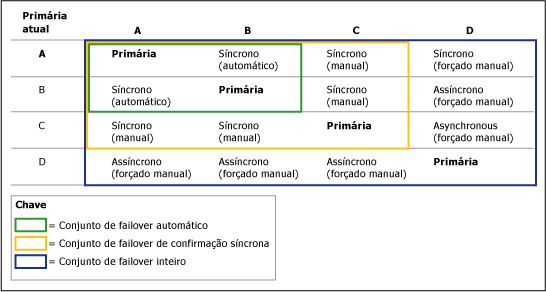
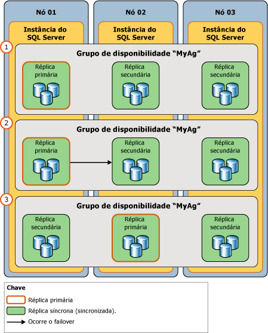

# Failover e modos de failover (Grupos de Disponibilidade AlwaysOn)
[!INCLUDE[appliesto-ss-xxxx-xxxx-xxx-md](../../../includes/appliesto-ss-xxxx-xxxx-xxx-md.md)]

  Dentro do contexto de um grupo de disponibilidade, as funções primária e secundária das réplicas de disponibilidade, normalmente, são intercambiáveis em um processo conhecido como *failover*. Existem três formas de failover: failover automático (sem perda de dados), failover manual planejado (sem perda de dados) e failover manual forçado (com possível perda de dados), geralmente chamado de *failover forçado*. Os failovers automáticos e manuais planejados preservam todos os seus dados. Um grupo de disponibilidade faz failover no nível da réplica de disponibilidade. Ou seja, um grupo de disponibilidade realiza failover em uma de suas réplicas secundárias (o *destino de failover*atual).  
  
> [!NOTE]  
>  Problemas no nível do banco de dados, como um banco de dados que se torna suspeito devido à perda de um arquivo de dados, à exclusão de um banco de dados ou à corrupção de um log de transações não causam o failover do grupo de disponibilidade.  
  
 Durante o failover, o destino de failover assume a função primária, recupera seus bancos de dados e os coloca online como os novos bancos de dados primários. A réplica primária anterior, quando disponível, alterna para a função secundária, e seus bancos de dados se tornam bancos de dados secundários. Potencialmente, essas funções podem ser alternadas (ou usar um destino de failover diferente) como resposta a várias falhas ou por razões administrativas.  
  
 Os formulários de failover aos quais uma determinada réplica de disponibilidade dá suporte são especificados pela propriedade *modo de failover* . Para uma determinada réplica de disponibilidade, os possíveis modos de failover dependem do [modo de disponibilidade](../../../database-engine/availability-groups/windows/availability-modes-always-on-availability-groups.md) da réplica, da seguinte maneira:  
  
-   **Réplicas de confirmação síncrona** dão suporte a duas configurações: automática ou manual. A configuração "automática" dá suporte a failover automático e failover manual. Para evitar a perda de dados, os failovers automático e planejado requerem que o destino de failover seja uma réplica secundária de confirmação síncrona com um estado de sincronização íntegro (isso indica que cada banco de dados secundário no destino de failover é sincronizado com seu banco de dados primário correspondente). Sempre que uma réplica secundária não atender a essas duas condições, ela dará suporte somente ao failover forçado. Observe que o failover forçado também dá suporte a réplicas cujo estado da função é RESOLVING.  
  
-   **Réplicas de confirmação assíncrona** dão suporte somente ao modo de failover manual. Além disso, como elas nunca são sincronizadas, dão suporte apenas ao failover forçado.  
  
> [!NOTE]  
>  Depois de um failover, os aplicativos cliente que precisam acessar os bancos de dados primários devem conectar-se com a nova réplica primária. Além disso, se a nova réplica secundária estiver configurada para permitir acesso somente leitura, os aplicativos cliente somente leitura poderão conectar-se a ela. Para obter informações sobre como clientes conectam a um grupo de disponibilidade, veja [Ouvintes do grupo de disponibilidade, conectividade de cliente e failover de aplicativos &#40;SQL Server&#41;](../../../database-engine/availability-groups/windows/listeners-client-connectivity-application-failover.md).  
  
 **Seções deste tópico:**  
  
-   [Termos e definições](#TermsAndDefinitions)  
  
-   [Visão geral de failover](#Overview)  
  
-   [Failover automático](#AutomaticFailover)  
  
-   [Failover manual planejado (sem perda de dados)](#ManualFailover)  
  
-   [Failover forçado (com possível perda de dados)](#ForcedFailover)  
  
-   [Tarefas relacionadas](#RelatedTasks)  
  
-   [Conteúdo relacionado](#RelatedContent)  
  
##   Termos e definições  
 failover automático  
 Um failover que ocorre automaticamente na perda da réplica primária. Há suporte para o failover automático apenas quando a réplica primária atual e uma réplica secundária estão configuradas como modo de failover definido como AUTOMATIC e a réplica secundária está sincronizada no momento.  Se o modo de failover da réplica primária ou secundária for MANUAL, o failover automático não poderá ocorrer.  
  
 Failover manual planejado (sem perda de dados)  
 O failover manual planejado, ou *failover manual*, é um failover iniciado por um administrador de banco de dados, em geral para fins administrativos. Um failover manual planejado tem suporte apenas se a réplica primária e a réplica secundária estiverem configuradas para modo de confirmação síncrona, e a réplica secundária estiver sincronizada atualmente (no modo SYNCHRONIZED). Quando a réplica secundária de destino está sincronizada, o failover manual (sem perda de dados) será possível até mesmo se a réplica primária tiver falhado, pois os bancos de dados secundários estão prontos para o failover. Um administrador de banco de dados inicia um failover manual manualmente.  
  
 Failover forçado (com possível perda de dados)  
 Um failover que pode ser iniciado por um administrador de banco de dados quando nenhuma réplica secundária é SYNCHRONIZED com a réplica primária ou a réplica primária não está em execução e nenhuma réplica secundária está pronta para failover. O failover forçado leva a um risco de perda de dados e é recomendável estritamente para a recuperação de desastres. O failover forçado também é conhecido como failover manual forçado porque ele só pode ser iniciado manualmente. Este é o único formulário de failover com suporte em modo de disponibilidade da confirmação assíncrona.  
  
 [!INCLUDE[ssFosAutoC](../../../includes/ssfosautoc-md.md)]  
 Em um grupo de disponibilidade específico, existe apenas um par de réplicas de disponibilidade (inclusive a réplica primária atual) que está configurado para o modo de confirmação síncrona com failover automático, se houver. Um[!INCLUDE[ssFosAuto](../../../includes/ssfosauto-md.md)]terá efeito apenas se a réplica secundária estiver SYNCHRONIZED no momento com a réplica primária.  
  
 [!INCLUDE[ssFosSyncC](../../../includes/ssfossyncc-md.md)]  
 Em um grupo de disponibilidade específico, um conjunto de duas ou três réplicas de disponibilidade (inclusive a réplica primária atual) que estão configuradas para o modo de confirmação síncrona, se houver. Um [!INCLUDE[ssFosSync](../../../includes/ssfossync-md.md)]terá efeito apenas se as réplicas secundárias estiverem configuradas para modo de failover manual e pelo menos uma réplica secundária estiver SYNCHRONIZED no momento com a réplica primária.  
  
 [!INCLUDE[ssFosEntireC](../../../includes/ssfosentirec-md.md)]  
 Dentro de um determinado grupo de disponibilidade, o conjunto de todas as réplicas de disponibilidade cujo estado operacional é ONLINE no momento, independentemente do modo de disponibilidade e do modo de failover. O [!INCLUDE[ssFosEntire](../../../includes/ssfosentire-md.md)]se tornará relevante quando nenhuma réplica secundária estiver SYNCHRONIZED no momento com a réplica primária.  
  
##   Visão geral de failover  
 A tabela a seguir resume os formulários de failover com suporte sob diferentes modos de disponibilidade e failover. Para cada emparelhamento, o modo de disponibilidade efetiva e o modo de failover são determinados pela interseção dos modos de réplica primária mais os modos de uma ou mais réplicas secundárias.  
  
||Modo de confirmação assíncrona|Modo de confirmação síncrona com modo de failover manual|Modo de confirmação síncrona com modo de failover automático|  
|-|-------------------------------|---------------------------------------------------------|------------------------------------------------------------|  
|failover automático|não|não|Sim|  
|Failover manual planejado|não|Sim|Sim|  
|failover forçado|Sim|Sim|Sim**\***|  
  
 **\*** Se você emitir um comando de failover forçado em uma réplica secundária sincronizada, a réplica secundária se comportará da mesma forma que um failover manual.  
  
 A quantidade de tempo durante o qual o banco de dados fica indisponível durante um failover depende do tipo de failover e de sua causa.  
  
> [!IMPORTANT]  
>  Para dar suporte a conexões de cliente depois de um failover, com exceção de bancos de dados independentes, os logons e os trabalhos definidos em quaisquer dos bancos de dados primários antigos devem ser recriados manualmente no novo banco de dados primário. Para obter mais informações, consulte [Gerenciamento de logons e trabalhos para os bancos de dados de um grupo de disponibilidade &#40;SQL Server&#41;](../../../database-engine/availability-groups/windows/logins-and-jobs-for-availability-group-databases.md).  
  
### Conjuntos de failover  
 As formas de failover possíveis para um determinado grupo de disponibilidade podem ser compreendidas em termos de conjuntos de failover. Um conjunto de failover consiste na réplica primária e nas réplicas secundárias que oferecem suporte a uma determinada forma de failover, da seguinte maneira:  
  
-   **[!INCLUDE[ssFosAutoC](../../../includes/ssfosautoc-md.md)] (opcional):**  em um grupo de disponibilidade específico, existe um par de réplicas de disponibilidade (inclusive a réplica primária atual) configurado para o modo de confirmação síncrona com failover automático, se houver. Um conjunto de failover automático terá efeito apenas se a réplica secundária estiver SYNCHRONIZED no momento com a réplica primária.  
  
-   **[!INCLUDE[ssFosSyncC](../../../includes/ssfossyncc-md.md)] (opcional):**  em um grupo de disponibilidade específico, um conjunto de duas ou três réplicas de disponibilidade (inclusive a réplica primária atual) configurado para o modo de confirmação síncrona, se houver. Um conjunto de failover de confirmação síncrona terá efeito se as réplicas secundárias estiverem configuradas para o modo de failover manual e pelo menos uma réplica secundária estiver SYNCHRONIZED no momento com a réplica primária.  
  
-   **[!INCLUDE[ssFosEntireC](../../../includes/ssfosentirec-md.md)] :**  dentro de um determinado grupo de disponibilidade, o conjunto de todas as réplicas de disponibilidade cujo estado operacional é ONLINE no momento, independentemente do modo de disponibilidade e do modo de failover. O conjunto de failover inteiro se tornará relevante quando nenhuma réplica secundária estiver SYNCHRONIZED no momento com a réplica primária.  
  
 Quando você configura uma réplica de disponibilidade como confirmação síncrona com failover automático, a réplica de disponibilidade se torna parte do [!INCLUDE[ssFosAuto](../../../includes/ssfosauto-md.md)]. Porém, se a definição entra em vigor ou não depende da primária atual. Os formulários de failover que são realmente possíveis em um determinado momento dependem de quais conjuntos de failover estão em vigor atualmente.  
  
 Por exemplo, considere um grupo de disponibilidade que tem quatro réplicas de disponibilidade, da seguinte maneira:  
  
|Réplica|Modo de disponibilidade e configurações de modo de failover|  
|-------------|--------------------------------------------------|  
|Um|Modo de confirmação síncrona com failover automático|  
|B|Modo de confirmação síncrona com failover automático|  
|C|Confirmação síncrona apenas com failover manual planejado|  
|D|Confirmação assíncrona (apenas com failover forçado)|  
  
 O comportamento do failover para cada réplica secundária depende de qual réplica de disponibilidade é a réplica primária no momento. Basicamente, para uma determinada réplica secundária, o comportamento de failover é o pior caso dependendo da réplica primária atual. A figura a seguir ilustra como o comportamento de failover de réplicas secundárias varia de acordo com a réplica primária atual, e se ela está configurada para o modo de confirmação assíncrona (apenas com failover forçado) ou modo de confirmação síncrona (com ou sem failover automático).  
  
   
  
##   Automatic Failover  
 Um failover automático faz com que uma réplica secundária qualificada faça a transição automática para a função primária depois que a réplica primária se torna indisponível. O failover automático é mais adequado quando o nó WSFC que hospeda a réplica primária é local em relação ao nó que hospeda a réplica secundária. Isso ocorre porque a sincronização de dados funciona melhor com baixa latência de mensagem entre computadores e porque as conexões cliente podem permanecer locais.  
  
 **Nesta seção:**  
  
-   [Condições exigidas para um failover automático](#RequiredConditions)  
  
-   [Como o failover automático funciona](#HowAutoFoWorks)  
  
-   [Para habilitar o failover automático](#EnableAutoFo)  
  
###   Condições exigidas para um failover automático  
 O failover automático ocorre apenas sob as seguintes condições:  
  
-   Um conjunto de failover automático existe. Este conjunto consiste em uma réplica primária e uma réplica secundária (o *destino do failover automático*) que estão configuradas para modo de confirmação síncrona e ambas estão definidas como failover AUTOMATIC. Se a réplica primária estiver definida como failover MANUAL, o failover automático não poderá ocorrer, mesmo que uma réplica secundária esteja definida como failover AUTOMATIC.  
  
     Para obter mais informações, consulte [Modos de disponibilidade &#40;Grupos de disponibilidade AlwaysOn&#41;](../../../database-engine/availability-groups/windows/availability-modes-always-on-availability-groups.md).  
  
-   O destino do failover automático tem um estado de sincronização íntegro (isto indica que todo banco de dados secundário no destino de failover é sincronizado com seu banco de dados primário correspondente).  
  
    > [!TIP]  
    >  Os Grupos de Disponibilidade AlwaysOn monitoram a integridade das duas réplicas em um conjunto de failover automático. Se alguma réplica falhar, o estado de integridade do grupo de disponibilidade será definido como CRITICAL. Se a réplica secundária falhar, o failover automático não será possível porque o destino de failover automático não estará disponível. Se a réplica primária falhar, o grupo de disponibilidade realizará failover para a réplica secundária. Até que a réplica primária antiga fique online, nenhum destino de failover automático existirá. Em qualquer caso, para garantir a disponibilidade no caso improvável de uma falha sequencial, recomendamos que você configure uma réplica secundária diferente como o destino de failover automático.  
    >   
    >  Para obter mais informações, consulte [Usar as políticas AlwaysOn para exibir a integridade de um Grupo de Disponibilidade &#40;SQL Server&#41;](../../../database-engine/availability-groups/windows/use-always-on-policies-to-view-the-health-of-an-availability-group-sql-server.md) e [Alterar o modo de failover de uma réplica de disponibilidade &#40;SQL Server&#41;](../../../database-engine/availability-groups/windows/change-the-failover-mode-of-an-availability-replica-sql-server.md).  
  
-   O cluster do WSFC (Windows Server Failover Clustering) tem quorum. Para obter mais informações, veja [Configuração de modos de quorum WSFC e votação &#40;SQL Server&#41;](../../../sql-server/failover-clusters/windows/wsfc-quorum-modes-and-voting-configuration-sql-server.md).  
  
-   A réplica primária se tornou indisponível, e os níveis da condição de failover definidos por sua política de failover flexível foram atendidos. Para obter informações sobre os níveis de condição de failover, consulte [Política de failover flexível para failover automático de um grupo de disponibilidade &#40;SQL Server&#41;](../../../database-engine/availability-groups/windows/flexible-automatic-failover-policy-availability-group.md).  
  
###   Como o failover automático funciona  
 Um failover automático inicia a seguinte sequência de ações:  
  
1.  Se a instância do servidor que está hospedando a réplica primária atual ainda estiver em execução, ela alterará o estado dos bancos de dados primários para DISCONNECTED e desconectará todos os clientes.  
  
2.  Se qualquer registro de log estiver esperando em filas de recuperação na réplica secundária de destino, a réplica secundária aplicará os registros de log restantes para concluir o roll forward dos bancos de dados secundários.  
  
    > [!NOTE]  
    >  A quantidade de tempo exigida para aplicar o log a um determinado banco de dados depende da velocidade do sistema, da carga de trabalho recente e da quantidade de log na fila de recuperação.  
  
3.  A réplica secundária antiga faz a transição para a função primária. Seus bancos de dados se tornam os bancos de dados primários. A nova réplica primária reverte todas as transações não confirmadas (a fase desfazer da recuperação) o mais rapidamente possível. Bloqueios isolam essas transações não confirmadas permitindo que a reversão ocorra em segundo plano enquanto os clientes usam o banco de dados. Esse processo não reverte nenhuma transação confirmada.  
  
     Até um determinado banco de dados secundário ser conectado, ele é marcado rapidamente como NOT_SYNCHRONIZED. Antes do início da recuperação da reversão, os bancos de dados secundários podem se conectar aos novos bancos de dados primários e fazer a transição rápida para o estado SYNCHRONIZED. O melhor caso geralmente é aquele em que uma terceira réplica de confirmação síncrona permanece na função secundária após o failover.  
  
4.  Posteriormente, quando a instância de servidor que está hospedando a réplica primária antiga é reiniciada, ela reconhece que outra réplica de disponibilidade possui a função primária agora. A réplica primária antiga faz a transição para a função secundária e seus bancos de dados se tornam bancos de dados secundários. A nova réplica secundária conecta-se à réplica primária atual e atualiza seu banco de dados com os bancos de dados primários atuais o mais rapidamente possível. Assim que a nova réplica secundária tiver sincronizado seus bancos de dados novamente, o failover será possível, na direção reversa.  
  
###   Para configurar o failover automático  
 Uma réplica de disponibilidade pode ser configurada para dar suporte a failover automático a qualquer momento.  
  
 **To configure automatic failover**  
  
1.  Verifique se a réplica secundária está configurada para usar o modo de disponibilidade de confirmação síncrona. Para obter mais informações, consulte [Alterar o modo de disponibilidade de uma réplica de disponibilidade &#40;SQL Server&#41;](../../../database-engine/availability-groups/windows/change-the-availability-mode-of-an-availability-replica-sql-server.md).  
  
2.  Defina o modo do failover como automático. Para obter mais informações, consulte [Alterar o modo de failover de uma réplica de disponibilidade &#40;SQL Server&#41;](../../../database-engine/availability-groups/windows/change-the-failover-mode-of-an-availability-replica-sql-server.md).  
  
3.  Opcionalmente, altere a política de failover flexível do grupo de disponibilidade para especificar as classificações de falhas que podem causar um failover automático. Para obter mais informações, consulte [Configurar a política de failover flexível para controlar condições de failover automático &#40;Grupos de disponibilidade AlwaysOn&#41;](../../../database-engine/availability-groups/windows/configure-flexible-automatic-failover-policy.md) e [Política de failover para instâncias de cluster de failover](../../../sql-server/failover-clusters/windows/failover-policy-for-failover-cluster-instances.md).  
  
##   Failover manual planejado (sem perda de dados)  
 Um failover manual faz com que uma réplica secundária sincronizada faça a transição para a função primária depois que um administrador de banco de dados emite um comando de failover manual na instância do servidor que hospeda a réplica secundária de destino. Para dar suporte ao failover manual, a réplica secundária e a réplica primária atual devem ser configuradas para o modo de confirmação síncrona, se houver. Todo banco de dados secundário na réplica de disponibilidade deve ser unido ao grupo de disponibilidade e sincronizado com seu banco de dados primário correspondente (ou seja, a réplica secundária deve ser sincronizada). Isso garante que todas as transações confirmadas em um banco de dados primário antigo também foram confirmadas no novo banco de dados primário. Portanto, os novos bancos de dados primários são idênticos aos bancos de dados primários antigos.  
  
 A figura a seguir ilustra os estágios de um failover planejado:  
  
1.  Antes do failover, a réplica primária é hospedada pela instância de servidor em `Node01`.  
  
2.  Um administrador de banco de dados inicia um failover planejado. O destino de failover é a réplica de disponibilidade hospedada pela instância de servidor em `Node02`.  
  
3.  O destino de failover (em `Node02`) se torna a nova réplica primária. Como esse é um failover planejado, a réplica primária anterior alterna para a função secundária durante o failover e coloca seus bancos de dados online como bancos de dados secundários imediatamente.  
  
   
  
 **Nesta seção:**  
  
-   [Condições exigidas para um failover manual](#ManualFailoverConditions)  
  
-   [Como o failover manual funciona](#ManualFailoverHowWorks)  
  
-   [Mantendo a disponibilidade durante as atualizações](#ManualFailoverDuringUpgrades)  
  
###   Condições exigidas para um failover manual  
 Para dar suporte a um failover manual, a réplica primária atual deve ser definida como modo de confirmação síncrona e uma réplica secundária deve ser:  
  
-   configurada para o modo de confirmação síncrona.  
  
-   Sincronizada atualmente com a réplica primária.  
  
 Para fazer failover manual de um grupo de disponibilidade, você deve estar conectado à réplica secundária que está para se tornar a nova réplica primária.  
  
###   Como o failover manual planejado funciona  
 O failover manual planejado, que deve ser iniciado na réplica secundária de destino, inicia a seguinte sequência de ações:  
  
1.  Para garantir que nenhuma nova transação de usuário ocorra nos bancos de dados primários originais, o cluster do WSFC envia uma solicitação à réplica primária para tornar-se offline.  
  
2.  Se algum log estiver esperando na fila de recuperação de qualquer banco de dados secundário, a réplica secundária concluirá o roll forward daquele banco de dados secundário. A quantidade de tempo necessária depende da velocidade do sistema, da carga de trabalho recente e da quantidade de log na fila de recuperação. Para saber o tamanho atual da fila de recuperação, use o contador de desempenho **Recovery Queue** . Para obter mais informações, consulte [SQL Server, Réplica de Banco de Dados](../../../relational-databases/performance-monitor/sql-server-database-replica.md).  
  
    > [!NOTE]  
    >  O tempo do failover pode ser controlado por meio da limitação do tamanho da fila de recuperação. Porém, isso pode fazer com que a réplica primária se torne mais lenta para permitir que a réplica secundária acompanhe.  
  
3.  A réplica secundária se torna a nova réplica primária, e a réplica secundária antiga se torna a nova réplica secundária.  
  
4.  A nova réplica primária reverte todas as transações não confirmadas e coloca seus bancos de dados online como os bancos de dados primários. Todos os bancos de dados secundários são marcados brevemente como NOT SYNCHRONIZED até que se conectem e se sincronizem novamente com os novos bancos de dados primários. Esse processo não reverte nenhuma transação confirmada.  
  
5.  Quando a réplica primária antiga volta a ficar online, ela assume a função secundária, e o banco de dados primário antigo se torna o banco de dados secundário. A nova réplica secundária ressincroniza rapidamente os novos bancos de dados secundários com os bancos de dados primários correspondentes.  
  
    > [!NOTE]  
    >  Assim que a nova réplica secundária tiver sincronizado os bancos de dados novamente, o failover será possível, mas na direção reversa.  
  
 Após o failover, os clientes devem se reconectar ao banco de dados primário atual. Para obter mais informações, consulte [Ouvintes do grupo de disponibilidade, conectividade de cliente e failover de aplicativo &#40;SQL Server&#41;](../../../database-engine/availability-groups/windows/listeners-client-connectivity-application-failover.md).  
  
###   Mantendo a disponibilidade durante as atualizações  
 O administrador de banco de dados de seus grupos de disponibilidade pode usar failovers manuais para manter a disponibilidade dos bancos de dados quando você atualizar hardware ou software. Para usar um grupo de disponibilidade para atualizações de software, a instância do servidor e/ou o nó do computador que hospeda a réplica secundária de destino já deverá ter recebido as atualizações. Para obter mais informações, consulte [Atualizar instâncias de réplica do Grupo de Disponibilidade AlwaysOn](../../../database-engine/availability-groups/windows/upgrading-always-on-availability-group-replica-instances.md).  
  
##   Failover forçado (com possível perda de dados)  
 O failover forçado de um grupo de disponibilidade (com possível perda de dados) é um método de recuperação de desastres que permite usar uma réplica secundária como um servidor em espera passiva. Como o failover forçado gera riscos de possível perda de dados, esse recurso deve ser usado com cautela e moderação. É recomendável forçar o failover apenas se você precisar restaurar serviço para seus bancos de dados de disponibilidade imediatamente e estiver disposto a perder dados. Para obter mais informações sobre os pré-requisitos e as recomendações para forçar failover e para obter um cenário de exemplo que usa um failover forçado para se recuperar de uma falha catastrófica, consulte [Executar um failover manual forçado de um grupo de disponibilidade &#40;SQL Server&#41;](../../../database-engine/availability-groups/windows/perform-a-forced-manual-failover-of-an-availability-group-sql-server.md).  
  
> [!WARNING]  
>  O failover forçado requer que o cluster WSFC tenha quorum. Para obter informações sobre como configurar e forçar o quorum, consulte [WSFC &#40;Windows Server Failover Clustering&#41; com o SQL Server](../../../sql-server/failover-clusters/windows/windows-server-failover-clustering-wsfc-with-sql-server.md).  
  
 **Nesta seção:**  
  
-   [Como o failover forçado funciona](#ForcedFailoverHowWorks)  
  
-   [Riscos de forçar o failover](#ForcedFailoverRisks)  
  
-   [Por que o failover forçado é necessário após um quorum forçado](#WhyFFoPostForcedQuorum)  
  
-   [Controlando a potencial perda de dados](#TrackPotentialDataLoss)  
  
-   [Gerenciando a perda potencial de dados](#ForcedFailoverManagingDataLoss)  
  
###   Como o failover forçado funciona  
 Um failover forçado inicia uma transição da função primária para uma réplica de destino cujo estado da função é SECONDARY ou RESOLVING. O destino do failover se torna a nova réplica primária e logo oferece suas cópias dos bancos de dados para clientes. Quando a réplica primária antiga se tornar disponível, ela fará a transição para a função secundária e seus bancos de dados se tornarão bancos de dados secundários.  
  
 Todos os bancos de dados secundários (inclusive os bancos de dados primários antigos, quando ficam disponíveis) são SUSPENDED. Dependendo do estado de sincronização de dados anterior de um banco de dados secundário suspenso, ele poderá ser adequado para salvar dados confirmados ausentes para esse banco de dados primário. Em uma réplica secundária configurada para acesso somente leitura, você pode consultar os bancos de dados secundários para descobrir manualmente dados ausentes. Em seguida, você pode emitir instruções [!INCLUDE[tsql](../../../includes/tsql-md.md)] para fazer as alterações necessárias nos novos bancos de dados primários.  
  
###   Riscos de forçar o failover  
 É essencial compreender que forçar o failover pode provocar perda de dados. É possível que haja perda de dados porque a réplica de destino não pode se comunicar com a réplica primária e, portanto, não pode garantir que os bancos de dados estejam sincronizados. O forçamento do failover inicia uma bifurcação de recuperação. Como os bancos de dados primários originais e os bancos de dados secundários estão em bifurcações de recuperação diferentes, cada banco de dados agora contém dados que o outro banco de dados não tem: cada banco de dados primário original contém as alterações que ainda não foram enviadas de sua fila de envio para o banco de dados secundário antigo (o log não enviado); o banco de dados secundário antigo contém as alterações feitas depois que o failover foi forçado.  
  
 Se o failover for forçado porque houve falha na réplica primária, a perda potencial de dados dependerá de os logs de transações não terem sido enviados à réplica secundária antes da ocorrência da falha. No modo de confirmação assíncrona, o log acumulado não enviado é sempre uma possibilidade. No modo de confirmação síncrona, isso é possível apenas até que os bancos de dados secundários sejam sincronizados.  
  
 A tabela a seguir resume a possibilidade de perda de dados para um banco de dados específico na réplica para a qual você força o failover.  
  
|Modo de disponibilidade de réplica secundária|O bancos de dados é sincronizado?|É possível haver perda de dados?|  
|--------------------------------------------|-------------------------------|----------------------------|  
|Synchronous-commit|Sim|não|  
|Synchronous-commit|não|Sim|  
|Asynchronous-commit|não|Sim|  
  
 Os bancos de dados secundários acompanham apenas duas bifurcações de recuperação, portanto, se você executar vários failovers forçados, nenhum banco de dados secundário que iniciou a sincronização de dados com o failover forçado anterior poderá ser retomado. Se isso ocorrer, qualquer banco de dados secundário que não pode ser retomado precisará ser removido do grupo de disponibilidade e unido novamente depois de ser restaurado para o período correto e reunido para o grupo de disponibilidade. Uma restauração não funcionará em várias bifurcações de recuperação, portanto, certifique-se de executar um backup do log depois de executar mais de um failover forçado.  
  
###   Por que o failover forçado é necessário após um quorum forçado  
 Depois de forçar o quorum no cluster WSFC (*quorum forçado*), é necessário realizar um failover forçado (com possível perda de dados) em cada grupo de disponibilidade. O failover forçado é necessário porque o estado real dos valores do cluster WSFC pode ter sido perdido. É necessário evitar failovers normais após um quorum forçado devido à possibilidade de que uma réplica secundária não sincronizada apareça para ser sincronizada no cluster WSFC reconfigurado.  
  
 Por exemplo, considere um cluster WSFC que hospeda um grupo de disponibilidade em três nós: o nó A hospeda a réplica primária, enquanto os nós B e C hospedam, cada um, uma réplica secundária. O nó C é desconectado do cluster WSFC enquanto a réplica secundária local é SYNCHRONIZED.  Mas os nós A e B retêm um quorum íntegro e o grupo de disponibilidade permanece online. No nó A, a réplica primária continua a aceitar atualizações e, no nó B, a réplica secundária continua a sincronizar com a réplica primária. A réplica secundária no nó C se torna não sincronizada e fica bem atrás da réplica primária. Entretanto, como o nó C é desconectado, a réplica permanece, incorretamente, no estado SYNCHRONIZED.  
  
 Se o quorum for perdido e, em seguida, forçado no nó A, o estado de sincronização do grupo de disponibilidade no cluster WSFC deverá estar correto — com a réplica secundária no nó C mostrada como UNSYNCHRONIZED. No entanto, se o quorum for forçado no nó C, a sincronização do grupo de disponibilidade estará incorreta. A sincronização no cluster será revertida ao estado de quando o nó C foi desconectado, ou seja, com a réplica secundária no nó C mostrada *incorretamente* como SYNCHRONIZED. Como os failovers manuais planejados garantem a segurança dos dados, eles não têm permissão para recolocar um grupo de disponibilidade online após o quorum ser forçado.  
  
###   Controlando a potencial perda de dados  
 Quando o cluster WSFC tem um quorum íntegro, você pode calcular o potencial atual de perda de dados em bancos de dados. Para uma réplica secundária específica, o potencial atual de perda de dados depende do atraso dos bancos de dados secundários locais em relação aos bancos de dados primários correspondentes. Como o tempo de retardo varia com o passar do tempo, é recomendável acompanhar periodicamente a possível perda de dados para os bancos de dados secundários não sincronizados. Controlar o retardo envolve comparar a LSN da Última Confirmação e a Hora da Última Confirmação para cada banco de dados primário e seus bancos de dados secundários, como segue:  
  
1.  Conecte-se à réplica primária.  
  
2.  Consulte as colunas **last_commit_lsn** (LSN da última transação confirmada) e **last_commit_time** (hora da última confirmação) da exibição de gerenciamento dinâmico [sys.dm_hadr_database_replica_states](../../../relational-databases/system-dynamic-management-views/sys-dm-hadr-database-replica-states-transact-sql.md) .  
  
3.  Compare os valores retornados para cada banco de dados primário e cada um de seus bancos de dados secundários. A diferença entre LSNs da Última Confirmação indica o tempo de retardo.  
  
4.  Você pode disparar um alerta quando o tempo de retardo em um banco de dados ou conjunto de bancos de dados excede o retardo máximo desejado para um período de tempo específico. Por exemplo, a consulta pode ser executada por um trabalho executado a cada minuto em cada banco de dados primário. Se a diferença entre o **last_commit_time** de um banco de dados primário e qualquer um de seus bancos de dados secundários exceder o objetivo de ponto de recuperação ou RPO (por exemplo, 5 minutos) desde a última execução do trabalho, esse trabalho poderá gerar um alerta.  
  
> [!IMPORTANT]  
>  Quando o cluster WSFC não tiver quorum ou o quorum for forçado, **last_commit_lsn** e **last_commit_time** serão NULL. Para obter informações sobre como você pode evitar a perda de dados após o quorum forçado, consulte “Maneiras possíveis de evitar a perda de dados após o quorum forçado” em [Executar um failover manual forçado de um grupo de disponibilidade &#40;SQL Server&#41;](../../../database-engine/availability-groups/windows/perform-a-forced-manual-failover-of-an-availability-group-sql-server.md).  
  
###   Gerenciando a perda potencial de dados  
 Após um failover forçado, todos os bancos de dados secundários são suspensos. Isso inclui os antigos bancos de dados primários, depois que a antiga réplica primária ficar online novamente e descobrir que agora ela é uma réplica secundária. É necessário retomar manualmente cada banco de dados suspenso individualmente em cada réplica secundária.  
  
 Assim que a réplica primária antiga estiver disponível, supondo que seus bancos de dados não estejam danificados, você poderá tentar gerenciar a possível perda de dados. A abordagem disponível para o gerenciamento da perda potencial de dados depende de se a réplica primária original conectou-se com a nova réplica primária. Presumindo que a réplica primária original pode acessar a nova instância primária, a reconexão ocorrerá de forma automática e transparente.  
  
#### A réplica primária original foi reconectada  
 Normalmente, depois de uma falha, quando a réplica primária original é reiniciada, ela se reconecta rapidamente a sua parceira. Na reconexão, a réplica primária original se torna a réplica secundária. Seus bancos de dados se tornam os bancos de dados secundários e entram no estado SUSPENDED. Os novos bancos de dados secundários não serão revertidos a menos que você os retome.  
  
 Contudo, os bancos de dados suspensos estão inacessíveis. Portanto, você não pode inspecioná-los para avaliar os dados que seriam perdidos se você retomasse um banco de dados específico. Portanto, a decisão de retomar ou remover um banco de dados secundário dependerá de se você está propenso a aceitar alguma perda dos dados, da seguinte maneira:  
  
-   Se a perda dos dados for inaceitável, será necessário remover os bancos de dados do grupo de disponibilidade para resgatá-los.  
  
     O administrador de banco de dados agora pode recuperar os bancos de dados primários antigos e tentar recuperar os dados que foram perdidos. Porém, quando um banco de dados primário antigo ficar online, ele será divergente do banco de dados primário atual, assim, o administrador de banco de dados precisa tornar o banco de dados removido ou o banco de dados primário atual inacessível para clientes, para evitar divergência adicional dos bancos de dados e impedir problemas do failover de cliente.  
  
-   Se a perda de dados for aceitável para suas metas de negócios, você poderá retomar os bancos de dados secundários.  
  
     A retomada de um novo banco de dados secundário faz com que ele seja revertido como a primeira etapa na sincronização do banco de dados. Se houver registros de log aguardando na fila de envio no momento da falha, as transações correspondentes serão perdidas, mesmo se tiverem sido confirmadas.  
  
#### A réplica primária original não foi reconectada  
 Se for possível impedir temporariamente que a réplica primária original seja reconectada na rede com a nova réplica primária, você poderá inspecionar os bancos de dados primários originais para avaliar os dados que seriam perdidos se eles fossem retomados.  
  
-   Se a perda potencial de dados for aceitável  
  
     Permita que a réplica primária original se reconecte à nova réplica primária. A reconexão faz com que os novos bancos de dados secundários sejam suspensos. Para iniciar a sincronização de dados em um banco de dados, basta retomá-lo. A nova réplica secundária cancela a bifurcação de recuperação original para aquele banco de dados, perdendo as transações que nunca foram enviadas ou recebidas pela réplica secundária antiga.  
  
-   Se a perda de dados for inaceitável  
  
     Se o banco de dados primário original contiver dados críticos que seriam perdidos se você retomasse o banco de dados suspenso, você poderá preservar os dados no banco de dados primário original removendo-o do grupo de disponibilidade. Isso faz com que o banco de dados entre no estado RESTORING. Nesse ponto, é recomendável tentar fazer backup da parte final do log do banco de dados removido. Em seguida, é possível atualizar o primário atual (o banco de dados secundário antigo) exportando os dados que você deseja resgatar do banco de dados primário original e importando-os no banco de dados primário atual. É recomendável fazer um backup completo dos bancos de dados primários atualizados o mais rápido possível.  
  
     Em seguida, na instância de servidor que hospeda a nova réplica secundária, você pode excluir o banco de dados secundário suspenso e criar um novo banco de dados secundário restaurando esse backup (e pelo menos um backup de log subsequente) usando RESTORE WITH NORECOVERY. É recomendável atrasar backups de log adicionais dos bancos de dados primários atuais até que os bancos de dados secundários correspondentes sejam retomados.  
  
> [!WARNING]  
>  O truncamento do log de transações será atrasado em um banco de dados primário enquanto qualquer um de seus bancos de dados secundários estiver suspenso. Além disso, a integridade da sincronização de uma réplica secundária de confirmação síncrona não poderá fazer a transição para HEALTHY enquanto qualquer banco de dados local permanecer suspenso.  
  
##   Tarefas relacionadas  
 **Para configurar o comportamento de failover**  
  
-   [Alterar o modo de disponibilidade de uma réplica de disponibilidade &#40;SQL Server&#41;](../../../database-engine/availability-groups/windows/change-the-availability-mode-of-an-availability-replica-sql-server.md)  
  
-   [Alterar o modo de failover de uma réplica de disponibilidade &#40;SQL Server&#41;](../../../database-engine/availability-groups/windows/change-the-failover-mode-of-an-availability-replica-sql-server.md)  
  
-   [Configurar a política de failover flexível para controlar condições de failover automático &#40;Grupos de disponibilidade AlwaysOn&#41;](../../../database-engine/availability-groups/windows/configure-flexible-automatic-failover-policy.md)  
  
 **Para executar um failover manual**  
  
-   [Executar um failover manual planejado de um grupo de disponibilidade &#40;SQL Server&#41;](../../../database-engine/availability-groups/windows/perform-a-planned-manual-failover-of-an-availability-group-sql-server.md)  
  
-   [Executar um failover manual forçado de um grupo de disponibilidade &#40;SQL Server&#41;](../../../database-engine/availability-groups/windows/perform-a-forced-manual-failover-of-an-availability-group-sql-server.md)  
  
-   [Usar o Assistente de Grupo de Disponibilidade de Failover &#40;SQL Server Management Studio&#41;](../../../database-engine/availability-groups/windows/use-the-fail-over-availability-group-wizard-sql-server-management-studio.md)  
  
-   [Gerenciamento de logons e trabalhos para os bancos de dados de um grupo de disponibilidade &#40;SQL Server&#41;](../../../database-engine/availability-groups/windows/logins-and-jobs-for-availability-group-databases.md)  
  
 **Para definir a configuração de quorum do WSFC**  
  
-   [Definir configurações de NodeWeight de quorum do cluster](../../../sql-server/failover-clusters/windows/configure-cluster-quorum-nodeweight-settings.md)  
  
-   [Exibir configurações de NodeWeight de quorum de cluster](../../../sql-server/failover-clusters/windows/view-cluster-quorum-nodeweight-settings.md)  
  
-   [Forçar um cluster WSFC para iniciar sem um quorum](../../../sql-server/failover-clusters/windows/force-a-wsfc-cluster-to-start-without-a-quorum.md)  
  
##   Conteúdo relacionado  
  
-   [Guia de soluções AlwaysOn do Microsoft SQL Server para alta disponibilidade e recuperação de desastre](http://go.microsoft.com/fwlink/?LinkId=227600)  
  
-   [Blog da equipe do AlwaysOn do SQL Server: o blog oficial da equipe do AlwaysOn do SQL Server](https://blogs.msdn.microsoft.com/sqlalwayson/)  
  
## Consulte Também  
 [Visão geral dos grupos de disponibilidade AlwaysOn &#40;SQL Server&#41;](../../../database-engine/availability-groups/windows/overview-of-always-on-availability-groups-sql-server.md)   
 [Modos de disponibilidade &#40;Grupos de disponibilidade AlwaysOn&#41;](../../../database-engine/availability-groups/windows/availability-modes-always-on-availability-groups.md)   
 [WSFC &#40;Windows Server Failover Clustering&#41; com o SQL Server](../../../sql-server/failover-clusters/windows/windows-server-failover-clustering-wsfc-with-sql-server.md)   
 [Transações entre bancos de dados e transações distribuídas para Grupos de Disponibilidade AlwaysOn e o Espelhamento de Banco de Dados &#40;SQL Server&#41;](../../../database-engine/availability-groups/windows/transactions-always-on-availability-and-database-mirroring.md)   
 [Política de failover para instâncias de cluster de failover](../../../sql-server/failover-clusters/windows/failover-policy-for-failover-cluster-instances.md)   
 [Política de failover flexível para failover automático de um grupo de disponibilidade &#40;SQL Server&#41;](../../../database-engine/availability-groups/windows/flexible-automatic-failover-policy-availability-group.md)  
  
  
